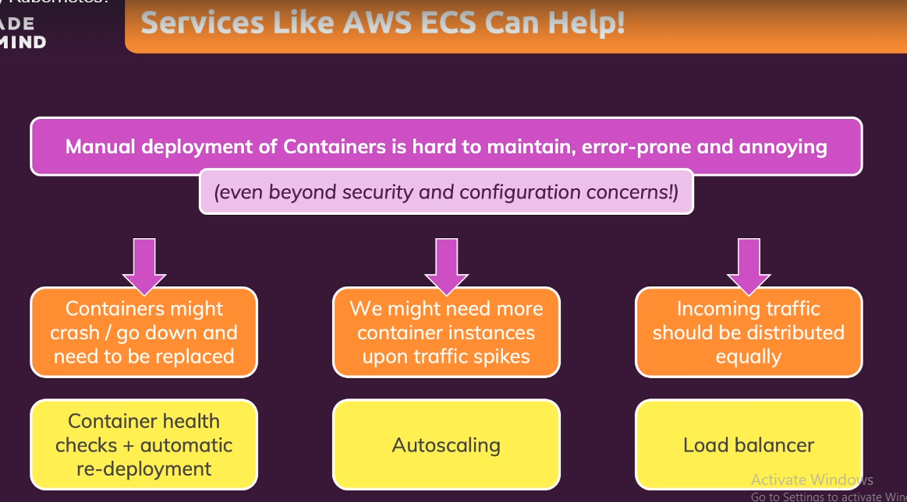
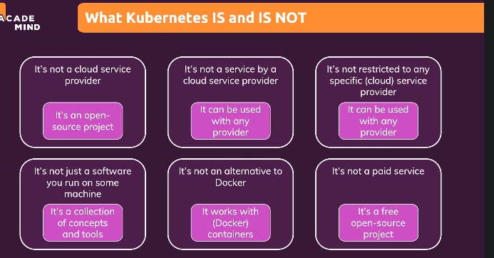
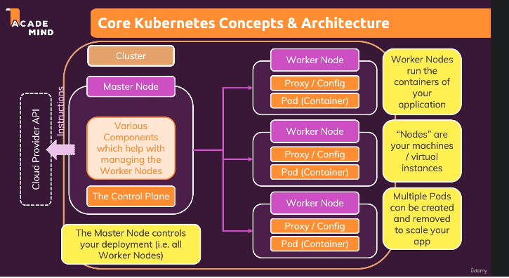
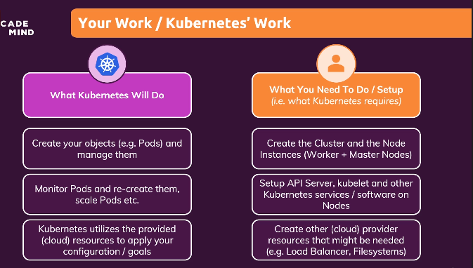
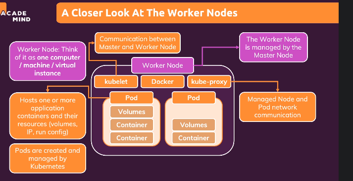
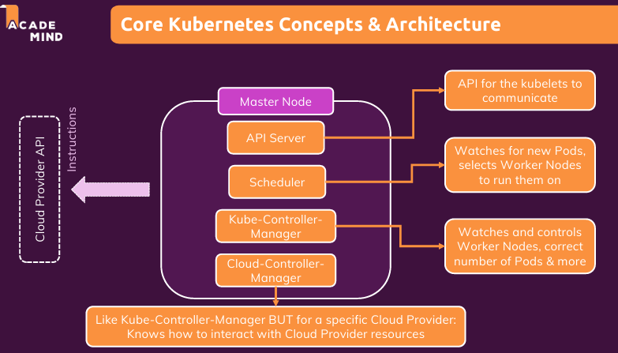
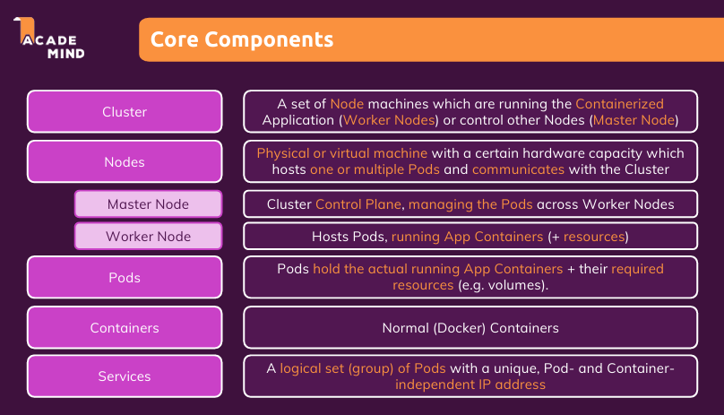

# Docker

Docker is a container technology : A tool for creating and managing container.

container: A standardized unit of software

A package of code and dependencies to run that code (e.g. NodeJS code + the NodeJS runtime ie node v22 setup)

## Building and running containers

We have the file naming Dockerfile, when we run below command then docker image is created

```bash
docker build .
```

To run container from image
3000 is the port you want to access from local and 80 is the port expose in docker file

```bash
docker run -p 3000:80 someImageId
```

## Managing containers

List of container

```bash
docker ps -a
```

list of running container

```bash
docker ps
```

to stop container

```bash
docker stop containerName
```

to restart the docker conatiner

```bash
docker start continerName
```

If we want to see the logs of container

```bash
docker logs containerName
```

To remove container, first you have stop if it is running then remove it

```bash
docker rm containerName
```

## Managing images

To get list of images

```bash
docker images
```

to remove images

```bash
docker rmi imageId
```

Below is the code for the dockerfile, filename is dockerfile and it will be available at root level
```bash
# all the code below here use to create the docker image not the conatiner

# here we are using node image from docker hub as base image, if we want specific version of node then we can use node:version, for example node:14, node:24.21 etc.
FROM node

# Here we are creating a directory /app in the image
WORKDIR /app

# Here we are copying the package.json file from current directory to /app directory in the image to prevent 
# re-installing all the dependencies every time we make a change in the code, this will help to speed up the build process.
COPY package.json /app

# Below command will install all the dependencies mentioned in package.json file
RUN npm install

# Below command will copy all the files from current directory ie github repo code to /app directory in the container
COPY . /app

# Below command will expose the port 80 to the outside world
# It is optional but it is good practice to expose the port which we are using in our application
# but if you have added here means you have to add the same port in docker run command while running the container otherwise it will not work.
EXPOSE 80

# Below command will run the application when the container is started, it is like node index.js command in local machine.
# Here we are using CMD means this will run when the container is started, if we use RUN then it will run when the image is created.
CMD ["node", "server.js"]
```

## Creating and sharing images

There are two ways in which we can create the images

1. use an existing or prebuilt image  eg donwloading image from dockerHub
2. Create your own, custom image, ie write your own dockerfile

Note : Container built on up of image ie image layer + 1 extra layer = conatiner, container is not made copyig everyting from image and then creating new thing of it.

For sharing the images we have 2 approaches

1. Share whole repo along with dockerfile - user will create the container by running built command
2. share a bult image via dockerhub


## Networking in docker - How comminication happens in docker

Basically there are 3 ways communication happens from docker

1. Through www to external api - Nothing need to work here
2. to localhost of internal device - change the localhost to host.docker.internal
3. Communication with other container - by using the IP of other container as domain name of url or creating a network and replacing the domain with image name of other container


## .dockerignore

When we create the image from the repo, if we have the folder like node modules then it copies and paste it in the docker, sometime what happens it might of older code, so we do not want it to copy to the image, so add the node_modules in this .dockerignore, similaty we add the .git folder in .dockerignore becuase it is no need to be copied in the image of docker.

### Docker Compose

**Docker Compose** is a tool for defining and running multiple Docker containers together using a single YAML file.


Lets we have the frontend and backend, we have very long command for running the conatiner in each case. there can be sometime we might forget the command then it will cause the issue. So we create the compose file in which we have added the command in detail form for each container.

like below is command
```bash
docker run --name goals-backend \
  -e MONGODB_USERNAME=max \
  -e MONGODB_PASSWORD=secret \
  -v logs:/app/logs \
  -v /Users/maximilianschwarzmuller/development/teaching/udemy/docker-complete/backend:/app \
  -v /app/node_modules \
  --rm \
  -d \
  --network goals-net \
  -p 80:80 \
  goals-node
```

it will be replaced in compose file


For example, your application might need:

- **Frontend:** React
- **Backend:** Node.js
- **Database:** MongoDB

Instead of starting each container manually, you describe them in a `compose.yaml` file:

```yaml
version: "3.8" # version of the Docker Compose spec which is being used
services: # "Services" are in the end the Containers that your app needs
  mongodb: # This is the image name
    image: 'mongo'
    volumes: 
      - data:/data/db
    # environment: 
    #   MONGO_INITDB_ROOT_USERNAME: max
    #   MONGO_INITDB_ROOT_PASSWORD: secret
      # - MONGO_INITDB_ROOT_USERNAME=max
    env_file: 
      - ./env/mongo.env
  backend:
    build: ./backend # Define the path to your Dockerfile for the image of this container
    # build:
    #   context: ./backend
    #   dockerfile: Dockerfile
    #   args:
    #     some-arg: 1
    ports:
      - '80:80'
    volumes: 
      - logs:/app/logs
      - ./backend:/app
      - /app/node_modules
    env_file: 
      - ./env/backend.env
    depends_on:
      - mongodb
  frontend:
    build: ./frontend
    ports: 
      - '3000:3000'
    volumes: 
      - ./frontend/src:/app/src
    stdin_open: true
    tty: true
    depends_on: 
      - backend

volumes: 
  data:
  logs:

```

Here, `build` creates an image using the Dockerfile in that folder, `ports` exposes a container port on your computer, and `volumes` preserves database data.

**Start everything:**

```bash
docker compose up -d
```

**Stop and remove the containers:**

```bash
docker compose down
```

**View logs:**

```bash
docker compose logs -f
```

Compose creates a `shared network automatically`. The backend can reach MongoDB using its service name, `mongo`, as the hostname.

**Interview answer:** “Docker Compose lets us define and manage a multi-container application in one YAML file, including its services, networks, volumes, and configuration.”


**`CMD` provides a default command or arguments. `ENTRYPOINT` defines the executable the container runs.** Both apply when the container starts, rather than during image building. [Docker Docs](https://docs.docker.com/build/concepts/dockerfile/?utm_source=chatgpt.com)

| Behavior | `CMD` | `ENTRYPOINT` in exec form |
|---|---|---|
| Purpose | Default command or arguments | Main executable |
| Arguments after `docker run IMAGE` | Replace `CMD` | Append to `ENTRYPOINT`, replacing `CMD` |
| How to override | Supply a command after the image | Use `--entrypoint` |

These override rules are defined in Docker’s Dockerfile reference. [Docker Docs](https://docs.docker.com/reference/dockerfile?utm_source=chatgpt.com)

### 1. Using CMD

```dockerfile
FROM alpine:3.22
CMD ["echo", "Hello"]
```

```bash
docker run my-image
# Executes: echo Hello

docker run my-image echo Goodbye
# Executes: echo Goodbye
```

The supplied command **replaces the entire `CMD`**.

### 2. Using ENTRYPOINT

```dockerfile
FROM alpine:3.22
ENTRYPOINT ["echo"]
```

```bash
docker run my-image Hello
# Executes: echo Hello

docker run my-image Goodbye
# Executes: echo Goodbye
```

The supplied arguments go to `echo`.

A common mistake:

```bash
docker run my-image echo Goodbye
# Executes: echo echo Goodbye
# Output: echo Goodbye
```

### 3. Using both together

```dockerfile
FROM alpine:3.22
ENTRYPOINT ["echo"]
CMD ["Hello"]
```

For these **exec-form instructions**:

```text
Final command = ENTRYPOINT + CMD
```

| Command | Executes |
|---|---|
| `docker run my-image` | `echo Hello` |
| `docker run my-image Goodbye` | `echo Goodbye` |
| `docker run --entrypoint /bin/sh my-image -c "echo Custom"` | `/bin/sh -c "echo Custom"` |

### 4. Practical utility-container example

```dockerfile
FROM node:22
WORKDIR /app

ENTRYPOINT ["npm"]
CMD ["--help"]
```

```bash
docker run my-npm
# npm --help

docker run my-npm install
# npm install

docker run my-npm test
# npm test
```

Mount your project into `/app` when using this for project tasks.

### 5. Exec form vs shell form

```dockerfile
# Exec form: directly starts the executable
CMD ["node", "server.js"]

# Shell form: invokes a shell
CMD node server.js
```

**Prefer exec form** for application startup. It avoids an intermediate shell and lets the application receive stop signals directly. It does not automatically expand shell variables such as `$PORT`. [Docker Docs](https://docs.docker.com/reference/build-checks/json-args-recommended/?utm_source=chatgpt.com)

**Interview answer:**  
“CMD defines overridable defaults. ENTRYPOINT defines the main executable. When combined in exec form, CMD supplies default arguments to ENTRYPOINT. Runtime arguments replace CMD, while overriding ENTRYPOINT requires `--entrypoint`.”


### We can create the docker inside the EC2 instance, but we have the issue that we have regulary update the docker and manage the security manually, which is difficult to do, then we use the amazon service of Amazon Elastic Container Service (ECS), but we come to know there is different service of every cloud provider and there is differnet configuration, also if container is down then we need the it should be auto up and some other service, which should be free and can user be used with ervey cloud provider then we use the Kubernetes













