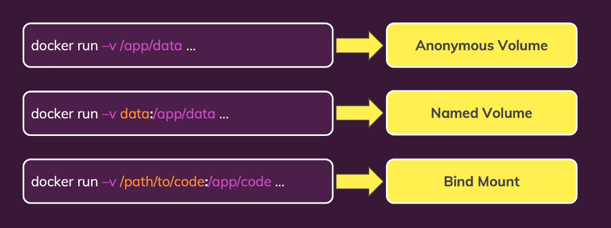
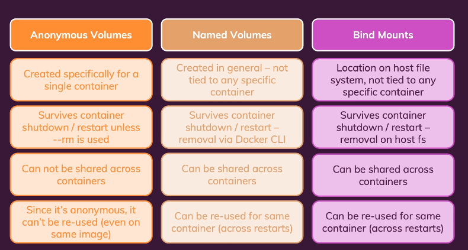

Docker is a container technology : A tool for creating and managing container.

container: A standardized unit of software

A package of code and dependencies to run that code (e.g. NodeJS code + the NodeJS runtime ie node v22 setup)

We have the file naming Dockerfile, when we run below command then docker image is created

```
docker build .
```

To run container from image
3000 is the port you want to access from local and 80 is the port expose in docker file

```
docker run -p 3000:80 someImageId
```

List of container
```
docker ps -a
```

list of running container
```
docker ps
````

to stop container
```
docker stop containerName
```

to restart the docker conatiner

```
docker start continerName
```

If we want to see the logs of container
```
docker logs containerName
```

To remove container, first you have stop if it is running then remove it
```
docker rm containerName
```

To get list of images
```
docker images
```

to remove images
```
docker rmi imageId
```


There are two ways in which we can create the images
1. use an existing or prebuilt image  eg donwloading image from dockerHub
2. Create your own, custom image, ie write your own dockerfile

Note : Container built on up of image ie image layer + 1 extra layer = conatiner, container is not made copyig everyting from image and then creating new thing of it.

For sharing the images we have 2 approaches
1. Share whole repo along with dockerfile - user will create the container by running built command
2. share a bult image via dockerhub






### Networking in docker - How comminication happens in docker

Basically there are 3 ways communication happens from docker
1. Through www to external api - Nothing need to work here
2. to localhost of internal device - change the localhost to host.docker.internal
3. Communication with other container - by using the IP of other container as domain name of url or creating a network and replacing the domain with image name of other container


### .dockerignore

When we create the image from the repo, if we have the folder like node modules then it copies and paste it in the docker, sometime what happens it might of older code, so we do not want it to copy to the image, so add the node_modules in this .dockerignore, similaty we add the .git folder in .dockerignore becuase it is no need to be copied in the image of docker.

