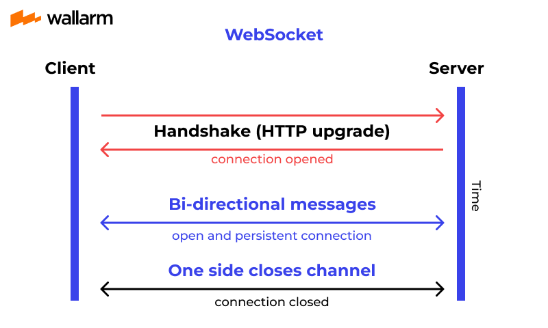
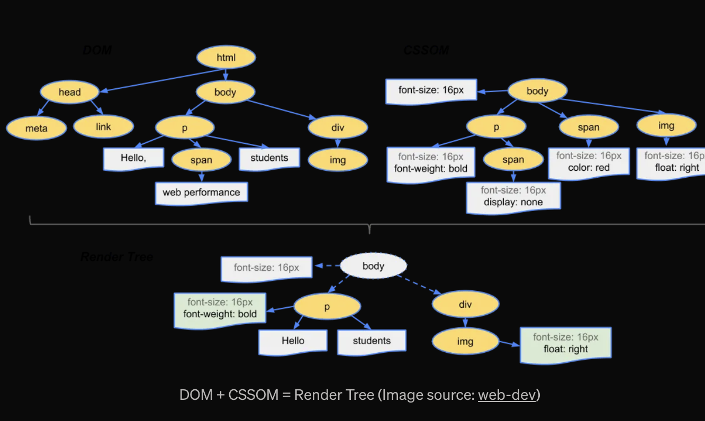

## Enhanced Core web vitals
Website used - Google Lighthouse, PageSpeed Insights

=> JS
1. Used `async` and `defer` for scripts to prevent render-blocking. usage -> Google Analytics script
2. Minimized Third-party Scripts
3. Code-Splitting using React.lazy()

```jsx
import React, { useState, lazy, Suspense } from "react";

const LazyComponent = lazy(() => import("./MyComponent")); // Lazy-loaded

const App = () => {
  const [show, setShow] = useState(false);

  return (
    <div>
      <button onClick={() => setShow(true)}>Load Component</button>
      <Suspense fallback={<div>Loading...</div>}>
        {show && <LazyComponent />} {/* Now only loaded when needed */}
      </Suspense>
    </div>
  );
};

export default App;
```

<br>

=> Optimized Images

1. WebP format (smaller & faster).
2. srcset to load appropriate sizes.
3. Applied lazy loading (loading="lazy") to avoid loading offscreen images.

CLS (Avoiding Layout Shifts)
1. Defined Image & Video Dimensions


<br>

## **Vue**

#### **Positives**:
1. **Simplicity and faster code devlopment**:
  - HTML-like `template syntax` made it easy to integrate designs directly from the UI/UX team.
  - Using directives like `v-if` and `v-for` felt intuitive, especially for conditional rendering and loops.
  - A data table with dynamic row rendering took half the time compared to React because of Vue's clean `two-way binding` (`v-model`).

    <details>

    ### **Scenario**:
    I was tasked with creating a data table where users could:
    1. Dynamically add or remove rows.
    2. Edit values in each cell directly.
    3. Update the table data in real-time (e.g., update a total based on input changes).

    ### **Vue Implementation**:
    Here’s how it worked in **Vue**:
    1. The data was stored in a reactive array, e.g., `rows: [{ name: '', quantity: 0, price: 0 }]`.
    2. Using Vue's **two-way binding** (`v-model`), I could bind each input in the table to the reactive data directly.
    3. Adding or removing rows was as simple as modifying the array (`rows.push()` or `rows.splice()`), and Vue automatically re-rendered the table.

    #### **Code Example in Vue**:
    ```vue
    <template>
      <div>
        <table>
          <tr v-for="(row, index) in rows" :key="index">
            <td><input v-model="row.name" placeholder="Product Name" /></td>
            <td><input type="number" v-model="row.quantity" /></td>
            <td><input type="number" v-model="row.price" /></td>
            <td>{{ row.quantity * row.price }}</td>
            <td><button @click="removeRow(index)">Remove</button></td>
          </tr>
        </table>
        <button @click="addRow">Add Row</button>
      </div>
    </template>

    <script>
    export default {
      data() {
        return {
          rows: [{ name: '', quantity: 0, price: 0 }],
        };
      },
      methods: {
        addRow() {
          this.rows.push({ name: '', quantity: 0, price: 0 });
        },
        removeRow(index) {
          this.rows.splice(index, 1);
        },
      },
    };
    </script>
    ```

    #### **Why it’s Fast in Vue**:
    1. **Two-Way Binding (`v-model`)**:
      - Automatically syncs the input fields with the `rows` array.
      - No need to write extra logic to update the state when the input changes.

    2. **Reactive Rendering**:
      - When the array changes (e.g., rows are added/removed), Vue’s reactivity ensures the DOM updates automatically without additional code.

    ---

    ### **React Implementation**:
    In React, the same task required more boilerplate because React doesn’t have two-way binding, and state updates are handled manually. Here’s how it went:
    1. I used `useState` to manage the rows (`const [rows, setRows] = useState([{ name: '', quantity: 0, price: 0 }])`).
    2. For every input change, I had to write a separate handler to update the corresponding field in the `rows` state.
    3. Adding or removing rows also required updating the state manually and ensuring the updates propagated.

    #### **Code Example in React**:
    ```jsx
    import React, { useState } from 'react';

    function DataTable() {
      const [rows, setRows] = useState([{ name: '', quantity: 0, price: 0 }]);

      const handleInputChange = (index, field, value) => {
        const updatedRows = [...rows];
        updatedRows[index][field] = value;
        setRows(updatedRows);
      };

      const addRow = () => {
        setRows([...rows, { name: '', quantity: 0, price: 0 }]);
      };

      const removeRow = (index) => {
        setRows(rows.filter((_, i) => i !== index));
      };

      return (
        <div>
          <table>
            {rows.map((row, index) => (
              <tr key={index}>
                <td>
                  <input
                    value={row.name}
                    onChange={(e) => handleInputChange(index, 'name', e.target.value)}
                    placeholder="Product Name"
                  />
                </td>
                <td>
                  <input
                    type="number"
                    value={row.quantity}
                    onChange={(e) => handleInputChange(index, 'quantity', parseInt(e.target.value) || 0)}
                  />
                </td>
                <td>
                  <input
                    type="number"
                    value={row.price}
                    onChange={(e) => handleInputChange(index, 'price', parseFloat(e.target.value) || 0)}
                  />
                </td>
                <td>{row.quantity * row.price}</td>
                <td>
                  <button onClick={() => removeRow(index)}>Remove</button>
                </td>
              </tr>
            ))}
          </table>
          <button onClick={addRow}>Add Row</button>
        </div>
      );
    }

    export default DataTable;
    ```

    #### **Why React Took Longer**:
    1. **Manual State Handling**:
      - I had to write a `handleInputChange` function to update state for each input, which adds boilerplate.
      - Forgetting to deep-clone the state (e.g., directly modifying the `rows` array) caused subtle bugs.

    2. **No Native Two-Way Binding**:
      - React requires explicitly setting the `value` and `onChange` for every input, which feels repetitive compared to Vue’s `v-model`.

    3. **Performance Optimization**:
      - In React, if you don’t memoize components or handlers properly, unnecessary re-renders can degrade performance.

    ---

    ### **Final Thoughts**:
    Vue’s **two-way binding** (`v-model`) and its **reactive system** simplify the process of building dynamic, data-driven components like this data table. React offers more control but requires more code for the same functionality, which can slow down development for such scenarios.
    </details>

  - for `react` has `one way communication`, used props, `vue` has `two way communications`, `emits and props`.
  - `Handling of attributes inheritance` is way better.
    
    For example, in React, to pass a `className `to UI component that is probably going to be dynamic in the future, you need to write it in `props` and later pass it in the component’s root HTML tag:
    ```js
    export const Button = ({className}: {className: string}) => {
      return <button className={className}> Classified </button>
    }
    ```

    And in Vue it is just:

    ```js
    <template>
      <Child class="abc"/>
    </template>
    ```

2. **Scoped Styles**:
   - **Experience**: Managing styles for a component library was a breeze with Vue’s scoped styles in `.vue` files. It eliminated worries about CSS bleed.
   - **Example**: In a multi-developer environment, we avoided style conflicts entirely, which was a nightmare in React without CSS modules or styled-components.

3. **Single-File Components (SFCs)**:

Vue’s SFC structure allowed me to keep HTML, CSS, and JavaScript logic for each component in a single .vue file. This was especially helpful for modularizing the POC without overthinking the project structure

While React's JSX is powerful, managing CSS, logic, and structure separately took slightly more effort compared to Vue’s SFCs. I had to rely on styled-components or CSS modules for scoped styles.


- React doesn’t have a built-in reactivity system. if any data proprty changes in vue, vue will update the DOM. eg For filtering, I had to manually update the state using useState and setState. then re-render of component will happen then changes will be avialble in DOM.

```js
setState((prevState) => ({
  ...prevState,
  nestedObj: {
    ...prevState.nestedObj,
    key: newValue,
  },
}));
```

<br>

#### **Negatives**:
1. **Scaling with Large Teams**:
   - **Experience**: On a large project with multiple developers, Vue's flexibility in allowing multiple coding styles led to inconsistencies. For instance, some developers preferred the `Options API`, while `others used` the `Composition API`, making the codebase harder to maintain.

2. **Tooling Limitations**:
   - **Experience**: While debugging a Vue 2 app, I found `Vue DevTools is legacy now`.

3. **Ecosystem Depth**:
   - **Experience**: For certain advanced needs, like optimizing large lists, I had to spend more time researching or building custom solutions because the ecosystem didn’t have as many mature libraries as React.
   - **Example**: Implementing virtual scrolling required using a lesser-known library compared to React’s well-supported libraries like `react-window`.


## **React**

#### **Positives**:
1. **Backing by Facebook**:
   - React is maintained by Facebook, which ensures continuous development, regular updates, and a high level of stability. This can be reassuring for large-scale enterprises..
   - Vue, while open-source and community-driven, doesn’t have the same level of corporate backing.

2. **Ecosystem and Libraries**:
   - **Experience**: When implementing infinite scrolling in a React project, I had immediate access to high-quality libraries like `react-infinite-scroll-component` that worked seamlessly.
   - **Example**: Adding drag-and-drop functionality using `react-beautiful-dnd` saved me days of custom coding.

3. **React Native**:
   - **Experience**: The ability to share components and logic between a React web app and a React Native mobile app was a game-changer for a project with tight deadlines.
   - **Example**: Sharing authentication logic and UI components across platforms reduced development effort significantly.

4. **Rich DevTools**:
   - **Experience**: React DevTools allowed me to pinpoint performance bottlenecks quickly. Tracing state changes and component updates was straightforward.
   - **Example**: Identifying unnecessary re-renders using `React.memo` and `Profiler` improved performance in a large React app with complex grids.

#### **Negatives**:
1. **Verbose Code**:
   - **Experience**: JSX often felt verbose for simple tasks. For instance, `conditionally rendering` lists or elements required more boilerplate compared to Vue's directives.
   - **Example**: A simple `v-if`-style condition in Vue took four extra lines in React with `&&` or ternary operators.
   - JSX combines HTML and JavaScript, making it harder to debug and read, especially in large components with complex logic.
   - Example: A dynamic table with conditionally rendered rows or cells in JSX can quickly become a tangled mix of ternary operators and JavaScript expressions, making it harder to maintain:

  ```jsx
  {data.map((item) =>
    item.isVisible ? <tr key={item.id}>{item.name}</tr> : null
  )}
  ```

2. **JSX Learning Curve**:
   - **Experience**: When onboarding junior developers, `JSX’s mixing of HTML and JavaScript concepts `often confused them initially.
   - **Example**: A developer accidentally wrote invalid JavaScript logic inside JSX attributes, causing runtime errors.

3. **Performance Pitfalls in Large Applications**
   - `infinite rerender kabhi nhi bolna h, bolna h unnecessary re-render` hota h bolna h
   - since `vue has reactivity due to which rendering controlled by vue`, in react we can unnecessary re-render which can down the performance of app
   - React's rendering is efficient, but improper state management can lead to unnecessary re-renders and performance bottlenecks.\

     Example:\
     Forgetting to use React.memo or useCallback in a deeply nested component tree might cause avoidable re-renders and slow down the application.


<br>

> ### You were given a project, you have to choose react or vue, which you will choose and why ?

### **1. If the Project Emphasizes Rapid Development**  
**I’d choose Vue.**

#### **Why**:
1. **Built-in Features**: 
   - Vue provides a complete ecosystem out of the box (e.g., routing, state management with Vuex, and transitions).
   - This minimizes the need to integrate third-party libraries, speeding up development.
2. **Two-Way Binding**: 
   - Vue's `v-model` simplifies form handling and data binding, making prototyping faster.
3. **Easier Learning Curve for Junior Developers**:
   - Vue is more intuitive for new team members to pick up and contribute quickly.
   
#### **Example**:  
A startup needing a **proof-of-concept (POC)** in 2 weeks would benefit from Vue’s simplicity and speed.


### **2. If needed mobile along the web, prefer the react**  
**I’d choose React.**


### **3. If Team Expertise is Skewed**  
- **If the team knows React well**: I’d pick React.  
- **If the team is more familiar with Vue**: I’d choose Vue.  

#### **Why**:
- The productivity of a project depends on the team’s ability to work effectively with the framework.
- Forcing a React team to use Vue (or vice versa) increases ramp-up time and risks suboptimal code.


### **4. If the Project Requires Frequent Updates and Long-Term Maintenance**  
**I’d lean towards React.**

#### **Why**:
1. **Ecosystem Stability**: 
   - React has a massive community and long-term support from Meta, ensuring its longevity.
2. **Component Reusability**: 
   - React’s functional components with hooks encourage reusable, maintainable code.

<br>

> ### concurrent session kya hota h

A user logs into the same account from a web browser on their laptop and a mobile app on their phone at the same time. Both sessions are active concurrently.

<br>

> ### Optimzation 

Optimizing frontend API integration and reducing page load time by 40% involves identifying performance bottlenecks and addressing them with efficient techniques. Here’s a breakdown of how I achieved this:

### **1. Efficient Data Fetching**

- The application was making fetching large datasets unnecessarily.
  - divided api in two parts, make 1st call on load and second when user scroll to end
  - removed unnecessary data from api

### **2. Improved Caching**

1. **Client-Side State Management**:
   - Used state management libraries like Redux (React) or Vuex (Vue) to cache API responses locally. This allowed the app to reuse previously fetched data without making additional API calls.

2. **Service Workers**: ye wala abhi padhna h
   - Leveraged service workers for caching static assets and API responses to improve offline availability and reduce network requests.

### **3. Parallel and Pre-Fetching**:
   - Parallelized independent API calls to reduce total wait time. `Promise.all for Parallel Execution`
   - Prefetched critical data during idle time or when the user hovered over a link.
   - Example: Prefetched product details when a user hovered over a product card.

<br>

> ### SEO

#### **Meta Tags Optimization**
- Ensured every page had appropriate meta tags for title, description, and keywords.


### **1. Manual Management (Basic Approach)**
If the app is small, you can manually update the `document.title` and meta tags in lifecycle hooks like `created` or `mounted`.

#### Example Code:
<Details>

```javascript
export default {
  name: "ProductPage",
  created() {
    document.title = "Product Name - Brand"; // Set page title
    const metaDescription = document.querySelector("meta[name='description']");
    if (metaDescription) {
      metaDescription.setAttribute("content", "Buy Product Name from Brand at the best price.");
    }
  },
};
```
</Details>

#### Limitations:
- Repetitive code in components.
- Limited to simple scenarios.

### **2. Using vue-meta in vue, react has react helmet**
For scalable and reusable head management, I used **vue-meta**, a library specifically designed for handling meta information in Vue.

#### Installation:
<Details>

```bash
npm install vue-meta
```

#### Configuration:
1. Import and use `vue-meta` in your Vue project.
   ```javascript
   import Vue from "vue";
   import VueMeta from "vue-meta";

   Vue.use(VueMeta);
   ```

2. Add the `metaInfo` property in your components.

#### Example:
```javascript
export default {
  name: "ProductPage",
  metaInfo: {
    title: "Product Name - Brand",
    meta: [
      {
        name: "description",
        content: "Buy Product Name from Brand at the best price.",
      },
      {
        name: "keywords",
        content: "Product Name, Buy Online, Brand",
      },
    ],
  },
};
```
</Details>

- The `vue-meta` library ensures that the page title and meta tags are dynamically updated whenever the route or component changes.

### **3. Centralized Approach for SPA with vue-router**
For applications using `vue-router`, you can centralize SEO configuration by defining meta information in routes.

#### Example:
<Details>

```javascript
const routes = [
  {
    path: "/products/:id",
    component: ProductPage,
    meta: {
      title: "Product Name - Brand",
      description: "Buy Product Name from Brand at the best price.",
    },
  },
];

const router = new VueRouter({ routes });

router.afterEach((to) => {
  if (to.meta.title) {
    document.title = to.meta.title;
  }
  if (to.meta.description) {
    const metaDescription = document.querySelector("meta[name='description']");
    if (metaDescription) {
      metaDescription.setAttribute("content", to.meta.description);
    }
  }
});
```
</Details>

<br>

> ### Handling Social Media Meta Tags (Open Graph and Twitter Cards)
For social media sharing, you can dynamically inject Open Graph (OG) tags.

#### Example with vue-meta:
<Details>

```javascript
metaInfo: {
  title: "Product Name - Brand",
  meta: [
    {
      property: "og:title",
      content: "Product Name - Brand",
    },
    {
      property: "og:description",
      content: "Buy Product Name from Brand at the best price.",
    },
    {
      property: "og:image",
      content: "https://example.com/product-image.jpg",
    },
    {
      property: "og:url",
      content: "https://example.com/products/product-name",
    },
  ],
},
```
</Details>

<br>

> ### Optimizing for Dynamic Components
If the SEO information depends on API data, such as product names fetched dynamically, you can update `metaInfo` after the data is loaded.

#### Example:
<Details>

```javascript
export default {
  data() {
    return {
      product: null,
    };
  },
  async created() {
    // Fetch product details
    const response = await fetch(`/api/products/${this.$route.params.id}`);
    this.product = await response.json();

    // Dynamically update meta information
    // method provided by vue-meta to update the metadata dynamically when there is a change in the component's data or state.
    this.$meta().refresh();
  },

  // The metaInfo function is automatically invoked by the vue-meta library.
  metaInfo() {
    return {
      title: this.product ? `${this.product.name} - Brand` : "Loading...",
      meta: [
        {
          name: "description",
          content: this.product
            ? `Buy ${this.product.name} from Brand at the best price.`
            : "Loading product details...",
        },
      ],
    };
  },
};
```
</Details>

<br>

> ### Schema Markup

- **Experience**: Added structured data (JSON-LD) for rich snippets to improve visibility in search results.
- It's typically implemented using `JSON-LD (JavaScript Object Notation for Linked Data)`. This data helps search engines generate rich snippets, such as star ratings, prices, FAQs, or event details, directly in search results.
- Example: Implemented **product schema** for an e-commerce project to display prices and ratings directly in search results.

<Details>

  ```html
  <script type="application/ld+json">
  {
    "@context": "http://schema.org",
    "@type": "Product",
    "name": "Product Name",
    "image": "https://example.com/image.jpg",
    "description": "Product Description",
    "brand": "Brand Name",
    "aggregateRating": {
      "@type": "AggregateRating",
      "ratingValue": "4.5",
      "reviewCount": "120"
    }
  }
  </script>
  ```
</Details>

### **How I Implemented JSON-LD**

To implement JSON-LD, I added a `<script>` tag in the HTML of the page or dynamically injected it in a Vue or React component.

**1. Static Example**

<Details>

For a product page:
```html
<script type="application/ld+json">
{
  "@context": "http://schema.org",
  "@type": "Product",
  "name": "Smartphone XYZ",
  "image": "https://example.com/images/smartphone-xyz.jpg",
  "description": "A high-performance smartphone with 128GB storage.",
  "brand": {
    "@type": "Brand",
    "name": "BrandName"
  },
  "sku": "12345",
  "offers": {
    "@type": "Offer",
    "priceCurrency": "USD",
    "price": "699.00",
    "itemCondition": "http://schema.org/NewCondition",
    "availability": "http://schema.org/InStock",
    "url": "https://example.com/products/smartphone-xyz"
  },
  "aggregateRating": {
    "@type": "AggregateRating",
    "ratingValue": "4.5",
    "reviewCount": "134"
  }
}
</script>
```
</Details>

<br>

**2.Dynamic Example**

- For Vue
For a product dynamically fetched via API:

<Details>

```javascript
export default {
  data() {
    return {
      product: null,
    };
  },
  async created() {
    const response = await fetch(`/api/products/${this.$route.params.id}`);
    this.product = await response.json();
  },
  mounted() {
    if (this.product) {
      const jsonLd = {
        "@context": "http://schema.org",
        "@type": "Product",
        "name": this.product.name,
        "image": this.product.image,
        "description": this.product.description,
        "brand": {
          "@type": "Brand",
          "name": this.product.brand,
        },
        "offers": {
          "@type": "Offer",
          "priceCurrency": "USD",
          "price": this.product.price,
          "availability": this.product.inStock
            ? "http://schema.org/InStock"
            : "http://schema.org/OutOfStock",
        },
        "aggregateRating": {
          "@type": "AggregateRating",
          "ratingValue": this.product.rating,
          "reviewCount": this.product.reviewsCount,
        },
      };

      const script = document.createElement("script");
      script.type = "application/ld+json";
      script.textContent = JSON.stringify(jsonLd);
      document.head.appendChild(script);
    }
  },
};
```
</Details>

<br>

- for React
For the same product page in React:

<Details>

```javascript
import React, { useEffect } from "react";

const ProductPage = ({ product }) => {
  useEffect(() => {
    if (product) {
      const jsonLd = {
        "@context": "http://schema.org",
        "@type": "Product",
        "name": product.name,
        "image": product.image,
        "description": product.description,
        "brand": {
          "@type": "Brand",
          "name": product.brand,
        },
        "offers": {
          "@type": "Offer",
          "priceCurrency": "USD",
          "price": product.price,
          "availability": product.inStock
            ? "http://schema.org/InStock"
            : "http://schema.org/OutOfStock",
        },
        "aggregateRating": {
          "@type": "AggregateRating",
          "ratingValue": product.rating,
          "reviewCount": product.reviewsCount,
        },
      };

      const script = document.createElement("script");
      script.type = "application/ld+json";
      script.textContent = JSON.stringify(jsonLd);
      document.head.appendChild(script);

      return () => {
        document.head.removeChild(script);
      };
    }
  }, [product]);

  return <div>{product && <h1>{product.name}</h1>}</div>;
};

export default ProductPage;
```
</Details>

<br>

**Validation**

After adding JSON-LD, I validated it using:
- [Schema Markup Validator](https://validator.schema.org/)

<br>

> ### Others 

#### **URL Structure**
- **Experience**: Ensured a clean and user-friendly URL structure with hyphens separating words and no special characters.
- Example:
  - Before: `example.com/products?id=12345`
  - After: `example.com/products/product-name`

#### **Canonical Tags**
- **Experience**: Used canonical tags to avoid duplicate content issues.
- Example:
  ```html
  <link rel="canonical" href="https://example.com/products/product-name" />
  ```

#### **Sitemap and Robots.txt**
- **Experience**: Created XML sitemaps and configured `robots.txt` to guide search engines.
  - Example Sitemap Entry:
    ```xml
    <url>
      <loc>https://example.com/products/product-name</loc>
      <lastmod>2025-01-05</lastmod>
      <changefreq>weekly</changefreq>
      <priority>0.8</priority>
    </url>
    ```
<br>

> ### vue-meta and react-helmet only manage metadata and rely on CSR. They don't address the lack of pre-rendered HTML, which can negatively impact SEO.

<br>

> ### Webpack purpose i have used

**1. Adding Aliases for Cleaner Imports**

- Scenario: Simplified imports by creating aliases for frequently used directories.
- Configuration:
```javascript
// vue.config.js
module.exports = {
  chainWebpack: (config) => {
    config.resolve.alias
      .set('@components', '/src/components')
      .set('@assets', '/src/assets');
  },
};
```
- Outcome: Allowed imports like @components/Button.vue instead of long relative paths.
<br>

**2. Image Optimization**

- Scenario: Optimized large images for a Vue project.
- Configuration:
```javascript
module.exports = {
  chainWebpack: (config) => {
    config.module
      .rule('images')
      .use('image-webpack-loader')
      .loader('image-webpack-loader')
      .options({
        mozjpeg: { progressive: true, quality: 75 },
        optipng: { enabled: true },
      });
  },
};
```
- Outcome: Reduced image sizes significantly, improving page load times.

<br>

> ### You have mentioned you have used webpack for bundling the vanilla js blog project

Primarily to organize and optimize the project structure, enhance performance, and enable modern features like ES6+ support. 

### **Purpose of Using Webpack in a Vanilla JS Blog Project**

1. **Code Splitting and Modularization**: 
   - Split the project into smaller, reusable modules instead of writing everything in one file.
   - Example: Separate files for utilities, blog post rendering, API calls, and DOM manipulation.

2. **Transpilation (ES6+ Support)**:
   - Converted modern ES6+ syntax to ES5 for better browser compatibility using **Babel**.

3. **Asset Optimization**:
   - Minimized and bundled JavaScript, CSS, and images to reduce the number of HTTP requests.
   - Ensured faster page loads by optimizing asset delivery.

4. **Live Development with Hot Reloading**:
   - Set up a development server with **live reloading** for faster iterations during development.

<br>

### **Webpack Configuration for the Blog Project**

**Project Structure**:
```
/src
  /js
    api.js
    renderPosts.js
    utils.js
  /css
    styles.css
  index.html
webpack.config.js
```

**Webpack Configuration**:
```javascript
const path = require('path');
const HtmlWebpackPlugin = require('html-webpack-plugin');
const MiniCssExtractPlugin = require('mini-css-extract-plugin');
const { CleanWebpackPlugin } = require('clean-webpack-plugin');

module.exports = {
  entry: './src/js/index.js', // Entry point for bundling
  output: {
    path: path.resolve(__dirname, 'dist'),
    filename: 'bundle.[contenthash].js', // Content hashing for caching
  },
  module: {
    rules: [
      {
        test: /\.js$/, // Transpile JS using Babel
        exclude: /node_modules/,
        use: {
          loader: 'babel-loader',
        },
      },
      {
        test: /\.css$/, // Load and bundle CSS
        use: [MiniCssExtractPlugin.loader, 'css-loader'],
      },
      {
        test: /\.(png|jpg|jpeg|svg|gif)$/, // Optimize images
        use: {
          loader: 'file-loader',
          options: {
            name: '[name].[hash].[ext]',
            outputPath: 'images',
          },
        },
      },
    ],
  },
  plugins: [
    new CleanWebpackPlugin(), // Clean the dist folder before each build
    new HtmlWebpackPlugin({
      template: './src/index.html',
      filename: 'index.html',
    }),
    new MiniCssExtractPlugin({
      filename: 'styles.[contenthash].css', // Extract CSS into separate file
    }),
  ],
  devServer: {
    contentBase: path.resolve(__dirname, 'dist'),
    hot: true,
    port: 3000,
  },
  mode: 'development', // Change to 'production' for optimized builds
};
```

<br>

### **Key Features Configured**

1. **Modular Code**
   - Split JavaScript into files like:
     - `api.js` for API requests.
     - `renderPosts.js` for DOM rendering logic.
     - `utils.js` for helper functions.
   - Imported these into the main `index.js` using `import` statements.

2. **CSS Handling**
   - Used `MiniCssExtractPlugin` to bundle CSS into a separate file.
   - Optimized and minimized CSS for production builds.

3. **Dynamic HTML**
   - Used `HtmlWebpackPlugin` to inject the bundled CSS and JS into the `index.html` file automatically.

4. **Asset Management**
   - Configured `file-loader` to handle and optimize image assets for blog post thumbnails.

5. **Development Features**
   - Enabled **Hot Module Replacement (HMR)** for live reloading during development using `webpack-dev-server`.

<br>

## Security

1. XSS
2. CSP headers
3. Iframe protection
4. Security Headers
5. Client storage security
6. Dependency Security
7. Permissions Policy
8. CSRF
9. CORS
10. SRI


| XSS | CSP     | Iframe          | Security Headers| Client storage security |
| ---- | ---- | ------------- |----| ----|
|Vuelidate,Formik,Regex | default-src | sandbox | X-Powered-By | encrypted form with strong salt |
|innerHTML to innerText | script-src | allow | Referrer-Policy | set expiry |
|REACT or Vue | style-src | X-Frame-Options | X-Content-Type-Options | first check how much space is left |
|DOMPurity | img-src | csp => frame-ancestors | x-xss-protection |  |
|eval | connect-src | httpOnly,secure,sameSite |Strict-Transport-Security |  |
|Avoid v-html & dangerouslySetInnerHTML | report-uri |  |  |  |

<br>

| Dependency Security | Permissions Policy     | CSRF          | CORS| Subresource Integrity (SRI) |
| ---- | ---- | ------------- |----| ----|
|Regular audit => npm audit | Permissions-Policy: <directive>=<allowlist> | Synchronizer token pattern | Access-Control-Allow-Origin | encrypted form with strong salt |
| |  | SameSite Cookies | Access-Control-Allow-Methods |  |
| |  | Referer-based-validate | Access-Control-Allow-Headers |  |
| |  | Use captacha | Access-Control-Allow-Credentials |  |

<br>

> ### XSS

An `XSS (Cross-Site Scripting)` attack occurs when an `attacker injects malicious scripts` into a website viewed by other users.

The attacker add the malicious script in browser through various method like 
- added script in `params or query in url`, we take directly value form parms and then pass value in payload in api
- added `script in the input box`, then script passed into function from input box.
- sometimes `script passed is event listner` which listen every event like click and call api and pass value to hacker api


Prevention Techniques:
- `Input Validation and Sanitization`: Always validate and sanitize user input before processing it, especially when dealing with user-generated content. `Vuelidate (for Vue), Formik (for React) and Regex`
- Replace `innerHTML` of DOM manipulation method with `innerText or textContent` of DOM manupulation.(`Avoided using v-html in Vue or dangerouslySetInnerHTML`)
- `use library like REACT or Vue, which handle all the sanitization itself`
- you can use the `pakage like DOMPurity`
- `avoid` using the `eval`
- CSP headers

<br>

> ### CSP headers

https://developer.mozilla.org/en-US/docs/Web/HTTP/CSP

Content Security Policy (CSP) is a security feature that helps prevent a range of attacks, including Cross-Site Scripting (XSS), data injection, and other code injection attacks by `controlling` which `resources (like scripts, styles, images, etc.) the browser is allowed` to load and execute.

### How CSP Works:
CSP allows you to `create a whitelist of trusted sources` for various types of content. The browser will only `load resources from these trusted sources`. If a resource is not in the whitelist, the browser will block it, preventing malicious code from running.

### Main Directives of CSP:
1. **`default-src`**: means agar koi source mark nhi kia h kisi content me then ishme jo source/ url mark kia hoga wha se content load hoga, agr yha self likha h means website pe kisi ka content load nhi hoga bas khud ka content load hoga, eg kisi aur url ki image load nhi hogi
   
2. **`script-src`**: Controls the sources from which JavaScript can be loaded. You can allow or block inline scripts, external scripts, and JavaScript files.
   
3. **`style-src`**: Controls the sources from which CSS styles can be loaded. It can also restrict inline styles.
   
4. **`img-src`**: Controls the sources from which images can be loaded.
   
5. **`connect-src`**: Specifies which URLs the application can connect to using mechanisms like `XMLHttpRequest`, `WebSocket`, `fetch()`, etc.
   
6. **`font-src`**: Specifies the sources for fonts used by the application.
   
7. **`frame-src`**: Controls which sources can be embedded in `<iframe>` elements.
   
8. **`object-src`**: Specifies allowed sources for `<object>`, `<embed>`, or `<applet>` tags.

9. **`report-uri` / `report-to`**: Allows you to specify a URI or a group of URIs where CSP violation reports should be sent, enabling you to detect and respond to CSP violations.

<br>

### Implementing CSP in the Frontend:
There are different methods for implementing CSP in the frontend:

#### 1. **Via HTTP Headers (Best Practice)**:
The CSP is typically set in the server’s HTTP headers, which instruct the browser on how to handle various types of content for a web page.

Example header:
```http
Content-Security-Policy: default-src 'self'; script-src 'self' https://apis.example.com; style-src 'self' 'unsafe-inline'
```

- `'self'`: Allows resources to be loaded from the same domain.
- `https://apis.example.com`: Only allows scripts to be loaded from `https://apis.example.com`.
- `'unsafe-inline'`: Allows inline styles (though this is not recommended for security).

#### 2. **Via HTML `<meta>` Tag**:
If you don't have access to the server configuration or you're working on static sites, you can add CSP rules via the `<meta>` tag in your HTML `<head>` section:
```html
<meta http-equiv="Content-Security-Policy" content="default-src 'self'; script-src 'self' https://apis.example.com">
```
This works similarly to the HTTP header method but is less flexible, as it applies only to the specific HTML document.

#### 3. **Nonce-based CSP (Script-specific CSP)**:
One method to allow specific inline scripts while still using a restrictive `script-src` directive is by using a `nonce` (a unique, cryptographically random token for each request).

Example CSP header:
```http
Content-Security-Policy: script-src 'self' 'nonce-abc123'
```

In the HTML:
```html
<script nonce="abc123">
  // Your trusted inline JavaScript
</script>
```

Only the script with the matching nonce will be allowed to execute.

#### 4. **Strict Dynamic**:
For scenarios where you load third-party libraries like Google Tag Manager or Stripe (which may load additional scripts), you can use `strict-dynamic` to trust dynamically loaded scripts, provided the parent script is trusted.

Example header:
```http
Content-Security-Policy: script-src 'strict-dynamic' 'nonce-abc123'; object-src 'none'; base-uri 'none'
```

#### 5. **Hash-based CSP**:
You can also specify which inline scripts are allowed by providing a hash of the script. This prevents any modifications to the inline script without updating the CSP policy.

Example header:
```http
Content-Security-Policy: script-src 'self' 'sha256-xyz' 
```

The `sha256-xyz` hash corresponds to a specific inline script, ensuring that only the script with that exact content is allowed to run.

<br>

#### Common CSP Pitfalls to Avoid:
- **'unsafe-inline' and 'unsafe-eval'**: Allowing these can significantly weaken the CSP as they allow inline scripts and eval() to execute, which are common attack vectors.
  
- **Too Restrictive**: A CSP that's too restrictive (blocking legitimate resources like Google Analytics or third-party APIs) may break the site functionality. Test thoroughly before deploying CSP rules.

- **Content Type Considerations**: Ensure that you include rules for all resource types (e.g., scripts, images, fonts) to avoid missing coverage on certain attack vectors.

<br>

#### CSP Reporting:
You can set up a reporting mechanism to monitor CSP violations without blocking content immediately. This is useful during the development phase.

Example:
```http
Content-Security-Policy: default-src 'self'; report-uri /csp-violation-report-endpoint
```

In this case, violations will be reported to `/csp-violation-report-endpoint`, helping you adjust your policy before enforcing it strictly.

<br>

> ### Iframe protection

The iFrame is a common `technique to embed webpages, videos, or maps` in your web page.

**Example**. suppose you use content from a malicious website within an iFrame in your website. In that case, it could execute harmful scripts or redirect the user to a malicious site, exposing sensitive information.

What security risks do iFrames bring?

The `main security threat` of iFrames is `XSS` (cross-site scripting) attacks. Attackers can perform XSS attacks in multiple ways. 

For example, changing the source site URL, installing malware, stealing information, or hijacking clicks and keystrokes through an iFrame.

- **iFrame Injection** – HTML documents are displayed on websites using iFrames, redirecting users to different websites.
- **iFrame Phishing** – iFrame phishing attacks combine iFrame, which loads a legitimate page, with an iFrame which loads the attacker’s website to steal data from an unsuspecting user.
- **Cross-Frame Scripting** – The Cross-Frame Scripting (XFS) attack uses malicious JavaScript on an iFrame that loads a legitimate page to collect data.
- **Clickjacking** – A clickjacking assault occurs when a person is persuaded to click a webpage element that is not readily visible. Therefore, consumers risk unintentionally downloading malware, accessing malicious websites, disclosing passwords or other sensitive information, transferring money, or making online purchases.

- **Data theft via javascript**

- **Session and cookie theft**

<br>

### **5 Required Steps to Secure Your iFrames**

<br>

**1. Use the ‘sandbox’ attribute**

 https://developer.mozilla.org/en-US/docs/Web/HTML/Element/iframe#sandbox

- Controls the restrictions applied to the `content embedded` in the `<iframe>`. 

- The value of the attribute `can either be empty to apply all restrictions`, or `space-separated tokens` to `lift particular restrictions`:

- An `empty sandbox` attribute will `completely sandbox the iFrame`. As a result, `all the above privileges will be restricted`, and the `JavaScript inside the iFrame won’t run`. 

<br>

Add the sandbox attribute to the iFrame to restrict its functionality.\
**Example:**
```html
<iframe src="https://example.com" sandbox="allow-scripts allow-same-origin"></iframe>
```
Common flags:
- `allow-same-origin`: Allows the iFrame to maintain its origin.
- `allow-scripts`: Allows JavaScript execution (use with caution).
- `allow-popups`: Allows pop-ups.

Exclude unnecessary permissions for enhanced security.

<br>

**2. Use the ‘allow’ attribute**

The allow attribute enables you to safelist particular functionalities, such as allowing iFrame access to the camera, battery information, or accelerometer. 


To allow all origins access to geolocation
```html
<iframe src="https://example.com" allow="geolocation *"></iframe>
```


To apply a policy to the current origin and others, you'd do this:

```html
<iframe
  src="https://example.com"
  allow="geolocation 'self' https://a.example.com https://b.example.com"></iframe>
```

<br>

**3. Use the ‘X-Frame-Options’ HTTP response header**

Deprecated: This feature is no longer recommended.

The X-Frame-Options HTTP response header can be used to indicate whether a `browser should be allowed to render your website page in a <iframe>`. Sites can use this to `avoid click-jacking attacks, by ensuring that their content is not embedded into other sites`.


**Warning**: Setting X-Frame-Options inside the `<meta>` element (e.g., `<meta http-equiv="X-Frame-Options" content="deny">`) has no effect. 

X-Frame-Options is only enforced via HTTP headers.

X-Frame-Options: DENY\
X-Frame-Options: SAMEORIGIN\
X-Frame-Options: allow-from-url

<br>

**4. Use the ‘Content-Security-Policy’ standard**

https://developer.mozilla.org/en-US/docs/Web/HTTP/Headers/Content-Security-Policy/frame-ancestors

The frame-ancestors directive is used in Content Security Policy (CSP) to `control which domains are allowed to embed a your web page` inside an `<iframe>`, `<embed>`.

```
Content-Security-Policy: frame-ancestors 'none';

Content-Security-Policy: frame-ancestors 'self' https://www.example.org;

Content-Security-Policy: frame-ancestors 'self' https://example.org https://example.com https://store.example.com;
```

Use the Content-Security-Policy header to control the sources of content allowed within the iFrame.
```
Content-Security-Policy: frame-ancestors 'self' https://trusted.com;
```

This ensures the iFrame can only be embedded by trusted domains.

<br>

**5. Cookies must be set from backend having the httpOnly be true, secure be true, sameSite be Strict**

<br>

> ### Security Headers

<br>

**1. X-Powered-By**

"X-Powered-By" is a common non-standard HTTP response header. It gives idea what is technologies server is using, and hacker can run malicious script easily. The X-Powered-By header describes the technologies used by the webserver. This information exposes the server to attackers.

eg. X-Powered-By: express

we have to remove "X-Powered-By" from the headers

<br>

**2. Referrer-Policy**

https://developer.mozilla.org/en-US/docs/Web/HTTP/Headers/Referrer-Policy

The Referrer-Policy HTTP header controls how much referrer information (from which site you are coming, eg going from youtube nested url to linkedin, how much youtube url information you want to share with the linkedin) should be included with requests

eg\
```
Referrer-Policy: `no-referrer`, Referrer information is never sent.\
Referrer-Policy: `origin`, Always sends only the origin, not the path.\
Referrer-Policy: `origin-when-cross-origin`, Sends the full URL for same-origin requests and only the origin for cross-origin requests.\
Referrer-Policy: `same-origin`,  Referrer is sent only for requests within the same origin.
```

You can add the Referrer-Policy meta tag to your HTML file

```html
<meta name="referrer" content="strict-origin-when-cross-origin">
```

<br>

**3. X-Content-Type-Options**

It’s a security feature that tells the browser, **"Hey, don't guess what kind of file this is; just use the type I say!"**. This stops the browser from making mistakes that could lead to security problems, like running harmful code by accident.

earlier, sometime the browser expect jpg file but someone modified the content and add the harmful script in html form, then the browser accepts it considering that it might be update form of jpg. this cause malicius script can run in your browser.


### Why is it important?

Browsers sometimes try to be "smart" and guess what kind of file is being loaded (like an image, script, or text). But if they guess wrong, it can open up your website to attacks, like **cross-site scripting (XSS)**, where harmful code could be executed.

### Example:
You want to make sure a browser only treats a file as a JavaScript file if it is **actually** a JavaScript file, not something else.

So, you add this to your server's response:

```
X-Content-Type-Options: nosniff
```

This tells the browser, "Don’t sniff (guess) the file type—just trust what I’m telling you!"

<Details>

### For Development Servers (e.g., Vite, Webpack Dev Server)
You can configure a proxy or middleware to add the header during development.

Vite:
Use a middleware in the vite.config.js file:
```js
import { defineConfig } from 'vite';

export default defineConfig({
  server: {
    middlewareMode: true,
    setupMiddleware(app) {
      app.use((req, res, next) => {
        res.setHeader('X-Content-Type-Options', 'nosniff');
        next();
      });
    },
  },
});
```

This way, every time your app responds, it tells the browser not to guess the content type. Simple and effective!

</Details>

<br>

**4. x-xss-protection**

The `X-XSS-Protection` is another security header that helps protect your website from **cross-site scripting (XSS) attacks**. 

**How Does `X-XSS-Protection` Work?**

This header works by `telling the browser to enable its built-in XSS filter`, which detects and prevents certain types of XSS attacks.

### Directives:

1. **`0` (Disable Protection):**
   - Turns off the browser's XSS filter. `Not recommended` unless you're sure your app is already protected in other ways.
   
   Example:
   ```
   X-XSS-Protection: 0
   ```

2. **`1` (Enable Protection - Default):**
   - Enables the browser’s XSS filter. When an XSS attack is detected, the browser will sanitize the page to prevent malicious code from running.
   
   Example:
   ```
   X-XSS-Protection: 1
   ```

3. **`1; mode=block` (Enable Protection & Block):**
   - When an XSS attack is detected, instead of just sanitizing the page, the browser will block the entire page from loading.
   
   Example:
   ```
   X-XSS-Protection: 1; mode=block
   ```

<br>

### Example in a Node.js App (with Express):
```js
app.use((req, res, next) => {
  res.setHeader('X-XSS-Protection', '1; mode=block');
  next();
});
```

**Vite:**\
Add a custom middleware in the vite.config.js file:
```js
import { defineConfig } from 'vite';

export default defineConfig({
  server: {
    middlewareMode: true,
    setupMiddleware(app) {
      app.use((req, res, next) => {
        res.setHeader('X-XSS-Protection', '1; mode=block');
        next();
      });
    },
  },
});
```

**Webpack Dev Server:**\
Configure headers in webpack.config.js:

```js
module.exports = {
  devServer: {
    headers: {
      'X-XSS-Protection': '1; mode=block',
    },
  },
};
```


This will enable the XSS protection for every response your server sends. It’s a simple but effective way to reduce the risk of XSS attacks.

<br>

**5. HSTS**

**Easy Explanation:**
HSTS is like telling the browser, **“Only visit my site using a secure connection (HTTPS), and remember this rule for a year.”** This makes sure users aren’t accidentally exposed to unencrypted traffic.

HSTS (`HTTP Strict Transport Security`) is a security feature that forces browsers to `only interact with your website over **HTTPS** and never over plain HTTP`. This helps protect users from certain types of attacks, like **man-in-the-middle (MITM) attacks**, where attackers intercept unencrypted communications.

Even if the `user manually types http://`, the `browser automatically redirects to https://`.

**Key Directives:**

1. **`max-age`**: This defines how long (in seconds) the browser should remember to only use HTTPS for the website.
   - Example: `max-age=31536000` (1 year).

2. **`includeSubDomains`**: This tells the browser to apply HSTS to all subdomains as well.
   - Example: If set, both `www.example.com` and `sub.example.com` must use HTTPS.

3. **`preload`**: This tells the browser to include your website in the browser's HSTS preload list, which means your site will always default to    HTTPS even on the first visit (useful for new users who haven't visited before).
   - To add your site to the preload list, you can submit it to the [HSTS Preload List](https://hstspreload.org/).

**Example:**
```http
Strict-Transport-Security: max-age=31536000; includeSubDomains; preload
```

**Why is HSTS important?**

1. **Prevents Downgrade Attacks**: Attackers can’t force users to downgrade from HTTPS to HTTP.
2. **Stops Man-in-the-Middle Attacks**: It ensures data is always encrypted, even if a user tries to access the site using an insecure link.
3. **Better User Security**: It protects your users by ensuring that they always use the safest version of your site.

**Example in a Node.js App (with Express):**
```js
const helmet = require('helmet');

// Use Helmet's HSTS middleware
app.use(helmet.hsts({
  maxAge: 31536000, // 1 year in seconds
  includeSubDomains: true,
  preload: true
}));
```

This will ensure that all your HTTP responses include the HSTS header, forcing browsers to stick to HTTPS for your site.

<br>

> ### Client storage security

- always `store the client data` in `encrypted form` with `strong salt` in `localstorage or cookies or anything`.
- always `set expiry` of token whether it is `cookies or localstorage`, for `localstorage we can create the custom function which clears the data`.
- while setting the data in cookies or localstorage, `first check how much space is left, otherwise you will loose some data`.

<Details>

```js
function getCookieSpaceLeft() {
  // Maximum cookie space allowed per domain (4KB)
  const maxCookieSpace = 4096; // 4KB = 4096 bytes
  
  // Get all cookies as a single string
  const cookies = document.cookie;

  // Get the total size of the current cookies
  const cookieSize = new Blob([cookies]).size;

  // Calculate the remaining space
  const remainingSpace = maxCookieSpace - cookieSize;

  // Return the result in bytes
  return remainingSpace > 0 ? remainingSpace : 0; // Ensures we don't return negative values
}

console.log(`Remaining cookie space: ${getCookieSpaceLeft()} bytes`);

```


```js
function getLocalStorageSpaceLeft() {
  // Maximum localStorage space (assume 5MB for this example)
  const maxLocalStorageSpace = 5 * 1024 * 1024; // 5MB = 5 * 1024 * 1024 bytes

  // Calculate the total size of the data stored in localStorage
  let totalSize = 0;
  for (let key in localStorage) {
    if (localStorage.hasOwnProperty(key)) {
      totalSize += localStorage.getItem(key).length + key.length;
    }
  }

  // Calculate the remaining space
  const remainingSpace = maxLocalStorageSpace - totalSize;

  // Return the result in bytes
  return remainingSpace > 0 ? remainingSpace : 0;
}

console.log(`Remaining localStorage space: ${getLocalStorageSpaceLeft()} bytes`);

```
</Details>

<br>

> ### Dependency Security

- Regular audit or update the dependencies/package beacuse some package became outdated or vulnerable

**eg** `npm update`, it provide the `list of package which have update or show the package which are vulnerable`, out of which you can update the packages which you required

or below step

```
npm audit  - The output will show vulnerabilities categorized as Critical,High,Moderate,Low
npm audit fix - This updates dependencies to the nearest safe version.
```


<br>

> ### Permissions Policy

Let say you have used iframe in your site, now the `iframe website` tried to cheat on you, he `ask for the voice and video permission` and `user` on your website `thinks that it is giving permission to your website` but actually the permission is taken by iframe website. This can cause security issue

https://developer.mozilla.org/en-US/docs/Web/HTTP/Permissions_Policy

In this we `restrict the permission to self and iframe or other mailcious code on your website`

Examples of what you can do with Permissions Policy:

- Change the default behavior of autoplay on mobile and third-party videos.
- Restrict a site from using sensitive devices like the camera, microphone, or speakers.
- Allow iframes to use the Fullscreen API.
- Stop items from being scripted if they are not visible in the viewport, to improve performance.

eg: geolocation, camera, microphone

**Permissions-Policy header syntax**

The general syntax looks like this:
```
Permissions-Policy: <directive>=<allowlist>

```
eg: below is no one is allowed for the geolocation permission

```
Permissions-Policy: geolocation=()
```

below is allow access to a subset of origins
```
Permissions-Policy: geolocation=(self "https://a.example.com" "https://b.example.com")
```

```html
<iframe 
    src="https://example.com"
    allow="geolocation; microphone; camera"
></iframe>
```

you can refer below website if you want to see demo

```
https://permissions-policy-demo.glitch.me/demo/
```

<br>

> ### CSRF (cross site request forgery)

A cross site request forgery attack is a cyber attack that `tricks a user into accidentally using their credentials to invoke a state changing activity`, such as transferring funds from their account, changing their email address and password, or some other undesired action.

Here is an example of the 4 steps in a cross-site request forgery attack:

1. An attacker creates a forged request that, when run, will transfer $10,000 from a particular bank into the attacker’s account.
2. The attacker embeds the forged request into a hyperlink and sends it out in bulk emails and also embeds it into websites. (Hyperlink contains a POST or GET request, as user is alreadys logged in bank website and cookies is already setup, it directly calls the api and end point actions done on backend)
3. A victim clicks on an email or website link placed by the attacker, resulting in the victim making a request to the bank to transfer $10,000.
4. The bank server receives the request, and because the victim is properly authorized, it treats the request as legitimate and transfers the funds.


How can Cross-Site Request Forgery be mitigated?

**1. Synchronizer token pattern:**

When a user visits a web page, such as the bank webpage that allows for the transfer of funds, the bank’s website embeds a random token into the form. When the user submits the form, the random token is returned and the bank is able to check to see if the two tokens match. If the tokens match, the transfer occurs. The attacker has no way to access the random token value created in the webpage, and if they request the page, the same origin policy would prevent the attacker from reading the response.

**2. SameSite Cookies**

https://developer.mozilla.org/en-US/docs/Web/HTTP/Headers/Set-Cookie

cookies to be set as SameSite=Strict,Secure.

**3. Referer-based-validate**

referer should be added in the link, so that we can verify it in the backend, refere is our website or any other website

**4. Use captacha**

**5. Add CSP header**

<br>

> ### For handling Cross Origin Resource sharing

**1. Access-Control-Allow-Origin :**

The `Access-Control-Allow-Origin` header is part of Cross-Origin Resource Sharing (CORS) in web development. It tells the browser which origins (domains) are permitted to access a resource on the server. When a web application running at one origin tries to request resources from another origin (like making an API call from `https://example.com` to `https://api.example.com`), the server responds with `Access-Control-Allow-Origin` to specify if it allows access from the requesting origin.

Here’s how it works:

1. **Single Origin**: If a server wants to allow a specific origin, it includes `Access-Control-Allow-Origin: https://example.com` in its response. Only `https://example.com` can access this resource.

2. **Wildcard (`*`)**: If a server wants to allow access from any origin, it can use `Access-Control-Allow-Origin: *`. However, this is generally less secure and is often restricted for APIs that require user credentials or sensitive information.

3. **No Header**: If the server doesn't include `Access-Control-Allow-Origin`, the browser blocks the request for security reasons.

**Example header**:
```http
Access-Control-Allow-Origin: https://example.com
```

This header is typically used in the server response to handle CORS policies for frontend applications that need to make cross-origin HTTP requests.

<br>

**2. Access-Control-Allow-Methods**

The `Access-Control-Allow-Methods` header is used in Cross-Origin Resource Sharing (CORS) to specify which HTTP methods are permitted when accessing a resource on the server from a different origin. This is part of the server's response to a "preflight" request, which is an initial request the browser sends to determine if the actual request is safe to make.

For instance, if a web application on `https://example.com` wants to send a `POST` request to `https://api.example.com`, the browser first sends an `OPTIONS` request to check what methods are allowed by the server. The server then responds with an `Access-Control-Allow-Methods` header to specify which HTTP methods it supports.

**Examples of `Access-Control-Allow-Methods`:**

1. **Allow specific methods**:
   ```http
   Access-Control-Allow-Methods: GET, POST, PUT, DELETE
   ```

   Here, only `GET`, `POST`, `PUT`, and `DELETE` requests are allowed.

2. **Allow all methods** (not commonly used for security reasons):
   ```http
   Access-Control-Allow-Methods: *
   ```

**Common Values for `Access-Control-Allow-Methods`:**
- `GET`
- `POST`
- `PUT`
- `DELETE`
- `OPTIONS`
- `PATCH`

<br>

**3. Access-Control-Allow-Headers**

The `Access-Control-Allow-Headers` header in Cross-Origin Resource Sharing (CORS) specifies which HTTP headers can be included in requests made to the server from a different origin. This is especially relevant when making requests that use custom headers or non-standard headers that aren’t typically included in simple requests, like `Authorization`, `Content-Type`, or other custom headers.

**Note**\
When a browser makes a `preflight` `OPTIONS` request, it checks which headers it can include in the actual request by looking at the `Access-Control-Allow-Headers` response from the server.

### Example Usage

If a server allows specific headers like `Content-Type`, `Authorization`, and `X-Custom-Header`, it would respond with:

```http
Access-Control-Allow-Headers: Content-Type, Authorization, X-Custom-Header
```

This response tells the browser that the specified headers are permitted in requests from allowed origins.

### Key Points:

1. **Common Headers**: Frequently permitted headers include `Authorization`, `Content-Type`, `Accept`, and custom headers like `X-Requested-With`.

2. **Security and Control**: By specifying allowed headers, the server can control which information clients are allowed to send, helping to prevent malicious or unintended data from being sent.

3. **Wildcard (`*`)**: Though it's possible to use `*` to allow all headers, this is generally discouraged due to security concerns.

### Example in a CORS Response

In a full CORS setup, you might see:

```http
Access-Control-Allow-Origin: https://example.com
Access-Control-Allow-Methods: GET, POST, OPTIONS
Access-Control-Allow-Headers: Content-Type, Authorization
```

This setup ensures only certain headers and methods are allowed when accessing resources from cross-origin requests, providing an additional layer of security for API resources.

<br>

**4. Access-Control-Allow-Credentials**

The `Access-Control-Allow-Credentials` header in Cross-Origin Resource Sharing (CORS) specifies whether or not the browser should include credentials (such as cookies, HTTP authentication, or client-side SSL certificates) with requests to the server. This header is crucial for applications that rely on user authentication and need to send credentials in cross-origin requests.

When a web application from one origin (e.g., `https://example.com`) requests resources from another origin (e.g., `https://api.example.com`) and the server sets `Access-Control-Allow-Credentials: true`, the browser will send cookies and authentication data along with the request.

**Example Usage**

```http
Access-Control-Allow-Credentials: true
```

This response header tells the browser to include credentials in cross-origin requests to the server.

**Important Notes**

1. **Must be Used with Specific Origins**: For `Access-Control-Allow-Credentials: true` to work, `Access-Control-Allow-Origin` must specify a particular origin rather than a wildcard (`*`). For example:
   ```http
   Access-Control-Allow-Origin: https://example.com
   Access-Control-Allow-Credentials: true
   ```

2. **Security Implications**: Allowing credentials can expose sensitive user data, so it’s typically used only with secure (HTTPS) requests and with trusted origins.

3. **Restricted Header Access**: When `Access-Control-Allow-Credentials` is set to `true`, the browser restricts access to the response headers to prevent exposing sensitive information unintentionally. Only a few headers like `Content-Type`, `Cache-Control`, and `Expires` are accessible.

<br>

**Example in a Full CORS Response**

Here’s an example CORS response that allows credentials:

```http
Access-Control-Allow-Origin: https://example.com
Access-Control-Allow-Methods: GET, POST
Access-Control-Allow-Headers: Content-Type, Authorization
Access-Control-Allow-Credentials: true
```

In this setup, requests to the server at `https://api.example.com` will include cookies or other credentials if they originate from `https://example.com`. This enables authenticated sessions to work across different domains securely.

<br>

> ###  Subresource Integrity (SRI)

```
https://developer.mozilla.org/en-US/docs/Web/Security/Subresource_Integrity
```

Let say you are using any third part script like bootstrap cdn, and you are loading its content, but somehow hacker load mailicous script in bootstrap or its security gets compromised, then your website will be very much vulnerable. so thats why we use the SRI.

Subresource Integrity (SRI) is a security feature that allows browsers to verify that resources (such as scripts or stylesheets) loaded from a third-party source have not been tampered with. This is done by `including a cryptographic hash` in the HTML `<script>` or `<link>` tags for the resource. If the resource’s content doesn’t match the specified hash, the browser blocks it, helping to prevent attacks such as code injection.

### How It Works

When you include an SRI hash in a `<script>` or `<link>` tag, the browser:
1. Downloads the resource.
2. Calculates its hash.
3. Compares the calculated hash to the hash provided in the SRI attribute.
4. Loads the resource only if the hashes match.

### Example of SRI in HTML

For a CDN-hosted JavaScript file:

```html
<script src="https://cdn.jsdelivr.net/npm/bootstrap@5.3.3/dist/js/bootstrap.bundle.min.js" integrity="sha384-YvpcrYf0tY3lHB60NNkmXc5s9fDVZLESaAA55NDzOxhy9GkcIdslK1eN7N6jIeHz" crossorigin="anonymous"></script>
```

In this example:
- The `integrity` attribute contains the hash (`sha384` here), which the browser uses to verify the file’s integrity.
- The `crossorigin="anonymous"` attribute allows cross-origin requests without credentials. This is typically required for SRI to work when loading resources from a different origin.

### Commonly Used Hash Algorithms
SRI hashes are usually created using either:
- **sha256**: Secure Hash Algorithm 256-bit
- **sha384**: Secure Hash Algorithm 384-bit
- **sha512**: Secure Hash Algorithm 512-bit

### How to Generate an SRI Hash

```
// website url

https://www.srihash.org/
```

Visit above site and paste bootstrap url in it ie 'https://cdn.jsdelivr.net/npm/bootstrap@5.3.3/dist/js/bootstrap.bundle.min.js', select hash, it wil generate the hash from the url take the genrated integrity, compare it with the hash provided in the integrity in above bootstrap cdn, if it matches then content gets loaded otherwise not loaded. 

<br>

## How does the web works


### So what happens, exactly?

**Note**: ip address defines the as the main address of any website.

When you enter a URL in a browser and press Enter, several steps occur behind the scenes to load the requested webpage. Here’s a high-level breakdown:

### **1. DNS Lookup (Domain Name System)**
   - The browser checks if it has the IP address for the domain (e.g., `example.com`) cached.
   - If not, it queries a DNS server to resolve the domain name into an IP address (e.g., `93.184.216.34`).

### **2. Establishing a Connection**
   - The browser initiates a **TCP (Transmission Control Protocol)** connection with the server using the resolved IP address.
   - If HTTPS is used, a **TLS/SSL handshake** occurs to establish a secure connection.

### **3. Sending an HTTP Request**
   - The browser sends an **HTTP request** to the server, specifying the method (`GET`, `POST`, etc.), headers (cookies, user-agent, etc.), and optional body (e.g., form data for a POST request).

### **4. Server Processing**
   - The server processes the request, often interacting with databases or running backend logic.
   - It prepares an **HTTP response**, which usually includes an HTML document.

### **5. Receiving and Rendering Response**
   - The browser parses the HTML and begins rendering the page.
   - It discovers additional resources (CSS, JavaScript, images) and makes separate requests for them.
   - CSS is applied, JavaScript is executed, and the page becomes interactive.

<br>

> ### Explain TCP 3-Way Handshake process

The TCP (Transmission Control Protocol) 3-way handshake is a process that establishes a reliable connection between two devices, typically a client and a server, before they can exchange data.

Here's a step-by-step explanation of the TCP 3-way handshake process:

1. **Client Sends a SYN (Synchronize) Packet**: When the client wants to initiate a connection with the server it sends a TCP packet with the SYN flag set to the server indicating the client's intent to establish a connection.
2. **Server Responds with SYN-ACK Packet**: Upon receiving the SYN packet, the server acknowledges the client's request by sending a TCP packet back. This packet has the SYN and ACK (Acknowledge) flags set. The ACK flag indicates the server's acknowledgment of the client's request, and the SYN flag indicates its intent to establish a connection.
3. **Client Acknowledges with an ACK Packet**: Once the client receives the SYN-ACK packet from the server, it sends an acknowledgment (ACK) packet back to the server. This packet has the ACK flag set and acknowledges the receipt of the server's response.
Here's a summary of the flags used in each step:

**SYN (Synchronize)**: Indicates the start of a connection request.

**ACK (Acknowledge)**: Acknowledges the receipt of a packet or confirms a connection establishment.

After the 3-way handshake is complete, both the client and server can start exchanging data in a reliable and orderly manner. If any of the packets in the handshake process are lost, the sender will retransmit them until a successful handshake is established.

<br>

## DNS explained
Real web addresses aren't the nice, memorable strings you type into your address bar to find your favorite websites. They are special numbers that look like this: 192.0.2.172.

This is called an IP address, and it represents a unique location on the web. However, it's not very easy to remember, is it? That's why the Domain Name System was invented. This system uses special servers that match up a web address you type into your browser (like "mozilla.org") to the website's real (IP) address.

Websites can be reached directly via their IP addresses. You can use a [DNS lookup tool](https://www.nslookup.io/website-to-ip-lookup/) to find the IP address of a website.


- To get all the details of any domain visit below, enter the url in search and you will see when this doamin was first registered and when it was last updated or renewed.

https://www.whois.com/whois/tataaig.com

**Now we have connected server with the browser, we will se how they transfer data from server to browser**

<br>

## Communication Protocols

Communication protocols are essential rules and conventions for data transfer between network devices. These protocols define how data is formatted, transmitted, and received, enabling reliable communication across networks. Here are some common types of communication protocols:

### 1. **Network Protocols**
   - **TCP/IP (Transmission Control Protocol/Internet Protocol):** The foundation of the internet, governing how data is divided into packets, transmitted, and reassembled at the destination. TCP ensures reliability, while IP handles addressing.
   - **UDP (User Datagram Protocol):** A faster but less reliable alternative to TCP, often used for real-time applications like video streaming and gaming, where speed is prioritized over guaranteed delivery.
   - **HTTP/HTTPS (Hypertext Transfer Protocol):** A protocol for transmitting web pages. HTTPS is the secure version, adding encryption for secure communication.
   - **FTP (File Transfer Protocol):** Used for transferring files between a client and server, commonly for file sharing and website management.

### 2. **Email Protocols**
   - **SMTP (Simple Mail Transfer Protocol):** Used for sending emails from clients to servers and between servers.
   - **IMAP (Internet Message Access Protocol):** Allows users to access emails on a remote server, keeping the email on the server and syncing it across devices.
   - **POP3 (Post Office Protocol):** Downloads emails to a local client and usually deletes them from the server, suitable for accessing email from a single device.

### 3. **Wireless and Mobile Protocols**
   - **Wi-Fi (Wireless Fidelity):** Based on IEEE 802.11 standards, it allows devices to connect to a LAN without cables.
   - **Bluetooth:** A short-range protocol enabling communication between devices like phones, laptops, and accessories.
   - **5G/4G LTE (Long-Term Evolution):** Cellular protocols for high-speed data transfer on mobile networks, offering improved speed and connectivity.

### 4. **Data Link Layer Protocols**
   - **Ethernet:** A widely used protocol in LAN environments, based on IEEE 802.3, managing data transmission over wired networks.
   - **PPP (Point-to-Point Protocol):** Often used for establishing direct connections between network nodes, commonly used in DSL connections.

### 5. **Application Layer Protocols**
   - **DNS (Domain Name System):** Resolves human-readable domain names (like openai.com) into IP addresses.
   - **DHCP (Dynamic Host Configuration Protocol):** Assigns IP addresses dynamically to devices on a network, simplifying device configuration.
   - **SNMP (Simple Network Management Protocol):** Used for network management, it monitors network devices and handles alerts.

Each protocol plays a specific role in enabling reliable, efficient, and secure communication between devices across various types of networks. These protocols can operate at different layers of the OSI (Open Systems Interconnection) model, from the physical transfer of data to application-level interactions.

> ### Explaining 8 Popular Network Protocols in 1 Diagram. The method to download the high-resolution PDF is available at the end.

If have the time then get the knowlege of each

Network protocols are standard methods of transferring data between two computers in a network.

**1. HTTP (HyperText Transfer Protocol)**

HTTP is a protocol for fetching resources such as HTML documents. It is the foundation of any data exchange on the Web and it is a client-server protocol.

**2. HTTP/3**

HTTP/3 is the next major revision of the HTTP. It runs on QUIC, a new transport protocol designed for mobile-heavy internet usage. It relies on UDP instead of TCP, which enables faster web page responsiveness. VR applications demand more bandwidth to render intricate details of a virtual scene and will likely benefit from migrating to HTTP/3 powered by QUIC.

**3. HTTPS (HyperText Transfer Protocol Secure)**

HTTPS extends HTTP and uses encryption for secure communications.

**4. WebSocket**

WebSocket is a protocol that provides full-duplex communications over TCP. Clients establish WebSockets to receive real-time updates from the back-end services. Unlike REST, which always “pulls” data, WebSocket enables data to be “pushed”. Applications, like online gaming, stock trading, and messaging apps leverage WebSocket for real-time communication.

**5. TCP (Transmission Control Protocol)**

TCP is is designed to send packets across the internet and ensure the successful delivery of data and messages over networks. Many application-layer protocols build on top of TCP.

**6. UDP (User Datagram Protocol)**

UDP sends packets directly to a target computer, without establishing a connection first. UDP is commonly used in time-sensitive communications where occasionally dropping packets is better than waiting. Voice and video traffic are often sent using this protocol.

**7. SMTP (Simple Mail Transfer Protocol)**

SMTP is a standard protocol to transfer electronic mail from one user to another.

**8. FTP (File Transfer Protocol)**

FTP is used to transfer computer files between client and server. It has separate connections for the control channel and data channel.


<br>

## Rest API

**1 Tier architecture** - frontend and backend are on same\
**2 Tier architecture** - frontend and backend are manage separately\
**3 Tier architecture** - frontend, backend and database, we managing separately

For communicationg between the frontend, backend and database, we need api,

A `REST (Representational State Transfer) API` is a widely-used web service architecture that allows clients and servers to `communicate over HTTP protocol` using standard HTTP methods like GET, POST, PUT, DELETE, and PATCH. RESTful APIs are stateless, meaning each request from the client to the server must contain all the information needed to understand and process the request.

Here’s a quick overview of REST API principles and best practices:

### Key Principles
1. **Statelessness**: Each request is independent and does not rely on previous requests. This makes the API more scalable.
2. **Client-Server Separation**: The client and server interact only through requests and responses, keeping the client interface separate from server data management.
3. **Uniform Interface**: REST defines a standard set of methods (HTTP verbs) for interaction.
4. **Cacheability**: Responses should define whether they are cacheable, improving performance on the client side.
5. **Layered System**: An API can have multiple layers, improving scalability, load balancing, and security.

### Common HTTP Methods
- **GET**: Retrieve information from the server (e.g., a list of users or a specific user).
- **POST**: Send data to the server, often to create a new resource.
- **PUT**: Update an existing resource or create one if it doesn’t exist.
- **DELETE**: Remove a resource.
- **PATCH**: Partially update a resource.

<br>

> ### Various headers used in api   

https://developer.mozilla.org/en-US/docs/Web/HTTP/Headers

### **1. Authentication & Authorization Headers**
   - **Authorization**: Used for client authentication. Includes tokens or credentials.
     - Example: `Authorization: Bearer {token}`
   - **WWW-Authenticate**: Sent by the server when an `Authorization` is missing or invalid.
     - Example: `WWW-Authenticate: Basic realm="Access to the site"`

### **2. Content & Encoding Headers**
   - **Content-Type**: Indicates the media type of the request/response body.
     - Example: `Content-Type: application/json`
   - **Content-Length**: Specifies the size (in bytes) of the body in a request or response.
     - Example: `Content-Length: 348`
   - **Content-Encoding**: Specifies the encoding applied to the body, like gzip, deflate, or br (Brotli).
     - Example: `Content-Encoding: gzip`
   - **Transfer-Encoding**: Indicates that the message body uses chunked encoding (data sent in smaller chunks).
     - Example: `Transfer-Encoding: chunked`
   - **Accept**: Tells the server which response formats the client can handle.
     - Example: `Accept: application/json`
   - **Accept-Encoding**: Specifies the content encoding types the client supports for compressed data (e.g., gzip).
     - Example: `Accept-Encoding: gzip, deflate, br`

### **3. Caching & Conditional Headers**
   - **Cache-Control**: Specifies caching policies to control data freshness and caching.
     - Example: `Cache-Control: no-store, must-revalidate`
   - **ETag**: Provides a unique identifier for a version of a resource to help with cache validation.
     - Example: `ETag: "33a64df551425fcc55e"`
   - **Last-Modified**: Specifies the last time the resource was modified, helping clients cache responses.
     - Example: `Last-Modified: Wed, 21 Oct 2023 07:28:00 GMT`
   - **Expires**: Indicates the date/time after which the response is considered stale.
     - Example: `Expires: Thu, 01 Dec 2023 16:00:00 GMT`

### **4. Connection Management Headers**
   - **Connection**: Controls whether the network connection stays open after the transaction.
     - Example: `Connection: keep-alive`
   - **Keep-Alive**: Provides parameters for how long a connection should remain open (used with `Connection: keep-alive`).
     - Example: `Keep-Alive: timeout=5, max=100`

### **5. Security Headers**
   - **X-Content-Type-Options**: Prevents MIME-type sniffing by specifying content type.
     - Example: `X-Content-Type-Options: nosniff`
   - **Strict-Transport-Security (HSTS)**: Enforces HTTPS by instructing browsers to only connect securely.
     - Example: `Strict-Transport-Security: max-age=31536000; includeSubDomains`
   - **X-Frame-Options**: Controls whether a site can be embedded in an `<iframe>`.
     - Example: `X-Frame-Options: DENY`
   - **X-XSS-Protection**: Activates cross-site scripting filters in browsers.
     - Example: `X-XSS-Protection: 1; mode=block`

### **6. Client Metadata Headers**
   - **User-Agent**: Identifies the client (browser or app) making the request.
     - Example: `User-Agent: Mozilla/5.0`
   - **Referer**: Specifies the URL of the page that referred the client to the current page.
     - Example: `Referer: https://example.com/page`
   - **Origin**: Specifies the origin (protocol, host, port) of the request, essential for CORS.
     - Example: `Origin: https://example.com`
   - **Host**: Identifies the domain name of the server (useful for virtual hosting).
     - Example: `Host: api.example.com`
   - **Accept-Language**: Specifies the language expected in the response, useful for localization..
     - Example: `Accept-Language: en-US`

### **7. CORS (Cross-Origin Resource Sharing) Headers**
   - **Access-Control-Allow-Origin**: Indicates which domains are allowed to access resources.
     - Example: `Access-Control-Allow-Origin: https://example.com`
   - **Access-Control-Allow-Methods**: Specifies allowed HTTP methods (GET, POST, etc.) for cross-origin requests.
     - Example: `Access-Control-Allow-Methods: GET, POST`
   - **Access-Control-Allow-Headers**: Lists allowed headers in the actual request.
     - Example: `Access-Control-Allow-Headers: Content-Type, Authorization`

### **8. Rate Limiting Headers**
   - **X-RateLimit-Limit**: Maximum number of requests allowed within a period.
     - Example: `X-RateLimit-Limit: 1000`
   - **X-RateLimit-Remaining**: Number of requests remaining in the period.
     - Example: `X-RateLimit-Remaining: 499`
   - **X-RateLimit-Reset**: Time (in seconds) until the rate limit resets.
     - Example: `X-RateLimit-Reset: 3600`

### **9. Session & Cookie Headers**
   - **Set-Cookie**: Used to set a cookie on the client’s browser.
     - Example: `Set-Cookie: sessionId=abc123; Secure; HttpOnly`
   - **Cookie**: Contains cookie data to be sent back to the server.
     - Example: `Cookie: sessionId=abc123`

### **10. Custom Headers**
   - **X-Requested-With**: Common in AJAX requests to signal the request was made with JavaScript.
     - Example: `X-Requested-With: XMLHttpRequest`
   - **X-Forwarded-For**: Identifies the originating IP address of a client connecting through a proxy or load balancer.
     - Example: `X-Forwarded-For: 192.168.1.1`
   - **X-Correlation-ID**: Unique identifier for a request, useful for tracing requests across services.
     - Example: `X-Correlation-ID: 12345abcde`

<br>

> ### Etag is used for ?

The **ETag** (Entity Tag) header is used in HTTP responses for caching and conditional requests. It serves as a unique identifier for a specific version of a resource. When the resource changes, the ETag value changes as well. This is particularly useful for optimizing performance and bandwidth usage.

### **How ETag Works**

1. **Server Response with ETag**: When a server responds to a request for a resource (e.g., an image, JSON data, or a webpage), it may include an `ETag` header with a unique identifier for the current version of that resource.

   ```plaintext
   HTTP/1.1 200 OK
   ETag: "34a64df551429fcc55e4d42a148795d9f25f89d4"
   Content-Type: application/json
   ```

2. **Client Caching and Revalidation**: The client (browser or other HTTP client) caches the response along with the ETag. On subsequent requests for the same resource, the client can include an `If-None-Match` header with the cached ETag value.

   ```plaintext
   GET /resource HTTP/1.1
   If-None-Match: "34a64df551429fcc55e4d42a148795d9f25f89d4"
   ```

3. **Server Comparison**:
   - **If the ETag matches** the current version of the resource, the server responds with a `304 Not Modified` status code, meaning the cached version on the client is still valid. This saves bandwidth by not resending the full resource.
   - **If the ETag does not match**, the server sends the new version of the resource with a new ETag.

### **Benefits of ETag**

- **Reduced Bandwidth**: Avoids resending unchanged resources, saving bandwidth and speeding up the loading time.
- **Improved Performance**: Reduces latency by allowing clients to validate cached resources instead of fully re-downloading them.
- **Cache Control**: Ensures that clients always have the most recent version of the resource, avoiding outdated cache issues.

### **Example with ETag**

**Initial Response:**

```plaintext
HTTP/1.1 200 OK
ETag: "v1.0"
Content-Type: application/json
```

**Client Subsequent Request:**

```plaintext
GET /resource HTTP/1.1
If-None-Match: "v1.0"
```

**Server Response If Resource Unchanged:**

```plaintext
HTTP/1.1 304 Not Modified
```

**Server Response If Resource Changed:**

```plaintext
HTTP/1.1 200 OK
ETag: "v2.0"
Content-Type: application/json
``` 

In this way, `ETag` helps maintain up-to-date data while optimizing server-client communication.

<br>

> ### Status code and category

1XX - Information\
2XX - Success\
3XX - Redirection\
4XX - Client Error\
5XX - Server Error

<br>

> ### what are the points you will keep in mind while creating a project from scratch

1. **Requirement Gathering & Analysis**  
   - Understand business needs and objectives.  
   - Identify stakeholders and key project constraints (budget, timeline, scalability).  
   - Define functional and non-functional requirements (performance, security, compliance).  

2. **Technology Selection**  
   - Choose the appropriate tech stack based on project needs (frontend, backend, database).  
   - Consider scalability, maintainability, and developer community support.  
   - Ensure compatibility with existing systems if integration is required.  

3. **Project Architecture & Design**  
   - Follow a modular and scalable architecture (e.g., MVC, microservices, monolithic).  
   - Use design patterns and best practices to ensure code reusability and maintainability.  
   - Plan for API structure if applicable (REST, GraphQL, WebSockets).   

4. **Security Considerations**  
   - Prevent common vulnerabilities (XSS, CSRF, SQL Injection).  
   - Implement authentication (OAuth, JWT, session-based).  
   - Secure sensitive data (encryption, hashing for passwords).  

5. **Code Quality & Maintainability**  
   - Follow clean code principles and coding standards.  
   - Implement reusable components and maintain modularity.  
   - Use proper naming conventions and documentation.  

6. **Version Control & Collaboration**  
   - Set up a Git repository with branching strategies (GitFlow, trunk-based).  
   - Write meaningful commit messages and use pull requests for code reviews.  
   - Maintain CI/CD pipelines for automated testing and deployment.  

7. **Testing Strategy**  
   - Write unit tests, integration tests, and end-to-end tests.  
   - Automate testing using tools like Jest, Mocha, Cypress, etc.  
   - Implement linting and static code analysis for consistency.  

8. **Performance Optimization**  
   - Optimize API response times and database queries.  
   - Use lazy loading, caching (Redis, CDN), and code splitting for frontend performance.  
   - Monitor system performance using logging and profiling tools.  

9. **Deployment & DevOps Considerations**  
   - Choose the right hosting solution (Cloud, on-premise, serverless).  
   - Set up automated deployments with CI/CD (GitHub Actions, Jenkins, GitLab CI).  
   - Monitor logs and errors using tools like Prometheus, Grafana, or Datadog.  

10. **Documentation & Knowledge Sharing**  
   - Maintain API documentation (Swagger, Postman collections).  
   - Create internal wikis or guides for onboarding new developers.  
   - Keep architectural decisions documented for future reference.  

<br>

> ### what is GRAPHQL

GraphQL is a query language for APIs, developed by Facebook in 2012 and open-sourced in 2015. It’s designed to provide a more efficient, powerful, and flexible alternative to REST by enabling clients to request only the data they need, exactly in the shape they need it.

### Key Features:

1. **Declarative Data Fetching**: Clients define the structure of the data they need, and the server responds with that exact structure. This minimizes over-fetching or under-fetching data.
  
2. **Single Endpoint**: Unlike REST, where each resource typically has a separate endpoint, a GraphQL server exposes a single endpoint that processes various types of queries and mutations.
  
3. **Schema-Driven**: The server uses a schema to define the data types, relationships, and operations available. Clients can introspect this schema to understand what’s available and how to request it.

4. **Real-Time Data**: GraphQL subscriptions enable real-time data updates, which is great for applications requiring live updates (e.g., chat apps).

### Basic Concepts:

- **Queries**: Used to retrieve data from the server.
- **Mutations**: Used to modify data on the server (create, update, delete).
  
### Example of a GraphQL Query:

```graphql
query {
  user(id: "1") {
    id
    name
    email
    posts {
      title
      content
    }
  }
}
```

In this example, a client requests only specific fields (e.g., `name`, `email`, `posts`) from the `user` resource with `id: 1`, reducing unnecessary data transfer.

<br>

> ### Advantages of GraphQL

GraphQL offers several advantages over traditional REST APIs, making it popular for modern application development. Here’s a rundown of its primary benefits:

### 1. **Efficient Data Fetching (No Over-fetching or Under-fetching)**

   - GraphQL lets clients request only the data they need, reducing the amount of data transferred over the network. client change the payload in same endpoint and get the data in required format, same endpoint pe payload change kr different form me output mil jayega.
   - This is particularly useful for mobile or low-bandwidth applications where minimizing data usage is essential.

### 2. **Single Endpoint**

   - Unlike REST, where each resource typically has its own endpoint, a GraphQL server exposes a single endpoint for all requests.
   - This simplifies API calls, as clients don’t need to manage multiple endpoints for different resources.

### 3. **Strongly Typed Schema**

   - GraphQL uses a schema to define types and relationships, making APIs more predictable and discoverable.
   - This schema serves as a contract between the client and server, helping developers understand exactly what data is available and what format to expect.

### 4. **Real-Time Data with Subscriptions**

   - GraphQL supports real-time updates via subscriptions, allowing clients to listen to data changes as they happen.
   - This feature is valuable for apps that need live updates, such as chat applications, live sports scores, or collaborative tools.

### 5. **Reduced Network Requests**

   - With REST, clients often need to make multiple requests to different endpoints to get all the data they need. In GraphQL, a single query can pull data from multiple resources.
   - This can simplify the client’s code and reduce the load on the network.

### 6. **Improved Developer Experience**

   - Tools like GraphiQL or Apollo Explorer allow developers to introspect the schema, autocomplete queries, and get real-time feedback.
   - This improves the development workflow and makes it easier to troubleshoot and optimize API queries.

### 7. **Easier Evolution of APIs**

   - GraphQL’s flexibility allows for evolving APIs without breaking existing clients. By controlling what data is exposed in the schema, new fields can be added or deprecated without impacting existing queries.
   - This enables smoother API versioning and long-term maintenance.

### 8. **Enhanced Query Capabilities**

   - Clients have complete control over how they shape their requests, including filtering, pagination, and nested querying.
   - This flexibility allows for complex data retrieval in a single query that would otherwise require complex REST endpoint designs.

### 9. **Better Error Handling**

   - GraphQL responses include details about both successful and failed parts of the request. This helps clients handle errors more precisely and recover more gracefully.

### 10. **Platform-Agnostic**

   - GraphQL can work with any data source and is not restricted to specific databases or backend architectures.
   - This means it can unify data from multiple microservices, databases, or even third-party APIs into a single, cohesive API layer.

These advantages make GraphQL a strong choice for building scalable, performant, and flexible APIs, especially for applications with complex data requirements.

<br>

> ### Rest vs GraphQL

REST and GraphQL are two distinct approaches for building APIs, each with its own strengths and trade-offs. Here’s a comparison between the two:

### 1. **Data Fetching Efficiency**

   - **REST**: Typically results in over-fetching or under-fetching data because each endpoint is tied to a specific resource structure. For example, if you need data from multiple resources, you might need to make multiple requests or get extra data that isn’t needed.
   - **GraphQL**: Allows clients to request only the specific data they need. A single query can retrieve related data across multiple resources, reducing the number of requests and payload size.

### 2. **Endpoints**

   - **REST**: Uses multiple endpoints, with each endpoint usually mapped to a single resource (e.g., `/users`, `/posts`, `/comments`).
   - **GraphQL**: Has a single endpoint that handles all queries and mutations. The structure of the request determines what data is returned, not the endpoint.

### 3. **Schema and Strong Typing**

   - **REST**: Doesn’t inherently enforce types; the data structure is usually documented but isn’t strongly typed by default. Changes to the response structure can require new versions of endpoints.
   - **GraphQL**: Uses a schema to define the data structure, types, and relationships in a strongly typed system. This schema serves as a contract between the server and client and can be introspected by the client to understand available data.

### 4. **Data Manipulation (Mutations)**

   - **REST**: Uses standard HTTP methods (GET, POST, PUT, DELETE) to perform actions on resources. This convention makes it easy to understand, but complex operations may require multiple calls or convoluted endpoints.
   - **GraphQL**: Uses “mutations” for any data changes (create, update, delete). This allows clients to perform complex actions in a single request and specify exactly what data should be returned after the operation.

### 5. **Real-Time Updates**

   - **REST**: Real-time updates typically require using techniques like WebSockets, polling, or Server-Sent Events. Real-time capabilities are not inherently part of REST.
   - **GraphQL**: Supports real-time updates through “subscriptions.” This makes it easier to implement live data features directly within the GraphQL system.

### 6. **Error Handling**

   - **REST**: Errors are usually handled through HTTP status codes (e.g., 404 for not found, 500 for server error). Each response indicates the success or failure of the entire request.
   - **GraphQL**: Provides detailed error handling within a single response. It returns partial results with errors for specific fields, enabling clients to handle errors more precisely for complex queries.

### 7. **Caching**

   - **REST**: Leverages HTTP caching (using headers like ETag and Last-Modified), which is straightforward and easy to set up at the endpoint level.
   - **GraphQL**: Doesn’t natively support HTTP caching, as it uses a single endpoint. However, clients like Apollo Client offer in-memory caching for queries, and developers can implement caching strategies at a more granular level.

### 8. **Versioning**

   - **REST**: Typically uses versioned endpoints (e.g., `/api/v1/users`). Changing the structure of a resource or response often requires creating a new version of the API to maintain backward compatibility.
   - **GraphQL**: Can evolve the schema without versioning, as clients can request only the fields they need. New fields can be added without affecting existing clients, making versioning less necessary.

### 9. **Performance**

   - **REST**: May require multiple requests to fetch related resources (e.g., fetching posts and comments for each post). Each request has an HTTP overhead, which can increase latency.
   - **GraphQL**: Minimizes the number of requests by enabling clients to retrieve related data in a single query. This reduces HTTP overhead, but complex queries could add load on the server and require optimization (e.g., batching, query cost analysis).

### 10. **Developer Experience**

   - **REST**: Well-known conventions and tools exist, making it easy to implement and understand. REST is stateless, which simplifies scaling, but handling complex relationships and nested resources can be challenging.
   - **GraphQL**: Tools like GraphiQL, Apollo Explorer, and Playground provide schema introspection, autocompletion, and real-time query feedback. This makes GraphQL more user-friendly for developers, especially with complex data models.

### Use Cases for Each

- **REST** is ideal for simpler, resource-driven applications where each resource is represented by a separate endpoint and where caching and standard HTTP methods suffice.
  
- **GraphQL** is a good choice for complex applications with intricate data relationships, where clients need specific data fields and real-time updates, such as social media platforms, data-heavy dashboards, or apps with multiple client types (mobile, web).

### Summary Table

| Feature                      | REST                          | GraphQL                    |
|------------------------------|-------------------------------|----------------------------|
| **Data Fetching**            | Multiple endpoints, over-fetching | Single endpoint, tailored queries |
| **Schema & Typing**          | Not strictly typed             | Strongly typed schema      |
| **Real-Time Support**        | Requires separate solution     | Built-in with subscriptions |
| **Complex Requests**         | Multiple requests often needed | Single request with nested fields |
| **Error Handling**           | HTTP status codes              | Detailed field-level errors |
| **Caching**                  | Native HTTP caching            | Client-side caching needed |
| **Versioning**               | Typically endpoint versioning  | Not necessary with schema evolution |
| **Developer Tools**          | Standard API tools             | Rich introspection and tooling |
| **Request Structure**        | Fixed structure + HTTP methods | Flexible(Query/Mutation) |
| **Request Size**             | Fixed Size                     | Flexible size |
| **Tooling Support**          | Postman                        | Playground |
| **Caching**                  | Relies on HTTP cache           | Fine grained |

Overall, both REST and GraphQL have their strengths, and the choice depends on the specific needs of the project, client requirements, and complexity of the data interactions.

```js

            GraphQL
              |
    ----------------------------------------------------          
    |                                                   |
  Creator                                           Consumer
  (Server)                                          (Client)
    |                                                   |
    |                                                   |
    |                                                   |
  GraphlQL Server Libraries             ------------------------------ 
                                        |                            |
                                      fetch GraphQL           client library

```

> ### GraphQL building Block

1. Schema/Types
2. Query/ Mutation.   Quey to get data from the server and mutation to update data on server through api
3. Resolver. This is like controller of rest api structure(basically we write the logical part in it)

<br>

## Communication Techniques

In system design interviews, discussing various communication techniques is essential, as different use cases benefit from different approaches. Here’s a breakdown of popular communication techniques:

### 1. **Short Polling**

   - **Description**: The client `repeatedly sends requests to the server at fixed intervals` to check for updates or new data.
   - **Use Case**: Simple use cases where occasional updates are needed, such as `checking a job status`.
   - **Pros**: Easy to implement and doesn’t require a persistent connection.
   - **Cons**: Inefficient, can cause unnecessary load on the server due to frequent requests, and has latency.

### 2. **Long Polling**

   - **Description**: The `client` makes a `request to the server`, and t`he server holds the request open until new data is available or a timeout` occurs. Once the response is received, the client immediately re-establishes the connection.
   - **Use Case**: Suitable for real-time applications where WebSockets are not feasible, `like notification systems`.
   - **Pros**: Reduces server load compared to short polling and provides near-real-time updates.
   - **Cons**: Still requires repeated requests and can be harder to scale with high traffic.

### 3. **WebSockets**

   - **Description**: A `bidirectional communication` protocol where a `persistent connection` is established between the client and server, allowing data to be sent in both directions at any time.
   - **Use Case**: Real-time applications requiring frequent updates, like `chat applications, gaming, or live trading platforms`.
   - **Pros**: Low latency, efficient, and suitable for continuous real-time data exchange.
   - **Cons**: Requires a persistent connection, which can be more resource-intensive, and may not be supported by all firewalls/proxies.

### 4. **Server-Sent Events (SSE)**

   - **Description**: A `one-way communication` protocol where the `server pushes data to the client over HTTP whenever new information is available`.
   - **Use Case**: Real-time, one-way data flow scenarios, such as live `sports scores, stock prices, or news feeds`.
   - **Pros**: Simple to implement, efficient for one-way updates, and works well over HTTP.
   - **Cons**: Limited to one-way communication, and reconnection logic is needed if the connection drops.

### 5. **Webhooks**

   - **Description**: A `server-to-server` communication mechanism where the server sends data to a specific URL provided by another server whenever a specified event occurs.
   - **Use Case**: Event-driven applications, like `triggering a notification when a payment is completed` or updating an external system when a user’s profile changes.
   - **Pros**: Efficient for event-driven updates and reduces the need for polling.
   - **Cons**: Client must handle security for incoming requests, and there’s no guarantee of delivery if the client server is down.

### Summary Table

| Technique         | Direction       | Connection Type    | Best Use Case                                | Limitations                 |
|-------------------|-----------------|--------------------|----------------------------------------------|-----------------------------|
| **Short Polling** | Client to Server | Repeated requests | Basic status updates                         | High latency, resource-intensive |
| **Long Polling**  | Client to Server | Repeated requests | Notifications, async updates                 | Some latency, repeated requests |
| **WebSockets**    | Bi-directional  | Persistent        | Real-time bidirectional communication        | Resource-intensive, may have firewall issues |
| **SSE**           | Server to Client | Persistent        | Real-time one-way updates                    | Limited to one-way, reconnect handling |
| **Webhooks**      | Server to Server | Event-based       | Event-driven external updates                | No guaranteed delivery, security concerns |

Each technique has its own strengths, and your choice will depend on the specific requirements, such as the need for real-time data, resource constraints, and scalability.

<br>

> ### Short Polling

**Polling** simply means checking for new data over a fixed interval of time by making API calls at regular intervals to the server. It is used to get real-time updates in applications. There are many applications that need real-time data and polling is a life savior for those applications.

<br>


<Details>

**Short Polling**: In a short polling client requests data from the server and the server will return the response if it is available and if it is not available then it returns an empty response. This process will be repeated at regular intervals.

Application:
- Short Live connection
- No persistent Connection
- Less Resource Utility
- Problem with scale

A good example is sending updates about the temperature of the client environment.Temperature is not something that we update every second, maybe we can update it every 1 or 2 minutes from the server.

Basically In this, we call the setinterval fumction with api call function with fixed interval of time

```js
setInterval(getWeatherChangesFromThirdParty, 60 * 1000)
```

Short polling is a simpler, less efficient version of long polling where the client continuously checks the server for updates at regular intervals. Unlike long polling, short polling doesn’t wait for data to be available before responding; it immediately completes each request. This can increase server load, especially when polling intervals are short and there are many clients.

### How Short Polling Works

1. **Client Sends Request:** The client sends a request to the server to check for updates.
2. **Server Responds Immediately:** The server responds right away, either with data if there’s something new or indicating that no new data is available.
3. **Client Waits and Repeats:** The client waits for a predefined interval, then sends another request, repeating the process indefinitely.

### Benefits and Drawbacks

- **Benefits:**
  - Easier to implement than long polling.
  - Suitable for applications where updates are infrequent or not critical to be immediate.

- **Drawbacks:**
  - Inefficient for real-time updates, as it sends frequent requests regardless of new data availability.
  - High server load due to frequent requests.

### Short Polling Example (Node.js and Express)

Here’s an example of short polling using Node.js and Express on the server and JavaScript on the client.

#### Server-Side (Node.js and Express)

The server will have an endpoint `/poll` that the client checks periodically. This endpoint responds immediately with available data or an empty response if no new data exists.

```javascript
// server.js
const express = require('express');
const app = express();
const port = 3000;

let messages = []; // Store messages to be sent to clients

// Short polling endpoint
app.get('/poll', (req, res) => {
    if (messages.length > 0) {
        res.json({ message: messages.shift() }); // Send the next message if available
    } else {
        res.json({ message: null }); // No new messages
    }
});

// Endpoint to add a new message
app.post('/message', express.json(), (req, res) => {
    const newMessage = req.body.message;
    messages.push(newMessage); // Add new message to the queue
    res.status(200).send('Message added');
});

app.listen(port, () => {
    console.log(`Server listening at http://localhost:${port}`);
});
```

#### Client-Side (JavaScript)

The client periodically checks the `/poll` endpoint every few seconds.

```html
<!-- index.html -->
<!DOCTYPE html>
<html lang="en">
<head>
    <meta charset="UTF-8">
    <title>Short Polling Example</title>
</head>
<body>
    <h1>Short Polling Example</h1>
    <div id="messages"></div>

    <script>
        // Polling interval in milliseconds
        const pollingInterval = 5000;

        // Function to start short polling
        async function shortPoll() {
            try {
                const response = await fetch('http://localhost:3000/poll');
                const data = await response.json();
                if (data.message) {
                    displayMessage(data.message);
                }
            } catch (error) {
                console.error('Polling error:', error);
            }
        }

        // Display message on the page
        function displayMessage(message) {
            const messageDiv = document.getElementById('messages');
            const newMessage = document.createElement('p');
            newMessage.textContent = message;
            messageDiv.appendChild(newMessage);
        }

        // Start the polling process with a set interval
        setInterval(shortPoll, pollingInterval);
    </script>
</body>
</html>
```

In this setup:
- **Server-side:** The server responds right away to each `/poll` request, either with a message or an empty response.
- **Client-side:** The client sends requests to `/poll` every 5 seconds (`pollingInterval = 5000`), checking for new data.

This method is suitable for low-frequency updates but can cause unnecessary traffic if used for high-frequency real-time updates. It’s also not as responsive as long polling, WebSockets, or Server-Sent Events (SSE).

</Details>

<br>

> ### Long Polling
Long polling is a technique used in web development to enable real-time updates from the server to the client. It's commonly used when WebSockets or Server-Sent Events (SSE) are not available or suitable, allowing the server to push data to the client without requiring a constant connection.


<br>

<Details>

### How Long Polling Works

1. **Client Sends Request:** The client sends a request to the server to get data.
2. **Server Holds the Request:** If there’s no new data, the server holds the request open until new data is available or a timeout period is reached.
3. **Server Responds with Data:** When new data is available, the server sends a response, ending the open request.
4. **Client Repeats the Request:** The client immediately sends another request to wait for the next update, creating a loop.

### Benefits and Drawbacks

- **Benefits:**
  - Allows real-time updates without a persistent WebSocket connection.
  - Works in environments where WebSockets aren’t supported.

- **Drawbacks:**
  - Increased server load due to frequent connections.
  - Can be less efficient than WebSockets for high-frequency data.

### Long Polling Example (Node.js and Express)

Here’s a simple example using Node.js and Express for the server, and JavaScript on the client.

#### Server-Side (Node.js and Express)

The server will have a `/poll` endpoint that the client hits in intervals. The server will respond immediately if data is available; otherwise, it waits until new data arrives or a timeout occurs.

```javascript
// server.js
const express = require('express');
const app = express();
const port = 3000;

let messageQueue = []; // Holds messages to send to clients

// Long polling endpoint
app.get('/poll', (req, res) => {
    if (messageQueue.length > 0) {
        // Send available message and clear the queue
        res.json({ message: messageQueue.shift() });
    } else {
        // No new message, wait until one is available or timeout (30s)
        const timeoutId = setTimeout(() => {
            res.json({ message: null });
        }, 30000);

        // Push response to the queue and clear on message arrival
        messageQueue.push({ res, timeoutId });
    }
});

// Endpoint to add a new message
app.post('/message', (req, res) => {
    const newMessage = req.body.message;
    if (messageQueue.length > 0) {
        const { res: pendingResponse, timeoutId } = messageQueue.shift();
        clearTimeout(timeoutId);
        pendingResponse.json({ message: newMessage });
    }
    res.status(200).send('Message sent to clients');
});

app.listen(port, () => {
    console.log(`Server listening at http://localhost:${port}`);
});
```

#### Client-Side (JavaScript)

The client makes a request to the `/poll` endpoint, waits for a response, and repeats the request.

```html
<!-- index.html -->
<!DOCTYPE html>
<html lang="en">
<head>
    <meta charset="UTF-8">
    <title>Long Polling Example</title>
</head>
<body>
    <h1>Long Polling Example</h1>
    <div id="messages"></div>

    <script>
        // Function to start long polling
        async function longPoll() {
            try {
                const response = await fetch('http://localhost:3000/poll');
                const data = await response.json();
                if (data.message) {
                    displayMessage(data.message);
                }
                // Restart polling immediately after receiving data
                longPoll();
            } catch (error) {
                console.error('Polling error:', error);
                setTimeout(longPoll, 1000); // Retry after 1 second on failure
            }
        }

        // Display message on the page
        function displayMessage(message) {
            const messageDiv = document.getElementById('messages');
            const newMessage = document.createElement('p');
            newMessage.textContent = message;
            messageDiv.appendChild(newMessage);
        }

        // Start the long polling process
        longPoll();
    </script>
</body>
</html>
```

In this setup:
- **Server-side:** The server holds requests open for 30 seconds and responds when a new message arrives.
- **Client-side:** The client continuously requests the `/poll` endpoint to check for new data and displays it when received.

This is a basic implementation, and in production, long polling would require optimizations like connection limits and error handling for scalability and stability.

</Details>

<br>

> ### What is web sockets

WebSockets provide a full-duplex, persistent connection between the client and server, allowing real-time, bidirectional communication. Unlike HTTP-based techniques like short or long polling, WebSockets allow the server to send data to the client as soon as it becomes available, making it ideal for real-time applications (e.g., chat apps, live notifications, collaborative tools, online games).

### Features
1. Full-duplex communication
2. Single long live TCP Connection
3. Contineous bi-directional communication



<Details>

### How WebSockets Work

1. **Connection Establishment:** A WebSocket connection starts with an HTTP handshake, which upgrades the protocol from HTTP to WebSocket. This handshake is initiated by the client and acknowledged by the server.
2. **Persistent Connection:** After the initial handshake, the WebSocket connection remains open, allowing continuous, bidirectional data flow between client and server without the need to re-establish the connection.
3. **Full-Duplex Communication:** Both the client and server can send messages independently and at any time, without waiting for a request or response.
4. **Connection Termination:** The connection remains open until either the client or server explicitly closes it.

### Benefits and Drawbacks

- **Benefits:**
  - **Real-time Data Flow:** Ideal for real-time applications, as data can be sent instantly.
  - **Reduced Overhead:** Fewer requests than HTTP polling, as the connection is persistent.
  - **Efficient Communication:** Lower latency compared to HTTP polling methods.
  
- **Drawbacks:**
  - **Complexity:** Requires server support and additional handling for different client types.
  - **Compatibility:** Not all environments support WebSockets, though modern browsers generally do.
  - **Resource Usage:** Persistent connections may increase server resource usage, especially with many concurrent clients.
  - connection limits

- secturity
  - wss - like we have the https we have wss in sockets
  - framing - framing refers to the process of packaging data into a specific structure or format so it can be sent across the network efficiently and securely.

### Example of WebSocket with Node.js and Express (Server) and HTML/JavaScript (Client)

#### Server-Side (Node.js with WebSocket Library)

We'll use the `ws` package to implement WebSocket support on the server.

Install `ws`:
```bash
npm install ws
```

Server code to set up WebSocket communication:

```javascript
// server.js
const express = require('express');
const http = require('http');
const WebSocket = require('ws');

const app = express();
const port = 3000;

// Create an HTTP server
const server = http.createServer(app);

// Initialize the WebSocket server instance
const wss = new WebSocket.Server({ server });

// Function to broadcast messages to all clients
function broadcastMessage(data) {
    wss.clients.forEach(client => {
        if (client.readyState === WebSocket.OPEN) {
            client.send(data);
        }
    });
}

// Handle WebSocket connections
wss.on('connection', (ws) => {
    console.log('New client connected');

    // Send a welcome message
    ws.send('Welcome to the WebSocket server!');

    // Listen for messages from the client
    ws.on('message', (message) => {
        console.log('Received:', message);

        // Broadcast the message to all connected clients
        broadcastMessage(`Client says: ${message}`);
    });

    // Handle client disconnection
    ws.on('close', () => {
        console.log('Client disconnected');
    });
});

// Start the server
server.listen(port, () => {
    console.log(`Server is listening on http://localhost:${port}`);
});
```

In this server setup:
- WebSocket connections are managed separately from HTTP routes.
- The `broadcastMessage` function sends a message to all connected clients.

#### Client-Side (JavaScript)

The client connects to the WebSocket server, listens for messages, and can also send messages.

```html
<!-- index.html -->
<!DOCTYPE html>
<html lang="en">
<head>
    <meta charset="UTF-8">
    <title>WebSocket Example</title>
</head>
<body>
    <h1>WebSocket Chat Example</h1>
    <div id="messages"></div>
    <input id="messageInput" type="text" placeholder="Type a message" />
    <button onclick="sendMessage()">Send</button>

    <script>
        // Connect to the WebSocket server
        const socket = new WebSocket('ws://localhost:3000');

        // Listen for messages from the server
        socket.onmessage = (event) => {
            displayMessage(event.data);
        };

        // Display message on the page
        function displayMessage(message) {
            const messagesDiv = document.getElementById('messages');
            const newMessage = document.createElement('p');
            newMessage.textContent = message;
            messagesDiv.appendChild(newMessage);
        }

        // Send message to the server
        function sendMessage() {
            const input = document.getElementById('messageInput');
            const message = input.value;
            socket.send(message); // Send message to the server
            input.value = ''; // Clear input
        }

        // Handle connection open and close
        socket.onopen = () => {
            displayMessage('Connected to the WebSocket server');
        };

        socket.onclose = () => {
            displayMessage('Disconnected from the WebSocket server');
        };
    </script>
</body>
</html>
```

In this client code:
- **Connection:** The client connects to the server via WebSocket.
- **Message Handling:** It listens for incoming messages and displays them on the page.
- **Sending Messages:** The `sendMessage` function allows the client to send messages to the server, which will be broadcast to all clients.

### Summary

WebSockets are ideal for real-time applications with rapid, bidirectional data flow requirements. This approach reduces the need for repeated HTTP requests and ensures minimal latency, making it highly suitable for chat applications, live notifications, games, and similar use cases where fast and efficient data transfer is crucial.

</Details>

<br>

> ### Server Sent Event (SSE)     

https://developer.mozilla.org/en-US/docs/Web/API/Server-sent_events/Using_server-sent_events

Server-Sent Events (SSE) is a standard for enabling one-way, real-time updates from a server to a client over HTTP. Unlike WebSockets, which allow for full-duplex communication, SSE provides a one-way connection where only the server can send updates to the client. This makes SSE particularly useful for cases like live notifications, stock tickers, news feeds, or any scenario where the client needs to be informed of new server-side events.

SSE uses the HTTP protocol and is supported by most modern browsers. It’s also more firewall- and proxy-friendly than WebSockets and doesn’t require a specific server setup.


<Details>

### How Server-Sent Events Work

1. **Client Requests Connection:** The client establishes a connection to the server with a special HTTP header (`Accept: text/event-stream`) to indicate it supports SSE.
2. **Server Pushes Events:** The server can continuously push updates to the client in a stream format, which the client listens to without polling or re-establishing connections.
3. **Automatic Reconnection:** If the connection is lost, the browser automatically tries to reconnect by default, making SSE resilient to temporary network issues.

### Benefits and Drawbacks

- **Benefits:**
  - **Simple Setup:** Built on top of HTTP, so it doesn’t need custom protocols.
  - **Automatic Reconnects:** The browser automatically retries when a connection is lost.
  - **Text-based Format:** Events are sent in a simple, text-based format, which is easy to read and debug.

- **Drawbacks:**
  - **One-way Communication:** Only the server can send messages to the client.
  - **No Binary Data:** SSE is limited to text data, though it can be encoded as Base64 if binary data is needed.
  - **Limited Browser Support:** Not all environments support SSE, though most modern browsers do.

### Example of Server-Sent Events (SSE) with Node.js and JavaScript

Here’s an example where we’ll create an SSE server in Node.js and set up a client in HTML to receive the events.

#### Server-Side (Node.js with Express)

The server will use Express to create an endpoint that streams events to the client.

```javascript
// server.js
const express = require('express');
const app = express();
const port = 3000;

app.get('/events', (req, res) => {
    // Set headers for SSE
    res.setHeader('Content-Type', 'text/event-stream');
    res.setHeader('Cache-Control', 'no-cache');
    res.setHeader('Connection', 'keep-alive');

    // Send a welcome message immediately upon connection
    res.write(`data: Welcome! The server is now sending events.\n\n`);

    // Function to send a message every 5 seconds
    const intervalId = setInterval(() => {
        const time = new Date().toLocaleTimeString();
        res.write(`data: The current time is ${time}\n\n`);
    }, 5000);

    // Cleanup when the connection closes
    req.on('close', () => {
        clearInterval(intervalId);
        res.end();
    });
});

// Start the server
app.listen(port, () => {
    console.log(`Server is listening on http://localhost:${port}`);
});
```

In this code:
- **Headers:** The `Content-Type` is set to `text/event-stream` to inform the client that this is an SSE connection.
- **Event Stream:** Messages are sent with the `data:` prefix and end with `\n\n` (two newlines), which is required by the SSE protocol.
- **Heartbeat/Keep-alive:** Messages are sent every 5 seconds to keep the connection open and provide updates.

#### Client-Side (JavaScript)

The client code uses the `EventSource` API to connect to the server and listen for events.

```html
<!-- index.html -->
<!DOCTYPE html>
<html lang="en">
<head>
    <meta charset="UTF-8">
    <title>Server-Sent Events Example</title>
</head>
<body>
    <h1>Server-Sent Events Example</h1>
    <div id="events"></div>

    <script>
        // Connect to the SSE endpoint
        const eventSource = new EventSource('http://localhost:3000/events');

        // Listen for messages from the server
        eventSource.onmessage = (event) => {
            displayEvent(event.data);
        };

        // Display incoming messages
        function displayEvent(message) {
            const eventsDiv = document.getElementById('events');
            const newMessage = document.createElement('p');
            newMessage.textContent = message;
            eventsDiv.appendChild(newMessage);
        }

        // Handle connection errors (optional)
        eventSource.onerror = () => {
            displayEvent('An error occurred or connection was lost');
        };
    </script>
</body>
</html>
```

In this client code:
- **EventSource Object:** `EventSource` automatically manages the SSE connection.
- **Receiving Messages:** The `onmessage` event handler listens for incoming data from the server, which is then displayed on the page.
- **Automatic Reconnects:** The browser will automatically attempt to reconnect if the connection drops, which is a built-in feature of `EventSource`.

### Summary

SSE is a powerful solution for applications that need server-to-client, real-time, text-based data updates with minimal overhead. It’s simple to set up and works well for scenarios like notifications, live data feeds, and other cases where bidirectional communication isn’t necessary.

</Details>

<br>

> ### What is Webhooks.

Webhooks are a way for a server to send real-time data to another server (or application) when an event occurs, without the receiving server having to continuously poll for updates. Unlike polling methods, where one server regularly checks another server for new information, webhooks allow the sender to automatically notify the receiver of new events, saving both time and resources. 


<Details>

### How Webhooks Work

1. **Event Registration:** The receiver (client) registers a URL (also called an endpoint) with the sender's service to receive webhook notifications.
2. **Event Occurrence:** When an event occurs (e.g., a new order, a completed payment, or a new user sign-up), the sender triggers the webhook.
3. **HTTP Request to Endpoint:** The sender sends an HTTP request (usually a POST request) to the receiver's registered URL with the event data in the payload.
4. **Processing Data:** The receiver server processes the received data and can perform any desired actions, such as updating a database, sending a notification, or initiating further processes.

### Benefits and Drawbacks

- **Benefits:**
  - **Resource Efficiency:** Only sends data when an event occurs, reducing server load.
  - **Real-Time Updates:** Allows instant notification of important events.
  - **Simple Setup:** Easy to implement, as it uses standard HTTP requests.

- **Drawbacks:**
  - **No Retry Mechanism by Default:** If the receiver is down, the webhook might not be received unless the sender implements retries.
  - **Security Risks:** The webhook URL could be vulnerable to unauthorized requests if not secured.
  - **Data Consistency:** Webhooks can be missed if the receiver server is temporarily unavailable, which may cause data consistency issues without retries.

### Example of Webhooks Using Node.js and Express

Let’s create a simple webhook setup where:
- A **sender** server sends a webhook notification to a **receiver** server whenever an event (e.g., new order) occurs.
- The **receiver** server receives the webhook and logs the data.

#### Sender Server (Simulating a Webhook Trigger)

In this example, the sender will send an HTTP POST request to the receiver's webhook URL with JSON data.

```javascript
// sender.js
const express = require('express');
const axios = require('axios');
const app = express();
const port = 3001;

// Endpoint to simulate an event and send a webhook
app.get('/trigger-webhook', async (req, res) => {
    const webhookUrl = 'http://localhost:3002/webhook'; // The receiver server's webhook URL

    // Sample data payload to send
    const payload = {
        event: 'new_order',
        data: {
            orderId: '12345',
            customerName: 'John Doe',
            totalAmount: 100.50,
        },
    };

    try {
        // Send the webhook notification
        await axios.post(webhookUrl, payload);
        res.send('Webhook sent');
    } catch (error) {
        console.error('Failed to send webhook:', error);
        res.status(500).send('Failed to send webhook');
    }
});

app.listen(port, () => {
    console.log(`Sender server running on http://localhost:${port}`);
});
```

In this code:
- **Trigger Endpoint** (`/trigger-webhook`): This endpoint simulates an event (e.g., a new order) and sends a webhook to the receiver server.
- **Payload:** The payload includes event details and any data associated with it (order information in this case).

#### Receiver Server (Listening for Webhook Events)

The receiver server listens for incoming webhooks at a specified endpoint (`/webhook`). When a webhook is received, it logs the data.

```javascript
// receiver.js
const express = require('express');
const app = express();
const port = 3002;

app.use(express.json()); // Middleware to parse JSON body

// Webhook endpoint to receive data
app.post('/webhook', (req, res) => {
    const webhookData = req.body;
    console.log('Received webhook:', webhookData);

    // Process webhook data (e.g., save to database, trigger further actions)
    res.status(200).send('Webhook received');
});

app.listen(port, () => {
    console.log(`Receiver server running on http://localhost:${port}`);
});
```

In this code:
- **Webhook Endpoint** (`/webhook`): The receiver listens for incoming POST requests with webhook data.
- **Data Processing:** The data from the webhook is logged but could also be processed further (e.g., stored in a database or used to trigger additional actions).

### Testing the Webhook

1. Start both servers:
   ```bash
   node sender.js
   node receiver.js
   ```
   
2. Trigger the webhook by visiting the sender's `/trigger-webhook` endpoint in the browser or using a tool like `curl` or Postman:
   ```bash
   curl http://localhost:3001/trigger-webhook
   ```

3. The receiver server should log the received data:
   ```
   Received webhook: { event: 'new_order', data: { orderId: '12345', customerName: 'John Doe', totalAmount: 100.5 } }
   ```

### Security Considerations for Webhooks

To secure webhooks, you should:
1. **Validate the Request Origin:** Use a secret key or token to verify that requests are from the expected sender.
2. **Use HTTPS:** Encrypts data to prevent eavesdropping or tampering.
3. **Implement Retries and Logging:** Implement logging and retry mechanisms in case the receiver is temporarily unavailable.

### Summary

Webhooks are an efficient way for servers to communicate events to other systems in real-time without requiring continuous polling. This setup is common in scenarios where timely updates are essential, such as payment confirmations, order tracking, and notification systems.

</Details>

<br>

## Testing in frontend applications

Testing in frontend applications is crucial for maintaining high code quality and delivering a reliable user experience. Here's a breakdown of the main types of frontend testing and some popular tools and practices to consider:

### 1. **Unit Testing**
   - **Purpose**: Test individual components and functions to ensure they behave as expected. eg is single image of carasoul
   - **Tools**: 
     - **Jest**: Popular for JavaScript testing, often used with React, Vue, and other frontend frameworks.
     - **Mocha** and **Chai**: Common for standalone JavaScript testing in various frontend environments.
   - **Best Practices**:
     - Write small, focused tests for each component's function.
     - Mock external dependencies like APIs.
     - Test edge cases, such as empty inputs or invalid values.

### 2. **Component Testing**
   - **Purpose**: Specifically test UI components in isolation to verify they render and behave correctly. eg carasoul
   - **Tools**:
     - **React Testing Library** and **Vue Test Utils**: For React and Vue components, respectively.
     - **Storybook**: Although primarily for component documentation, it can also be paired with testing tools like Jest or Chromatic for visual regression testing.
   - **Best Practices**:
     - Test props, events, and expected render outcomes.
     - Check for accessibility by ensuring important ARIA attributes and roles are present.
     - Use snapshots carefully; avoid snapshots for entire pages or complex components, as these can become hard to maintain.

### 3. **Integration Testing**
   - **Purpose**: Test how components work together in a specific part of the application.
   - **Tools**:
     - **Cypress**: Useful for simulating user interactions with the application and testing multiple components in combination.
     - **Playwright**: Another choice for end-to-end (E2E) and integration testing, offering cross-browser testing support.
   - **Best Practices**:
     - Test realistic user workflows that span multiple components, such as form submissions.
     - Use a testing API or a mock server to simulate backend interactions.
     - Focus on high-value workflows rather than testing every detail.

### 4. **End-to-End (E2E) Testing**
   - **Purpose**: Validate entire user flows from start to finish to ensure the app works as expected in a real browser environment. eg order processing in e-commerce website
   - **Tools**:
     - **Cypress** and **Playwright**: Both tools are capable of full E2E tests, allowing for real browser interaction simulation.
   - **Best Practices**:
     - Test core user journeys like login, checkout, and navigation.
     - Mock external dependencies when testing locally, or use a staging server to test with live data.
     - Prioritize stability in E2E tests; flaky tests can undermine confidence.

### 5. **Visual Regression Testing**
   - **Purpose**: Capture and compare visual changes to prevent unintentional style or layout issues.
   - **Tools**:
     - **Chromatic**: Integrated with Storybook for React and Vue, allowing for automated visual regression tests.
     - **Percy**: Integrates with Cypress and other frameworks to capture visual diffs.
   - **Best Practices**:
     - Limit visual testing to components with complex styling or critical layouts.
     - Integrate visual regression into the CI/CD pipeline to catch issues before they reach production.

### 6. **Performance Testing**
   - **Purpose**: Assess the frontend's load time, rendering efficiency, and responsiveness to ensure good user experience.
   - **Tools**:
     - **Lighthouse**: Chrome’s built-in tool for testing load performance, accessibility, and more.
     - **WebPageTest** and **GTmetrix**: Tools for detailed analysis of frontend performance across different networks.
   - **Best Practices**:
     - Test pages for load speed and interactivity.
     - Profile components for re-rendering inefficiencies.
     - Set performance budgets for key metrics like Time to Interactive (TTI) and Largest Contentful Paint (LCP).

### 7. **Accessibility Testing**
   - **Purpose**: Ensure the application is usable for people with disabilities by adhering to Web Content Accessibility Guidelines (WCAG).
   - **Tools**:
     - **Axe**: Integrates with tools like Cypress and Jest for automated accessibility testing.
     - **Wave** and **Accessibility Insights**: Offer on-demand accessibility checks.
   - **Best Practices**:
     - Include accessibility tests as part of both unit and E2E tests.
     - Regularly audit with screen readers and keyboard-only navigation.
     - Avoid accessibility violations by checking ARIA roles, contrast ratios, and focus traps.

<br>

> ### What is A/B testing

A/B testing, also known as split testing, is a method used to compare two versions of a webpage, app feature, marketing content, or other product elements to see which one performs better in terms of a desired outcome. The goal is to optimize for specific metrics, such as conversion rates, engagement, or click-through rates. Here’s a detailed breakdown of how A/B testing works, its benefits, and the process involved.

### 1. **Purpose of A/B Testing**
   - **Optimization**: It helps in making data-driven decisions to improve user experience and increase conversions.
   - **Validation**: Allows teams to test hypotheses about what users prefer, ensuring that any changes made are grounded in real user data.
   - **Reduced Risk**: By testing changes on a smaller scale, teams can mitigate the risk of implementing a design or functionality change that may negatively impact user behavior.

### 2. **How A/B Testing Works**
   - **Two Variants (A and B)**: A/B testing involves creating two different versions of an element, often referred to as “A” and “B.”
      - **A**: The original version (the control).
      - **B**: A modified version (the variation) with a single change to test its impact.
   - **Random Assignment**: Users are randomly divided into two groups; one group is exposed to version A, while the other group experiences version B.
   - **Measurement**: Both versions are monitored over time, with key metrics tracked to see which version performs better.
   - **Analysis**: At the end of the test, data is analyzed to determine if there’s a statistically significant difference between the two versions.

### 3. **A/B Testing Process**
   - **Define Goals**: Clearly identify what you want to achieve with the test, such as increasing conversions, improving engagement, or reducing bounce rates.
   - **Formulate Hypothesis**: Develop a hypothesis based on observed user behavior or analytics. For example, "Changing the color of the CTA button will increase the click-through rate."
   - **Design Variations**: Create the control (A) and variation (B). Limit the change to one specific element to keep the test focused.
   - **Run the Test**: Start the A/B test and randomly assign users to one of the two groups. Ensure that the sample size is large enough to reach statistically significant results.
   - **Collect Data**: Track relevant metrics such as clicks, sign-ups, or sales.
   - **Analyze Results**: Use statistical analysis to interpret the results and determine whether there’s a clear winner. Common methods include calculating p-values or confidence intervals.
   - **Implement Changes**: If the variation proves to be more effective, implement it as the new version. If not, continue testing with new variations or hypotheses.

### 4. **Types of A/B Testing**
   - **Simple A/B Testing**: Involves only one variable change, such as changing a button color or headline text.
   - **Multivariate Testing**: Tests multiple changes simultaneously to see which combination performs best. This requires more traffic but provides insight into how various elements interact.
   - **Split URL Testing**: Tests different web pages or URLs rather than changes on a single page. For instance, two distinct landing page designs.
   - **Bandit Testing**: An adaptive form where traffic is dynamically adjusted toward the better-performing version as data is collected.

### 5. **Benefits of A/B Testing**
   - **Improved User Experience**: By testing and optimizing elements that users interact with, the overall experience is enhanced.
   - **Increased Conversion Rates**: Helps identify which changes positively impact conversions, leading to higher sales, sign-ups, or engagement.
   - **Lower Bounce Rates**: By adjusting content to match user preferences, bounce rates can be reduced, meaning users stay on the site longer.
   - **Data-Driven Decisions**: Rather than guessing, A/B testing allows teams to make decisions based on actual user behavior.

### 6. **Limitations of A/B Testing**
   - **Time and Resources**: Running a proper test requires a significant amount of time and, sometimes, technical resources.
   - **Sample Size Requirement**: Small sites or apps with limited traffic may struggle to collect enough data for statistically significant results.
   - **Limited Scope**: A/B testing only works well for changes that can be directly measured. Broader changes may require qualitative feedback.

### 7. **Example of A/B Testing in Practice**
   Imagine an e-commerce company wants to improve the conversion rate on a product page. The company hypothesizes that changing the "Buy Now" button color from green to red may make it more noticeable and increase conversions. They set up an A/B test as follows:
   - **Version A**: The control page with a green "Buy Now" button.
   - **Version B**: The variant page with a red "Buy Now" button.
   - **Goal**: Increase the purchase rate by 10%.
   - After running the test for a week with a statistically significant sample size, they find that the red button performs better by 15%, leading them to implement the red button as the new standard.

A/B testing is a powerful tool for teams to validate changes and continuously improve based on real user behavior, helping companies make informed, data-backed decisions that enhance the user experience and drive results.

<br>

> ### What is test driven approach? explain in details

Test-Driven Development (TDD) is a software development approach where `tests are written before writing the actual code`. This approach helps to ensure that the code meets the specified requirements and behaves as expected. It’s a popular methodology in Agile development and is especially useful for creating high-quality, bug-resistant code.

**Key Concepts of TDD**

1. **Red-Green-Refactor Cycle**:
   - **Red**: Write a test for a new feature or function that doesn’t yet exist. Since the feature hasn’t been implemented, the test will fail (hence "red").
   - **Green**: Write just enough code to make the test pass. The goal is not to create a perfect implementation but rather to get the test to pass.
   - **Refactor**: Once the code passes the test, improve or optimize the code while ensuring the test still passes. This is where you clean up any inefficiencies or redundancies.

2. **Test First**:
   In TDD, tests are created before the functionality. This forces the developer to think through the requirements and edge cases from the very beginning.

3. **Incremental Development**:
   TDD is iterative, meaning you’re developing the application one feature at a time. This keeps the development focused and helps prevent scope creep, as you’re working with small, manageable steps.

4. **Continuous Feedback**:
   Running tests at each step provides immediate feedback on code behavior, helping developers catch issues early.

<br>

**TDD Workflow**

The TDD process generally follows these steps:

1. **Add a Test**: Identify a feature or requirement, and write a test for it before any code is written. This test is specific to the feature’s expected behavior.

2. **Run the Test**: Execute the test. It should fail since the code doesn’t yet implement the feature. This failure ensures that the test is valid.

3. **Write Code**: Write the minimum code required to make the test pass. Focus only on getting the test to pass, without adding any extras or anticipating future requirements.

4. **Run the Test Again**: After coding, run the test again to see if it passes. If it does, you know the code meets the requirement of that specific test.

5. **Refactor**: Refactor the code to improve its structure, readability, or performance. As you refactor, keep running the test to make sure it still passes.

6. **Repeat**: Move to the next feature or requirement, and repeat the cycle.

### Advantages of TDD

- **Improved Code Quality**: By forcing the developer to write tests before coding, TDD encourages well-structured, modular, and testable code.
  
- **Bug Prevention**: Issues are identified and fixed early, as tests are run frequently during development. This reduces the number of bugs in production.

- **Documentation**: Tests serve as a form of documentation by providing examples of how each feature is expected to work.

- **Ease of Refactoring**: With tests in place, developers can confidently refactor code, knowing that if something breaks, the tests will catch it.

### Challenges of TDD

- **Initial Time Investment**: Writing tests before writing code can initially slow down development. However, it often saves time in the long run due to reduced debugging.

- **Requires Discipline**: TDD requires a structured, disciplined approach to follow the Red-Green-Refactor cycle and avoid skipping steps.

- **Maintenance Overhead**: As requirements evolve, tests may also need to be updated or rewritten. This can add to the maintenance effort if not managed well.

### Example of TDD

Suppose you’re creating a function to check if a number is prime.

1. **Write the Test**: Write a test that checks if `isPrime(7)` returns `true`.
2. **Run the Test**: It fails because `isPrime` doesn’t exist yet.
3. **Write Code**: Implement a basic version of `isPrime` that can check for prime numbers.
4. **Run the Test Again**: Check that the test passes with this code.
5. **Refactor**: Simplify the code if possible while ensuring the test still passes.

By the end of the TDD cycle, you have a tested, working `isPrime` function and confidence that it behaves as expected.

<br>

> ### Header `Clear-Site-Data` usage,  

https://developer.mozilla.org/en-US/docs/Web/HTTP/Headers/Clear-Site-Data

When the user logout from the website, instead of clearing the localstorage, indexdb, cookies,session storage etc, we use the above header, it clears all the data from the client side throught the api hitting.

Here's how you can implement a logout in Node.js with Express, using the `Clear-Site-Data` header to remove all client-side data and then redirecting to the homepage (`"/"`). The `Clear-Site-Data` header tells the browser to clear any cached data, cookies, local storage, or service workers.

### Code Implementation

```javascript
const express = require("express");
const app = express();

// Logout route
app.get("/logout", (req, res) => {
    // Clear session or any server-side user data here, if needed
    if (req.session) {
        req.session.destroy();  // Destroys session if you're using express-session
    }

    // Set the Clear-Site-Data header to clear client-side storage and cookies
    res.set("Clear-Site-Data", '"cache", "cookies", "storage", "executionContexts"');

    // Redirect to the homepage after clearing data
    res.redirect("/");
});

// Start the server
const PORT = process.env.PORT || 3000;
app.listen(PORT, () => {
    console.log(`Server running on http://localhost:${PORT}`);
});
```

### Explanation of the Code

- `"storage"`: Clears local storage, session storage, and IndexedDB data.
- `"executionContexts"`: Removes service workers associated with the site.

<br>

> ### Normalization of data 

Try to make the data structure in schema or database such that for getting the data, we get in O(1) instead of O(n). basically create the object in finding data to be key and result to be value, so that we can directly access the value.

<br>

> ### What is fetch policy

Below is important url, agr time ho to jarur padhe

https://developer.mozilla.org/en-US/docs/Web/Progressive_web_apps/Guides/Caching

In the context of data fetching (especially in client-side libraries like `Apollo` for GraphQL or certain REST-based state management libraries like `React Query`), *fetch policies* or *network policies* `control how and where data is retrieved—either from the cache, the network, or both`.

### Fetch Policy
Fetch policies decide how the data is fetched and how the cache is used. Some common fetch policies include:

1. **`cache-first`**: The query tries to get data from the cache first. If it exists, it skips the network request. If not, it fetches from the network and stores the response in the cache. This minimizes network requests.

2. **`cache-only`**: The query only reads from the cache and will not make a network request. This is useful when you want to strictly avoid network traffic.

3. **`network-only`**: Always bypasses the cache and makes a network request. The fetched data can still be stored in the cache for future use.

4. **`no-cache`**: Similar to `network-only`, but it does not store the fetched data in the cache. Each request is unique and avoids both reading from and writing to the cache.

5. **`cache-and-network`**: The query checks the cache and returns data if available, but it also triggers a network request to update the cache. This policy gives quick responses while ensuring fresh data is eventually received.

<br>

> ### Order in which component files are parsed
In a general **HTML, CSS, and JavaScript** file setup, the parsing order by the browser is:  

### **1. HTML Parsing (DOM Construction)**  
- The browser reads the HTML from top to bottom.  
- It creates the **DOM (Document Object Model)**.  
- If it encounters a `<script>` tag **without** `defer` or `async`, it **pauses parsing** to download and execute the script before continuing.

### **2. CSS Parsing (CSSOM Construction)**  
- The browser downloads and parses CSS while HTML is being parsed.  
- It builds the **CSSOM (CSS Object Model)**.  
- CSS **does not block HTML parsing** but **blocks rendering** until styles are applied.

### **3. JavaScript Execution**  
- **Blocking `<script>` (without `defer` or `async`)**  
  - Stops HTML parsing until the script is downloaded and executed.  
- **`defer` scripts**  
  - Download in parallel but execute **after HTML parsing is complete**.  
- **`async` scripts**  
  - Download in parallel and execute **immediately** when ready (may execute before HTML parsing finishes).  

### **Final Step: Render Process**  
- The browser combines **DOM + CSSOM → Render Tree** and paints the page.

<br>

```
HTML                            CSS
|                                 |
|                                 |
DOM <---------> Javascript <---> CSSOM
|                                  |
|__________________________________|
                  |
                Render Tree
                  |
                Style
                  |
                Layout
                  |
                Paint
                  |
                Composite
                  |
                Display
```

<br>

> ### How Does HTML Rendering Happen in Browsers

When a url is hit, Data is sent over the Internet as byte packets. The browser must convert these data bytes into a form it understands. Firstly, bytes are converted to HTML characters and then to Tokens. In the next step, Tokens are converted into nodes. Nodes are different objects with certain properties. After the nodes are created, the DOM tree is created.


The DOM tree has been successfully created, but the browser needs information on how the elements will appear in order to render the page. It is the CSSOM’s responsibility to know how the elements of a page should appear.

<br>

**What is the CSSOM?**

While creating the DOM tree, a request is sent to the CSS link in the `<head>` and the CSS styles are returned as a result of this request. As with HTML tags, CSS information comes in bytes, and the CSS Object Model (CSSOM) is created by going through certain stages.


**What is the Render Tree?**


- **DOM and CSSOM Trees**:  
  - The **DOM Tree** represents the structure and relationships of all HTML elements on the page.  
  - The **CSSOM Tree** contains information about how to **style** these elements.  
  - These are **independent structures**.  

- **Render Tree**:  
  - Combines visible DOM content and necessary CSSOM information for nodes.  
  - Excludes nodes hidden by CSS (e.g., `display: none`) and certain tags like `<script>` and `<meta>`.  
  - Represents all **visible content** and **styles** needed for rendering the page.  

- **Hidden Elements**:  
  - Elements styled with `display: none` are present in the **DOM Tree** but **excluded** from the Render Tree.  
  - The Render Tree includes visible content and skips content hidden by CSS.  

- **Rendering Process**:  
  - The browser **renders each visible node** starting from the root of the DOM tree.  
  - Tags such as `<script>` and `<meta>` are not included in the Render Tree.  
  - Nodes styled with `display: none` are excluded.  

- **Note**:  
  - **`visibility: hidden`** vs. **`display: none`**:  
    - `visibility: hidden`: The element is invisible but included in the Render Tree as an **empty node**.  
    - `display: none`: The element is completely removed from the Render Tree.  




<br>

> ### Layout and Paint Steps

- **Render Tree Construction**:  
  - The browser constructs the **Render Tree**, which contains all content and style information for elements on the page.  
  - However, images and other resources might not yet be displayed on the screen.  

- **Layout Calculation (Reflow)**:  
  - The browser calculates the exact **size** and **position** of each object on the page.  
  - This process begins at the **root of the Render Tree** and progresses through all its nodes.  
  - The outcome is a detailed layout that determines the exact **location** and **size** of each element.  

- **Painting**:  
  - Once the layout is complete, the browser **paints** the nodes onto the screen, rendering the visual representation of the page.  
  - Painting is done **node by node**, using the layout and style information from the Render Tree.

<br>

> ### Resources Blocking Rendering

- DOM and CSSOM must be created before painting.
- When the `browser encounters` a script tag while reading `scripts`, the `DOM rendering process is paused` and stopped until the script file has finished executing. 
- This is because `JavaScript can modify` both the `DOM` and the `CSSOM`. Because the `browser isn’t sure what the JavaScript will do`, it takes `precautions` by completely `stopping the entire DOM structure`.


As a different scenario, if the app.js file was being pulled from a server rather than locally, and it was taking seconds to fetch app.js due to network connection, the DOM construction process would also be stopped for the same time.

Let’s continue with a different scenario, for example, when the browser encounters a script tag, if the CSSOM is not ready yet, the JS execution will wait until the CSSOM is ready.

**Note**
- CSS - Render Blocking
- JS - Parsing Blocking

<br>

### **Comparison**  
| Aspect               | Render Blocking                                | Parse Blocking                                   |
|----------------------|-----------------------------------------------|------------------------------------------------|
| **What it affects**   | Delays the **rendering** process (CSSOM and painting). | Pauses **HTML parsing** to execute JavaScript. |
| **Key resource**      | **CSS**                                       | **JavaScript**                                  |
| **Optimization**      | Critical CSS, `media`, `preload`.             | Use `async` or `defer`.                         |

<br>

> ### Performance Optimization

**1. Critical Rendering path**

When we hit the website url, request goes to the server and server send a file in packets form, which is html file, then browser try to start rendering the html, as many more packets received it again start rendering that packet form html. 

`First packet transfered is of max 14kb`

if we try to add `max data(css, js code in single html file) in that 14kb`, then it become super optimized becuse being it is first packed, browser render the html first and show it on the screen. 
If we have added the css and js external file link, then it will wait to download that part and then rendering and then it will show on screen. It will become time consuming. so try to use max data technique

try to use in-line svg image, it will reduce the request to server. because in single time we can have max 6 to 10 reuest from broswer to server in `same domain`. lets say we have 10 image on home page and all 10 we need to fetch from same domain server, then better to have 5 image from server and 5 from inline svg image

Inline the CSS and any small JavaScript needed for initial rendering directly into the HTML

```html
<!DOCTYPE html>
<html>
<head>
  <style>
    /* Critical CSS */
    body {
      font-family: Arial, sans-serif;
      margin: 0;
      padding: 0;
    }
    .header {
      background-color: #f8f9fa;
      padding: 20px;
      text-align: center;
    }
  </style>
  <script>
    // Inline JavaScript for basic interactivity
    document.addEventListener("DOMContentLoaded", function () {
      console.log("Page loaded");
    });
  </script>
</head>
<body>
  <div class="header">Welcome to My Website</div>
  <p>Loading...</p>
</body>
</html>
```

<br>

**2. Resource hints**

```
https://web.dev/learn/performance/resource-hints
```

- preconnect (connect to specific cross origin server in advance, basically did the dns,tcp handshake and other thing in advance)\
  let say we have `many images from single domain`, in normal scenario browser request the website each time for image and each time it will do the dns lookup, TCP/SSL handsake, which overall increase time, so what we do is we just `preconnect to that domain means we just do the handshake one time only`, when going through each image we do not need to connect SSL handshake every time.
   ```html
   <link rel="preconnect" href="https://anyImageWebsite.com" crossorigin >
   ```

- dns-prefetch (does DNS lookup in advance) - same as above, instead of preconnect we do the dns lookup in advance
   ```html
   <link rel="dns-prefetch" href="https://fonts.gstatic.com" >
   ```

- preload (initiate early request to resource for the rendering the page)
   ```html
   <link rel="preload" href="/font.woff2" as="font" crossorigin >
   ```
   above can do in js, we can do it in react with webpack for components
   ```
   https://javascriptpatterns.vercel.app/patterns/performance-patterns/browser-hints#preload
   ```


- prefetch (load resource which are needed in near future with low priority - future navigation)
   ```html
   <link rel="prefetch" href="gstatic.css" as="style" >
   ```
    above can do in js, we can do it in react with webpack for components
   ```
   https://javascriptpatterns.vercel.app/patterns/performance-patterns/browser-hints#prefetch
   ```

- prerender (loads entire page and all its dependency in background which display hidden)
   ```html
   <link rel="prerender" href="blog.html" >
   ```

<br>

**3. Fetch Priority**

Lower priority only for the non-critical preloaded scripts
```html
<link rel="preload" as="script" href="critical-script.js">
<link rel="preload" as="script" href="/js/script.js" fetchpriority="low">
```

Preload css without blocking other resources
```html
<link rel="preload" as="style" href="/theme.css" fetchpriority="low" onload="this.rel='stylesheet">
```

<br>

**4. http1 vs http2 vs http3**

There are many difference but one main difference we can make limited no of api call or data fetch request(getting image from server) from the server, the no depends on browser to browser. as compare to http 2 or http3 the count increases.


Below is image to know which is protocol ie http1 or http2 or http3


<br>

**5. Text compression**

https://web.dev/articles/codelab-text-compression-brotli

> Compression Technique

we have default gzip compression technique but we can switch to brotli compression technique, which is

- 14% smaller than gzip for JavaScript
- 21% smaller than gzip for HTML
- 17% smaller than gzip for CSS


### Brotli in BE

#### 1. Steps to Set Up Brotli Compression using 'compression' package:

- **Install Required Packages**

   You need to install the `compression` package (which includes Brotli support) and `express` (if you're using Express).

   ```bash
   npm install compression express
   ```

   If you're not using Express, you can still use `compression` as a standalone middleware for any HTTP server in Node.js.

- **Set Up Compression Middleware in Express**

   If you're using Express, you can set up Brotli compression like this:

   ```javascript
   const express = require('express');
   const compression = require('compression');

   const app = express();

   // Enable Brotli compression
   app.use(compression({ 
     threshold: 0, // Compress all responses (even small ones)
     filter: (req, res) => {
       // Only enable Brotli compression for requests that accept it
       return req.headers['accept-encoding'] && req.headers['accept-encoding'].includes('br');
     },
   }));

   app.get('/', (req, res) => {
     res.send('Hello, Brotli!');
   });

   app.listen(3000, () => {
     console.log('Server is running on port 3000');
   });
   ```

   - The `compression` middleware automatically detects supported encodings in the `Accept-Encoding` header.
   - By default, it will use gzip, but you can configure it to prioritize Brotli (`br`).

- **Add Broccoli to the `Accept-Encoding` Header**

   Ensure that the `Accept-Encoding` header in the incoming HTTP requests indicates that the client supports Brotli compression. For instance, the header should look like this:

   ```
   Accept-Encoding: br, gzip, deflate
   ```

   If the request contains `br`, Brotli compression will be used for that response.

- **Test Your Setup**

   After setting up Brotli compression, you can test it by sending a request to the server and inspecting the `Content-Encoding` header in the response.

   For example, using `curl`:

   ```bash
   curl -H "Accept-Encoding: br" -I http://localhost:3000
   ```

   You should see `Content-Encoding: br` in the response headers.


#### 2. Alternative: Using `brotli` Directly

If you don't want to use `compression` and prefer to use Brotli directly, you can use the `zlib` built-in module, which includes Brotli support from Node.js v11 onwards.

```javascript
const http = require('http');
const zlib = require('zlib');

const server = http.createServer((req, res) => {
  if (req.headers['accept-encoding'] && req.headers['accept-encoding'].includes('br')) {
    // Set up Brotli compression
    res.setHeader('Content-Encoding', 'br');
    const brotli = zlib.createBrotliCompress();
    res.pipe(brotli).pipe(res);
  }

  res.setHeader('Content-Type', 'text/plain');
  res.end('Hello, Brotli!');
});

server.listen(3000, () => {
  console.log('Server is running on port 3000');
});
```

This example shows how to use the built-in `zlib` module for Brotli compression without using an external library. The `createBrotliCompress()` method compresses the response.


### Brotli in FE

In Fe side, when we run the build command in react or other, it build using default gzib compression technique, we can change the default compression technique to brotlli.

We have many module bundler like webpack or any other we can configure in that bundler for compression to use brotli. Keep in mind the server we have dployed our FE code on server(any like ngnix serve, amazon ec2 serve), it should serve the brotli compression file

- **Webpack and Brotli Compression**:
  If you're using Webpack to bundle your React app, you can set up Brotli compression for your static files during the build process.

  **Installing the `brotli-webpack-plugin`:**

  ```bash
  npm install brotli-webpack-plugin --save-dev
  ```

  **Configuring Webpack:**

  Add the plugin to your `webpack.config.js` to create `.br` files for your assets:

  ```javascript
  const BrotliPlugin = require('brotli-webpack-plugin');

  module.exports = {
    // Other Webpack configurations...
    plugins: [
      new BrotliPlugin({
        asset: '[path].br[query]',
        test: /\.(js|css|html|svg)$/,
        threshold: 10240,  // Compress files larger than 10 KB
        minRatio: 0.8,  // Only compress files with a compression ratio above 0.8
      }),
    ],
  };
  ```

With this setup, Webpack will generate `.br` versions of your `.js`, `.css`, `.html`, and `.svg` files, which can then be served by your server.

<br>

> ### Tree shaking

```
https://javascriptpatterns.vercel.app/patterns/performance-patterns/introduction#tree-shaking
```

<br>

> ### How could you do to improve performance in React?

React.memo - HOC will help to avoid unnesessary render\
lazy loading\
Function/Stateless Components and React.PureComponent - Function is better to zip;\
React.PureComponent does a shallow comparison on state change\
Multiple Chunk Files\
Using Production Mode Flag in Webpack - limit optimizations, such as minification or removing development-only code\
Dependency optimization - checking how much code you are actually utilizing from dependencies\
Use React.Fragments to Avoid Additional HTML Element Wrappers\
Avoid Inline Function Definition in the Render Function\
Throttling and Debouncing Event Action in JavaScript\
Avoid using Index as Key for map\
Avoiding Props in Initial States\
Spreading props on DOM elements - it adds unknown HTML attribute\
Use Reselect in Redux to Avoid Frequent Re-render\
CSS Animations Instead of JS Animations\
Using a CDN\
Using Web Workers for CPU Extensive Tasks\
Virtualize Long Lists\
Analyzing and Optimizing Your Webpack Bundle Bloat\
Consider Server-side Rendering\
Enable Gzip Compression on Web Server\
Using Immutable Data Structures

https://www.codementor.io/blog/react-optimization-5wiwjnf9hj


<br>

> ### CDN explained

CDN stands for Content Delivery Network. It is a distributed network of servers strategically located in various data centers across the globe.

Here's why we use CDNs:

1. **Faster Content Delivery**: CDNs cache content on their servers, which are geographically dispersed. This results in faster loading times and improved website performance.
2. **Reduced Server Load**: CDNs offload a significant portion of the traffic from a website's origin server. This is especially beneficial during traffic spikes or DDoS attacks, as CDNs can absorb a large portion of the incoming requests.
3. **Improved Scalability**: CDNs are designed to scale easily to accommodate growing website traffic without having to invest in additional server infrastructure.
4. **Enhanced Reliability**: CDNs offer redundancy and failover capabilities. If one CDN server goes down, requests are automatically routed to the next closest server, ensuring continuous availability and reliability of content.
5. **Security**: CDNs often include security features like DDoS protection, Web Application Firewalls (WAF), and SSL/TLS encryption.
6. **Global Reach**: CDNs' global presence ensures that users from different parts of the world can access content quickly, regardless of their location.
7. **Bandwidth Savings**: CDNs can compress and optimize content, reducing the amount of data that needs to be transferred leading to cost savings for both website owners and users.
8. **Analytics and Reporting**: CDNs typically provide detailed analytics and reporting tools that allow website owners to monitor traffic, user behavior, and other relevant metrics.

<br>

> ### Detect web page crash

JavaScript events like onbeforeunload won't be triggered in situations of unexpected errors. However, there are several approaches you can take to monitor and detect web page crashes:

**Monitoring Services:** Use external monitoring services like Pingdom, UptimeRobot, or StatusCake that periodically ping your website and notify you if it becomes unreachable.

**Server-Side Monitoring:** Have your web server log errors and crashes. You can set up tools like New Relic, Sentry, or Rollbar to track JavaScript errors on the server and receive timely notifications.

**Client-Side Error Tracking:** Tracking tools like Sentry or LogRocket can capture JavaScript errors and unexpected behavior in the browser and send reports to a server.

**Heartbeat Mechanism:** A client-side "heartbeat" mechanism periodically sends a signal to your server to indicate that the page is still alive. If the server stops receiving these signals, it can assume that the page has crashed.

**Browser Extensions:** Some browser extensions and plugins, such as "Page Monitor" can be configured to monitor web pages and notify you of changes.

**Window onerror Event:** This event captures unhandled JavaScript errors. While this won't detect a full page crash, it can help identify if there are critical JavaScript errors .

**User Reports:** Encourage users to report crashes, allowing users to report when they encounter problems or crashes.

**Session Monitoring:** Keep track of user sessions and their activities. If a user's session suddenly ends without proper termination, it might be an indicator of a crash.

**Network Monitoring:** Use network monitoring tools to track traffic to your website. A sudden drop in incoming requests could be a sign of a crash.


> ### Memory leaks explained

A memory leak occurs when the application unintentionally retains references to objects that are no longer needed, preventing the garbage collector from reclaiming that memory.

This can lead to increased memory usage over time, slowing down or crashing the application.

Common Scenarios

- **Unintended Closures:** Variables captured in closures that are never released.
- **Unused Global Variables:** Variables declared in global scope that are not properly cleaned up.
- **Event Listeners:** Forgotten event listeners that hold references to DOM elements.
- **Circular References:** Objects referencing each other, making them ineligible for garbage collection.

**Garbage Collection**

JavaScript engines automatically manage memory through a process called garbage collection. It identifies and deallocates memory used by objects that are no longer reachable.

**Debugging Memory Leaks (Chrome Dev Tools)**

**Heap Snapshot**: Use the "Heap Snapshot" feature in Chrome Dev Tools to take snapshots of the heap memory at different points in time.
**Comparison**: Compare snapshots to identify which objects have increased in memory usage.
**Retaining Paths**: Examine "retaining paths" to find out what is preventing an object from being garbage collected.


**Preventing Memory Leaks**

- **Clean Up Event Listeners:** Remove event listeners when they are no longer needed, especially for DOM elements.
- **Avoid Global Variables:** Minimize the use of global variables and ensure they are properly cleaned up.
- **Use WeakMap/WeakSet:** Use WeakMap/WeakSet for data structures where object references should not prevent garbage collection.
- **Release Closures:** Be mindful of closures, and release unnecessary closures when they are no longer needed.
- **Testing and Profiling:** Regularly test and profile your application for memory leaks, using tools like Chrome Dev Tools.


<br>

> ### lets say your build time gets increased by 8 min, how you will resolve this issue ?

### 1. Identify the Root Cause

First, determine *what changed* recently.

* **Check Git history** — Did new dependencies, assets, or scripts get added?
* **Compare build logs** — Look for new or longer-running steps.
* **Use CI/CD timestamps** — Many CI systems (GitHub Actions, Jenkins, GitLab, etc.) show per-step timing. Identify which step grew.

🔍 Example:

> Earlier, `npm run build` took 2m, now it’s 10m → check webpack stats to find which plugin or loader is slow.

<br>

### 2. Optimize Dependency & Package Size

* Remove unused npm packages.
* Avoid large libraries if smaller ones exist.
* Ensure `node_modules` isn’t being reinstalled unnecessarily in CI.

📦 **Pro Tip:** Cache `node_modules` or `.pnpm-store` in your CI (e.g., GitHub Actions cache) to save 3–5 minutes easily.

<br>

### 3. Improve Bundler Efficiency

If you’re using **Webpack**, **Vite**, **Nuxt**, or **React Native Metro**, check:

* Disable source maps for production (`devtool: false` or `build.sourcemap = false`).
* Reduce bundle size — fewer assets = faster build.

<br>

### 4. CI/CD Optimization

In CI (Jenkins, GitHub Actions, AWS CodeBuild, etc.):

* **Enable caching** for `node_modules`, `.nuxt`, `.vite`, or `dist`.
* **Parallelize jobs** — linting, testing, and building can run concurrently.
* Use **Docker layer caching** if building inside containers.

Example (GitHub Actions cache):

```yaml
- uses: actions/cache@v3
  with:
    path: ~/.npm
    key: ${{ runner.os }}-npm-${{ hashFiles('package-lock.json') }}
```

<br>

### 5. Profile the Build

Use tools to pinpoint bottlenecks:

* **Webpack Bundle Analyzer**
* **Nuxt build --analyze**
* **React Native ––profile**
  This helps see which chunks or loaders take time.

<br>

### 6. Remove Unnecessary Steps

* Running tests or linting inside the build job (move them to separate jobs).
* Unnecessary environment setup (e.g., `npm ci` twice).
* Large image optimization during every build (move to pre-processing step).

<br>

### 7. Long-Term Fixes

* Migrate to **Vite** or **esbuild** if possible (faster dev & prod builds).
* Use **incremental static regeneration** (Next.js / Nuxt3).


> ### successful in unit testing but gets failed in integration testing, what will you do ?

> I’d start by reproducing the issue, identifying the integration point that’s failing, and then validating assumptions like data flow, mocks, and side effects.
> My goal would be to isolate whether it’s a code issue, environment mismatch, or incorrect mock behavior.”


| Check                       | Why                                                                   |
| --------------------------- | --------------------------------------------------------------------- |
| Props or data passed        | The component might receive different props in integration.           |
| Mocked API or store         | The mock might differ from the real data shape.                       |
| Environment                 | Some APIs (like window, localStorage, router) might not be available. |
| Lifecycle or async behavior | Integration might introduce real side effects or network timing.      |

🧠 Example:

> Unit test used a mock store with `user: { name: 'Test' }`,
> Integration test uses the real store where `user` is `null` — causing crash.


### Debug Side Effects

Sometimes integration failures come from:

* API calls not awaited.
* Race conditions.
* Cleanup not done properly.


Common fixes I’ve seen:

* Correcting prop or state shape mismatch.
* Adjusting mock to match live data.
* Waiting for async renders using `await waitFor()`.
* Adding missing providers (Router, Store, Theme).
* Adjusting cleanup logic in `useEffect`.

<br>