# Table of Contents

- [Hash Map alogo ](#1-hash-map-alogo)
- [Prefix sum algorithm ](#2-prefix-sum-algorithm)
- [Two pointer algorithm ](#3-two-pointer-algorithm)
- [Two Sum Algorithm ](#4-two-sum-algorithm)
- [Sliding window algorithm ](#5-sliding-window-algorithm)
- [fast and slow pointer algorithm ](#6-fast-and-slow-pointer-algorithm)
- [Monotonic stack algorithm  ](#7-monotonic-stack-algorithm)
- [BFS and DFS algorithm  ](#8-bfs-and-dfs-algorithm)
- [Backtracking algorithm  ](#9-backtracking-algorithm)

<br>

## The Big O
The Big O is basically `worst-case` running `time` of an `algorithm` as the input size increases

```
https://www.bigocheatsheet.com/
```
<br>

> ### Measuring Space Complexity in Practice

- **Variables**: Consider the memory used by variables you create. For example:
  ```js
  let x = 42; // O(1), fixed space for a number
  let arr = [1, 2, 3, 4]; // O(n), space depends on array size
  ```

- **Functions**: Track the memory used by functions, especially if they store data or call other functions recursively:
  ```js
  function sum(arr) {
      if (arr.length === 0) return 0;
      return arr[0] + sum(arr.slice(1));
  }
  // Each recursive call adds to the call stack: O(n) space
  ```

- **Data Structures**: Take note of how much space collections (arrays, objects) use:
  ```js
  let obj = { a: 1, b: 2, c: 3 }; // O(m), where m is the number of keys
  ```

<br>

> ### The difference between various notations
The differences between the time complexities \(O(1)\), \(O(log n)\), \(O(n)\), \(O(nlog n)\), and \(O(n^2)\) describe how the runtime of an algorithm scales with the size of the input \(n\). Here's a breakdown of each:

1. **\(O(1)\) - Constant Time Complexity**:
   - The runtime of the algorithm does not depend on the input size. No matter how large \(n\) is, it always takes a constant amount of time to complete.
   - Example: Accessing an element in an array by index, such as `arr[5]`.

2. **\(O(log n)\) - Logarithmic Time Complexity**:
   - The runtime grows logarithmically as the input size increases. This often occurs in `divide-and-conquer` algorithms, where the problem is split into smaller chunks.
   - Example: Binary search on a sorted array.

3. **\(O(n)\) - Linear Time Complexity**:
   - The runtime `increases linearly` with the input size. If \(n\) doubles, the time taken also doubles.
   - Example: Iterating over an array of size \(n\).

4. **\(O(n log n)\) - Linearithmic Time Complexity**:
   - The runtime grows faster than linear but slower than quadratic. This time complexity often appears in more efficient sorting algorithms.
   - Example: Merge Sort, Quick Sort (average case).

5. **\(O(n^2)\) - Quadratic Time Complexity**:
   - The runtime grows quadratically as the input size increases. If \(n\) doubles, the time taken increases by a factor of four. This happens when you have `nested loops` over the same input.
   - Example: Bubble Sort, Selection Sort.

### Summary of Growth:
- \(O(1)\) < \(O(log n)\) < \(O(n)\) < \(O(n log n)\) < \(O(n^2)\)

<br>

> ### Example: Analyzing Space Complexity

#### Iterative Algorithm (constant space):
```js
function sum(arr) {
    let total = 0; // O(1) space
    for (let i = 0; i < arr.length; i++) { // O(1) space for i
        total += arr[i]; // O(1)
    }
    return total;
}
// Space Complexity: O(1), since no additional space grows with input size
```

#### Recursive Algorithm (linear space):
```js
function factorial(n) {
    if (n === 0) return 1;
    return n * factorial(n - 1); // O(n) space for the call stack
}
// Space Complexity: O(n), since each recursive call adds to the stack
```

<br>

## Various alogorithm used in DSA

<br>

> ## Binary Search Algo O(log n)

> ### 704. Binary Search 

Given an array of integers nums which is `sorted in ascending order`, and an integer target, write a function to search target in nums. If target exists, then return its index. Otherwise, return -1.

Example 1:\
Input: nums = [-1,0,3,5,9,12], target = 9\
Output: 4\
Explanation: 9 exists in nums and its index is 4

Example 2:\
Input: nums = [-1,0,3,5,9,12], target = 2\
Output: -1\
Explanation: 2 does not exist in nums so return -1

**Algorithm: Binary Search (Iterative)**  

<details>

- We maintain `left` and `right` pointers to track the search space.
- At each step:
  - Compute `mid = Math.floor((left + right) / 2)`.
  - Compare `nums[mid]` with `target`:
    - If equal, return `mid`.
    - If smaller, search in the right half (`left = mid + 1`).
    - If larger, search in the left half (`right = mid - 1`).
- If we exit the loop, return `-1` (not found).

```javascript
function search(nums, target) {
    let left = 0, right = nums.length - 1;

    while (left <= right) {
        let mid = Math.floor((left + right) / 2);

        if (nums[mid] === target) return mid;
        if (nums[mid] < target) left = mid + 1;
        else right = mid - 1;
    }

    return -1; // Target not found
}

// Test Cases
console.log(search([-1,0,3,5,9,12], 9));  // Output: 4
console.log(search([-1,0,3,5,9,12], 2));  // Output: -1
console.log(search([1,2,3,4,5,6,7], 4));  // Output: 3
console.log(search([5], 5));              // Output: 0
console.log(search([], 3));               // Output: -1
```

</details>

<br>

[Back to Top](#table-of-contents)

> ## 1. Hash Map alogo
In this algo, we approach the question by converting it into objects.

> ### 594. Longest Harmonious Subsequence
We define a harmonious array as an array where the difference between its maximum value and its minimum value is exactly 1.

Given an integer array nums, return the length of its longest harmonious subsequence among all its possible subsequences.

Example 1:

Input: nums = [1,3,2,2,5,2,3,7]\
Output: 5

Explanation:\
The longest harmonious subsequence is [3,2,2,2,3].

Example 2:

Input: nums = [1,2,3,4]\
Output: 2

Explanation:\
The longest harmonious subsequences are [1,2], [2,3], and [3,4], all of which have a length of 2.

Example 3:

Input: nums = [1,1,1,1]\
Output: 0

Explanation:\
No harmonic subsequence exists.

video - https://youtu.be/Gu9aKI7Oj_I?si=cL7FY5gknzV-fjmY&t=284

<details>

```js
var findLHS = function(nums) {
    const frequencyMap = new Map();
    let maxLength = 0;

    // Count the frequency of each number
    for (const num of nums) {
        frequencyMap.set(num, (frequencyMap.get(num) || 0) + 1);
    }

    // Check pairs where the difference is exactly 1
    for (const [key, value] of frequencyMap.entries()) {
        if (frequencyMap.has(key + 1)) {
            maxLength = Math.max(maxLength, value + frequencyMap.get(key + 1));
        }
    }

    return maxLength;
};

// Example usage:
console.log(findLHS([1, 3, 2, 2, 5, 2, 3, 7])); // Output: 5
console.log(findLHS([1, 2, 3, 4]));             // Output: 2
console.log(findLHS([1, 1, 1, 1]));             // Output: 0
```

</details>

<br>

> ### 350. Intersection of Two Arrays II - (edge case - we can duplicate value in both array)

Given two integer arrays nums1 and nums2, return an array of their intersection. Each element in the result must appear as many times as it shows in both arrays and you may return the result in any order.

Example 1:

Input: nums1 = [1,2,2,1], nums2 = [2,2]\
Output: [2,2]

Example 2:

Input: nums1 = [4,9,5], nums2 = [9,4,9,8,4]\
Output: [4,9]
Explanation: [9,4] is also accepted.


<details>

```js
var intersect = function(nums1, nums2) {
    const countMap = {};
    const result = [];
    
    // Count occurrences of elements in nums1
    for (let num of nums1) {
        countMap[num] = (countMap[num] || 0) + 1;
    }
    
    // Check for intersections in nums2
    for (let num of nums2) {
        if (countMap[num] > 0) {
            result.push(num);
            countMap[num]--; // Decrement count
        }
    }
    
    return result;
};

// Example 1
console.log(intersect([1, 2, 2, 1], [2, 2])); // Output: [2, 2]

// Example 2
console.log(intersect([4, 9, 5], [9, 4, 9, 8, 4])); // Output: [4, 9]
```

</details>

<br>

> ### 1. Two Sum - LeetCode - Keep in mind we have use the hasOwnProperty,
`hasOwnProperty` - it handles edge case of 0 index, for 0 index it is true but being 0 is false it comes out of if condition.

Example 1:

Input: nums = [2,7,11,15], target = 9\
Output: [0,1]\
Explanation: Because nums[0] + nums[1] == 9, we return [0, 1].

Example 2:

Input: nums = [3,2,4], target = 6\
Output: [1,2]

Example 3:

Input: nums = [3,3], target = 6\
Output: [0,1]

yt - https://youtu.be/KLlXCFG5TnA

<details>

```js
var twoSum = function(nums, target) {
    let dic={}

    for(let i=0;i<nums.length;i++){
        let diff=target-nums[i]

        if(dic.hasOwnProperty(diff)){
            return [i,dic[diff]];
        }
        dic[nums[i]]=i
    }
    return null
};
twoSum([7,11,15,2],9)
```

</details>

<br>

> ### 13. Roman to Integer

Symbol    -   Value\
I          -   1\
V           -  5\
X            - 10\
L             - 50\
C             - 100\
D            - 500\
M            - 1000

I can be placed before V (5) and X (10) to make 4 and 9. \
X can be placed before L (50) and C (100) to make 40 and 90.\
C can be placed before D (500) and M (1000) to make 400 and 900.


Example 1:

Input: s = "III"\
Output: 3\
Explanation: III = 3.

Example 2:

Input: s = "LVIII"\
Output: 58\
Explanation: L = 50, V= 5, III = 3.

Example 3:

Input: s = "MCMXCIV"\
Output: 1994\
Explanation: M = 1000, CM = 900, XC = 90 and IV = 4.

<details>

```js
function romanToInt(roman) {
    const romanMap = {
        'I': 1,
        'V': 5,
        'X': 10,
        'L': 50,
        'C': 100,
        'D': 500,
        'M': 1000
    };

    let total = 0;

    for (let i = 0; i < roman.length; i++) {
        const currentVal = romanMap[roman[i]];
        const nextVal = romanMap[roman[i + 1]];

        if (nextVal > currentVal) {
            total -= currentVal; // Subtract if a smaller numeral comes before a larger one
        } else {
            total += currentVal; // Otherwise, add the value
        }
    }

    return total;
}

// Example usage
console.log(romanToInt("III"));    // Output: 3
console.log(romanToInt("IV"));     // Output: 4
console.log(romanToInt("IX"));     // Output: 9
console.log(romanToInt("LVIII"));  // Output: 58
console.log(romanToInt("MCMXCIV"));// Output: 1994
```
</details>


> ### Below code integer to roman

```
integerToRoman(123)
// 'CXXIII'

integerToRoman(1999)
// 'MCMXCIX'

integerToRoman(3420)
// 'MMMCDXX'
```

<details>

**Solution**

```js
function integerToRoman(num) {
  const numerals = {
    M: 1000,
    CM: 900,
    D: 500,
    CD: 400,
    C: 100,
    XC: 90,
    L: 50,
    XL: 40,
    X: 10,
    IX: 9,
    V: 5,
    IV: 4,
    I: 1
  };

  let result = '';

  for (let key in numerals) {
    while (num >= numerals[key]) {
      result += key;
      num -= numerals[key];
    }
  }

  return result;
}
```

</details>

<br>

[Back to Top](#table-of-contents)

<br>

> ## 2. Prefix sum algorithm 

[Youtube video for concept](https://www.youtube.com/watch?v=qmlrMrIObvs)

**`Hints when to use` - Find the sum of elements between indices `i` and `j` for multiple queries.**

### Example:

For the array `[2, 4, 6, 8, 10]`:

- **Building the Prefix Sum Array:**
  - prefixSum[0] = 2
  - prefixSum[1] = 2 + 4 = 6
  - prefixSum[2] = 6 + 6 = 12
  - prefixSum[3] = 12 + 8 = 20
  - prefixSum[4] = 20 + 10 = 30
  
  So, the `prefixSum` array is `[2, 6, 12, 20, 30]`.

- **Querying the Sum of a Subarray:**
  - To get the sum of the subarray from index `1` to `3`, compute:
    - `sum = prefixSum[3] - prefixSum[0] = 20 - 2 = 18`.


- **Reason for subracting 1:**
    1. If `l == 0`, the sum of the subarray from index `0` to `r` is just `prefixSum[r]`.
    2. If `l > 0`, the sum of the subarray from index `l` to `r` can be calculated as:  
    `sum = prefixSum[r] - prefixSum[l-1]`.
    3. This works because `prefixSum[r]` gives the sum of elements from `0` to `r`, and subtracting `prefixSum[l-1]` removes the elements from `0` to `l-1`, leaving the sum of elements between `l` and `r`.

### Summary of Common Steps:
1. Build the prefix sum array in O(n) time.
2. Query the sum of any subarray in O(1) time by using the prefix sum array.

<details>

```js
function buildPrefixSumArray(arr) {
  let prefixSum = [];
  prefixSum[0] = arr[0];
  
  for (let i = 1; i < arr.length; i++) {
    prefixSum[i] = prefixSum[i - 1] + arr[i];
  }
  
  return prefixSum;
}

function getRangeSum(prefixSum, l, r) {
  if (l === 0) {
    return prefixSum[r];
  } else {
    return prefixSum[r] - prefixSum[l - 1];
  }
}

// Example usage:
const arr = [2, 4, 6, 8, 10];
const prefixSum = buildPrefixSumArray(arr);

console.log(getRangeSum(prefixSum, 1, 3)); // Output: 18 (4 + 6 + 8)
console.log(getRangeSum(prefixSum, 0, 2)); // Output: 12 (2 + 4 + 6)
```
</details>

<br>

> ### Leetcode - Find Pivot Index

Given an array of integers nums, calculate the pivot index of this array.

The pivot index is the index where the sum of all the numbers strictly to the left of the index is equal to the sum of all the numbers strictly to the index's right.

If the index is on the left edge of the array, then the left sum is 0 because there are no elements to the left. This also applies to the right edge of the array.

Return the leftmost pivot index. If no such index exists, return -1.

 

Example 1:

Input: nums = [1,7,3,6,5,6]\
Output: 3\
Explanation:\
The pivot index is 3.\
Left sum = nums[0] + nums[1] + nums[2] = 1 + 7 + 3 = 11\
Right sum = nums[4] + nums[5] = 5 + 6 = 11


Example 2:

Input: nums = [1,2,3]\
Output: -1\
Explanation:\
There is no index that satisfies the conditions in the problem statement.

Example 3:

Input: nums = [2,1,-1]\
Output: 0\
Explanation:\
The pivot index is 0.\
Left sum = 0 (no elements to the left of index 0)\
Right sum = nums[1] + nums[2] = 1 + -1 = 0

<details>

```js
function findPivotIndex(nums) {
    // Calculate the total sum of the array manually
    let totalSum = 0;
    for (let i = 0; i < nums.length; i++) {
        totalSum += nums[i];
    }

    let leftSum = 0; // Initialize left sum

    for (let i = 0; i < nums.length; i++) {
        // Calculate the right sum dynamically
        let rightSum = totalSum - leftSum - nums[i];

        // Check if left sum equals right sum
        if (leftSum === rightSum) {
            return i;
        }

        // Update the left sum
        leftSum += nums[i];
    }

    return -1; // Return -1 if no pivot index exists
}

// Example Usage:
const nums = [1, 7, 3, 6, 5, 6];
console.log(findPivotIndex(nums)); // Output: 3
```
</details>

<br>

> ### 1413. Minimum Value to Get Positive Step by Step Sum
Given an array of integers nums, you start with an initial positive value startValue.\
In each iteration, you calculate the step by step sum of startValue plus elements in nums (from left to right).\
Return the minimum positive value of startValue such that the step by step sum is never less than 1.

Example 1:

Input: nums = [-3,2,-3,4,2]\
Output: 5\
Explanation: If you choose startValue = 4, in the third iteration your step by step sum is less than 1.

**step by step sum**
startVal=4 | startVal =5| nums\
(4 -3 ) = 1  | (5 -3 ) = 2    |  -3\
(1 +2 ) = 3  | (2 +2 ) = 4    |   2\
(3 -3 ) = 0  | (4 -3 ) = 1    |  -3\
(0 +4 ) = 4  | (1 +4 ) = 5    |   4\
(4 +2 ) = 6  | (5 +2 ) = 7    |   2

Example 2:

Input: nums = [1,2]
Output: 1
Explanation: Minimum start value should be positive. 

Example 3:

Input: nums = [1,-2,-3]
Output: 5

`Video:` https://youtu.be/acIkZpmbiaA?si=zNiN1UkCKzastQ1S

<Details>

- basically jab prefix sum karte h ush time ush range ki jo min value hogi, utni value jodne pe sum 0 aayega but hume 1 jayda chaiye to, min value me 1 sum kr denge

```js
function minStartValue(nums) {
    let minSum = 0;
    let currentSum = 0;

    for (let num of nums) {
        currentSum += num;
        minSum = Math.min(minSum, currentSum);
    }

    // To ensure the step-by-step sum is never less than 1,
    // we need startValue to be at least 1 - minSum.
    return 1 - minSum;
}

// Example Usage
console.log(minStartValue([-3, 2, -3, 4, 2])); // Output: 5
console.log(minStartValue([1, 2]));            // Output: 1
console.log(minStartValue([1, -2, -3]));       // Output: 5
```

</Details>

<br>

> ### 1854. Maximum Population Year
You are given a 2D integer array logs where each logs[i] = [birthi, deathi] indicates the birth and death years of the ith person.

The population of some year x is the number of people alive during that year. The ith person is counted in year x's population if x is in the inclusive range [birthi, deathi - 1]. Note that the person is not counted in the year that they die.

Return the earliest year with the maximum population.

Example 1:

Input: logs = [[1993,1999],[2000,2010]]\
Output: 1993\
Explanation: The maximum population is 1, and 1993 is the earliest year with this population.

Example 2:

Input: logs = [[1950,1961],[1960,1971],[1970,1981]]\
Output: 1960\
Explanation:\
The maximum population is 2, and it had happened in years 1960 and 1970.\
The earlier year between them is 1960.

`video:` https://www.youtube.com/watch?v=v0xswVJnRlE

<Details>

```js
var maximumPopulation = function(logs) {
    const yearChanges = new Array(101).fill(0); // 1950 to 2050 inclusive

    logs.forEach(([birth, death]) => {
        yearChanges[birth - 1950]++; // Increment for birth year
        yearChanges[death - 1950]--; // Decrement for death year
    });

    let maxPopulation = 0;
    let maxYear = 1950;
    let currentPopulation = 0;

    for (let i = 0; i < yearChanges.length; i++) {
        currentPopulation += yearChanges[i];
        if (currentPopulation > maxPopulation) {
            maxPopulation = currentPopulation;
            maxYear = 1950 + i; // Convert index back to the actual year
        }
    }

    return maxYear;
};
```

</Details>

<br>

> ### 437. Path Sum III
Given the root of a binary tree and an integer targetSum, return the number of paths where the sum of the values along the path equals targetSum.

The path does not need to start or end at the root or a leaf, but it must go downwards (i.e., traveling only from parent nodes to child nodes).

Example 1:

Input: root = [10,5,-3,3,2,null,11,3,-2,null,1], targetSum = 8\
Output: 3\
Explanation: The paths that sum to 8 are shown.

Example 2:

Input: root = [5,4,8,11,null,13,4,7,2,null,null,5,1], targetSum = 22\
Output: 3

`video:` https://youtu.be/UQzXYDN49cs?si=jxPPtTM3alVIQ5JF

<Details>

```js
class TreeNode {
    constructor(val, left = null, right = null) {
        this.val = val;
        this.left = left;
        this.right = right;
    }
}

function pathSum(root, targetSum) {
    const prefixSumMap = new Map();
    prefixSumMap.set(0, 1); // Base case: one way to reach sum 0 is by not taking any nodes
    let count = 0;

    function dfs(node, currentSum) {
        if (!node) return;

        // Add the current node's value to the running sum
        currentSum += node.val;

        // Check if there's a prefix sum such that currentSum - prefixSum = targetSum
        const neededSum = currentSum - targetSum;
        if (prefixSumMap.has(neededSum)) {
            count += prefixSumMap.get(neededSum);
        }

        // Add the current running sum to the map
        prefixSumMap.set(currentSum, (prefixSumMap.get(currentSum) || 0) + 1);

        // Explore the left and right subtrees
        dfs(node.left, currentSum);
        dfs(node.right, currentSum);

        // Backtrack: Remove the current running sum from the map
        prefixSumMap.set(currentSum, prefixSumMap.get(currentSum) - 1);
    }

    dfs(root, 0);
    return count;
}

// Example usage:
// Create the tree: [10,5,-3,3,2,null,11,3,-2,null,1]
const root = new TreeNode(10,
    new TreeNode(5,
        new TreeNode(3, new TreeNode(3), new TreeNode(-2)),
        new TreeNode(2, null, new TreeNode(1))
    ),
    new TreeNode(-3, null, new TreeNode(11))
);

const targetSum = 8;
console.log(pathSum(root, targetSum)); // Output: 3
```

</Details>

<br>

[Back to Top](#table-of-contents)

> ## 3. Two pointer algorithm
In the two-pointer algorithm, there are several common steps or patterns that we typically follow, regardless of the specific problem. Here’s a generalized breakdown of the steps involved:

### 1. Initialize Two Pointers
   - One pointer is placed at the start (`left` or `i`) of the array.
   - The other pointer is placed at the end (`right` or `j`) of the array.
   
   ```javascript
   let left = 0;
   let right = arr.length - 1;
   ```

### 2. Loop Until the Two Pointers Meet
   - You continue the iteration while the `left` pointer is less than the `right` pointer.
   - In certain problems (like sliding window, string comparison), the loop condition could change slightly, but in the classic two-pointer approach, this is a common condition.
   
   ```javascript
   while (left < right) {
     // continue with logic
   }
   ```

### 3. Check a Condition with the Two Pointers
   - Inside the loop, you'll typically perform some kind of comparison or computation with the values at the two pointers (like summing them, checking their equality, etc.).
   - This condition will help determine the next move for the pointers.
   
   Example: Checking if the sum of the two pointers is equal to the target:
   ```javascript
   const sum = arr[left] + arr[right];
   if (sum === target) {
     return [arr[left], arr[right]];
   }
   ```

### 4. Move the Pointers Based on the Condition
   - **Increase the left pointer**: If the current sum (or comparison value) is less than the target, move the `left` pointer one step to the right (`left++`). This is usually done to increase the value.
   - **Decrease the right pointer**: If the current sum (or comparison value) is more than the target, move the `right` pointer one step to the left (`right--`). This is usually done to decrease the value.
   
   ```javascript
   if (sum < target) {
     left++;  // Move left pointer right to increase the sum
   } else {
     right--; // Move right pointer left to decrease the sum
   }
   ```

### 5. Edge Case Handling
   - Before the loop or within the loop, handle any special edge cases, like:
     - An empty array.
     - A single element.
     - Conditions where no solution exists.

### 6. Return the Result
   - Once the desired condition is met (like finding the target pair), return the result.
   - If no solution is found, return a failure condition (like `null` or an empty array).
   
   ```javascript
   return null; // If no pair or solution is found
   ```
<br>

> ### 11. Container With Most Water

You are given an integer array `height` of length `n`. There are n vertical lines drawn such that the two endpoints of the `ith` line are `(i, 0)` and `(i, height[i])`.

Find two lines that together with the x-axis form a container, such that the container contains the most water.

Return the maximum amount of water a container can store.

Example 1:


Input: height = [1,8,6,2,5,4,8,3,7]\
Output: 49\
Explanation: The above vertical lines are represented by array [1,8,6,2,5,4,8,3,7]. In this case, the max area of water (blue section) the container can contain is 49.

Example 2:

Input: height = [1,1]\
Output: 1

[Youtube video for concept](https://youtu.be/EbkMABpP52U?si=oVee2x5W2xPP7dN3&t=869)

<details>

```js
var maxArea = function(height) {
    let l = 0;
    let r = height.length -1;
    let max = 0;

    while(l < r){
        let containerHeight = Math.min(height[l], height[r]);
        let containerWidth = r - l;
        let area = containerWidth * containerHeight;

        if(area > max){
            max = area
        }

        if(height[l] < height[r]){
            l++
        }else{
            r--
        }

    }
    return max
    
};
```

</details>

<br>

> ### 633. Sum of Square Numbers

Given a non-negative integer c, decide whether there're two integers a and b such that a2 + b2 = c.

Example 1:

Input: c = 5\
Output: true\
Explanation: 1 * 1 + 2 * 2 = 5

Example 2:

Input: c = 3\
Output: false

<details>

1. Start with **left pointer** at \( a = 0 \) and **right pointer** at \( b = \lfloor \sqrt{c} \rfloor \).  
2. Compute the sum of squares and compare it to \( c \).  
3. Adjust pointers accordingly:  
   - If sum is **less than** \( c \), increment \( a \).  
   - If sum is **greater than** \( c \), decrement \( b \).  
   - If sum **equals** \( c \), return `true`.  
4. If no such pair exists, return `false`.  

```javascript
var judgeSquareSum = function(c) {
    let left = 0, right = Math.floor(Math.sqrt(c));

    while (left <= right) {
        let sum = left * left + right * right;

        if (sum === c) return true;
        else if (sum < c) left++;
        else right--;
    }

    return false;
};

// Example test cases
console.log(judgeSquareSum(5)); // Output: true (1^2 + 2^2 = 5)
console.log(judgeSquareSum(3)); // Output: false
console.log(judgeSquareSum(4)); // Output: true (0^2 + 2^2 = 4)
console.log(judgeSquareSum(25)); // Output: true (3^2 + 4^2 = 25)
console.log(judgeSquareSum(1000)); // Output: true (6^2 + 28^2 = 1000)
```

</details>

<br>

> ### 849. Maximize Distance to Closest Person

You are given an array representing a row of seats where seats[i] = 1 represents a person sitting in the ith seat, and seats[i] = 0 represents that the ith seat is empty.\
There is at least one empty seat, and at least one person sitting.\
Alex wants to sit in the seat such that the distance between him and the closest person to him is maximized. 

Return that maximum distance to the closest person.

**Example 1:**

Input: seats = [1,0,0,0,1,0,1]\
Output: 2\
Explanation:\
If Alex sits in the second open seat (i.e. seats[2]), then the closest person has distance 2.\
If Alex sits in any other open seat, the closest person has distance 1.\
Thus, the maximum distance to the closest person is 2.

**Example 2:**

Input: seats = [1,0,0,0]\
Output: 3\
Explanation:\
If Alex sits in the last seat (i.e. seats[3]), the closest person is 3 seats away.\
This is the maximum distance possible, so the answer is 3.

**Example 3:**

Input: seats = [0,1]\
Output: 1

<details>

#### **Approach:**
1. **Find the first occupied seat** → This helps in handling leading empty seats.
2. **Find the last occupied seat** → This helps in handling trailing empty seats.
3. **Find the maximum gap between two occupied seats**:
   - Traverse the array and calculate the distance between two consecutive `1`s.
   - The maximum half of the gap (`floor(gap / 2)`) determines the best seat in that gap.


### **JavaScript Solution**
```javascript
// Algorithm: Two-Pointer Traversal
function maxDistToClosest(seats) {
    let maxDist = 0;
    let prev = -1; // Track the previous occupied seat index
    
    for (let i = 0; i < seats.length; i++) {
        if (seats[i] === 1) {
            if (prev === -1) {
                // Handle leading zeros case (first occupied seat)
                maxDist = i;
            } else {
                // Find the max gap distance
                maxDist = Math.max(maxDist, Math.floor((i - prev) / 2));
            }
            prev = i; // Update last occupied seat
        }
    }
    
    // Handle trailing zeros case (last occupied seat)
    maxDist = Math.max(maxDist, seats.length - 1 - prev);
    
    return maxDist;
}

// Test Cases
console.log(maxDistToClosest([1,0,0,0,1,0,1])); // Output: 2
console.log(maxDistToClosest([1,0,0,0]));       // Output: 3
console.log(maxDistToClosest([0,1]));           // Output: 1
console.log(maxDistToClosest([1,0,0,1]));       // Output: 1
console.log(maxDistToClosest([0,0,1,0,1,0,0,0])); // Output: 3
```

#### **Input:**  
```js
seats = [1,0,0,0,1,0,1]
```

We maintain a variable `prev` to store the index of the last occupied seat and compute the maximum distance.

| Index | Seat Value | Action |
|--------|------------|-----------|
| 0      | 1         | `prev = 0` (First occupied seat) |
| 1      | 0         | Empty seat |
| 2      | 0         | Empty seat |
| 3      | 0         | Empty seat |
| 4      | 1         | **Found occupied seat at index 4**, compute the gap: `(4 - 0) / 2 = 2` → `maxDist = 2`, update `prev = 4` |
| 5      | 0         | Empty seat |
| 6      | 1         | **Found occupied seat at index 6**, compute the gap: `(6 - 4) / 2 = 1`, no change to `maxDist` |


</details>

<br>


[Back to Top](#table-of-contents)

> ##  4. Two Sum Algorithm

**it is advance case of two pointer alogo, which is specially used when given sum of two number equal to required no.**

Simple logic - It works like create a `object` and `add keys` in it with `value as index or just count` of array, then iterate over array and check if `(sum - current number)` exist in the obejct.


- Create an empty Hash Set or Unordered Set
- Iterate through the array and for each number in the array:
    - Calculate the complement (target – current number).
    - Check if the complement exists in the set:
        - If it is, then pair found.
        - If it isn’t, add the current number to the set.
- If the loop completes without finding a pair, return that no pair exists.

<br>

> ### Max Number of K-Sum Pairs

You are given an integer array nums and an integer k.

In one operation, you can pick two numbers from the array whose sum equals k and remove them from the array.

Return the maximum number of operations you can perform on the array.

Example 1:

Input: nums = [1,2,3,4], k = 5\
Output: 2

Explanation: Starting with nums = [1,2,3,4]:\
- Remove numbers 1 and 4, then nums = [2,3]\
- Remove numbers 2 and 3, then nums = []\
There are no more pairs that sum up to 5, hence a total of 2 operations.

Example 2:

Input: nums = [3,1,3,4,3], k = 6\
Output: 1

Explanation: Starting with nums = [3,1,3,4,3]:\
- Remove the first two 3's, then nums = [1,4,3]\
There are no more pairs that sum up to 6, hence a total of 1 operation.

<details>

```js
var maxOperations = function(nums, k) {
     let count = 0;
    let map = new Map();

    for (let num of nums) {
        let complement = k - num;
        if (map.has(complement) && map.get(complement) > 0) {
            count++;
            map.set(complement, map.get(complement) - 1); 
        } else {
            map.set(num, (map.get(num) || 0) + 1);
        }
    }

    return count;
};
```

</details>

<br>

> ### 1010. Pairs of Songs With Total Durations Divisible by 60

You are given a list of songs where the ith song has a duration of time[i] seconds.

Return the number of pairs of songs for which their total duration in seconds is divisible by 60. Formally, we want the number of indices i, j such that i < j with (time[i] + time[j]) % 60 == 0.

Example 1:

Input: time = [30,20,150,100,40]\
Output: 3\
Explanation: Three pairs have a total duration divisible by 60:\
(time[0] = 30, time[2] = 150): total duration 180\
(time[1] = 20, time[3] = 100): total duration 120\
(time[1] = 20, time[4] = 40): total duration 60

Example 2:

Input: time = [60,60,60]\
Output: 3\
Explanation: All three pairs have a total duration of 120, which is divisible by 60.

<details>

```js
function numPairsDivisibleBy60(time) {
    // Array to store counts of remainders, jab hum 60 se divide krenge to 
    // remainder 1 se 59 k beech aayega to 60 blank array bnaye h
    let remainderCount = new Array(60).fill(0); 
    let count = 0;

    // main concept- ek ka remainder dusre k remainder me add krene pe 60 ka divisble hoga to wo pair correct h

    for (let t of time) {

        // Calculate the remainder of the current time when divided by 60
        let remainder = t % 60;
        
        // Calculate the complementary remainder, complement means kitna aur chaiye 60 divisble k liye
        let complement = (60 - remainder) % 60;

        // agr complement array me exist karta h to count badha do
        count = count + remainderCount[complement];

        // Update the remainder count
        remainderCount[remainder]++;
    }

    return count;
}

// Example usage:
const time1 = [30, 20, 150, 100, 40];
console.log(numPairsDivisibleBy60(time1)); // Output: 3

const time2 = [60, 60, 60];
console.log(numPairsDivisibleBy60(time2)); // Output: 3
```
</details>

<br>

[Back to Top](#table-of-contents)

> ## 5. Sliding window algorithm

[Youtube video for concept](https://www.youtube.com/watch?v=uqGxFk0cEdI)

`Trick` - when we have to find min or max length of string or array, which have to do operations

The general steps to solve these questions by following below steps:

- Find the size of the window required, say K.
- Compute the result for 1st window, i.e. include the first K elements of the data structure.
- Then use a loop to slide the window by 1 and keep computing the result window by window.
- slide basically means add one element from right and remove one element from left from the sum 


How to Identify Sliding Window Problems:

- These problems generally require Finding Maximum/Minimum Subarray, Substrings which satisfy some specific condition.
- The size of the subarray or substring ‘K’ will be given in some of the problems.
- These problems can easily be solved in O(N2) time complexity using nested loops, using sliding window we can solve these in O(n) Time Complexity.
- Required Time Complexity: O(N) or O(Nlog(N))

<br>

> ### Maximum Average Subarray I

Example 1:

Input: nums = [1,12,-5,-6,50,3], k = 4\
Output: 12.75\
Explanation: Maximum average is (12 - 5 - 6 + 50) / 4 = 51 / 4 = 12.75

Example 2:

Input: nums = [5], k = 1\
Output: 5.00

<details>

```js
var findMaxAverage = function(nums, k) {
    let sum = 0;
    for(let i = 0; i < k; i++) {
        sum += nums[i];
    }
    
    let maxSum = sum;
    for(let i = k; i < nums.length; i++) {
        sum = sum - nums[i-k] + nums[i];  // i-k is the important part
        maxSum = Math.max(maxSum, sum);
    }
    
    return maxSum/k;  
};
```
</details>

<br>

> ### 1004. Max Consecutive Ones

Given a binary array nums and an integer k, return the maximum number of consecutive 1's in the array if you can flip at most k 0's.

Example 1:

Input: nums = [1,1,1,0,0,0,1,1,1,1,0], k = 2\
Output: 6\
Explanation: [1,1,1,0,0,.1,.1,.1,.1,.1,.1]\
dotted numbers were flipped from 0 to 1. The longest subarray is underlined.

Example 2:

Input: nums = [0,0,1,1,0,0,1,1,1,0,1,1,0,0,0,1,1,1,1], k = 3\
Output: 10\
Explanation: [0,0,.1,.1,.1,.1,.1,.1,.1,.1,.1,.1,0,0,0,1,1,1,1]\
dotted numbers were flipped from 0 to 1. The longest subarray is underlined.

[Youtube video for concept](https://youtu.be/7FE5Q_Bqzw8?si=uKw4xkjOtPBZzeUi&t=132)

```js
var longestOnes = function(nums, k) {
  let l =0;
  let r =0;
  let zeros = 0;
  let maxLength =0;
  while(r < nums.length){
    if(nums[r] === 0) {
        zeros++;
    }
    if(zeros > k){
        if(nums[l]=== 0){
            zeros--;
        }
        l++;
    }
   
    maxLength = Math.max(maxLength, r-l+1)
    r++;

  }  
  return maxLength;
};
longestOnes([1,1,1,0,0,0,1,1,1,1,0],2)
```

<br>

> ### Q-1234. Replace the Substring for Balanced String

You are given a string s of length n containing only four kinds of characters: 'Q', 'W', 'E', and 'R'.

A string is said to be balanced if each of its characters appears n / 4 times where n is the length of the string.

Return the minimum length of the substring that can be replaced with any other string of the same length to make s balanced. If s is already balanced, return 0.

 

Example 1:

Input: s = "QWER"\
Output: 0\
Explanation: s is already balanced.

Example 2:

Input: s = "QQWE"\
Output: 1\
Explanation: We need to replace a 'Q' to 'R', so that "RQWE" (or "QRWE") is balanced.

Example 3:

Input: s = "QQQW"\
Output: 2\
Explanation: We can replace the first "QQ" to "ER". 

### Approach

1. **Frequency Calculation**: Count the occurrences of each character.
2. **Sliding Window**: Use a sliding window to find the minimum substring length that can be replaced to balance the string.


### JavaScript Solution

```javascript
function balancedString(s) {
    const n = s.length;
    const requiredCount = n / 4;
    const charCount = { Q: 0, W: 0, E: 0, R: 0 };

    // Count occurrences of each character
    for (const char of s) {
        charCount[char]++;
    }

    // Check if already balanced
    if (Object.values(charCount).every(count => count === requiredCount)) {
        return 0;
    }

    let minLength = n;
    let left = 0;

    for (let right = 0; right < n; right++) {
        charCount[s[right]]--;

        // Check if current window satisfies the balance condition
        while (
            Object.values(charCount).every(
                count => count <= requiredCount
            )
        ) {
            minLength = Math.min(minLength, right - left + 1);  // (right - left + 1) this part gives the length of sliding window
            charCount[s[left]]++; // to get the optimized value count, we need to check by decreasing the count along with increasing the count
            left++;
        }
    }

    return minLength;
}

// Example usage:
const s = "WQWRQQQW";
console.log(balancedString(s)); // Output: 3
```


### Explanation

1. **Initial Count**: Calculate the count of `'Q'`, `'W'`, `'E'`, and `'R'` in the string.
2. **Sliding Window**:
   - Expand the window by increasing `right`.
   - Check if the substring inside the window can balance the string.
   - If so, try shrinking the window by increasing `left` to find the minimum possible length.
3. **Result**: Return the minimum substring length that needs to be replaced.

This approach ensures an efficient solution with a time complexity of \(O(n)\).


<br>

[Back to Top](#table-of-contents)

> ## 6. fast and slow pointer algorithm

[Youtube video for concept](https://www.youtube.com/watch?v=XWyXy2aNrXM)

The **fast and slow pointer algorithm** (also known as the **tortoise and hare algorithm**) is a two-pointer technique used to detect cycles in linked lists, arrays, or other data structures. It involves using two pointers that move at different speeds to determine if and where a cycle exists. This technique is particularly useful in problems related to detecting loops and finding middle points in a data structure.

### General Steps for the Fast and Slow Pointer Algorithm:

1. **Initialize Two Pointers**:
   - The **slow pointer** moves one step at a time.
   - The **fast pointer** moves two steps at a time.

2. **Traverse the Data Structure**:
   - Move both pointers until either:
     - The fast pointer reaches the end of the data structure (indicating no cycle).
     - The fast pointer catches up to the slow pointer (indicating a cycle).

3. **Cycle Detection** (If the fast pointer meets the slow pointer):
   - If the fast pointer equals the slow pointer at some point, a cycle exists.

4. **Find Cycle Length or Cycle Start (if needed)**:
   - To find the **starting point** of the cycle, reset one pointer to the head and move both pointers one step at a time until they meet again.
   - To find the **length of the cycle**, keep one pointer fixed and move the other around the cycle until it meets the first pointer again, counting the steps.

### 141. Detecting a Cycle in a Linked List

<details>

```javascript
class ListNode {
  constructor(value) {
    this.value = value;
    this.next = null;
  }
}

function hasCycle(head) {
  if (!head || !head.next) return false;

  let slow = head;
  let fast = head;

  while (fast !== null && fast.next !== null) {
    slow = slow.next;          // Move slow by 1 step
    fast = fast.next.next;      // Move fast by 2 steps

    if (slow === fast) {
      return true;              // Cycle detected
    }
  }

  return false;                 // No cycle
}
```
</details>

### Finding the Start of the Cycle

<details>

```javascript
function detectCycleStart(head) {
  if (!head || !head.next) return null;

  let slow = head;
  let fast = head;

  while (fast !== null && fast.next !== null) {
    slow = slow.next;
    fast = fast.next.next;

    if (slow === fast) {
      // Cycle detected, find the starting point
      let pointer = head;
      while (pointer !== slow) {
        pointer = pointer.next;
        slow = slow.next;
      }
      return pointer; // Start of the cycle
    }
  }

  return null; // No cycle
}
```
</details>

### Use Cases of Fast and Slow Pointer Algorithm:
- **Cycle Detection in Linked List**: As shown in the examples above, this is one of the most common uses.
- **Find the Middle of a Linked List**: Move one pointer one step and the other pointer two steps, and the slow pointer will be at the middle when the fast pointer reaches the end.
- **Detecting Palindromes**: Useful in determining if a list or array is a palindrome by moving pointers towards the center.
  
<br>

> ### 876. Middle of the Linked List
To find the **middle of a linked list** using the fast and slow pointer technique, the general idea is simple:

- The **slow pointer** moves one step at a time.
- The **fast pointer** moves two steps at a time.
- When the fast pointer reaches the end of the list (or cannot move further), the slow pointer will be at the middle.

This method works efficiently in `O(n)` time and doesn't require knowing the length of the list beforehand.

### Example of Finding the Middle of a Linked List in JavaScript:

Here's how you can implement it:
<details>

```javascript
class ListNode {
  constructor(value) {
    this.value = value;
    this.next = null;
  }
}

function findMiddle(head) {
  if (!head) return null;

  let slow = head;
  let fast = head;

  // Traverse the list with fast and slow pointers
  while (fast !== null && fast.next !== null) {
    slow = slow.next;       // Move slow pointer by 1 step
    fast = fast.next.next;   // Move fast pointer by 2 steps
  }

  // Slow pointer is now at the middle
  return slow;
}

// Example usage:

// Create linked list: 1 -> 2 -> 3 -> 4 -> 5
let head = new ListNode(1);
head.next = new ListNode(2);
head.next.next = new ListNode(3);
head.next.next.next = new ListNode(4);
head.next.next.next.next = new ListNode(5);

let middle = findMiddle(head);
console.log(middle.value);  // Output: 3 (Middle of the list)
```
</details>

### Handling Even and Odd Length Lists:
- If the list has **odd** length (e.g., 5 nodes), the `slow` pointer will point to the exact middle (e.g., 3 in the list `1 → 2 → 3 → 4 → 5`).
- If the list has **even** length (e.g., 6 nodes), the `slow` pointer will point to the first of the two middle elements (e.g., 3 in the list `1 → 2 → 3 → 4 → 5 → 6`).

You can adjust the logic depending on whether you want to return the first or second middle element in an even-length list. 

### Example with an Even-Length List:

```javascript
// Create linked list: 1 -> 2 -> 3 -> 4 -> 5 -> 6
let headEven = new ListNode(1);
headEven.next = new ListNode(2);
headEven.next.next = new ListNode(3);
headEven.next.next.next = new ListNode(4);
headEven.next.next.next.next = new ListNode(5);
headEven.next.next.next.next.next = new ListNode(6);

let middleEven = findMiddle(headEven);
console.log(middleEven.value);  // Output: 4 (First middle of the list)
```

In this case, the slow pointer will point to `4`, the first middle element.

Let me know if you'd like further clarifications or adjustments!

<br>

[Back to Top](#table-of-contents)

> ## 7. Monotonic stack algorithm
[Youtube video for concept](https://www.youtube.com/watch?v=Dq_ObZwTY_Q&t=152s)

[website](https://algo.monster/problems/mono_stack_intro)

The word "monotonic" means a list or a function is either always increasing, or always decreasing.

Monotonic stack is like a regular stack with one key distinction in the push operation: Before we push a new element onto the stack, we first check if adding it breaks the monotonic condition. If it does, then we pop the top element off the stack until pushing the new element no longer breaks the monotonic condition.


The monotonic stack is a useful data structure that maintains elements in a sorted order (increasing or decreasing) as you traverse an array or a list. It's commonly used in problems involving finding the **next greater element**, **previous smaller element**, or similar scenarios.

Here’s a breakdown of the **monotonic stack algorithm** in JavaScript:

### Algorithm:
1. **Decide the Stack Type**: Use an **increasing stack** (top-to-bottom smallest to largest) or **decreasing stack** (top-to-bottom largest to smallest) based on the problem.
2. **Iterate through the Array**: Traverse the array from left-to-right or right-to-left as required.
3. **Push/Pop Elements**:
   - While the stack is not empty and the current element violates the monotonic property, pop elements from the stack.
   - Push the current element (or its index) onto the stack.
4. **Process Results**: Based on the problem, use the stack to calculate results.


### Example: **Next Greater Element**
Here’s an example implementation for finding the **next greater element** for each element in an array:

```javascript
function nextGreaterElements(nums) {
    let stack = [];
    let result = Array(nums.length).fill(-1); // Initialize result array with -1

    for (let i = 0; i < nums.length; i++) {
        // While the stack is not empty and the current element is greater
        // than the element corresponding to the index on top of the stack
        while (stack.length > 0 && nums[i] > nums[stack[stack.length - 1]]) {
            let index = stack.pop();
            result[index] = nums[i]; // Update the result array
        }
        stack.push(i); // Push the current index
    }

    return result;
}

// Example usage:
let nums = [2, 1, 2, 4, 3];
console.log(nextGreaterElements(nums)); // Output: [4, 2, 4, -1, -1]
```


### Explanation:
- **Stack stores indices**: The stack contains indices of the elements in the array.
- **While condition**: If the current element is greater than the element at the top of the stack, pop from the stack, and update the result for that index.
- **Push the index**: Push the current index onto the stack to process later.


<br>

## Big O of various operations in data structure

| **Operation / Data Structure** | **Unsorted Array** | **Sorted Array** | **Linked List** | **BST (Balanced)** | **Hash Table** |
|-------------------------------|--------------------|------------------|-----------------|--------------------|---------------|
| **Search**                     | O(n)               | O(log n)         | O(n)            | O(log n)            | O(1)          |
| **Insert**                     | O(1)               | O(n)             | O(1)            | O(log n)            | O(1)          |
| **Delete**                     | O(n)               | O(n)             | O(n)            | O(log n)            | O(1)          |
| **Find Closest**               | O(n)               | O(log n)         | O(n)            | O(log n)            | O(n)          |
| **Sorted Traversal**           | O(n log n)         | O(n)             | O(n log n)      | O(n)                | O(n log n)    |

### Notes:
- **Unsorted Array**: Insertions are O(1) because they can be done at the end. Searching, deleting, and finding the closest element require scanning the entire array, which takes O(n).
- **Sorted Array**: Binary search (O(log n)) is used for search and finding the closest element. However, insertion and deletion take O(n) due to shifting elements.
- **Linked List**: Searching, deleting, and finding the closest element require traversing the list (O(n)), but insertions at the head take O(1).
- **Balanced BST**: All operations take O(log n) due to the tree's balanced nature, ensuring logarithmic time complexity.
- **Hash Table**: Average-case performance for search, insert, and delete is O(1), but finding the closest element (since it’s unordered) and sorted traversal would take O(n) or O(n log n) for sorting.

<br>

[Back to Top](#table-of-contents)


> ## 8. BFS and DFS algorithm

BFS Algorithm
- use Queue structure
- Best for shortest path

```js
// Tree Traversal

// BFS - Breadth First Search - is a vertex-based technique for finding the shortest path in the graph. 
// also called as Level Order Traversal
// It uses a `Queue data structure` that follows `first in first out`. 

// In BFS, Root ko lete h queue me then usko result me push kr dete h, then root k left and right ko lete h 
// then usko Queue me push kar dete h, then first jo queue me add kia thota h usko results me push kr dete h,
// jisko push kia h uske left and right ko Queue me add kr dete h 

// It is slower than DFS.

BFS() {
    let currentNode = this.root;
    let queue = [];
    let results = [];

    queue.push(currentNode);

    while (queue.length) {
        currentNode = queue.shift();
        results.push(currentNode.value);

        if (currentNode.left) queue.push(currentNode.left);
        if (currentNode.right) queue.push(currentNode.right);
    }

    return results;
}
```


DFS Algorithm
- use recursion
- Best for exploring all paths

```js
// DFS - Depth First Search - is an an edge-based technique. 

// It uses the Stack data structure and performs two stages, 
// first visited vertices are pushed into the stack, and 
// second if there are no vertices then visited vertices are popped.

// DFS is of 3 types - Preorder Traversal, Inorder Traversal, Postorder Traversal

// Algorithm for Preorder Traversal:

// Visit the root.
// Traverse the left subtree, i.e., call Preorder(left->subtree)
// Traverse the right subtree, i.e., call Preorder(right->subtree)

DFSPreOrder() {
    let results = [];

    function traverse(currentNode) {
        results.push(currentNode.value);

        if (currentNode.left) traverse(currentNode.left);
        if (currentNode.right) traverse(currentNode.right);
    }

    traverse(this.root);
    return results;
}


// Algorithm for Postorder Traversal:

// Traverse the left subtree, i.e., call Postorder(left->subtree)
// Traverse the right subtree, i.e., call Postorder(right->subtree)
// Visit the root

DFSPostOrder() {
    let results = [];

    function traverse(currentNode) {
        if (currentNode.left) traverse(currentNode.left);
        if (currentNode.right) traverse(currentNode.right);

        results.push(currentNode.value);
    }

    traverse(this.root);
    return results;
}

// Algorithm for Inorder Traversal:

// Traverse the left subtree, i.e., call Inorder(left->subtree)
// Visit the root.
// Traverse the right subtree, i.e., call Inorder(right->subtree)

DFSInOrder() {
    let results = [];

    function traverse(currentNode) {
        if (currentNode.left) traverse(currentNode.left);
        
        results.push(currentNode.value);
        
        if (currentNode.right) traverse(currentNode.right);   
    }

    traverse(this.root);
    return results;
}
```

<br>

[Back to Top](#table-of-contents)

> ## 9. Backtracking algorithm

Backtracking is controlled recursion


> ### Permutations of a String ( [Youtube video](https://youtu.be/mEBEw_xScsE?si=ExivZgmnO9MfF2J-&t=884) )

### Key Concepts:
1. For each character in the string, place it in the first position and then recursively permute the rest of the characters.
2. This is done by swapping the current character with every character after it, including itself.
3. When the recursion reaches the end of the string (base case), the permutation is stored.

### Example:
If the input string is `"ABC"`, the permutations are:
- ABC
- ACB
- BAC
- BCA
- CAB
- CBA

### Algorithm:

1. Start with the first character and swap it with each character, including itself.
2. Recursively call the function to generate permutations for the rest of the string.
3. Once the base case (end of the string) is reached, add the generated permutation to the result.

### Permutations of a String using Recursion in JavaScript:

<details>

```javascript
function permute(str) {
    const result = [];

    // Helper function to generate permutations
    function generatePermutations(chars, index) {
        if (index === chars.length - 1) {
            result.push(chars.join('')); // When a permutation is ready
            return;
        }

        for (let i = index; i < chars.length; i++) {
            // Swap characters at index and i
            [chars[index], chars[i]] = [chars[i], chars[index]];
            
            // Recurse for the next index
            generatePermutations(chars, index + 1);
            
            // Backtrack: Swap back the characters
            [chars[index], chars[i]] = [chars[i], chars[index]];
        }
    }

    generatePermutations(str.split(''), 0); // Split the string into an array of characters
    return result;
}

// Example usage:
const input = "ABC";
const permutations = permute(input);
console.log(permutations);
```

### Output:
```
[ 'ABC', 'ACB', 'BAC', 'BCA', 'CBA', 'CAB' ]
```
</details>

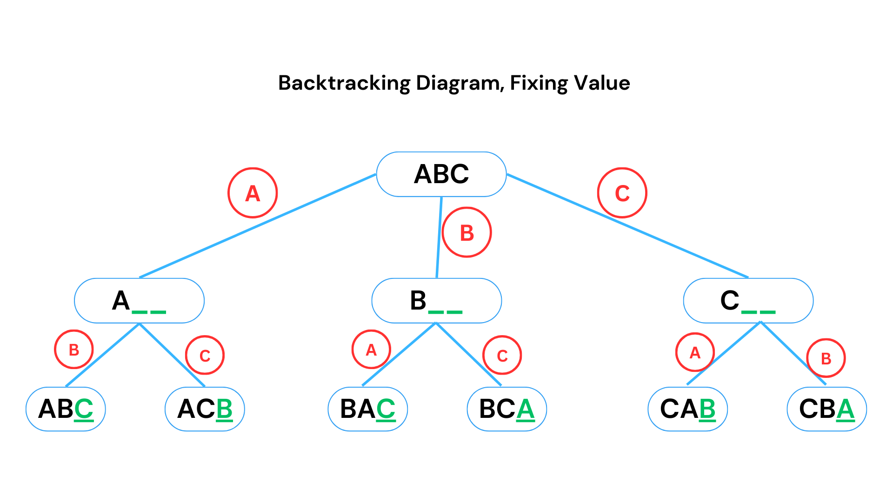

<br>

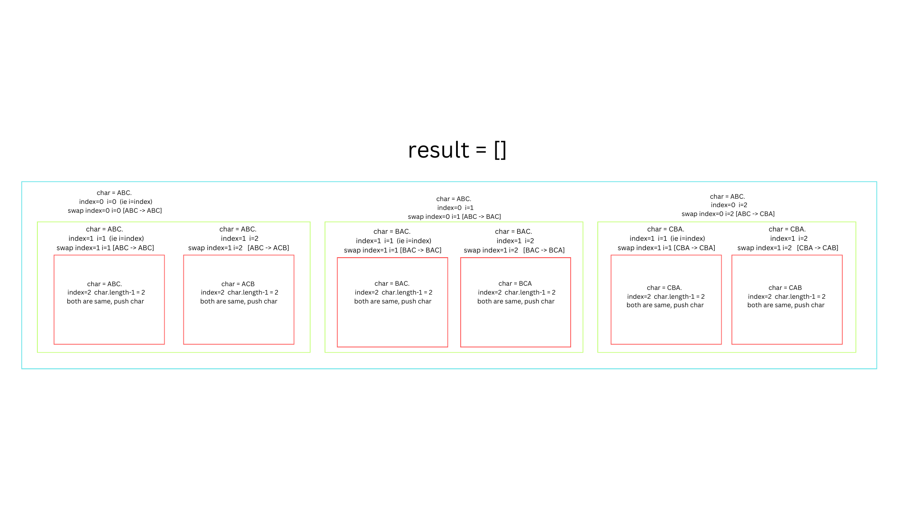

### Time Complexity:
- The time complexity is **O(n!)**, where \( n \) is the length of the string. This is because there are \( n! \) permutations for a string of length \( n \).

<br>

> ### 671. Second Minimum Node In a Binary Tree
Given a non-empty special binary tree consisting of nodes with the non-negative value, where each node in this tree has exactly two or zero sub-node. If the node has two sub-nodes, then this node's value is the smaller value among its two sub-nodes. More formally, the property root.val = min(root.left.val, root.right.val) always holds.

Given such a binary tree, you need to output the second minimum value in the set made of all the nodes' value in the whole tree.

If no such second minimum value exists, output -1 instead.

Example 1:

Input: root = [2,2,5,null,null,5,7]\
Output: 5\
Explanation: The smallest value is 2, the second smallest value is 5.

Example 2:

Input: root = [2,2,2]\
Output: -1\
Explanation: The smallest value is 2, but there isn't any second smallest value.

```js
var findSecondMinimumValue = function(root) {
    if (!root || !root.left || !root.right) return -1;

    let firstMin = root.val;
    let secondMin = Infinity;

    const traverse = (node) => {
        if (!node) return;

        if (node.val > firstMin && node.val < secondMin) {
            secondMin = node.val;
        } else if (node.val === firstMin) {
            traverse(node.left);
            traverse(node.right);
        }
    };

    traverse(root);

    return secondMin === Infinity ? -1 : secondMin;
};

// Example usage:
const root = {
    val: 2,
    left: { val: 2, left: null, right: null },
    right: { 
        val: 5, 
        left: { val: 5, left: null, right: null }, 
        right: { val: 7, left: null, right: null }
    }
};

console.log(findSecondMinimumValue(root)); // Output: 5 `
```

<br>

## Strings

> ### Palindrome

<details>

```js

    // time - O(n/2)
    // space - O(1)

 function checkPalindrome(str) {
    let j = str.length - 1;
    for (let i = 0; i < str.length / 2; i++) {
      if (str[i] === str[j]) {
        j--;
      } else {
        return false;
      }
    }
    return true;
  }

  console.log(checkPalindrome(str));
```


second approach

```js
function isPalindrome(s) {

    // Initialize two pointers
    let left = 0;
    let right = s.length - 1;

    // Iterate while left pointer is less than right pointer
    while (left < right) {
        // Compare characters at the pointers
        if (s[left] !== s[right]) {
            return false;
        }
        // Move pointers inward
        left++;
        right--;
    }

    return true; // The string is a palindrome
}
```
</details>

> ### 680. Valid Palindrome II
Given a string s, return true if the s can be palindrome after deleting at most one character from it.

Example 1:

Input: s = "aba"\
Output: true

Example 2:

Input: s = "abca"\
Output: true\
Explanation: You could delete the character 'c'.

Example 3:

Input: s = "abc"\
Output: false

<details>

```js
function validPalindrome(s) {
    function isPalindrome(str, left, right) {
        while (left < right) {
            if (str[left] !== str[right]) {
                return false;
            }
            left++;
            right--;
        }
        return true;
    }

    let left = 0;
    let right = s.length - 1;

    while (left < right) {
        if (s[left] !== s[right]) {
            // Try removing one character from either end
            return isPalindrome(s, left + 1, right) || isPalindrome(s, left, right - 1);
        }
        left++;
        right--;
    }

    return true;
}

// Example usage
console.log(validPalindrome("aba"));  // true
console.log(validPalindrome("abca")); // true
console.log(validPalindrome("abc"));  // false
```
</details>

<br>

> ### 859. Buddy Strings
Given two strings s and goal, return true if you can swap two letters in s so the result is equal to goal, otherwise, return false.

Swapping letters is defined as taking two indices i and j (0-indexed) such that i != j and swapping the characters at s[i] and s[j].

For example, swapping at indices 0 and 2 in "abcd" results in "cbad".
 

Example 1:

Input: s = "ab", goal = "ba"\
Output: true\
Explanation: You can swap s[0] = 'a' and s[1] = 'b' to get "ba", which is equal to goal.\

Example 2:

Input: s = "ab", goal = "ab"\
Output: false\
Explanation: The only letters you can swap are s[0] = 'a' and s[1] = 'b', which results in "ba" != goal.

Example 3:

Input: s = "aa", goal = "aa"\
Output: true\
Explanation: You can swap s[0] = 'a' and s[1] = 'a' to get "aa", which is equal to goal.

```js
function buddyStrings(s, goal) {
    if (s.length !== goal.length) return false;

    if (s === goal) { // for the case like s="aa" and goal="aa"
        // If s and goal are the same, check if there is a duplicate character
        const charSet = new Set(s);
        return charSet.size < s.length; // Duplicate characters exist
    }

    let diffs = [];
    for (let i = 0; i < s.length; i++) {
        if (s[i] !== goal[i]) {
            diffs.push(i);
            if (diffs.length > 2) return false; // More than two differences
        }
    }

    // Check if there are exactly two differences and they can be swapped
    return diffs.length === 2 &&
           s[diffs[0]] === goal[diffs[1]] &&
           s[diffs[1]] === goal[diffs[0]];
}
```

<br>


> ### Subsequence & Substring

**Main defination of Subsequence** of "abc" are  a, b, c, ab, bc, ac, abc. Keep in mind order matter because "ca" is not a subsequence\
count of subsequence is 2^n, where n is length of string.


**Substring** - All characters in substring appear `consecutively` in the original string. eg `"abcdef"`, `abc` and `def` are `substring`.

**Subsequence** - It is sequence of characters that appear in the same order as in the original string, but not necessarily consecutivaly. you can skip character but order must remain remain same. eg -`"abcdef"`, `ace` and `bdf` are `subsequence`.

<br>

> ### 2099. Find Subsequence of Length K With the Largest Sum

You are given an integer array nums and an integer k. You want to find a subsequence of nums of length k that has the largest sum.

Return any such subsequence as an integer array of length k.

A subsequence is an array that can be derived from another array by deleting some or no elements without changing the order of the remaining elements.

Example 1:

Input: nums = [2,1,3,3], k = 2\
Output: [3,3]\
Explanation:\
The subsequence has the largest sum of 3 + 3 = 6.

Example 2:

Input: nums = [-1,-2,3,4], k = 3\
Output: [-1,3,4]\
Explanation:\
The subsequence has the largest sum of -1 + 3 + 4 = 6.

Example 3:

Input: nums = [3,4,3,3], k = 2\
Output: [3,4]\
Explanation:\
The subsequence has the largest sum of 3 + 4 = 7. \
Another possible subsequence is [4, 3].

<details>

```js
var maxSubsequence = function(nums, k) {
    debugger
   const indexnums = nums.map((nums,index) => [nums,index])

   indexnums.sort((a,b) => b[0] - a[0])

   const top = indexnums.slice(0,k) 

   top.sort((a,b) => a[1] - b[1])
   
   return top.map(pair =>pair[0])
};

maxSubsequence([-1,-2,3,4],3)
```

</details>

<br>

> ### Check if a String is Subsequence of Other

console.log(isSubsequence("abc", "ahbgdc")); // true\
console.log(isSubsequence("axc", "ahbgdc")); // false

<details>

To check if a string is a subsequence of another string in JavaScript, you can use a `two-pointer` technique. 

```js
function isSubsequence(s1, s2) {
    let i = 0, j = 0;

    // Traverse both strings
    while (i < s1.length && j < s2.length) {
        // If characters match, move i
        if (s1[i] === s2[j]) {
            i++;
        }
        // Always move j to traverse s2
        j++;
    }

    // If we traversed all characters of s1, it's a subsequence
    return i === s1.length;
}

// Example usage:
console.log(isSubsequence("abc", "ahbgdc")); // true
console.log(isSubsequence("axc", "ahbgdc")); // false
```

### Explanation:
- `s1` is the string we're checking as a subsequence.
- `s2` is the main string.
- The code uses two pointers (`i` for `s1`, and `j` for `s2`). It traverses `s2`, and when characters match, the pointer `i` is incremented. If all characters of `s1` are matched before the end of `s2`, then `s1` is a subsequence of `s2`.

This approach runs in O(n) time complexity, where `n` is the length of `s2`.

</details>

<br>

> ### 438. Anagram Substring Search (Or Search for all permutations) ( [Youtube video](https://youtu.be/fYgU6Bi2fRg?si=HoRG7uxp0GCmxlCA&t=185) )

**Example**:

**Input**: txt = “BACDGABCDA”,  **pat** = “ABCD”\
**Output**: [0, 5, 6]\
**Explanation**: “BACD” is at 0, “ABCD” at 5 and “BCDA” at 6

**Input**: txt = “AAABABAA”, **pat** = “AABA”   \
**Output**:  [0, 1, 4]\
**Explanation**: “AAAB” is at 0, “AABA” at 5 and “ABAA” at 6


<details>

### Approach: Sliding Window + Frequency Count
To solve this efficiently, we can use the `sliding window technique` with `frequency count` of characters. The key idea is:
1. Maintain a frequency count of the characters in the pattern.
2. Slide a window of the same length as the pattern over the text.
3. At each step, compare the frequency of characters in the current window with the frequency count of the pattern.


### Code Implementation in JavaScript:

```javascript
// Function to find all anagram start indices in the text
function findAnagrams(text, pattern) {
    let result = [];
    let patternLength = pattern.length;
    let textLength = text.length;

    // Arrays to store frequency of characters in pattern and current window
    let patternCount = Array(26).fill(0);  // For 'a' to 'z'
    let windowCount = Array(26).fill(0);   // For 'a' to 'z'

    // Helper function to convert a character to its index (0 for 'a', 1 for 'b', etc.)
    const charToIndex = (char) => char.charCodeAt(0) - 'a'.charCodeAt(0);

    // Build the frequency count for the pattern
    for (let i = 0; i < patternLength; i++) {
        patternCount[charToIndex(pattern[i])]++;
        windowCount[charToIndex(text[i])]++;
    }

    // Slide the window over the text
    for (let i = patternLength; i < textLength; i++) {
        // If the current window matches the pattern, add the start index
        if (patternCount.toString() === windowCount.toString()) {
            result.push(i - patternLength);
        }

        // Move the window: remove the count of the first character of the previous window
        windowCount[charToIndex(text[i - patternLength])]--;

        // Add the count of the new character in the current window
        windowCount[charToIndex(text[i])]++;
    }

    // Check the last window (since the loop above ends one step early)
    if (patternCount.toString() === windowCount.toString()) {
        result.push(textLength - patternLength);
    }

    return result;
}

// Example usage:
let text = "cbaebabacd";
let pattern = "abc";
let indices = findAnagrams(text, pattern);
console.log("Anagram start indices:", indices);
```

### Explanation:
- We convert each character to an index (`0` for `'a'`, `1` for `'b'`, etc.) using the `charToIndex` function.
- We create two frequency arrays (`patternCount` and `windowCount`):
  - `patternCount` stores the frequency of characters in the pattern.
  - `windowCount` stores the frequency of characters in the current sliding window of the text.
- We slide a window of length equal to the pattern's length across the text:
  - If the frequency arrays match, the current window is an anagram of the pattern, so we store the starting index.
  - After moving the window, we update the frequency of the characters in the window.
- Finally, we check the last window for a match.


### Time Complexity:
- **O(n)** where `n` is the length of the text. We visit each character of the text only once while sliding the window.

</details>

<br>

> ### Lexicographic Rank of a String ( [Youtube video](https://youtu.be/uUN8fVPrJn0?si=Ege3okmmRJvxt331) )

**If needed, can refer the GFG code also https://www.geeksforgeeks.org/lexicographic-rank-of-a-string/**

**Detailed Steps:**

1. **Factorial Precomputation**: Precompute factorials of numbers from `0` to `n` (length of the string).
  
2. **Count Frequency of Characters**: Count how often each character appears in the string (we assume ASCII characters, so we use a frequency array of size 256).

3. **Calculate Rank**: For each character in the string, calculate how many permutations start with a smaller character. Use the frequency array to determine how many smaller characters exist and multiply by the factorial of the remaining length.

4. **Adjust Frequency**: After processing each character, reduce its frequency by 1 to account for it being fixed in place.

### Code Implementation in O(n) Time Complexity:

```javascript
// Function to calculate factorials up to 'n'
function precomputeFactorials(n) {
    let fact = Array(n + 1).fill(1);
    for (let i = 2; i <= n; i++) {
        fact[i] = fact[i - 1] * i;
    }
    return fact;
}

// Function to find the lexicographic rank of a string in O(n) time
function lexicographicRank(str) {
    const n = str.length;

    // Precompute factorials up to n
    let fact = precomputeFactorials(n);

    // Create a frequency array for all characters
    let charCount = Array(256).fill(0); // 256 for extended ASCII

    // Populate the frequency array with the count of each character
    for (let i = 0; i < n; i++) {
        charCount[str.charCodeAt(i)]++;
    }

    // Initialize rank to 1 (since ranks start from 1)
    let rank = 1;

    // Traverse each character in the string
    for (let i = 0; i < n; i++) {
        // Calculate how many permutations would be generated by smaller characters
        for (let j = 0; j < str.charCodeAt(i); j++) {
            if (charCount[j] > 0) {
                rank += fact[n - i - 1]; // Add factorial of remaining length
            }
        }

        // Reduce the frequency of the current character
        charCount[str.charCodeAt(i)]--;
    }

    return rank;
}

// Example usage
let str = "STRING";
let rank = lexicographicRank(str);
console.log(`Lexicographic rank of "${str}" is: ${rank}`);
```

### Explanation:

1. **Precompute Factorials**:
   - The `precomputeFactorials` function precomputes the factorial values for numbers from 0 to `n`. This reduces the time spent on calculating factorials during the rank calculation.
  
2. **Frequency Array**:
   - A frequency array (`charCount`) is used to store the frequency of each character in the string. Since the problem assumes unique characters, this will just serve as a way to track how many characters are smaller than the current character as we process the string.

3. **Calculate Rank**:
   - For each character, we calculate how many permutations would be generated by all characters smaller than the current character, and then add this count to the rank.
   - After processing each character, we decrement its count in the `charCount` array.

### Example:

For the string `"STRING"`:

1. Precompute factorials for the length of the string.
2. Populate the frequency array with character counts.
3. Traverse each character:
   - For `'S'`, there are `3!` permutations of characters smaller than `'S'`, like `'R'`, `'N'`, etc.
   - For `'T'`, count smaller characters and add corresponding permutations.
4. Sum the contributions of all characters to get the lexicographic rank.

### Output:

For the input `"STRING"`:

```
Lexicographic rank of "STRING" is: 598
```

### Time Complexity:

- **O(n)**: We are precomputing the factorials in O(n) and calculating the rank by iterating over the string once. Accessing and updating the frequency array takes constant time (`O(1)` for each character).
  
### Space Complexity:

- **O(1)** (if we ignore the factorial array and frequency array). Otherwise, it is **O(256)** for the frequency array and **O(n)** for the factorial array.


<br>

> ### 1071 - Greatest Common Divisor of Strings

Given two strings str1 and str2, return the `largest` string x such that x divides both str1 and str2.

 

Example 1:

Input: str1 = "ABCABC", str2 = "ABC"\
Output: "ABC"


Example 2:

Input: str1 = "ABABAB", str2 = "ABAB"\
Output: "AB"


Example 3:

Input: str1 = "LEET", str2 = "CODE"\
Output: ""

<details>

```js
var gcdOfStrings = function (str1, str2) {
    // (1)
    if (str1 + str2 !== str2 + str1) {
        return "";
    }

    // (2)
    const gcd = (a, b) => (b === 0 ? a : gcd(b, a % b));

    // (3)
    const maxLength = gcd(str1.length, str2.length);
    return str1.slice(0, maxLength);
};
```
For point 1;\
Since both strings contains multiples of the identical segment `base`, their concatenation must be consistent, regardless of the order `(str1 + str2 = str2 + str1)`.

For point 2;\
It is basically getting the `HCF` of two numbers.
```js
const gcd = (a, b) => {
    // Step 1: Check if `b` is 0. If so, return `a` as the GCD.
    if (b === 0) {
        return a;
    }

    // Step 2: Calculate the remainder of `a` divided by `b`.
    const remainder = a % b;

    // Step 3: Recursively call gcd with `b` and the remainder.
    return gcd(b, remainder);
};
```
How Does the above Euclidean Algorithm Work?

If b is 0, then a is the GCD (because any number divided by itself or zero has itself as the largest divisor).\
Otherwise, replace a with b and b with a % b (the remainder when a is divided by b).\
Repeat this process until b becomes 0.\
This is a recursive algorithm, meaning the function repeatedly calls itself with smaller values until a base case (b === 0) is reached.

Example Calculation: GCD of 48 and 18\
Let’s break it down step by step:

Initial Input: a = 48, b = 18

remainder = 48 % 18 = 12\
Call gcd(18, 12).\
Second Step: a = 18, b = 12

remainder = 18 % 12 = 6\
Call gcd(12, 6).\
Third Step: a = 12, b = 6

remainder = 12 % 6 = 0\
Call gcd(6, 0).\
Final Step: b = 0

Base case is reached, return a = 6.\
Thus, the GCD of 48 and 18 is 6.


For point 3;\

maxLength gives the the length of repeation of the identical segment `base` in the first string.\

</details>

<br>

> ### 345. Reverse Vowels of a String

Example 1:\
Input: s = "IceCreAm"\
Output: "AceCreIm"

Explanation:\
The vowels in s are ['I', 'e', 'e', 'A']. On reversing the vowels, s becomes "AceCreIm".

Example 2:\
Input: s = "leetcode"\
Output: "leotcede"

Hint is here that we have used the `two pointer therorem`.

```js
var reverseVowels = function (s) {
    const vowels = new Set(['a', 'e', 'i', 'o', 'u', 'A', 'E', 'I', 'O', 'U']);

    let left = 0;
    let right = s.length - 1;
    let r = s.split('');
    // debugger

    while (left < right) {
        // debugger
        if (!vowels.has(r[right])) right--;
        else if (!vowels.has(r[left])) left++;
        else {
            [r[left], r[right]] = [r[right], r[left]] 
            left++;
            right--;
        }
    }
    return r.join('');
};

reverseVowels('IceCreAm')
```

<br>

> ### 238. Product of Array Except Self

Given an integer array nums, return an array answer such that answer[i] is equal to the product of all the elements of nums except nums[i].

You must write an algorithm that runs in `O(n)` time and `without using the division operation`.

Example 1:

Input: nums = [1,2,3,4]\
Output: [24,12,8,6]

Example 2:

Input: nums = [-1,1,0,-3,3]\
Output: [0,0,9,0,0]

<details>

### Approach:
We can solve this problem by using two auxiliary arrays:
1. **Left Product Array**: Contains the product of all elements to the left of the current index.
2. **Right Product Array**: Contains the product of all elements to the right of the current index.

However, to optimize for space, we can avoid the auxiliary arrays and calculate the result directly in one pass after maintaining cumulative products.

video - https://youtu.be/bNvIQI2wAjk

```js
var productExceptSelf = function(nums) {
    
    const result = [];
    
    // Step 1: Calculate the prefix product (left product)
    let prefix = 1;
    for (let i = 0; i < nums.length; i++) {
        result[i] = prefix;
        prefix *= nums[i];
    }

    // result will be [1, 1, 2, 6]

    // Step 2: Calculate the suffix product (right product) and multiply
    let suffix = 1;
    for (let i = nums.length - 1; i >= 0; i--) {
        result[i] *= suffix;
        suffix *= nums[i];
    }

    return result;
};
productExceptSelf([1,2,3,4])
// [24,12,8,6]
```
</details>

<br>

> ### Increasing Triplet Subsequence

Given an integer array nums, return true if there exists a triple of indices `(i, j, k)` such that `i < j < k` and `nums[i] < nums[j] < nums[k]`. If no such indices exists, return false.

 

Example 1:

Input: nums = [1,2,3,4,5]\
Output: true\
Explanation: Any triplet where i < j < k is valid.

Example 2:

Input: nums = [5,4,3,2,1]\
Output: false\
Explanation: No triplet exists.

Example 3:

Input: nums = [2,1,5,0,4,6]\
Output: true\
Explanation: The triplet (3, 4, 5) is valid because nums[3] == 0 < nums[4] == 4 < nums[5] == 6.

<details>

#### Steps:
1. Maintain two variables `first` and `second` to represent the smallest and second smallest numbers found so far.
2. Traverse the array:
   - If the current number is smaller than or equal to `first`, update `first`.
   - Else if the current number is smaller than or equal to `second`, update `second`.
   - Otherwise, if the current number is greater than `second`, we have found our triplet, so return `true`.

3. If no triplet is found after the loop, return `false`.

### Implementation in JavaScript:
```javascript
function increasingTriplet(nums) {
    let first = nums[0];  // Smallest number so far
    let second = Infinity; // Second smallest number so far

    for (let num of nums) {
        if (num <= first) {
            first = num; // Update the smallest number
        } else if (num <= second) {
            second = num; // Update the second smallest number
        } else {
            // Found a number greater than both first and second
            return true;
        }
    }
    return false; // No triplet found
}

// Example usage
console.log(increasingTriplet([1, 2, 3, 4, 5])); // true
console.log(increasingTriplet([5, 4, 3, 2, 1])); // false
console.log(increasingTriplet([2, 1, 5, 0, 4, 6])); // true
```
</details>

<br>

> ### String Compression

You must write an algorithm that uses only constant extra space.

Example 1:

Input: chars = ["a","a","b","b","c","c","c"]\
Output: Return 6, and the first 6 characters of the input array should be: ["a","2","b","2","c","3"]\
Explanation: The groups are "aa", "bb", and "ccc". This compresses to "a2b2c3".

Example 2:

Input: chars = ["a"]\
Output: Return 1, and the first character of the input array should be: ["a"]\
Explanation: The only group is "a", which remains uncompressed since it's a single character.

Example 3:

Input: chars = ["a","b","b","b","b","b","b","b","b","b","b","b","b"]\
Output: Return 4, and the first 4 characters of the input array should be: ["a","b","1","2"].\
Explanation: The groups are "a" and "bbbbbbbbbbbb". This compresses to "ab12".


### Implementation in JavaScript

```javascript
function compress(chars) {
    let write = 0; // Position to write compressed data
    let count = 1; // Count occurrences of the current character

    for (let i = 1; i <= chars.length; i++) {
        // Check if the current character is the same as the previous one
        if (i < chars.length && chars[i] === chars[i - 1]) {
            count++;
        } else {
            // Write the character
            chars[write] = chars[i - 1];
            write++;

            // Write the count if greater than 1
            if (count > 1) {
                const countStr = count.toString();
                for (const digit of countStr) {
                    chars[write] = digit;
                    write++;
                }
            }

            // Reset the count
            count = 1;
        }
    }

    return write;
}

// Example Usage
const chars1 = ["a","a","b","b","c","c","c"];
console.log(compress(chars1)); // Output: 6, chars1 = ["a","2","b","2","c","3"]

const chars2 = ["a"];
console.log(compress(chars2)); // Output: 1, chars2 = ["a"]

const chars3 = ["a","b","b","b","b","b","b","b","b","b","b","b","b"];
console.log(compress(chars3)); // Output: 4, chars3 = ["a","b","1","2"]

```


### Complexity

- **Time Complexity**: \(O(n)\), where \(n\) is the length of `chars`. We traverse the array once.
- **Space Complexity**: \(O(1)\), as we perform the compression in-place with no extra space used for storage.


<br>

> ### Check for leftmost repeating character (when we start from left find which character repeats, then give its index)

- Algoname - Hashing

Here's a JavaScript code to check for the leftmost repeating character using a data structures and algorithms (DSA) approach. We can use a `map` (or object) to store character frequencies and their first occurrence.

### Approach:
1. Traverse the string and store the first occurrence of each character in a map.
2. While traversing, check if the character is already in the map. If it is, update the leftmost repeating character.
3. At the end, return the index of the leftmost repeating character.

### Code:
```javascript
function leftMostRepeatingChar(str) {
    const map = {};  // Object to store the first occurrence of characters
    let leftMostIdx = -1;  // Variable to store the index of the leftmost repeating character

    // Traverse from right to left to capture the leftmost repeating character
    for (let i = str.length - 1; i >= 0; i--) {
        const char = str[i];
        if (map[char]) {
            leftMostIdx = i;  // Update index of the leftmost repeating character
        } else {
            map[char] = true;  // Mark this character as visited
        }
    }

    return leftMostIdx;
}

// Test example
console.log(leftMostRepeatingChar("geeksforgeeks")) // 0
console.log(leftMostRepeatingChar("abbcc")) // 1
console.log(leftMostRepeatingChar("abcd")) // -1
```

### Explanation:
- A map (`map`) keeps track of the characters you've seen.
- The loop runs from the right end to the left, so whenever a character repeats, we update the `leftMostIdx`.
- This ensures that the leftmost repeating character is captured first.

### Time Complexity: 
- O(n), where n is the length of the string. The string is traversed only once.


<br>

> ### check for leftmost non-repeating character

```js
function leftMostNonRepeatingChar(str) {
  const freqMap = {};

  // First pass: count the frequency of each character
  for (let i = 0; i < str.length; i++) {
    const char = str[i];
    freqMap[char] = (freqMap[char] || 0) + 1;
  }

  // Second pass: find the first character with frequency 1
  for (let i = 0; i < str.length; i++) {
    if (freqMap[str[i]] === 1) {
      return str[i]; // Return the first non-repeating character
    }
  }

  return null; // Return null if no non-repeating character is found
}

// Example usage:
const str = "abacabad";
console.log(leftMostNonRepeatingChar(str)); // Output: "c"
```


<br>


<br>

> ### Pattern searching algoritm in string ( [Youtube video](https://youtu.be/V5-7GzOfADQ?si=Al1GgXyjbLyC2zEz&t=460) )

To implement a pattern searching algorithm in JavaScript, one of the most common algorithms is the **Knuth-Morris-Pratt (KMP)** algorithm. It efficiently searches for occurrences of a word within a text and improves performance by avoiding rechecking characters that have already been checked.

Here’s how you can implement the KMP pattern searching algorithm in JavaScript:

### Steps for KMP Algorithm:
1. **Preprocess the pattern** to create the longest prefix which is also a suffix (LPS) array.
2. **Search the pattern** in the given text using the LPS array to skip unnecessary comparisons.

### Code Implementation:

```javascript
// Function to create the LPS array (longest prefix suffix)  ( [Youtube video](https://www.youtube.com/watch?v=9kgWwkgXTGM&ab_channel=CollegeWalaDost) )
function computeLPSArray(pattern) {
  const lps = Array(pattern.length).fill(0);
  let len = 0;
  let i = 1;

  while (i < pattern.length) {
    if (pattern[i] === pattern[len]) {
      len++;
      lps[i] = len;
      i++;
    } else {
      if (len !== 0) {
        len = lps[len - 1];
      } else {
        lps[i] = 0;
        i++;
      }
    }
  }
  return lps;
}

// Function to perform KMP search
function KMPSearch(text, pattern) {
  const lps = computeLPSArray(pattern);
  const result = [];
  let i = 0; // index for text
  let j = 0; // index for pattern

  while (i < text.length) {
    if (pattern[j] === text[i]) {
      i++;
      j++;
    }

    if (j === pattern.length) {
      // Pattern found at index i-j
      result.push(i - j);
      j = lps[j - 1];
    } else if (i < text.length && pattern[j] !== text[i]) {
      if (j !== 0) {
        j = lps[j - 1];
      } else {
        i++;
      }
    }
  }

  return result; // Returns indices where the pattern is found
}

// Example usage
const text = "ABABDABACDABABCABAB";
const pattern = "ABABCABAB";
const occurrences = KMPSearch(text, pattern);
console.log("Pattern found at index:", occurrences);
```

### Explanation:
- **computeLPSArray**: Prepares the LPS array to optimize the search by storing the length of the previous longest prefix that is also a suffix.
- **KMPSearch**: This function uses the LPS array to perform the actual search, skipping unnecessary comparisons based on the LPS values.

### Example Output:
```
Pattern found at index: [10]
```

This code will find all the positions of the pattern in the given text efficiently.


<br>


> ### Array vs Linked list table in terms of BIG O

| Operation  | Array (Big O) | Linked List (Big O) |
|------------|---------------|---------------------|
| **Pop**    | O(1)          | O(n)                |
| **Push**   | O(1)          | O(n)                |
| **Shift**  | O(n)          | O(1)                |
| **Unshift**| O(n)          | O(1)                |
| **Reverse**| O(n)          | O(n)                |
| **Insert** | O(n)          | O(n)                |
| **Update** | O(1)          | O(n)                |

<br>

> ## Single linked list

> ### Linked List node

In linked list we have basic unit called `node` and below is the basic structure for the same

```js
// let node is 4

{
    value: 4,
    next: null
}
```

Each linked list have the `head node`,`tail node`, along with `length` property.


```js
class Node {
    constructor(value){
        this.value = value
        this.next = null
    }
}

class LinkedList {
    constructor(value){
        const newNode = new Node(value)
        this.head = newNode
        this.tail = this.head
        this.length = 1
    }

    push(value){
        const newNode = new Node(value)
        
        if(!this.head){
            this.head = newNode
            this.tail = newNode
        } else {
            this.tail.next = newNode
            this.tail = newNode
        }
        this.length++

        return this
    }

    pop(){
        // When there is no head
        if(!this.head) return undefined

        // when there is head in linked LinkedList
        let temp = this.head
        let pre = this.head

        while(temp.next){
            pre = temp
            temp = temp.next
        }

        this.tail = pre
        this.tail.next = null
        this.length--

        // for handling if deleting node, it empties the linked list
        if(this.length === 0){
            this.head = null
            this.tail = null
        }

        return temp
    }

    unshift(value){
        const newNode = new Node(value)

        // when there is no head
        if(!this.head){
            this.head = newNode
            this.tail = newNode
        } else {
            newNode.next = this.head
            this.head = newNode
        }
        this.length++
        return this
    }

    shift(){
        
        // When there is no head
        if(!this.head) return undefined

        let temp = this.head
        this.head = this.head.next
        temp.next = null
        this.length--

        // below is for, if we are removing the last node of linked list
        if(this.length === 0){
            this.tail = null
        }

        // below is for returning the delted value
        return temp
    }

    get(index){
        // for handling the value whose index is not in the range
        if(index < 0 || index >= this.length){
            return undefined
        }

        let temp = this.head
        for(let i=0; i<index; i++){
            temp = temp.next
        }
        return temp
    }

    set(index, value){
        let temp = this.get(index)
        if(temp){
            temp.value = value
            return true
        }
        return false
    }

    insert(index, value){
        // for handling if added to initial or starting position
        if(index === 0) return this.unshift(value)

        // for handling, if added to end of linked list
        if(index === this.length-1) return this.push(value)

        // for handling, if index passed which is out of range of linked list
        if(index < 0 || index >= this.length) return false

        const newNode = new Node(value)
        const temp = this.get(index-1)

        newNode.next = temp.next
        temp.next = newNode
        this.length++
        return true
    }

    remove(index) {
       // Handle index out of range
       if (index < 0 || index >= this.length) return null;
   
       // Handle removing the first node
       if (index === 0) return this.shift();
   
       // Handle removing the last node
       if (index === this.length - 1) return this.pop();
   
       // Get the node before the one we want to remove
       const before = this.get(index - 1);
       const temp = before.next;  // Corrected: no parentheses since next is a property
   
       // Remove the node by adjusting pointers
       before.next = temp.next;
       temp.next = null;
   
       // Decrease the length
       this.length--;
   
       return temp;  // Return the removed node
   }


   // delete a node in a singly linked list when only that node (the one to be deleted) is given
   // you can achieve the deletion by copying the data from the next node into the given node, and then deleting the next node.
   // 1.Copy the value of the next node to the current node (the node to be deleted)
   // 2.Set the next pointer of the current node to the next of the next node, effectively "skipping" the next node.
   // 3.This approach won't work for the last node in the list since there is no next node to copy data from.
    findAndDeleteNode(value) {
       let current = this.head;

       // Traverse the list to find the node with the given value
       while (current) {
           if (current.value === value) {
               // If the node is found, check if it's not the last node
               if (current.next) {
                   // Copy the value of the next node and bypass the next node
                   current.value = current.next.value;
                   current.next = current.next.next;
               } else {
                   console.log('Cannot delete the last node using this method.');
               }
               return;
           }
           current = current.next;
       }

       console.log(`Node with value ${value} not found.`);
    }


    // Function to segregate even and odd nodes
    segregateEvenOdd() {
        if (!this.head) return; // No nodes in the list

        let evenHead = null,
            evenTail = null;
        let oddHead = null,
            oddTail = null;
        let current = this.head;

        while (current) {
            if (current.value % 2 === 0) {
                // Even node
                if (!evenHead) {
                    evenHead = current;
                    evenTail = evenHead;
                } else {
                    evenTail.next = current;
                    evenTail = evenTail.next;
                }
            } else {
                // Odd node
                if (!oddHead) {
                    oddHead = current;
                    oddTail = oddHead;
                } else {
                    oddTail.next = current;
                    oddTail = oddTail.next;
                }
            }
            current = current.next;
        }

        // If there are no even nodes or no odd nodes, no need to modify the list
        if (!evenHead || !oddHead) {
            return;
        }

        // Combine the even and odd lists
        evenTail.next = oddHead;
        oddTail.next = null; // Mark the end of the new list

        // Update the head to point to the even list's head
        this.head = evenHead;
    }

    // Function to calculate the length of the list
    getLength() {
        let current = this.head;
        let length = 0;
        while (current) {
            length++;
            current = current.next;
        }
        return length;
    }

    // LeetCode : Q-160
    // Function to find the intersection point of two linked lists
    // 1.Calculate the lengths of both lists.
    // 2.Move the pointer of the longer list ahead by the difference in lengths.
    // 3.Traverse both lists together until the pointers meet at the intersection point.
    static findIntersection(headA, headB) {
        if (!headA || !headB) return null;

        let lenA = 0, lenB = 0;
        let currA = headA, currB = headB;

        // Calculate lengths of both lists
        while (currA) {
            lenA++;
            currA = currA.next;
        }
        while (currB) {
            lenB++;
            currB = currB.next;
        }

        // Reset pointers to heads
        currA = headA;
        currB = headB;

        // Align the starts
        if (lenA > lenB) {
            for (let i = 0; i < lenA - lenB; i++) {
                currA = currA.next;
            }
        } else if (lenB > lenA) {
            for (let i = 0; i < lenB - lenA; i++) {
                currB = currB.next;
            }
        }

        // Traverse and find intersection
        while (currA && currB) {
            if (currA === currB) {
                return currA; // Intersection found
            }
            currA = currA.next;
            currB = currB.next;
        }

        return null; // No intersection
    }


    // Function to swap nodes in pairs by changing links
    pairwiseSwap() {
        if (!this.head || !this.head.next) return; // No need to swap if less than 2 nodes

        let prev = null;
        let current = this.head;

        // Change the head to the second node since we are swapping in pairs
        this.head = current.next;

        while (current && current.next) {
            let nextNode = current.next;
            current.next = nextNode.next;
            nextNode.next = current;

            // Connect the previous pair to the current swapped pair
            if (prev) {
                prev.next = nextNode;
            }

            // Move to the next pair
            prev = current;
            current = current.next;
        }
    }

    // leetcode - 206. Function to reverse a linked list starting from a given node
    reverse(node) {
        let prev = null;
        let current = node;
        while (current) {
            let nextNode = current.next;
            current.next = prev;
            prev = current;
            current = nextNode;
        }
        return prev;
    }

    // 234. Leetcode -  Function to check if the linked list is a palindrome
    // A common method to solve this problem in O(n) time and O(1) space is to:
    function isPalindrome(head) {
        if (!head || !head.next) return true;

        // Step 1: Find the middle of the linked list
        let slow = head, fast = head;
        while (fast && fast.next) {
            slow = slow.next;
            fast = fast.next.next;
        }

        // Step 2: Reverse the second half of the linked list
        let prev = null;
        while (slow) {
            let next = slow.next;
            slow.next = prev;
            prev = slow;
            slow = next;
        }

        // Step 3: Compare the first and second halves
        let left = head, right = prev; // `prev` is now the head of the reversed second half
        while (right) {
            if (left.val !== right.val) return false;
            left = left.next;
            right = right.next;
        }

        // Step 4 (optional): Restore the list (if needed)
        // This step is usually optional unless the problem specifically asks to retain the original list structure.

        return true;
    }


    // Merge two sorted linked lists
    // 1.Create a dummy node to serve as the starting point of the merged list.
    // 2.Use two pointers to traverse both lists, comparing the nodes from each list.
    // 3.Add the smaller node to the merged list.
    // 4.If one list becomes empty before the other, append the remaining nodes from the other list to the merged list.

    static mergeSortedLists(list1, list2) {
        // Create a dummy node to serve as the start of the merged list
        const dummy = new Node(0);
        let current = dummy;

        let l1 = list1.head;
        let l2 = list2.head;

        // Traverse both lists and merge them in sorted order
        while (l1 && l2) {
            if (l1.value <= l2.value) {
                current.next = l1;
                l1 = l1.next;
            } else {
                current.next = l2;
                l2 = l2.next;
            }
            current = current.next;
        }

        // If one list is not fully traversed, append the remaining nodes
        if (l1) {
            current.next = l1;
        } else if (l2) {
            current.next = l2;
        }

        // Return the merged list starting from the next of dummy
        const mergedList = new LinkedList();
        mergedList.head = dummy.next;
        return mergedList;
    }

    reverse(){
        let temp = this.head
        this.head = this.tail
        this.tail = temp

        let next = temp.next
        let prev = null

        for(let i=0; i<this.length; i++){
            next = temp.next
            temp.next = prev
            prev = temp
            temp = next
        }

        return this
    }

    // reverse if we do not have tail and length
    reverse() {
        let previous = null;
        let current = this.head;
        let next = null;

        // Traverse the list and reverse the links
        while (current) {
            // Store the next node
            next = current.next;
            // Reverse the current node's pointer
            current.next = previous;
            // Move the previous and current pointers one step forward
            previous = current;
            current = next;
        }

        // After the loop, previous will be the new head
        this.head = previous;
    }


    // leetcode : 83
    // remove duplicates from a sorted singly linked list 
    removeDuplicates() {
        let current = this.head;

        while (current && current.next) {
            if (current.value === current.next.value) {
                // Skip/delete the duplicate node
                current.next = current.next.next;
            } else {
                // Move to the next node if no duplicate
                current = current.next;
            }
        }
    }

    // Function to reverse the linked list in groups of k
    reverseInGroupsOfK(k) {
        this.head = this.reverseInGroups(this.head, k);
    }

    // Function to reverse a group of k nodes in the linked list
    reverseInGroups(head, k) {
        let current = head;
        let previous = null;
        let next = null;
        let count = 0;

        // Reverse the first k nodes of the linked list
        while (current && count < k) {
            next = current.next;
            current.next = previous;
            previous = current;
            current = next;
            count++;
        }

        // next is now pointing to (k+1)th node
        // Recur for the list starting from current
        if (next) {
            head.next = this.reverseInGroups(next, k);
        }

        // previous is the new head of the reversed group
        return previous;
    }

    // Function to detect a loop using Floyd's Cycle Detection Algorithm ie Slow pointer and Fast pointer
    detectLoop() {
        let slow = this.head;
        let fast = this.head;

        while (fast && fast.next) {
            slow = slow.next;         // Moves one step
            fast = fast.next.next;     // Moves two steps

            // If slow and fast meet, there's a loop
            if (slow === fast) {
                return true;
            }
        }

        // If we reach here, there is no loop
        return false;
    }

    // Function to detect and remove a loop in the linked list
    // 1. Detect the loop using Floyd's Cycle Detection Algorithm (also known as the tortoise and hare method).
    // 2. reset slow pointer to the head of the list
    // 3. Move both pointers one step at a time until they meet. This is the start of the loop.
    // 4. To remove the loop, traverse the loop again and find the node whose next points to the start of the loop. Set that node's next to null.
    detectAndRemoveLoop() {
        let slow = this.head;
        let fast = this.head;
        let loopDetected = false;

        // Step 1: Detect the loop using Floyd's Cycle Detection Algorithm
        while (fast && fast.next) {
        slow = slow.next;
        fast = fast.next.next;

            if (slow === fast) {
                loopDetected = true;
                break;
            }
        }

        // If no loop was detected, return
        if (!loopDetected) {
            console.log("No loop detected.");
            return;
        }

        console.log("Loop detected.");

        // Step 2: Find the start of the loop
        slow = this.head;
        while (slow !== fast) {
            slow = slow.next;
            fast = fast.next;
        }

        // `slow` (or `fast`) is now pointing to the start of the loop
        const loopStart = slow;
        console.log("Loop starts at node with value:", loopStart.value);

        // Step 3: Find the node just before the start of the loop and remove the loop
        let current = loopStart;
        while (current.next !== loopStart) {
            current = current.next;
        }

        // Break the loop
        current.next = null;
        console.log("Loop removed.");
    }


    // Function to insert a new node in a sorted manner
    sortedInsert(value) {
        const newNode = new Node(value);

        // If the list is empty or the new node should be inserted at the head
        if (!this.head || this.head.value >= value) {
            newNode.next = this.head;
            this.head = newNode;
            return;
        }

        // Traverse the list and find the correct position to insert
        let current = this.head;
        while (current.next && current.next.value < value) {
            current = current.next;
        }

        // Insert the new node
        newNode.next = current.next;
        current.next = newNode;
    }


    // Function to find the middle node
    // "two-pointer technique" (also called "slow and fast pointer").
    findMiddle() {
        let slow = this.head;
        let fast = this.head;

        // Traverse the list, fast moves 2 steps, slow moves 1 step
        while (fast && fast.next) {
            slow = slow.next;
            fast = fast.next.next;
        }

        // When fast reaches the end, slow will be at the middle
        return slow;
    }

    // Function to find the nth node from the end
    // two-pointer technique
    findNthFromEnd(n) {
        let first = this.head;
        let second = this.head;

        // Move the first pointer `n` nodes ahead
        for (let i = 0; i < n; i++) {
            if (!first) {
                // If n is larger than the length of the list
                return null;
            }
            first = first.next;
        }

        // Move both pointers until the first pointer reaches the end
        while (first) {
            first = first.next;
            second = second.next;
        }

        // The second pointer is now at the nth node from the end
        return second;
    }


    // Function to print the linked list
    printList() {
        let current = this.head;
        let listStr = '';
        while (current) {
            listStr += current.value + ' -> ';
            current = current.next;
        }
        console.log(listStr + 'null');
    }
}

let myLinkedList = new LinkedList(1)
myLinkedList.push(2)

```

> ### 21. Merge Two Sorted Lists

Example 1:

Input: list1 = [1,2,4], list2 = [1,3,4]\
Output: [1,1,2,3,4,4]

Example 2:

Input: list1 = [], list2 = []\
Output: []

Example 3:

Input: list1 = [], list2 = [0]\
Output: [0]

```js
// Solution 1

function mergeTwoLists(list1, list2) {
    // If one of the lists is null, return the other list since there's nothing to merge
    if (list1 === null || list2 === null) {
        return list1 || list2;
    }

    // Compare the values of the two list heads and recursively merge the rest of the lists
    if (list1.val < list2.val) {
        // If the value of the first list head is less, 
        // link that node to the result of merging the rest of the lists
        list1.next = mergeTwoLists(list1.next, list2);
        return list1;
    } else {
        // If the value of the second list head is less or equal,
        // link that node to the result of merging the rest of the lists
        list2.next = mergeTwoLists(list1, list2.next);
        return list2;
    }
}


// Solution 2
class ListNode {
    constructor(val = 0, next = null) {
        this.val = val
        this.next = next
    }
}


var mergeTwoLists = function (list1, list2) {
    let newList = new ListNode()
    let curr = newList

    while (list1 !== null && list2 !== null) {
        if (list1.val < list2.val) {
            curr.next = list1
            list1 = list1.next
        } else {
            curr.next = list2
            list2 = list2.next
        }
        curr = curr.next
    }

    // This is for adding extra length jo bach jaye
    if (list1 !== null) {
        curr.next = list1;
    } else if (list2 !== null) {
        curr.next = list2;
    }

    return newList.next
};

const l1 = {
    val: 1,
    next: {
        val: 2,
        next: {
            val: 4,
            next: null
        }
    }
};
const l2 = {
    val: 1,
    next: {
        val: 3,
        next: {
            val: 4,
            next: null
        }
    }
};

mergeTwoLists(l1, l2)
```


> ### Double linked list

```js
class Node {
    constructor(value){
        this.value = value
        this.next = null
        this.prev = null
    }
}

class DoublyLinkedList {
    constructor(value){
        const newNode  = new Node(value)
        this.head = newNode
        this.tail = newNode
        this.length = 1
    }

    push(value){
        const newNode  = new Node(value)

        if(!this.head){
            this.head = newNode
            this.tail = newNode
        } else {
            this.tail.next = newNode
            newNode.prev = this.tail
            this.tail = newNode
        }

        this.length++
        return this
    }

    pop(){
        if(this.length === 0) return undefined

        let temp = this.tail

        if(this.length === 1){
            this.head = null
            this.tail = null
        } else {
            this.tail = this.tail.prev
            this.tail.next = null
            temp.prev = null
        }
        this.length--
        return temp
    }

    unshift(value){
        const newNode  = new Node(value)

        if(this.length === 0){
            this.head = newNode
            this.tail = newNode
        }else {
            newNode.next = this.head
            this.head.prev = newNode
            this.head = newNode
        }
        this.length++
        return this
    }

    shift(){
        if(this.length === 0) return undefined

        let temp = this.head

        if(this.length === 1){
            this.head = null
            this.tail = null
        } else {
            this.head = this.head.next
            this.head.prev = null
            temp.next = null
        }
        this.length++
        return temp
    }

    get(index){
        // to handle out of range index
        if(index < 0 || index >= this.length) return undefined

        let temp

        // here linked list is bind in two direction, we will find short path at tail and head, then traverse accordingly

        if(index < this.length/2){
            temp = this.head

            for(let i=0; i<index; i++){
                temp = temp.next
            }
        } else {
            temp = this.tail

            for(let i=this.length-1; i>index; i--){
                temp = temp.prev
            }
        }

        return temp
    }

    set(index,value){
        let temp = this.get(index)

        if(temp){
            temp.value = value
            return true
        }

        return false
    }

    insert(index,value){
        if(index === 0) return this.unshift(value)
        if(index === this.length) return this.push(value)
        if(index < 0 || index > this.length) return false

        const newNode = new Node(value)
        const before = this.get(index - 1)
        const after = before.next
        before.next = newNode
        newNode.prev = before
        newNode.next = after
        after.prev = newNode
        this.length++
        return true
        
    }

    remove(index){
        if(index === 0) return this.shift()
        if(index === this.length - 1) return this.pop()
        if(index < 0 || index > this.length) return undefined

        const temp = this.get(index)

        temp.prev.next = temp.next
        temp.next.prev = temp.prev
        temp.next = null
        temp.prev = null

        this.length--
        return temp
    }
}

let myDoublyLinkedList = new DoublyLinkedList(7)
myDoublyLinkedList
```

> ### Reverse K Nodes in a Linked List ( [Youtube video](https://www.youtube.com/watch?v=LCRGV8avvUY&t=176s&ab_channel=ApnaCollege) )

To **reverse K nodes in a linked list**, the idea is to reverse every block of `K` nodes in the list. If the remaining nodes are fewer than `K`, they can be left as they are.

Here's the step-by-step approach to solve this problem:

### Approach:

1. **Traverse K Nodes**: First, reverse the first `K` nodes of the linked list. After reversing, the `K-th` node becomes the new head of that part.

2. **Recursive Call or Loop**: Then, recursively process the remaining part of the linked list, and link the last node of the reversed segment to the head of the next segment.

3. **Return the New Head**: Once all segments are reversed, return the new head of the entire list.

### Example:

For the linked list: `1 -> 2 -> 3 -> 4 -> 5 -> 6 -> 7 -> 8 -> 9` and `K = 3`, the result will be:
```
3 -> 2 -> 1 -> 6 -> 5 -> 4 -> 9 -> 8 -> 7
```

### Code Implementation in JavaScript:

```javascript
class Node {
    constructor(value) {
        this.value = value;
        this.next = null;
    }
}

// Function to reverse K nodes in a linked list
function reverseKNodes(head, K) {
    if (head === null || K === 1) return head;

    let current = head;
    let next = null;
    let prev = null;
    let count = 0;

    // Reverse the first K nodes of the linked list
    while (current !== null && count < K) {
        next = current.next;
        current.next = prev;
        prev = current;
        current = next;
        count++;
    }

    // next is now pointing to (K+1)th node. Recursively reverse the rest of the list
    if (next !== null) {
        head.next = reverseKNodes(next, K);
    }

    // prev is the new head of the reversed group
    return prev;
}

// Utility function to print the linked list
function printList(head) {
    let temp = head;
    while (temp !== null) {
        console.log(temp.value + " -> ");
        temp = temp.next;
    }
    console.log("null");
}

// Driver code
const K = 3;

// Creating a linked list: 1 -> 2 -> 3 -> 4 -> 5 -> 6 -> 7 -> 8 -> 9
let head = new Node(1);
head.next = new Node(2);
head.next.next = new Node(3);
head.next.next.next = new Node(4);
head.next.next.next.next = new Node(5);
head.next.next.next.next.next = new Node(6);
head.next.next.next.next.next.next = new Node(7);
head.next.next.next.next.next.next.next = new Node(8);
head.next.next.next.next.next.next.next.next = new Node(9);

console.log("Original List:");
printList(head);

// Reverse every K nodes
head = reverseKNodes(head, K);

console.log("Reversed List in groups of K:");
printList(head);
```

### Explanation:

1. **Reverse First K Nodes**: In the first loop, we reverse the first `K` nodes by keeping track of the previous node (`prev`), the current node (`current`), and the next node (`next`). This process continues for `K` nodes.

2. **Recursive Call**: Once the first `K` nodes are reversed, we recursively call `reverseKNodes` for the next segment of `K` nodes. The head of the original segment (`head`) is then linked to the result of the next recursive call.

3. **Returning the New Head**: After reversing each group of `K` nodes, the new head of the segment is returned (`prev`).

### Time Complexity:
- **O(n)**: Each node is visited once, so the time complexity is linear.

### Space Complexity:
- **O(1)**: The solution uses constant extra space except for the recursion stack, which can go up to **O(n/K)** levels.

### Example:

For the input list `1 -> 2 -> 3 -> 4 -> 5 -> 6 -> 7 -> 8 -> 9` with `K = 3`, the reversed list will be:

```
3 -> 2 -> 1 -> 6 -> 5 -> 4 -> 9 -> 8 -> 7 -> null
```


> ### Clone a linked list using a random pointer

Cloning a linked list with both a **next pointer** and a **random pointer** is an interesting problem. The challenge here is to create a deep copy of the linked list such that each node's **next** and **random** pointers in the cloned list point to the correct nodes, mirroring the original list.

### Problem Breakdown:
- Each node in the linked list has two pointers:
  - **Next pointer**: Points to the next node in the linked list.
  - **Random pointer**: Points to any arbitrary node within the list (or `null`).

The goal is to clone this list in **O(n)** time and **O(1)** space.

### Steps to Solve the Problem:

1. **Step 1**: Insert each cloned node just after the original node in the linked list. For example, if the list is `A -> B -> C`, transform it to `A -> A' -> B -> B' -> C -> C'`.

2. **Step 2**: Assign the correct random pointers for the cloned nodes. Since the cloned nodes are adjacent to their originals, we can set `A'.random = A.random.next` (i.e., the random pointer of `A'` will point to the clone of `A.random`).

3. **Step 3**: Separate the cloned list from the original list.

### Code Implementation in JavaScript:

```javascript
class Node {
    constructor(value) {
        this.value = value;
        this.next = null;
        this.random = null;
    }
}

function cloneLinkedListWithRandomPointer(head) {
    if (!head) return null;

    // Step 1: Create cloned nodes and place them next to original nodes
    let current = head;
    while (current) {
        let newNode = new Node(current.value);
        newNode.next = current.next;
        current.next = newNode;
        current = newNode.next;
    }

    // Step 2: Update the random pointers of the cloned nodes
    current = head;
    while (current) {
        if (current.random) {
            current.next.random = current.random.next;
        }
        current = current.next.next; // Move to the next original node
    }

    // Step 3: Separate the cloned nodes to form the new cloned list
    current = head;
    let clonedHead = head.next;
    let clonedCurrent = clonedHead;
    
    while (current) {
        current.next = current.next.next; // Restore the original list
        if (clonedCurrent.next) {
            clonedCurrent.next = clonedCurrent.next.next; // Set next for the cloned list
        }
        current = current.next;
        clonedCurrent = clonedCurrent.next;
    }

    return clonedHead; // Return the head of the cloned list
}

// Utility function to print the list along with random pointers
function printListWithRandom(head) {
    let current = head;
    while (current) {
        const randomVal = current.random ? current.random.value : 'null';
        console.log(`Node value: ${current.value}, Random points to: ${randomVal}`);
        current = current.next;
    }
}

// Driver code

// Creating a linked list: 1 -> 2 -> 3 -> 4 -> 5
let head = new Node(1);
head.next = new Node(2);
head.next.next = new Node(3);
head.next.next.next = new Node(4);
head.next.next.next.next = new Node(5);

// Setting up random pointers
head.random = head.next.next; // 1's random -> 3
head.next.random = head; // 2's random -> 1
head.next.next.random = head.next.next.next.next; // 3's random -> 5
head.next.next.next.random = head.next.next; // 4's random -> 3
head.next.next.next.next.random = head.next; // 5's random -> 2

console.log("Original List with Random Pointers:");
printListWithRandom(head);

// Clone the linked list
let clonedHead = cloneLinkedListWithRandomPointer(head);

console.log("Cloned List with Random Pointers:");
printListWithRandom(clonedHead);
```

### Explanation:

1. **Step 1: Clone nodes and link them next to the original nodes**:
   - For each node in the original list, a new cloned node is created and inserted right after the original node. This step creates interleaved original and cloned nodes.

2. **Step 2: Set the random pointers**:
   - The cloned node's random pointer is set by using the original node's random pointer. Since the cloned nodes are right next to the originals, we can access the corresponding cloned node using `current.next`.

3. **Step 3: Separate the cloned list**:
   - Finally, we restore the original list by reconnecting its next pointers and also create the next links for the cloned list by connecting every second node (the cloned nodes).

### Time Complexity:
- **O(n)**: Each node is visited three times — once for cloning, once for setting the random pointer, and once for separating the cloned list from the original.

### Space Complexity:
- **O(1)**: We only use constant extra space (ignoring the output list), which makes this solution space-efficient.

### Example:

For a list like this:

```
1 -> 2 -> 3 -> 4 -> 5
```
With random pointers:
- 1's random -> 3
- 2's random -> 1
- 3's random -> 5
- 4's random -> 3
- 5's random -> 2

After cloning, the cloned list will have exactly the same structure and random pointers:

```
1' -> 2' -> 3' -> 4' -> 5'
```
Where the cloned random pointers mirror the original random pointers.

This method efficiently clones a linked list with both next and random pointers.


> ### Stacks and Queues

Stack ki need jab padti h jab hume chaiye jo last key visit ki thi traverse karte time wo kya thi ya uska effect kya tha.

```js
// stack is like linked list, with head named as top and available at top position. basically vertically alingned of linked list
// entry and exist on same side, basically LIFO
class Node {
    constructor(value){
        this.value = value
        this.next = null
    }
}

class Stack {
    constructor(value){
        const newNode = new Node(value)
        this.top = newNode
        this.length = 1
    }

    // push is like unshift of linked list
    push(value){
        const newNode = new Node(value)
        if(this.length === 0){
            this.top = newNode
        } else {
            newNode.next = this.top
            this.top = newNode
        }
        this.length++
        return this
    }

    pop(){
        if(this.length === 0) return undefined

        let temp = this.top
        this.top = this.top.next
        temp.next = null

        this.length--
        return temp
    }
}

let myStack = new Stack(11)
```

> ### implement two stack in array  ( [Youtube video](https://www.youtube.com/watch?v=TiYif1O1NTc) )

To implement two stacks in a single array, the idea is to divide the array in such a way that both stacks can grow from opposite ends:

1. Stack 1 starts from the beginning of the array (index 0) and grows towards the right (increasing index).
2. Stack 2 starts from the end of the array (index n-1, where n is the array size) and grows towards the left (decreasing index).

We'll maintain two pointers:

- One pointer (top1) tracks the top of Stack 1.
- Another pointer (top2) tracks the top of Stack 2.

```js
class TwoStacks {
  constructor(size) {
    this.size = size;
    this.array = new Array(size);  // Array to hold both stacks
    this.top1 = -1;                // Pointer for Stack 1 (initially no elements)
    this.top2 = size;              // Pointer for Stack 2 (initially no elements)
  }

  // Push an element into Stack 1
  push1(value) {
    if (this.top1 < this.top2 - 1) {
      this.top1++;
      this.array[this.top1] = value;
      console.log(`${value} pushed to Stack 1`);
    } else {
      console.log('Stack 1 Overflow');
    }
  }

  // Push an element into Stack 2
  push2(value) {
    if (this.top1 < this.top2 - 1) {
      this.top2--;
      this.array[this.top2] = value;
      console.log(`${value} pushed to Stack 2`);
    } else {
      console.log('Stack 2 Overflow');
    }
  }

  // Pop an element from Stack 1
  pop1() {
    if (this.top1 >= 0) {
      const poppedValue = this.array[this.top1];
      this.top1--;
      console.log(`${poppedValue} popped from Stack 1`);
      return poppedValue;
    } else {
      console.log('Stack 1 Underflow');
      return null;
    }
  }

  // Pop an element from Stack 2
  pop2() {
    if (this.top2 < this.size) {
      const poppedValue = this.array[this.top2];
      this.top2++;
      console.log(`${poppedValue} popped from Stack 2`);
      return poppedValue;
    } else {
      console.log('Stack 2 Underflow');
      return null;
    }
  }

  // Print the current elements of Stack 1
  printStack1() {
    if (this.top1 === -1) {
      console.log('Stack 1 is empty');
    } else {
      console.log('Stack 1:', this.array.slice(0, this.top1 + 1).join(' -> '));
    }
  }

  // Print the current elements of Stack 2
  printStack2() {
    if (this.top2 === this.size) {
      console.log('Stack 2 is empty');
    } else {
      console.log('Stack 2:', this.array.slice(this.top2, this.size).join(' -> '));
    }
  }
}

// Example usage
const twoStacks = new TwoStacks(10);

// Push elements into Stack 1
twoStacks.push1(5);
twoStacks.push1(10);
twoStacks.push1(15);

// Push elements into Stack 2
twoStacks.push2(25);
twoStacks.push2(30);
twoStacks.push2(35);

// Print both stacks
twoStacks.printStack1();  // Output: Stack 1: 5 -> 10 -> 15
twoStacks.printStack2();  // Output: Stack 2: 35 -> 30 -> 25

// Pop elements from both stacks
twoStacks.pop1();  // Output: 15 popped from Stack 1
twoStacks.pop2();  // Output: 35 popped from Stack 2

// Print both stacks after popping
twoStacks.printStack1();  // Output: Stack 1: 5 -> 10
twoStacks.printStack2();  // Output: Stack 2: 30 -> 25

```

> ### Removing Stars From a String

Example 1:

Input: s = "leet**cod*e"\
Output: "lecoe"\
Explanation: Performing the removals from left to right:\
- The closest character to the 1st star is 't' in "leet**cod*e". s becomes "lee*cod*e".\
- The closest character to the 2nd star is 'e' in "lee*cod*e". s becomes "lecod*e".\
- The closest character to the 3rd star is 'd' in "lecod*e". s becomes "lecoe".\
There are no more stars, so we return "lecoe".

Example 2:

Input: s = "erase*****"\
Output: ""\
Explanation: The entire string is removed, so we return an empty string.

```js
function removeStars(s) {
    const stack = [];
    
    for (const char of s) {
        if (char === '*') {
            // Remove the last character if `*` is encountered
            stack.pop();
        } else {
            // Add the character to the stack
            stack.push(char);
        }
    }
    
    // Join the stack to form the resulting string
    return stack.join('');
}

// Example usage
const input = "leet**cod*e";
console.log(removeStars(input)); // Output: "lecoe"
```

more solution

```js
var removeStars = function(s) {
    let result = "";
    let stars = 0;

    for (let i = s.length - 1; i >= 0; i--) {
        if (s[i] === "*") {
            stars++;
        } else if (stars > 0) {
            stars--;
        } else {
            result = s[i] + result;
        }
    }

    return result;
};
```

> ### Asteroid Collision

refer any youtube video for reference

We are given an array asteroids of integers representing asteroids in a row. The indices of the asteriod in the array represent their relative position in space.

For each asteroid, the absolute value represents its size, and the sign represents its direction (positive meaning right, negative meaning left). Each asteroid moves at the same speed.

Find out the state of the asteroids after all collisions. If two asteroids meet, the smaller one will explode. If both are the same size, both will explode. Two asteroids moving in the same direction will never meet.

 

Example 1:

Input: asteroids = [5,10,-5]
Output: [5,10]
Explanation: The 10 and -5 collide resulting in 10. The 5 and 10 never collide.

Example 2:

Input: asteroids = [8,-8]
Output: []
Explanation: The 8 and -8 collide exploding each other.

Example 3:

Input: asteroids = [10,2,-5]
Output: [10]
Explanation: The 2 and -5 collide resulting in -5. The 10 and -5 collide resulting in 10.


```js
// ⌚ Time complexity -> O(n) ->  n = len(asteroids)

//  Space complexity -> O(n)

var asteroidCollision = function (asteroids) {
    // Initialize a result array to store surviving asteroids
    const res = [];

    // Iterate through each asteroid in the input array
    for (let i = 0; i < asteroids.length; i++) {
        const last = res[res.length - 1]; // Get the last asteroid in the result array
        const cur = asteroids[i];        // Get the current asteroid

        // If there are no potential collisions:
        // - The result array is empty
        // - The last asteroid is moving left (negative)
        // - The current asteroid is moving right (positive)
        if (!res.length || last < 0 || cur > 0) {
            res.push(cur); // Add the current asteroid to the result
        }
        // If the current and last asteroids have equal magnitude but opposite directions
        else if (-cur == last) {
            res.pop(); // Both asteroids are destroyed
        }
        // If the current asteroid is larger in magnitude and moving left
        else if (-cur > last) {
            res.pop(); // Destroy the last asteroid
            i--;       // Reprocess the current asteroid for further collisions
        }
    }

    // Return the resulting array of surviving asteroids
    return res;
};
```

> ### Decode String

Example 1:

Input: s = "3[a]2[bc]"\
Output: "aaabcbc"

Example 2:

Input: s = "3[a2[c]]"\
Output: "accaccacc"

Example 3:

Input: s = "2[abc]3[cd]ef"\
Output: "abcabccdcdcdef"

```js
function decodeString(s) {
    let stack = [];
    let currentString = "";
    let currentNum = 0;

    for (let char of s) {
        if (!isNaN(char)) { // it is check pass value is number or not, if number go in it
            currentNum = (currentNum + char)*1; // Build the number (handles multi-digit numbers)
        } else if (char === '[') {
            // Push the current number and string onto the stack
            stack.push(currentString);
            stack.push(currentNum);
            currentString = "";
            currentNum = 0;
        } else if (char === ']') {
            // Pop the stack and build the new string
            let num = stack.pop();
            let prevString = stack.pop();
            currentString = prevString + currentString.repeat(num);
        } else {
            // Append the current character to the string
            currentString += char;
        }
    }

    return currentString;
}

// Example usage:
console.log(decodeString("3[a2[c]]")); // Output: "accaccacc"
console.log(decodeString("2[abc]3[cd]ef")); // Output: "abcabccdcdcdef"
```


> ### Implement K stack in an array

> ### Stock span problem ( [Youtube video](https://www.youtube.com/watch?v=vOqNBU7ipIk) )
The **Stock Span Problem** is a classic problem that can be solved using a stack. The task is to find the span of stock’s price for all days. The span of a stock’s price on a given day is defined as the maximum number of consecutive days just before the given day, where the price of the stock on those days is less than or equal to the price on the given day.

### Example:

For example, if the stock prices for 7 days are as follows:
```
Prices: [100, 80, 60, 70, 60, 75, 85]
```

The corresponding span values are:
```
Span:   [1, 1, 1, 2, 1, 4, 6]
```

### Explanation:
- On day 1 (price = 100), the span is 1 because there are no previous prices.
- On day 2 (price = 80), the span is 1 because 80 is smaller than 100.
- On day 3 (price = 60), the span is 1 because 60 is smaller than 80.
- On day 4 (price = 70), the span is 2 because 70 is greater than 60, and the span of 60 is 1 (so 2 days total).
- On day 5 (price = 60), the span is 1 because 60 is equal to itself but less than 70.
- On day 6 (price = 75), the span is 4 because 75 is greater than 60, 70, and 60.
- On day 7 (price = 85), the span is 6 because 85 is greater than all the previous prices.

### Approach using Stack:
The idea is to use a stack to store the indices of the days where the stock prices are strictly decreasing or equal, so that we can quickly calculate the span for the current day.

1. **Push the current day’s index** onto the stack if its price is higher than the previous day’s price (stored at the top of the stack).
2. **Pop indices** from the stack as long as the price at the current day is greater than or equal to the price at the index stored at the top of the stack.
3. The span is then the difference between the current day’s index and the index of the previous higher price (or the start of the array if no previous higher price exists).

### Code Implementation:

```javascript
function calculateSpan(prices) {
  let n = prices.length;
  let span = new Array(n).fill(0);  // Array to store spans
  let stack = [];                   // Stack to store indices of days
  
  // First day always has a span of 1
  stack.push(0);
  span[0] = 1;

  // Loop through the rest of the days
  for (let i = 1; i < n; i++) {
    // Pop elements from the stack while the stack is not empty and the current price is greater than or equal to the price at the top index of the stack
    while (stack.length > 0 && prices[stack[stack.length - 1]] <= prices[i]) {
      stack.pop();
    }

    // If the stack is empty, it means the current price is greater than all previous prices, so span = i + 1
    span[i] = stack.length === 0 ? i + 1 : i - stack[stack.length - 1];

    // Push the current index onto the stack
    stack.push(i);
  }

  return span;
}

// Example usage:
let prices = [100, 80, 60, 70, 60, 75, 85];
let result = calculateSpan(prices);
console.log(result);  // Output: [1, 1, 1, 2, 1, 4, 6]
```

### Explanation of the Code:
- We maintain an array `span[]` that stores the span for each day.
- We also maintain a stack that stores the indices of stock prices. The stack is used to find the most recent day where the stock price was higher than the current day’s price.
- For each day `i`, we pop elements from the stack as long as the stock price on previous days is less than or equal to the price on day `i`.
- The span for day `i` is calculated as the difference between the current day’s index `i` and the index of the top of the stack (which gives the previous day with a higher price). If no such day exists, the span is `i + 1`.

### Example Output:
```
[1, 1, 1, 2, 1, 4, 6]
```

### Time Complexity:
- **O(n)** where `n` is the number of days. Each element is pushed and popped from the stack at most once, so the overall time complexity is linear.

### Space Complexity:
- **O(n)** to store the spans and indices in the stack.

This solution efficiently calculates the span for each day in a single pass through the prices array using a stack.


> ### previous greater element  ( [Youtube video](https://www.youtube.com/watch?v=fnJGJxvL9nU) )

The **Previous Greater Element** problem is a common algorithmic question where, for each element in an array, you are required to find the **previous greater element** (PGE) that is closest to the left side of the current element. If there is no such element, return `-1` for that element.

### Problem Definition:
For an array `arr[]` of size `n`, the task is to find an array `pge[]` where:
- `pge[i]` contains the **previous greater element** of `arr[i]` (i.e., the closest element to the left of `arr[i]` that is greater than `arr[i]`).
- If no such element exists, `pge[i]` should be `-1`.

### Example:

For an array:
```
arr = [10, 4, 2, 20, 40, 12, 30]
```

The output array (previous greater elements) will be:
```
pge = [-1, 10, 4, -1, -1, 40, 40]
```

### Explanation:
- For `arr[0] = 10`, there is no previous element, so `pge[0] = -1`.
- For `arr[1] = 4`, the previous greater element is `10`, so `pge[1] = 10`.
- For `arr[2] = 2`, the previous greater element is `4`, so `pge[2] = 4`.
- For `arr[3] = 20`, there is no greater element before it, so `pge[3] = -1`.
- For `arr[4] = 40`, there is no greater element before it, so `pge[4] = -1`.
- For `arr[5] = 12`, the previous greater element is `40`, so `pge[5] = 40`.
- For `arr[6] = 30`, the previous greater element is `40`, so `pge[6] = 40`.

### Approach using Stack:

We can solve this problem efficiently using a **stack**. The stack helps us keep track of potential "previous greater elements" as we traverse the array from left to right.

1. We traverse the array from left to right.
2. For each element, we pop elements from the stack until we find a greater element or the stack is empty.
3. The top element of the stack, if it exists, is the previous greater element for the current element.
4. If the stack is empty, it means there is no previous greater element, so we assign `-1`.
5. Push the current element onto the stack for future comparisons.

### Code Implementation:

```javascript
function previousGreaterElement(arr) {
  let n = arr.length;
  let pge = new Array(n);  // Array to store previous greater elements
  let stack = [];          // Stack to store potential previous greater elements
  
  // Traverse the array from left to right
  for (let i = 0; i < n; i++) {
    // Pop elements from the stack while the top of the stack is less than or equal to the current element
    while (stack.length > 0 && stack[stack.length - 1] <= arr[i]) {
      stack.pop();
    }

    // If stack is empty, no previous greater element exists, otherwise the top is the PGE
    pge[i] = stack.length === 0 ? -1 : stack[stack.length - 1];

    // Push the current element onto the stack
    stack.push(arr[i]);
  }

  return pge;
}

// Example usage:
let arr = [10, 4, 2, 20, 40, 12, 30];
let result = previousGreaterElement(arr);
console.log(result);  // Output: [-1, 10, 4, -1, -1, 40, 40]
```

### Explanation of the Code:

- **Stack**: The stack is used to keep track of the previous elements that are candidates to be the "previous greater element" for the current element.
- **For loop**: We loop through the array once from left to right.
- **While loop**: We pop elements from the stack as long as they are smaller than or equal to the current element (`arr[i]`), because they can't be the previous greater element.
- **Pushing onto stack**: After processing each element, we push the current element onto the stack to check for future elements.
- If the stack is empty after popping, it means there's no previous greater element, so we assign `-1`.

### Example Walkthrough:

For `arr = [10, 4, 2, 20, 40, 12, 30]`:

- **i = 0, arr[0] = 10**: Stack is empty. `pge[0] = -1`, push `10` onto the stack. Stack: `[10]`
- **i = 1, arr[1] = 4**: Top of stack (`10`) is greater than `4`. `pge[1] = 10`, push `4` onto the stack. Stack: `[10, 4]`
- **i = 2, arr[2] = 2**: Top of stack (`4`) is greater than `2`. `pge[2] = 4`, push `2` onto the stack. Stack: `[10, 4, 2]`
- **i = 3, arr[3] = 20**: Top of stack (`2`) is less than `20`, pop it. Stack: `[10, 4]`. Top (`4`) is less than `20`, pop it. Stack: `[10]`. Top (`10`) is less than `20`, pop it. Stack is empty, so `pge[3] = -1`. Push `20` onto the stack. Stack: `[20]`
- **i = 4, arr[4] = 40**: Top of stack (`20`) is less than `40`, pop it. Stack is empty, so `pge[4] = -1`. Push `40` onto the stack. Stack: `[40]`
- **i = 5, arr[5] = 12**: Top of stack (`40`) is greater than `12`. `pge[5] = 40`, push `12` onto the stack. Stack: `[40, 12]`
- **i = 6, arr[6] = 30**: Top of stack (`12`) is less than `30`, pop it. Stack: `[40]`. Top of stack (`40`) is greater than `30`. `pge[6] = 40`, push `30` onto the stack. Stack: `[40, 30]`

Final `pge` array:
```
[-1, 10, 4, -1, -1, 40, 40]
```

### Time Complexity:

- **O(n)**: Each element is pushed and popped from the stack at most once, so the time complexity is linear, i.e., O(n).

### Space Complexity:

- **O(n)**: We use a stack to store elements, which in the worst case can hold all elements (if the array is strictly decreasing).

### Summary:
- **Time Complexity**: O(n)
- **Space Complexity**: O(n) for the stack and the result array.

This approach ensures that we find the **previous greater element** efficiently using a stack in linear time.


> ### next greater element
The **Next Greater Element** (NGE) problem is similar to the **Previous Greater Element** problem but in this case, we are tasked with finding the first element that is greater than the current element on the **right side** of the array.

### Problem Definition:
Given an array `arr[]` of size `n`, for each element in the array, find the **next greater element** (NGE) on its right side. If no such element exists, return `-1` for that element.

### Example:

For an array:
```
arr = [4, 5, 2, 25, 7, 8, 6, 3]
```

The output array (next greater elements) will be:
```
nge = [5, 25, 25, -1, 8, -1, -1, -1]
```

### Explanation:
- For `arr[0] = 4`, the next greater element is `5`.
- For `arr[1] = 5`, the next greater element is `25`.
- For `arr[2] = 2`, the next greater element is `25`.
- For `arr[3] = 25`, there is no greater element to its right, so `nge[3] = -1`.
- For `arr[4] = 7`, the next greater element is `8`.
- For `arr[5] = 8`, there is no greater element to its right, so `nge[5] = -1`.
- For `arr[6] = 6`, there is no greater element to its right, so `nge[6] = -1`.
- For `arr[7] = 3`, there is no greater element to its right, so `nge[7] = -1`.

### Approach using Stack:

We can solve this problem efficiently using a **stack**. The key idea is to traverse the array from **right to left**, so that we can efficiently find the next greater element for each item using the stack.

1. We traverse the array from **right to left**.
2. For each element, we pop elements from the stack until we find an element that is greater than the current element (this element will be the NGE).
3. If the stack is empty after popping, it means there is no greater element to the right, so we assign `-1`.
4. Push the current element onto the stack so that it can serve as a potential NGE for future elements.

### Code Implementation:

```javascript
function nextGreaterElement(arr) {
  let n = arr.length;
  let nge = new Array(n);  // Array to store next greater elements
  let stack = [];          // Stack to store potential next greater elements

  // Traverse the array from right to left
  for (let i = n - 1; i >= 0; i--) {
    // Pop elements from the stack while the top of the stack is less than or equal to the current element
    while (stack.length > 0 && stack[stack.length - 1] <= arr[i]) {
      stack.pop();
    }

    // If stack is empty, no next greater element exists, otherwise the top is the NGE
    nge[i] = stack.length === 0 ? -1 : stack[stack.length - 1];

    // Push the current element onto the stack
    stack.push(arr[i]);
  }

  return nge;
}

// Example usage:
let arr = [4, 5, 2, 25, 7, 8, 6, 3];
let result = nextGreaterElement(arr);
console.log(result);  // Output: [5, 25, 25, -1, 8, -1, -1, -1]
```

### Explanation of the Code:

- **Stack**: The stack is used to keep track of the potential **next greater elements** as we traverse the array from right to left.
- **For loop**: We start the loop from the last element (`n-1`) and go down to the first element (`i = 0`).
- **While loop**: We pop elements from the stack as long as they are smaller than or equal to the current element (`arr[i]`), because they can't be the next greater element.
- **Pushing onto the stack**: After processing each element, we push it onto the stack so that it can be used for future comparisons.

### Example Walkthrough:

For `arr = [4, 5, 2, 25, 7, 8, 6, 3]`:

- **i = 7, arr[7] = 3**: Stack is empty, so `nge[7] = -1`. Push `3` onto the stack. Stack: `[3]`
- **i = 6, arr[6] = 6**: Top of stack (`3`) is less than `6`, pop it. Stack is empty, so `nge[6] = -1`. Push `6` onto the stack. Stack: `[6]`
- **i = 5, arr[5] = 8**: Top of stack (`6`) is less than `8`, pop it. Stack is empty, so `nge[5] = -1`. Push `8` onto the stack. Stack: `[8]`
- **i = 4, arr[4] = 7**: Top of stack (`8`) is greater than `7`. `nge[4] = 8`. Push `7` onto the stack. Stack: `[8, 7]`
- **i = 3, arr[3] = 25**: Top of stack (`7`) is less than `25`, pop it. Stack: `[8]`. Top of stack (`8`) is less than `25`, pop it. Stack is empty, so `nge[3] = -1`. Push `25` onto the stack. Stack: `[25]`
- **i = 2, arr[2] = 2**: Top of stack (`25`) is greater than `2`. `nge[2] = 25`. Push `2` onto the stack. Stack: `[25, 2]`
- **i = 1, arr[1] = 5**: Top of stack (`2`) is less than `5`, pop it. Stack: `[25]`. Top of stack (`25`) is greater than `5`. `nge[1] = 25`. Push `5` onto the stack. Stack: `[25, 5]`
- **i = 0, arr[0] = 4**: Top of stack (`5`) is greater than `4`. `nge[0] = 5`. Push `4` onto the stack. Stack: `[25, 5, 4]`

Final `nge` array:
```
[5, 25, 25, -1, 8, -1, -1, -1]
```

### Time Complexity:

- **O(n)**: Each element is pushed and popped from the stack at most once, so the time complexity is linear, i.e., O(n).

### Space Complexity:

- **O(n)**: We use a stack to store elements, which in the worst case can hold all elements (if the array is strictly decreasing).

### Summary:
- **Time Complexity**: O(n)
- **Space Complexity**: O(n) for the stack and the result array.

This approach efficiently finds the **next greater element** for each element in the array using a stack in linear time.


> ### largest rectangular area in histogram ( [Youtube video](https://www.youtube.com/watch?v=vhUxKxiconE&ab_channel=AnujBhaiya) )

The **Largest Rectangular Area in a Histogram** problem is a well-known algorithmic challenge where we are given an array representing the heights of bars in a histogram. The goal is to find the area of the largest rectangle that can be formed using one or more contiguous bars.

### Problem Definition:
Given an array `heights[]` of size `n`, where each element represents the height of a bar in a histogram (all bars have a width of 1), find the area of the largest rectangle that can be formed.

### Example:

For the histogram:
```
heights = [2, 1, 5, 6, 2, 3]
```

The output should be:
```
10
```

### Explanation:
The largest rectangle can be formed between bars with heights `[5, 6]` with an area of `5 * 2 = 10`.

### Approach using Stack:

To solve this problem efficiently, we can use a **stack** to keep track of the indices of the histogram bars. The idea is to find the **next smaller** and **previous smaller** bars for each bar, and use these to compute the largest rectangle possible with each bar as the shortest bar in that rectangle.

The approach works as follows:

1. We traverse the array of heights, maintaining a stack of indices. The stack helps us keep track of bars in non-decreasing order of their heights.
2. When we encounter a bar that is shorter than the bar at the index stored on top of the stack, it means we can calculate the area for the bar at the top of the stack using the current bar as a boundary.
3. The width of the rectangle is determined by the indices of the current bar and the bar just below the top of the stack.
4. We repeat this process until we've processed all bars, and then process any remaining bars in the stack.

### Code Implementation:

```javascript
function largestRectangleArea(heights) {
    let stack = []; // Stack to store the indices of the bars
    let maxArea = 0; // Variable to keep track of the maximum area
    let n = heights.length;

    // Traverse through all bars of the histogram
    for (let i = 0; i <= n; i++) {
        // We append a 0 height bar at the end to force the stack to empty at the end
        let currentHeight = i < n ? heights[i] : 0;

        // While stack is not empty and the current bar is shorter than the bar at the top of the stack
        while (stack.length > 0 && currentHeight < heights[stack[stack.length - 1]]) {
            let h = heights[stack.pop()]; // Pop the top bar from the stack
            let w = stack.length === 0 ? i : i - stack[stack.length - 1] - 1; // Calculate the width of the rectangle
            maxArea = Math.max(maxArea, h * w); // Update the maximum area
        }

        // Push the current bar index onto the stack
        stack.push(i);
    }

    return maxArea;
}

// Example usage:
let heights = [2, 1, 5, 6, 2, 3];
let result = largestRectangleArea(heights);
console.log(result);  // Output: 10
```

### Explanation of the Code:

- **Stack**: We maintain a stack of indices representing the bars in increasing order of height.
- **Current Height**: In each iteration, we check if the current bar is shorter than the bar at the top of the stack.
- **Pop and Calculate**: When we encounter a shorter bar, we pop the top of the stack (which gives us the height of the largest rectangle with that bar as the shortest). The width of this rectangle is determined by the distance between the current index and the index of the bar just below the popped bar in the stack.
- **Width Calculation**: If the stack is empty after popping, it means the current bar is the smallest so far, and the width is the full range from the start to the current index. If the stack is not empty, the width is the difference between the current index and the index of the bar on top of the stack after popping.
- **Pushing Indices**: After calculating the area for the popped bar, we push the current bar's index onto the stack for future processing.
- **Extra Step**: We add a "0-height" bar at the end of the array to ensure that all remaining bars in the stack are processed by the end.

### Example Walkthrough:

For `heights = [2, 1, 5, 6, 2, 3]`:

1. **i = 0, height = 2**: Stack is empty, so push index `0`. Stack: `[0]`
2. **i = 1, height = 1**: Current height is less than `heights[0]`. Pop index `0`, calculate area `2 * 1 = 2`. Push index `1`. Stack: `[1]`
3. **i = 2, height = 5**: Push index `2`. Stack: `[1, 2]`
4. **i = 3, height = 6**: Push index `3`. Stack: `[1, 2, 3]`
5. **i = 4, height = 2**: Current height is less than `heights[3]`. Pop index `3`, calculate area `6 * 1 = 6`. Pop index `2`, calculate area `5 * 2 = 10`. Push index `4`. Stack: `[1, 4]`
6. **i = 5, height = 3**: Push index `5`. Stack: `[1, 4, 5]`
7. **i = 6, height = 0**: Current height is less than `heights[5]`. Pop index `5`, calculate area `3 * 1 = 3`. Pop index `4`, calculate area `2 * 4 = 8`. Pop index `1`, calculate area `1 * 6 = 6`. Push index `6`. Stack: `[6]`

The maximum area found is `10`.

### Time Complexity:

- **O(n)**: We traverse the array once, and each element is pushed and popped from the stack exactly once.
  
### Space Complexity:

- **O(n)**: We use a stack to store the indices of the bars.

### Summary:
- **Time Complexity**: O(n)
- **Space Complexity**: O(n)

This approach efficiently calculates the largest rectangular area in a histogram using a stack in linear time.


> ### largest reactangle with all 1s ( [Youtube video](https://www.youtube.com/watch?v=oaN9ibZKMpA&ab_channel=AnujBhaiya) )

The **Largest Rectangle with All 1s** problem is an extension of the largest rectangle in a histogram problem. In this version, we are given a binary matrix (a 2D grid where each cell contains either `0` or `1`), and we need to find the area of the largest rectangle that contains only `1`s.

### Problem Definition:
Given a binary matrix `mat[][]` of size `m x n` containing only `0`s and `1`s, find the area of the largest rectangle containing only `1`s.

### Approach:
We can solve this problem by reducing it to the **Largest Rectangular Area in a Histogram** problem. Here’s the step-by-step approach:

1. **Transform the Matrix into Histograms**:
   - Each row of the matrix can be seen as a base of a histogram.
   - We treat each row as the bottom of a histogram where the height of each bar in the histogram is the number of consecutive `1`s encountered up to that row in the column.
   - For example, for a given column `j`, if `mat[i][j] == 1`, the height of the histogram bar at column `j` is incremented by 1 from the previous row. If `mat[i][j] == 0`, the height becomes `0`.

2. **Apply the Histogram Area Algorithm**:
   - For each row, we can calculate the largest rectangle area using the histogram heights for that row, as we did in the **Largest Rectangular Area in Histogram** problem.
   
3. **Update the Maximum Area**:
   - We compute the largest rectangle for each row, and keep track of the maximum area encountered.

### Code Implementation:

```javascript
function maximalRectangle(matrix) {
    if (matrix.length === 0) return 0;  // Edge case: empty matrix

    let maxArea = 0;
    let n = matrix[0].length;
    let heights = new Array(n).fill(0);  // Histogram heights initialized to 0

    // Traverse each row of the matrix
    for (let i = 0; i < matrix.length; i++) {
        // Update the histogram heights
        for (let j = 0; j < n; j++) {
            if (matrix[i][j] == '1') {
                heights[j] += 1;  // Increase the height if we encounter a '1'
            } else {
                heights[j] = 0;   // Reset the height if we encounter a '0'
            }
        }

        // Compute the largest rectangle for this row's histogram
        maxArea = Math.max(maxArea, largestRectangleArea(heights));
    }

    return maxArea;
}

// Function to find largest rectangle area in a histogram
function largestRectangleArea(heights) {
    let stack = []; // Stack to store indices of histogram bars
    let maxArea = 0;
    let n = heights.length;

    for (let i = 0; i <= n; i++) {
        let currentHeight = i < n ? heights[i] : 0; // Add a sentinel value of 0 at the end

        while (stack.length > 0 && currentHeight < heights[stack[stack.length - 1]]) {
            let h = heights[stack.pop()]; // Pop the top bar
            let w = stack.length === 0 ? i : i - stack[stack.length - 1] - 1; // Calculate width
            maxArea = Math.max(maxArea, h * w); // Update max area
        }

        stack.push(i); // Push current index onto the stack
    }

    return maxArea;
}

// Example usage:
let matrix = [
  ['1', '0', '1', '0', '0'],
  ['1', '0', '1', '1', '1'],
  ['1', '1', '1', '1', '1'],
  ['1', '0', '0', '1', '0']
];

console.log(maximalRectangle(matrix));  // Output: 6
```

### Explanation of the Code:

1. **Maximal Rectangle Calculation**:
   - We traverse each row of the matrix, treating the row as the base of a histogram.
   - The histogram heights array `heights[]` is updated for each row:
     - If `matrix[i][j] == 1`, the height of the histogram bar at column `j` is incremented.
     - If `matrix[i][j] == 0`, the height is reset to `0`.
   - After updating the histogram heights for the current row, we apply the **largest rectangle in histogram** algorithm to calculate the maximum rectangle area for that row's histogram.

2. **Largest Rectangle in Histogram**:
   - This function uses a stack to compute the largest rectangle area in a histogram, just as explained in the previous problem.
   - We traverse the heights array and for each height, we calculate the area by treating the popped bar as the shortest bar of a rectangle. The width of the rectangle is calculated based on the current index and the index of the bar just below the popped bar in the stack.

3. **Time Complexity**:
   - We traverse the matrix once (`O(m * n)`), and for each row, we compute the largest rectangle area in a histogram using a stack (`O(n)`). Therefore, the overall time complexity is **O(m * n)**, where `m` is the number of rows and `n` is the number of columns.

### Example Walkthrough:

For `matrix = [ [1, 0, 1, 0, 0], [1, 0, 1, 1, 1], [1, 1, 1, 1, 1], [1, 0, 0, 1, 0] ]`:

1. After processing the first row `[1, 0, 1, 0, 0]`, the histogram is `[1, 0, 1, 0, 0]`. The largest rectangle area for this row is `1`.
2. After processing the second row `[1, 0, 1, 1, 1]`, the histogram becomes `[2, 0, 2, 1, 1]`. The largest rectangle area for this row is `3`.
3. After processing the third row `[1, 1, 1, 1, 1]`, the histogram becomes `[3, 1, 3, 2, 2]`. The largest rectangle area for this row is `6`.
4. After processing the fourth row `[1, 0, 0, 1, 0]`, the histogram becomes `[4, 0, 0, 3, 0]`. The largest rectangle area for this row is `4`.

The maximum area found is `6`, which is the largest rectangle of `1`s in the matrix.

### Summary:
- **Time Complexity**: O(m * n), where `m` is the number of rows and `n` is the number of columns.
- **Space Complexity**: O(n), for the histogram heights array and stack.

This approach efficiently finds the largest rectangle with all 1s in a binary matrix using a stack-based histogram approach.


> ### getmin() in o1) time and o1) extra space in stack ( [Youtube video](https://www.youtube.com/watch?v=gd9xEAnxXzc&ab_channel=Techdose) )

To implement a **stack with `getMin()` operation in O(1) time** and **O(1) extra space**, we can store the minimum value cleverly by modifying the elements pushed onto the stack itself. Instead of using an extra stack, we store the minimum value within the main stack while maintaining the original value using some calculations.

### Approach:

The key idea is to keep track of the minimum element in the stack at all times, but instead of using extra space, we will adjust the values pushed onto the stack.

1. **Push Operation**:
   - When pushing a new value onto the stack, compare it with the current minimum.
   - If the new value is smaller than the current minimum, we push a special value onto the stack that encodes both the new value and the previous minimum. This helps us retrieve the minimum in constant space and time.

2. **Pop Operation**:
   - While popping, if we pop the special encoded value (which indicates the minimum has changed), we update the minimum to its previous value.

3. **Encoding Values**:
   - We will use a simple arithmetic trick to store both the current element and the minimum in the stack. By comparing the new element with the current minimum and storing a modified value when necessary, we can reconstruct the original element and the minimum.

### Code Implementation:

```javascript
class MinStack {
    constructor() {
        this.stack = [];  // Main stack
        this.min = null;  // Current minimum
    }

    // Pushes an element onto the stack
    push(x) {
        if (this.stack.length === 0) {
            // Stack is empty, so the pushed element is the new minimum
            this.stack.push(x);
            this.min = x;
        } else {
            if (x < this.min) {
                // Store a special value instead of x, and update the minimum
                this.stack.push(2 * x - this.min);
                this.min = x;  // Update the new minimum
            } else {
                // Otherwise, push the element as it is
                this.stack.push(x);
            }
        }
    }

    // Removes the top element from the stack
    pop() {
        if (this.stack.length === 0) return null;  // Stack is empty

        let top = this.stack.pop();
        
        // If the popped value is less than the current minimum, it means it's a special encoded value
        if (top < this.min) {
            // The current minimum was changed, restore the previous minimum
            this.min = 2 * this.min - top;
        }
    }

    // Returns the top element of the stack
    top() {
        if (this.stack.length === 0) return null;  // Stack is empty

        let top = this.stack[this.stack.length - 1];

        // If the top is less than the current minimum, it means it's a special encoded value
        return top < this.min ? this.min : top;
    }

    // Returns the minimum element in the stack in O(1) time
    getMin() {
        return this.min;  // Minimum is stored in the min variable
    }
}

// Example usage:
let minStack = new MinStack();
minStack.push(5);
minStack.push(3);
minStack.push(7);
minStack.push(2);
console.log(minStack.getMin()); // Output: 2
minStack.pop();
console.log(minStack.getMin()); // Output: 3
minStack.pop();
console.log(minStack.top());    // Output: 3
console.log(minStack.getMin()); // Output: 3
```

### Explanation:

1. **push(x)**:
   - If the stack is empty, `x` becomes the new minimum and is pushed onto the stack.
   - If `x` is less than the current minimum, we store `2 * x - min` onto the stack, which encodes both the current element and the previous minimum. The `min` variable is then updated to the new minimum.

2. **pop()**:
   - When popping, if the popped value is less than the current minimum, this means that the value popped is the special encoded value, and we restore the previous minimum using the formula `min = 2 * min - top`.

3. **top()**:
   - If the top of the stack is less than the current minimum, it indicates that the actual value is the minimum, as we stored an encoded value. Otherwise, return the top element.

4. **getMin()**:
   - The minimum is directly stored in the `min` variable, which is updated on each push and pop operation.

### Why is this O(1) Space?

- We do not use any extra stack or array to store the minimum values.
- We store modified values directly in the stack when necessary.
- The `min` variable holds the current minimum, and we use arithmetic to recover previous minimums without needing additional space.

### Time and Space Complexity:

- **Time Complexity**:
  - All operations (`push`, `pop`, `top`, and `getMin`) take constant time **O(1)**.
  
- **Space Complexity**:
  - The space complexity is **O(n)**, where `n` is the number of elements in the stack, as we only store one value per element (no extra space for the minimum).

This approach ensures that both `getMin()` and other stack operations run in constant time with constant space overhead.

<br>

> ### infix, prefix, postfix in stack ( [Youtube video](https://www.youtube.com/watch?v=_PU5t-gk_B4&ab_channel=AnujBhaiya) )

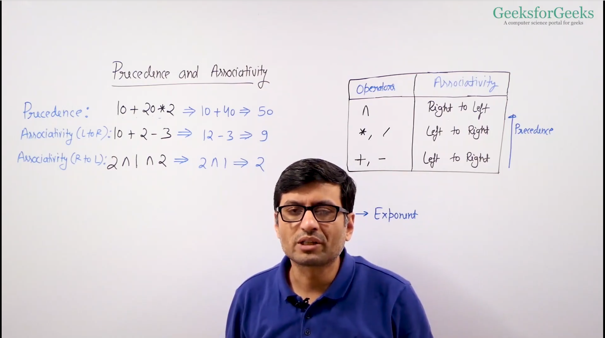

In computer science, expressions can be written in three main notations: **Infix**, **Prefix**, and **Postfix**. These notations differ in the placement of operators relative to their operands. Using stacks, we can efficiently evaluate or convert between these notations.

### 1. **Infix Notation**:
   - The operator is placed **between** operands.
   - Example: `A + B`
   - This is the standard form of writing expressions and is commonly used in mathematics. However, it requires parentheses and precedence rules to dictate the order of operations (e.g., BODMAS/PEMDAS).

### 2. **Prefix Notation (Polish Notation)**:
   - The operator is placed **before** the operands.
   - Example: `+ A B`
   - This notation does not require parentheses, as the order of operations is clear from the placement of the operator.

### 3. **Postfix Notation (Reverse Polish Notation)**:
   - The operator is placed **after** the operands.
   - Example: `A B +`
   - This notation also eliminates the need for parentheses and follows a straightforward evaluation process using a stack.

### Stack Operations and Their Use:

#### 1. **Infix to Postfix Conversion Using a Stack**:   ( [Youtube video](https://www.youtube.com/watch?v=m7SGekhd1mQ&ab_channel=AnujBhaiya) )

Steps:
1. Initialize an empty stack for operators and an empty string for the output.
2. Scan the infix expression from left to right.
3. If the token is an operand (a `variable or number`), add it to the output.
4. If the token is an operator:
   - Pop from the stack to the output until you find an operator with less precedence or an open parenthesis.
   - Push the current operator onto the stack.
5. If the token is `(` (left parenthesis), push it onto the stack.
6. If the token is `)` (right parenthesis), pop from the stack to the output until you encounter `(`, then discard the parentheses.
7. After the entire expression has been scanned, pop all operators from the stack to the output.

**Operator Precedence** (from high to low):
- `^` (exponentiation)
- `*` `/` (multiplication and division)
- `+` `-` (addition and subtraction)

#### Example Code: Infix to Postfix Conversion

```javascript
function precedence(op) {
    if (op === '+' || op === '-') return 1;
    if (op === '*' || op === '/') return 2;
    if (op === '^') return 3;
    return 0;
}

function infixToPostfix(exp) {
    let stack = [];
    let output = "";
    for (let i = 0; i < exp.length; i++) {
        let char = exp[i];

        // If the character is an operand, add it to the output
        if (/[a-zA-Z0-9]/.test(char)) {
            output += char;
        }
        // If the character is '(', push it to the stack
        else if (char === '(') {
            stack.push(char);
        }
        // If the character is ')', pop and output from the stack until '(' is found
        else if (char === ')') {
            while (stack.length > 0 && stack[stack.length - 1] !== '(') {
                output += stack.pop();
            }
            stack.pop(); // Remove '(' from the stack
        }
        // If the character is an operator
        else {
            while (stack.length > 0 && precedence(stack[stack.length - 1]) >= precedence(char)) {
                output += stack.pop();
            }
            stack.push(char);
        }
    }

    // Pop all the remaining operators from the stack
    while (stack.length > 0) {
        output += stack.pop();
    }

    return output;
}

// Example usage:
let infixExp = "A+(B*C-(D/E^F)*G)*H";
console.log(infixToPostfix(infixExp)); // Output: "ABC*DEF^/G*-H*+"
```

#### 2. **Postfix Evaluation Using a Stack**:   ( [Youtube video](https://www.youtube.com/watch?v=5B6jw4wOJR0&ab_channel=ApnaCollege) )

Steps:
1. Initialize an empty stack.
2. Scan the postfix expression from left to right.
3. If the token is an operand, push it onto the stack.
4. If the token is an operator, pop the top two elements from the stack, apply the operator, and push the result back onto the stack.
5. After the entire expression has been scanned, the final result will be the only element left in the stack.

#### Example Code: Postfix Evaluation

```javascript
function evaluatePostfix(exp) {
    let stack = [];
    for (let i = 0; i < exp.length; i++) {
        let char = exp[i];

        // If the character is an operand, push it to the stack
        if (!isNaN(parseInt(char))) {
            stack.push(parseInt(char));
        }
        // If the character is an operator
        else {
            let val2 = stack.pop();
            let val1 = stack.pop();
            switch (char) {
                case '+':
                    stack.push(val1 + val2);
                    break;
                case '-':
                    stack.push(val1 - val2);
                    break;
                case '*':
                    stack.push(val1 * val2);
                    break;
                case '/':
                    stack.push(val1 / val2);
                    break;
            }
        }
    }
    return stack.pop();
}

// Example usage:
let postfixExp = "231*+9-";
console.log(evaluatePostfix(postfixExp)); // Output: -4
```

#### 3. **Infix to Prefix Conversion Using a Stack**:   

Steps:
1. Reverse the infix expression.
2. Replace `(` with `)` and `)` with `(`.
3. Convert the modified expression to postfix using the same process as in the **Infix to Postfix** conversion.
4. Reverse the postfix expression to get the prefix expression.

#### Example Code: Infix to Prefix Conversion

```javascript
function reverseString(str) {
    return str.split('').reverse().join('');
}

function replaceBrackets(exp) {
    let result = '';
    for (let i = 0; i < exp.length; i++) {
        if (exp[i] === '(') result += ')';
        else if (exp[i] === ')') result += '(';
        else result += exp[i];
    }
    return result;
}

function infixToPrefix(exp) {
    // Reverse the infix expression and replace brackets
    let reversedExp = reverseString(exp);
    let modifiedExp = replaceBrackets(reversedExp);

    // Convert modified expression to postfix
    let postfixExp = infixToPostfix(modifiedExp);

    // Reverse the postfix expression to get prefix
    return reverseString(postfixExp);
}

// Example usage:
let infixExp2 = "A+(B*C-(D/E^F)*G)*H";
console.log(infixToPrefix(infixExp2)); // Output: "+A*+*BC-*^/DEFGH"
```

#### 4. **Prefix Evaluation Using a Stack**:

Steps:
1. Initialize an empty stack.
2. Scan the prefix expression from **right to left**.
3. If the token is an operand, push it onto the stack.
4. If the token is an operator, pop the top two elements from the stack, apply the operator, and push the result back onto the stack.
5. After the entire expression has been scanned, the final result will be the only element left in the stack.

#### Example Code: Prefix Evaluation

```javascript
function evaluatePrefix(exp) {
    let stack = [];
    for (let i = exp.length - 1; i >= 0; i--) {
        let char = exp[i];

        // If the character is an operand, push it to the stack
        if (!isNaN(parseInt(char))) {
            stack.push(parseInt(char));
        }
        // If the character is an operator
        else {
            let val1 = stack.pop();
            let val2 = stack.pop();
            switch (char) {
                case '+':
                    stack.push(val1 + val2);
                    break;
                case '-':
                    stack.push(val1 - val2);
                    break;
                case '*':
                    stack.push(val1 * val2);
                    break;
                case '/':
                    stack.push(val1 / val2);
                    break;
            }
        }
    }
    return stack.pop();
}

// Example usage:
let prefixExp = "-+2*31/9";
console.log(evaluatePrefix(prefixExp)); // Output: -4
```

### Summary:
- **Infix** is the standard human-readable form of an expression but requires parentheses and precedence rules.
- **Prefix** (operators first) and **Postfix** (operators last) can be more easily evaluated by a computer using stacks, without needing precedence rules or parentheses.
- Conversion between these notations can be done efficiently using stacks, and both **evaluation** and **conversion** have simple stack-based algorithms.


> ## Queue

Always choose the head as front and tail as rear, becuase if you reverse time complexity changes


```js
// Below code is for Queue in Linked List form

// Queue is like linked list with FIFO.
// entry and exit are on opposite side
// Define a Node for the linked list
class Node {
    constructor(value) {
        this.value = value;
        this.next = null;
    }
}

class LinkedListQueue {
    constructor() {
        this.front = null;  // Points to the front of the queue
        this.rear = null;   // Points to the rear of the queue
        this.size = 0;      // Stores the size of the queue
    }

    // Add an element to the rear of the queue
    enqueue(value) {
        let newNode = new Node(value);
        if (this.isEmpty()) {
            this.front = this.rear = newNode;
        } else {
            this.rear.next = newNode;
            this.rear = newNode;
        }
        this.size++;
    }

    // Remove and return the front element from the queue
    dequeue() {
        if (this.isEmpty()) {
            return "Queue is empty";
        }
        let removedValue = this.front.value;
        this.front = this.front.next;

        // If the queue becomes empty after the dequeue operation
        if (!this.front) {
            this.rear = null;
        }

        this.size--;
        return removedValue;
    }

    // Get the front element without removing it
    frontElement() {
        if (this.isEmpty()) {
            return "Queue is empty";
        }
        return this.front.value;
    }

    // Check if the queue is empty
    isEmpty() {
        return this.size === 0;
    }

    // Get the size of the queue
    getSize() {
        return this.size;
    }

    // Print the elements in the queue
    printQueue() {
        if (this.isEmpty()) {
            return "Queue is empty";
        }

        let result = [];
        let currentNode = this.front;
        while (currentNode !== null) {
            result.push(currentNode.value);
            currentNode = currentNode.next;
        }
        return result.join(" ");
    }
}

// Example usage:
let linkedQueue = new LinkedListQueue();
linkedQueue.enqueue(10);
linkedQueue.enqueue(20);
linkedQueue.enqueue(30);
console.log(linkedQueue.printQueue());  // Output: 10 20 30
console.log(linkedQueue.dequeue());     // Output: 10
console.log(linkedQueue.frontElement()); // Output: 20
console.log(linkedQueue.isEmpty());     // Output: false
```

Time complexity table for operations on a **Linked List-based Queue**:

| **Operation** | **Time Complexity** |
|---------------|---------------------|
| **Enqueue**   | O(1)                |
| **Dequeue**   | O(1)                |
| **Front**     | O(1)                |
| **isEmpty**   | O(1)                |
| **Size**      | O(1)                |
| **PrintQueue**| O(n)                |

> ### Implement Stack using Queues ( [Youtube video](https://www.youtube.com/watch?v=SgQ0VV3eM7Q&ab_channel=Yogesh%26Shailesh%28CodeLibrary%29) )

To implement a **stack** using **queues**, we can take advantage of two queues and simulate the Last In, First Out (LIFO) behavior of a stack. There are two common approaches to achieve this:

1. **Making push operation costly**: We keep elements in such a way that the latest pushed element is always at the front of the queue.
2. **Making pop operation costly**: We rearrange elements during the pop operation to mimic stack behavior.

Here, I'll explain and provide code for both approaches.

### 1. **Making Push Operation Costly**
In this approach, the `push` operation will rearrange elements to ensure that the newest element is at the front of the queue. The `pop` operation remains efficient as it simply dequeues from the front.

#### Steps:
- For `push(x)`: 
  1. Move all elements from `queue1` to `queue2`.
  2. Add the new element `x` to `queue1`.
  3. Move all elements back from `queue2` to `queue1`.
- For `pop()`: Simply dequeue from `queue1`.
- For `top()`: Peek the front element of `queue1`.

#### Code Implementation:

```javascript
class StackUsingQueues {
    constructor() {
        this.queue1 = [];
        this.queue2 = [];
    }

    // Push element onto stack
    push(x) {
        // Move all elements from queue1 to queue2
        while (this.queue1.length > 0) {
            this.queue2.push(this.queue1.shift());
        }

        // Add the new element to queue1
        this.queue1.push(x);

        // Move all elements back to queue1 from queue2
        while (this.queue2.length > 0) {
            this.queue1.push(this.queue2.shift());
        }
    }

    // Remove and return the top element from stack
    pop() {
        if (this.queue1.length === 0) {
            return "Stack is empty";
        }
        return this.queue1.shift();
    }

    // Get the top element
    top() {
        if (this.queue1.length === 0) {
            return "Stack is empty";
        }
        return this.queue1[0];
    }

    // Check if the stack is empty
    isEmpty() {
        return this.queue1.length === 0;
    }
}

// Example usage:
let stack = new StackUsingQueues();
stack.push(10);
stack.push(20);
stack.push(30);
console.log(stack.top());    // Output: 30
console.log(stack.pop());    // Output: 30
console.log(stack.top());    // Output: 20
console.log(stack.isEmpty()); // Output: false
```

#### Time Complexity:
- **Push**: O(n) (because we move all elements twice, once to `queue2` and back to `queue1`).
- **Pop**: O(1) (as we simply dequeue from `queue1`).
- **Top**: O(1).
- **isEmpty**: O(1).


### 2. **Making Pop Operation Costly**
In this approach, we keep the `push` operation efficient by simply enqueueing the element. The costly operation happens during `pop`, where we transfer elements between queues to simulate stack behavior.

#### Steps:
- For `push(x)`: Enqueue the element into `queue1`.
- For `pop()`: 
  1. Move all elements except the last one from `queue1` to `queue2`.
  2. Dequeue the last element from `queue1` (this is the element we want to pop).
  3. Swap `queue1` and `queue2` references.
- For `top()`: Perform similar steps as `pop()` but without actually removing the element.

#### Code Implementation:

```javascript
class StackUsingQueues2 {
    constructor() {
        this.queue1 = [];
        this.queue2 = [];
    }

    // Push element onto stack
    push(x) {
        this.queue1.push(x);
    }

    // Remove and return the top element from stack
    pop() {
        if (this.queue1.length === 0) {
            return "Stack is empty";
        }

        // Move all elements except the last to queue2
        while (this.queue1.length > 1) {
            this.queue2.push(this.queue1.shift());
        }

        // The last element in queue1 is the top of the stack
        let poppedElement = this.queue1.shift();

        // Swap the queues
        let temp = this.queue1;
        this.queue1 = this.queue2;
        this.queue2 = temp;

        return poppedElement;
    }

    // Get the top element without removing it
    top() {
        if (this.queue1.length === 0) {
            return "Stack is empty";
        }

        // Move all elements except the last to queue2
        while (this.queue1.length > 1) {
            this.queue2.push(this.queue1.shift());
        }

        // Peek the last element (top of the stack)
        let topElement = this.queue1[0];

        // Also move this last element to queue2 to maintain the queue order
        this.queue2.push(this.queue1.shift());

        // Swap the queues
        let temp = this.queue1;
        this.queue1 = this.queue2;
        this.queue2 = temp;

        return topElement;
    }

    // Check if the stack is empty
    isEmpty() {
        return this.queue1.length === 0;
    }
}

// Example usage:
let stack2 = new StackUsingQueues2();
stack2.push(10);
stack2.push(20);
stack2.push(30);
console.log(stack2.top());    // Output: 30
console.log(stack2.pop());    // Output: 30
console.log(stack2.top());    // Output: 20
console.log(stack2.isEmpty()); // Output: false
```

#### Time Complexity:
- **Push**: O(1) (just enqueue).
- **Pop**: O(n) (because we move all elements except the last one to `queue2`).
- **Top**: O(n) (similar to `pop`, but without removing the element).
- **isEmpty**: O(1).


### Comparison of Approaches:
- **Push-Costly Approach**: The `push` operation has a time complexity of O(n), but the `pop` and `top` operations are O(1).
- **Pop-Costly Approach**: The `push` operation is O(1), but the `pop` and `top` operations are O(n).

The choice of approach depends on which operation (push or pop) you want to optimize for in terms of performance.


> ### Reverse a Queue  ( [Youtube video](https://www.youtube.com/watch?v=xxlcFYskVRQ&ab_channel=HelloWorld)) )
Keep in mind queue FIFO follow karta h, wahi reverse k method me chaiye

To **reverse a queue**, we can utilize either a stack or recursion. Let's explore both methods.

### 1. **Using a Stack**
A stack follows the **LIFO** (Last In, First Out) principle, which complements the **FIFO** (First In, First Out) principle of a queue. By pushing all the elements from the queue into the stack and then popping them back, we can reverse the order.

#### Steps:
1. Dequeue all elements from the queue and push them onto the stack.
2. Pop elements from the stack and enqueue them back into the queue.

#### JavaScript Code (Reversing Queue Using Stack):

```javascript
class Queue {
    constructor() {
        this.items = [];
    }

    // Add an element to the queue
    enqueue(element) {
        this.items.push(element);
    }

    // Remove and return the front element from the queue
    dequeue() {
        if (this.isEmpty()) {
            return "Queue is empty";
        }
        return this.items.shift();
    }

    // Check if the queue is empty
    isEmpty() {
        return this.items.length === 0;
    }

    // Print the elements in the queue
    printQueue() {
        return this.items.join(" ");
    }
}

// Function to reverse the queue
function reverseQueue(queue) {
    let stack = [];

    // Dequeue all elements from the queue and push onto the stack
    while (!queue.isEmpty()) {
        stack.push(queue.dequeue());
    }

    // Pop all elements from the stack and enqueue back to the queue
    while (stack.length > 0) {
        queue.enqueue(stack.pop());
    }
}

// Example usage
let queue = new Queue();
queue.enqueue(1);
queue.enqueue(2);
queue.enqueue(3);
queue.enqueue(4);

console.log("Original Queue: " + queue.printQueue());  // Output: 1 2 3 4

reverseQueue(queue);

console.log("Reversed Queue: " + queue.printQueue());  // Output: 4 3 2 1
```

#### Time Complexity:
- **Enqueue**: O(1) for each element.
- **Dequeue**: O(1) for each element.
- The total time complexity is **O(n)**, where `n` is the number of elements in the queue.

### 2. **Using Recursion**
Alternatively, we can use recursion to reverse the queue by removing elements from the front recursively and adding them back after the recursive call.

#### Steps:
1. Dequeue an element and store it.
2. Recursively reverse the remaining queue.
3. Enqueue the dequeued element back after the recursive call.

#### JavaScript Code (Reversing Queue Using Recursion):

```javascript
// Function to reverse the queue using recursion
function reverseQueueRecursively(queue) {
    if (queue.isEmpty()) {
        return;
    }

    // Dequeue the front element
    let frontElement = queue.dequeue();

    // Recursively reverse the remaining queue
    reverseQueueRecursively(queue);

    // Enqueue the front element back
    queue.enqueue(frontElement);
}

// Example usage
let queue2 = new Queue();
queue2.enqueue(1);
queue2.enqueue(2);
queue2.enqueue(3);
queue2.enqueue(4);

console.log("Original Queue: " + queue2.printQueue());  // Output: 1 2 3 4

reverseQueueRecursively(queue2);

console.log("Reversed Queue: " + queue2.printQueue());  // Output: 4 3 2 1
```

#### Time Complexity:
- **Dequeue/Enqueue**: O(1) for each element.
- The recursion goes as deep as the number of elements in the queue, so the total time complexity is **O(n)**, where `n` is the number of elements in the queue.


### Summary:
- **Using a stack** involves first transferring the elements to a stack and then back to the queue, which is iterative and straightforward.
- **Using recursion** is a more elegant, recursive approach where we utilize the call stack to reverse the queue.
- Both methods have a time complexity of **O(n)**, where `n` is the number of elements in the queue.


> ### generate no with given digits using queue

To generate numbers with a given set of digits using a **queue**, we can follow this approach:

### Problem:
We are given a set of digits, and we need to generate all numbers that can be formed by these digits. We'll generate the numbers in increasing order of their lengths, starting from 1-digit numbers and building up to longer numbers by concatenating the digits.

### Approach:
1. **Initialize a queue** with the given digits.
2. **Dequeue** the front element of the queue.
3. For each digit in the set, append it to the dequeued element to form a new number.
4. **Enqueue** the newly formed numbers.
5. Continue the process for a specified number of iterations or until a certain condition is met (e.g., generating a required number of numbers or generating numbers up to a certain length).

### Example:
Given digits: `[5,6]`, the numbers generated would be: `'5', '6', '55', '56', '65', '66', ...`

### Code Implementation in JavaScript:

```javascript
// Function to generate numbers with the given digits using a queue
function generateNumbersWithDigits(digits, n) {
    let queue = [];

    // Step 1: Initialize the queue with the given digits
    for (let i = 0; i < digits.length; i++) {
        queue.push(digits[i].toString());
    }

    let result = [];

    // Step 2: Generate numbers up to 'n' numbers
    while (result.length < n) {
        // Dequeue the front element from the queue
        let current = queue.shift();

        // Add the dequeued element to the result
        result.push(current);

        // Step 3: Append each digit to the current element and enqueue
        for (let i = 0; i < digits.length; i++) {
            queue.push(current + digits[i]);
        }
    }

    // Return the generated numbers
    return result;
}

// Example usage:
let digits = [5,6]; // Given set of digits
let n = 6; // Number of numbers to generate

let generatedNumbers = generateNumbersWithDigits(digits, n);
console.log("Generated Numbers:", generatedNumbers);
```

### Output:
For the example above, the output will be:

```
Generated Numbers: ['5', '6', '55', '56', '65', '66']
```

### Explanation:
- The queue initially holds `["5","6"]`.
- Then, for each number dequeued (like `5`), we append the digits `5,6` to it, resulting in `['55', '56']` being added to the queue.
- This process continues for each dequeued number until we've generated `n` numbers.

### Time Complexity:
- Each enqueue and dequeue operation takes O(1) time.
- The total number of operations is proportional to the number of numbers generated, so the time complexity is **O(n)** where `n` is the number of numbers to generate.

> ### Dequeue data structure

A **Dequeue** (or **Deque**), short for "Double-Ended Queue", is a linear data structure that allows insertion and deletion of elements from both ends (front and rear). It combines the properties of both stacks and queues, making it more versatile.

### Key Operations in Deque:
1. **Insert at front** (`addFront()`): Add an element to the front.
2. **Insert at rear** (`addRear()`): Add an element to the rear.
3. **Delete from front** (`removeFront()`): Remove an element from the front.
4. **Delete from rear** (`removeRear()`): Remove an element from the rear.
5. **Peek front** (`getFront()`): Get the element from the front without removing it.
6. **Peek rear** (`getRear()`): Get the element from the rear without removing it.
7. **isEmpty()**: Check if the deque is empty.
8. **isFull()**: Check if the deque is full (if it's a bounded deque).

### Types of Deque:
- **Input-restricted deque**: Insertion is allowed at only one end, but deletion is possible at both ends.
- **Output-restricted deque**: Deletion is allowed at only one end, but insertion is possible at both ends.

### Applications of Deque:
- Implementing a queue, stack, or both.
- Storing a history of operations in browsers or other applications.
- Sliding window problems, such as finding the maximum in a sliding window in arrays.
- Palindrome checking, where elements are compared from both ends.
  
### JavaScript Implementation of a Deque:
Here's an implementation of a Deque using an array.

### Benefits of Deque:
- Deque is more flexible than a queue or a stack.
- It can be used efficiently for both **LIFO** (Last In, First Out) and **FIFO** (First In, First Out) operations.

### Use Cases of Deque:
1. **Sliding Window Maximum**: Deque can be used to find the maximum element in every sliding window of size `k` in an array.
2. **Palindrome Check**: Deque can be used to check whether a given sequence is a palindrome by comparing elements from both ends.
3. **Job Scheduling**: Deque can be used in scheduling algorithms where both front and rear operations are needed.

### Summary:
Deque is a powerful data structure that allows both stack-like and queue-like operations efficiently from both ends. It is versatile and can solve a wide range of problems that require access from both ends of a data structure.


> ### Implement Dequeue using array and linked list, all operation in O(1)

Implementing a **Deque** (double-ended queue) such that all operations are performed in **O(1)** time is possible using both **arrays** and **linked lists** with careful design. Let's explore both implementations.

### 1. **Array-Based Deque Implementation (Circular Array)**
To achieve **O(1)** time for all operations using an array, we can implement a **circular array** where we maintain two pointers: one for the front and one for the rear. We manage the indices such that when they reach the array's bounds, they wrap around, hence the term "circular."

#### Key Points:
- Maintain a fixed-size array.
- Use two pointers `front` and `rear`.
- Handle both ends of the deque in a circular manner using modulo operations to keep track of the positions.

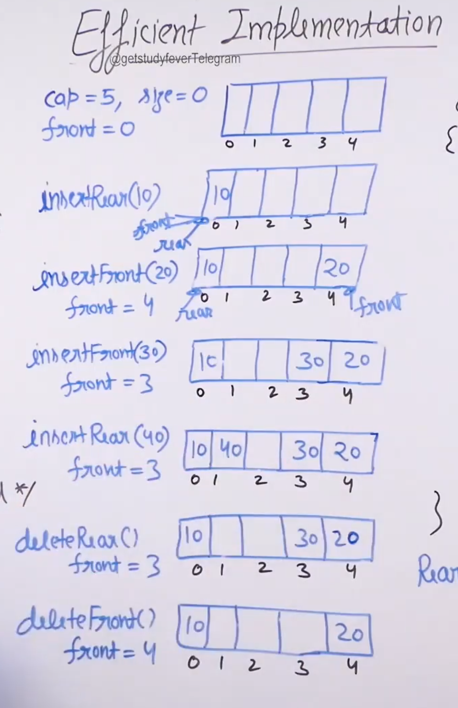

#### JavaScript Code for Circular Array Deque:

```javascript

// Rear is always (front + size - 1) % capacity

class CircularDeque {
    constructor(capacity) {
        this.capacity = capacity;
        this.items = new Array(capacity);
        this.front = -1;
        this.rear = -1;
    }

    // Check if the deque is empty
    isEmpty() {
        return this.front === -1;
    }

    // Check if the deque is full
    isFull() {
        return (this.rear + 1) % this.capacity === this.front;
    }

    // Insert element at the front
    addFront(element) {
        if (this.isFull()) {
            console.log("Deque is full");
            return;
        }

        if (this.isEmpty()) {
            this.front = 0;
            this.rear = 0;
        } else {
            this.front = (this.front - 1 + this.capacity) % this.capacity;
        }

        this.items[this.front] = element;
    }

    // Insert element at the rear
    addRear(element) {
        if (this.isFull()) {
            console.log("Deque is full");
            return;
        }

        if (this.isEmpty()) {
            this.front = 0;
            this.rear = 0;
        } else {
            this.rear = (this.rear + 1) % this.capacity;
        }

        this.items[this.rear] = element;
    }

    // Remove element from the front
    removeFront() {
        if (this.isEmpty()) {
            console.log("Deque is empty");
            return;
        }

        let removedElement = this.items[this.front];

        if (this.front === this.rear) { // Single element case
            this.front = -1;
            this.rear = -1;
        } else {
            this.front = (this.front + 1) % this.capacity;
        }

        return removedElement;
    }

    // Remove element from the rear
    removeRear() {
        if (this.isEmpty()) {
            console.log("Deque is empty");
            return;
        }

        let removedElement = this.items[this.rear];

        if (this.front === this.rear) { // Single element case
            this.front = -1;
            this.rear = -1;
        } else {
            this.rear = (this.rear - 1 + this.capacity) % this.capacity;
        }

        return removedElement;
    }

    // Get the front element
    getFront() {
        if (this.isEmpty()) {
            console.log("Deque is empty");
            return;
        }
        return this.items[this.front];
    }

    // Get the rear element
    getRear() {
        if (this.isEmpty()) {
            console.log("Deque is empty");
            return;
        }
        return this.items[this.rear];
    }

    // Print the deque
    printDeque() {
        if (this.isEmpty()) {
            console.log("Deque is empty");
            return;
        }
        let i = this.front;
        let result = [];
        while (i !== this.rear) {
            result.push(this.items[i]);
            i = (i + 1) % this.capacity;
        }
        result.push(this.items[this.rear]); // Add the rear element
        console.log(result.join(" "));
    }
}

// Example usage:
let deque = new CircularDeque(5);

deque.addRear(1);
deque.addRear(2);
deque.addFront(0);
deque.addFront(-1);

deque.printDeque(); // Output: -1 0 1 2
console.log("Front element:", deque.getFront()); // Output: -1
console.log("Rear element:", deque.getRear()); // Output: 2

deque.removeFront();
deque.removeRear();

deque.printDeque(); // Output: 0 1
```

### Time Complexity:
- All operations (`addFront`, `addRear`, `removeFront`, `removeRear`, `getFront`, `getRear`) take **O(1)** time.

### 2. **Linked List-Based Deque Implementation**
Using a **doubly linked list**, we can achieve **O(1)** time complexity for all deque operations. The key is that inserting and deleting from the front and rear can be done in constant time with pointers.

#### Key Points:
- Use a doubly linked list to store the deque elements.
- Maintain two pointers: `head` (front) and `tail` (rear).
- Insertions and deletions at both ends are performed in constant time.

#### JavaScript Code for Linked List Deque:

```javascript
class Node {
    constructor(value) {
        this.value = value;
        this.next = null;
        this.prev = null;
    }
}

class Deque {
    constructor() {
        this.head = null;
        this.tail = null;
    }

    // Check if the deque is empty
    isEmpty() {
        return this.head === null;
    }

    // Insert element at the front
    addFront(value) {
        const newNode = new Node(value);
        if (this.isEmpty()) {
            this.head = newNode;
            this.tail = newNode;
        } else {
            newNode.next = this.head;
            this.head.prev = newNode;
            this.head = newNode;
        }
    }

    // Insert element at the rear
    addRear(value) {
        const newNode = new Node(value);
        if (this.isEmpty()) {
            this.head = newNode;
            this.tail = newNode;
        } else {
            this.tail.next = newNode;
            newNode.prev = this.tail;
            this.tail = newNode;
        }
    }

    // Remove element from the front
    removeFront() {
        if (this.isEmpty()) {
            console.log("Deque is empty");
            return;
        }
        let removedValue = this.head.value;
        if (this.head === this.tail) {
            this.head = null;
            this.tail = null;
        } else {
            this.head = this.head.next;
            this.head.prev = null;
        }
        return removedValue;
    }

    // Remove element from the rear
    removeRear() {
        if (this.isEmpty()) {
            console.log("Deque is empty");
            return;
        }
        let removedValue = this.tail.value;
        if (this.head === this.tail) {
            this.head = null;
            this.tail = null;
        } else {
            this.tail = this.tail.prev;
            this.tail.next = null;
        }
        return removedValue;
    }

    // Get the front element
    getFront() {
        if (this.isEmpty()) {
            console.log("Deque is empty");
            return;
        }
        return this.head.value;
    }

    // Get the rear element
    getRear() {
        if (this.isEmpty()) {
            console.log("Deque is empty");
            return;
        }
        return this.tail.value;
    }

    // Print the deque
    printDeque() {
        if (this.isEmpty()) {
            console.log("Deque is empty");
            return;
        }
        let current = this.head;
        let result = [];
        while (current) {
            result.push(current.value);
            current = current.next;
        }
        console.log(result.join(" "));
    }
}

// Example usage:
let deque = new Deque();

deque.addRear(1);
deque.addRear(2);
deque.addFront(0);
deque.addFront(-1);

deque.printDeque(); // Output: -1 0 1 2
console.log("Front element:", deque.getFront()); // Output: -1
console.log("Rear element:", deque.getRear()); // Output: 2

deque.removeFront();
deque.removeRear();

deque.printDeque(); // Output: 0 1
```

### Time Complexity:
- All operations (`addFront`, `addRear`, `removeFront`, `removeRear`, `getFront`, `getRear`) take **O(1)** time.

### Conclusion:
- **Array-Based Deque** uses a circular array to achieve **O(1)** time operations.
- **Linked List-Based Deque** uses a doubly linked list where operations on both ends are performed in constant time.
Both implementations can handle deque operations efficiently depending on the use case and memory constraints.


> ### Binary search tree
 
Full Tree - Every item either points to two nodes or zero nodes

Leaf nodes - there the nodes which do not have child nodes

In binary search tree - if child is greater than parent it goes to right else goes to left.

in BST, every node has at-most two children.when we add any node we start comparing from the top.

When traversing(lookup, insert,remove) through the BST, it is O(logn), it is because in BST, the right side is always greater than the left side, so it will be divide and conquere(diving in half in each level) so becomes the O(log n)\
sometime in BST, every node is added in right side means always it is bigger than parent, in that scenario it will become O(n)

We can make binary search tree with array and linked list, below is in form of linked list

Here’s a table summarizing the time and space complexity of BST operations for implementations using a **linked list** and an **array**:

| **Operation**   | **Linked List (Typical BST)**                | **Array (Complete BST)**                  |
|------------------|---------------------------------------------|-------------------------------------------|
| **Search**       | Best: \(O(log n)\), Worst: \(O(n)\)         | Best: \(O(log n)\), Worst: \(O(log n)\) |
| **Insertion**    | Best: \(O(log n)\), Worst: \(O(n)\)         | Best: \(O(1)\), Worst: \(O(n)\)*          |
| **Deletion**     | Best: \(O(log n)\), Worst: \(O(n)\)         | Best: \(O(log n)\), Worst: \(O(log n)\) |
| **Traversal**    | \(O(n)\)                                     | \(O(n)\)                                  |
| **Space**        | \(O(n)\) for nodes, \(O(h)\) recursion stack | \(O(n)\) for array storage                |


```js
class Node(value){
    constructor(value){
        this.value = value
        this.left = null
        this.right = null
    }
}

class BST {
    constructor(){
        this.root = null
    }

    insert(value){
        const newNode = new Node(value)

        // If BST do not have any node or root node
        if(this.root === null){ 
            this.root = newNode
            return this
        }

        // travesing the node
        let temp = this.root
        while(true){

            // for handling, adding duplicate node
            if(newNode.value === temp.value) return undefined

            if(newNode.value < temp.value){
                
                // if left side has no value
                if(temp.left === null){
                    temp.left = newNode
                    return this
                }

                // if left side has value
                temp = temp.left
            } else {

                // if right side has no value
                if(temp.right === null){
                    temp.right = newNode
                    return this
                }

                // if right side has value
                temp = temp.right
            }
        }
    }

    contains(value){
        // for handling if there is no root node
        if(this.root === null) return false

        let temp = this.root
        while(temp){
            if(value < temp.value){
                temp = temp.left
            } else if(value > temp.value){
                temp = temp.right
            } else {
                return true
            }
        }

        return false
    }
}

let myTree = new BST()
myTree
```

> ### Delete a node in BST ( [Youtube video](https://www.youtube.com/watch?v=petKaikRiIA&ab_channel=AnujBhaiya) )

In a Binary Search Tree (BST), deletion of a node requires three different cases to handle:

1. **Case 1: Node to be deleted is a leaf node** (no children):
   - Simply remove the node from the tree.
   
2. **Case 2: Node to be deleted has one child**:
   - Replace the node with its child.
   
3. **Case 3: Node to be deleted has two children**:
   - Replace the node with its in-order successor (smallest node in the right subtree) or in-order predecessor (largest node in the left subtree) and delete the in-order successor/predecessor from its original position.

Here is the JavaScript code for deleting a node in a BST:

### Code for Deletion in a Binary Search Tree (BST): 

```js
// Definition for a Binary Search Tree Node
class Node {
    constructor(value) {
        this.value = value;
        this.left = null;
        this.right = null;
    }
}

// Function to delete a node from a BST
function deleteNode(root, key) {
    // Base case: if the tree is empty
    if (root === null) return root;

    // Recur down the tree to find the node to be deleted
    if (key < root.value) {
        root.left = deleteNode(root.left, key); // The key to be deleted is in the left subtree
    } else if (key > root.value) {
        root.right = deleteNode(root.right, key); // The key to be deleted is in the right subtree
    } else {
        // Node to be deleted is found

        // Case 1: Node with only one child or no child
        if (root.left === null) {
            let temp = root.right;
            root = null; // Free the current node
            return temp; // Return the right subtree as the new subtree
        } else if (root.right === null) {
            let temp = root.left;
            root = null; // Free the current node
            return temp; // Return the left subtree as the new subtree
        }

        // Case 2: Node with two children
        // Get the inorder successor (smallest in the right subtree)
        let temp = findMin(root.right);

        // Copy the inorder successor's value to the current node
        root.value = temp.value;

        // Delete the inorder successor
        root.right = deleteNode(root.right, temp.value);
    }

    return root;
}

// Function to find the node with the minimum value (in-order successor)
function findMin(node) {
    let current = node;
    while (current.left !== null) {
        current = current.left;
    }
    return current;
}

// Example Usage:
let root = new Node(50);
root.left = new Node(30);
root.right = new Node(70);
root.left.left = new Node(20);
root.left.right = new Node(40);
root.right.left = new Node(60);
root.right.right = new Node(80);

console.log("Before deletion:");
console.log(JSON.stringify(root, null, 2));

// Delete node with key 70
root = deleteNode(root, 70);

console.log("After deletion:");
console.log(JSON.stringify(root, null, 2));
```

### Explanation:

- **Case 1 (Leaf Node)**: When the node has no children, the node is set to `null`.
- **Case 2 (One Child)**: When the node has only one child, the node is replaced by its child.
- **Case 3 (Two Children)**: The in-order successor (the smallest node in the right subtree) is found and replaces the node to be deleted. Then the in-order successor is deleted from its original position.

### Example Output (before and after deletion of 70):

**Before Deletion:**

```
        50
       /  \
     30    70
    /  \   /  \
   20  40 60  80
```

**After Deletion of 70:**

```
        50
       /  \
     30    80
    /  \   /
   20  40 60
```

The node `70` is replaced with its in-order successor `80`, and the BST is updated accordingly.

> ### floor and ceil in BST  ( [Youtube video](https://www.youtube.com/watch?v=Sgz3SF_0wOw&ab_channel=AnujBhaiya) )

To find the floor and ceiling of a given value in a Binary Search Tree (BST), we can use a recursive approach. Let's define what the "floor" and "ceiling" mean in the context of a BST:

- **Floor** of a value `x` is the greatest value in the BST that is less than or equal to `x`.
- **Ceiling** of a value `x` is the smallest value in the BST that is greater than or equal to `x`.

### BST Node Structure
```js
class Node {
  constructor(data) {
    this.data = data;
    this.left = null;
    this.right = null;
  }
}
```

### Inserting Nodes into the BST
```js
class BST {
  constructor() {
    this.root = null;
  }

  insert(data) {
    const newNode = new Node(data);
    if (this.root === null) {
      this.root = newNode;
      return;
    }

    let current = this.root;
    while (true) {
      if (data < current.data) {
        if (current.left === null) {
          current.left = newNode;
          break;
        }
        current = current.left;
      } else {
        if (current.right === null) {
          current.right = newNode;
          break;
        }
        current = current.right;
      }
    }
  }
}
```

### Floor and Ceil Functions
The basic idea for both `floor` and `ceil` functions is to traverse the tree and keep track of the possible values while moving through the tree.

#### Finding the Floor
```js
function findFloor(root, key) {
  let floor = null;
  let current = root;

  while (current !== null) {
    if (current.data === key) {
      return current.data;
    }
    if (current.data < key) {
      floor = current.data;
      current = current.right;
    } else {
      current = current.left;
    }
  }

  return floor;
}
```

#### Finding the Ceiling
```js
function findCeil(root, key) {
  let ceil = null;
  let current = root;

  while (current !== null) {
    if (current.data === key) {
      return current.data;
    }
    if (current.data > key) {
      ceil = current.data;
      current = current.left;
    } else {
      current = current.right;
    }
  }

  return ceil;
}
```

### Example Usage
```js
let bst = new BST();
bst.insert(10);
bst.insert(5);
bst.insert(15);
bst.insert(3);
bst.insert(7);
bst.insert(12);
bst.insert(18);

let key = 6;
console.log("Floor of", key, "is", findFloor(bst.root, key)); // Floor of 6 is 5
console.log("Ceiling of", key, "is", findCeil(bst.root, key)); // Ceiling of 6 is 7
```

### Explanation:
- **Floor**: Traverse the tree, and if you find a node that is less than or equal to the target, move right, but keep track of the most recent value that meets this condition.
- **Ceiling**: Traverse the tree, and if you find a node greater than or equal to the target, move left, but keep track of the most recent value that meets this condition.

This solution runs in **O(h)** time complexity, where **h** is the height of the tree. For balanced trees, it would be **O(log n)**.

> ### AVL tree ( [Youtube video](https://www.youtube.com/watch?v=jDM6_TnYIqE&ab_channel=AbdulBari) )

An **AVL tree** is a type of `self-balancing binary search tree (BST)`. In an AVL tree, the `difference in height`s (balance factor) between the `left and right` subtrees of any node is `at most(<=) 1`. If at any point this condition is violated, the tree performs rotations to restore balance.

The height of an AVL tree is kept in check, ensuring that the time complexity for operations like insertion, deletion, and lookup is O(log n), where **n** is the number of nodes.

### Key Operations in an AVL Tree:
1. **Insertion**: Insert the node as in a normal BST and then check if the tree is balanced. If not, perform rotations to balance it.
2. **Rotation**: There are four types of rotations that can be used to balance the tree after insertion or deletion:
   - Left rotation
   - Right rotation
   - Left-Right rotation
   - Right-Left rotation
3. **Balancing**: After every insertion or deletion, the balance factor (difference between the heights of left and right subtrees) of each node is checked. If it violates the AVL property (i.e., balance factor > 1 or < -1), the tree is rebalanced using rotations.

### Balance Factor
For each node, the **balance factor** is calculated as:
```
balance_factor = height(left subtree) - height(right subtree)
```
The AVL property requires that the balance factor of every node should be in the range of [-1, 1].

### AVL Tree Rotations

#### 1. **Left Rotation**:
Left rotation is performed when a node's right subtree becomes taller, causing the tree to become unbalanced.
```text
      z                            y
     / \                          / \
    T1  y      Left Rotate(z)     z   T3
       / \   ---------------->   / \
      T2  T3                    T1  T2
```

#### 2. **Right Rotation**:
Right rotation is performed when a node's left subtree becomes taller, causing the tree to become unbalanced.
```text
      z                            y
     / \                          / \
    y   T4      Right Rotate(z)   x   z
   / \        ---------------->     / \
  x   T3                          T3  T4
```

#### 3. **Left-Right Rotation**:
A left-right rotation is a combination of a left rotation followed by a right rotation. This is used when the tree becomes unbalanced because of a left-right case.

#### 4. **Right-Left Rotation**:
A right-left rotation is a combination of a right rotation followed by a left rotation. This is used when the tree becomes unbalanced because of a right-left case.

### JavaScript Implementation of an AVL Tree

```js
class Node {
  constructor(data) {
    this.data = data;
    this.left = null;
    this.right = null;
    this.height = 1; // height of the node
  }
}

class AVLTree {
  constructor() {
    this.root = null;
  }

  // Get the height of a node
  getHeight(node) {
    if (node === null) return 0;
    return node.height;
  }

  // Calculate balance factor
  getBalance(node) {
    if (node === null) return 0;
    return this.getHeight(node.left) - this.getHeight(node.right);
  }

  // Right rotation
  rightRotate(y) {
    const x = y.left;
    const T2 = x.right;

    // Perform rotation
    x.right = y;
    y.left = T2;

    // Update heights
    y.height = Math.max(this.getHeight(y.left), this.getHeight(y.right)) + 1;
    x.height = Math.max(this.getHeight(x.left), this.getHeight(x.right)) + 1;

    // Return new root
    return x;
  }

  // Left rotation
  leftRotate(x) {
    const y = x.right;
    const T2 = y.left;

    // Perform rotation
    y.left = x;
    x.right = T2;

    // Update heights
    x.height = Math.max(this.getHeight(x.left), this.getHeight(x.right)) + 1;
    y.height = Math.max(this.getHeight(y.left), this.getHeight(y.right)) + 1;

    // Return new root
    return y;
  }

  // Insert a node
  insert(node, key) {
    // Perform normal BST insertion
    if (node === null) {
      return new Node(key);
    }

    if (key < node.data) {
      node.left = this.insert(node.left, key);
    } else if (key > node.data) {
      node.right = this.insert(node.right, key);
    } else {
      return node; // Duplicate keys not allowed
    }

    // Update the height of the ancestor node
    node.height = 1 + Math.max(this.getHeight(node.left), this.getHeight(node.right));

    // Get the balance factor
    const balance = this.getBalance(node);

    // Balance the node if it's unbalanced
    // Left Left Case
    if (balance > 1 && key < node.left.data) {
      return this.rightRotate(node);
    }

    // Right Right Case
    if (balance < -1 && key > node.right.data) {
      return this.leftRotate(node);
    }

    // Left Right Case
    if (balance > 1 && key > node.left.data) {
      node.left = this.leftRotate(node.left);
      return this.rightRotate(node);
    }

    // Right Left Case
    if (balance < -1 && key < node.right.data) {
      node.right = this.rightRotate(node.right);
      return this.leftRotate(node);
    }

    return node; // Return the unchanged node pointer
  }

  // In-order traversal
  inOrder(node) {
    if (node !== null) {
      this.inOrder(node.left);
      console.log(node.data);
      this.inOrder(node.right);
    }
  }
}

// Example Usage
const avl = new AVLTree();
avl.root = avl.insert(avl.root, 10);
avl.root = avl.insert(avl.root, 20);
avl.root = avl.insert(avl.root, 30);
avl.root = avl.insert(avl.root, 40);
avl.root = avl.insert(avl.root, 50);
avl.root = avl.insert(avl.root, 25);

console.log("In-order traversal of the balanced AVL tree:");
avl.inOrder(avl.root);  // Output will be in sorted order
```

### Explanation:
1. **Insertion**: The `insert` function inserts a node like in a regular BST, but after every insertion, it checks if the tree has become unbalanced. If it has, appropriate rotations (right, left, left-right, or right-left) are performed to balance the tree.
2. **Rotation**: Right and left rotations are performed to restore balance when necessary.

### Time Complexity:
- **Insertion**: O(log n) because the tree is kept balanced after every insertion.
- **Rotation**: O(1) because rotations only involve changing a few pointers and heights.
- **In-order Traversal**: O(n), where **n** is the number of nodes.

AVL trees ensure efficient searching, insertion, and deletion operations, with guaranteed logarithmic time complexity.

> ### 235. Lowest Common Ancestor of a Binary Search Tree
Given a binary search tree (BST), find the lowest common ancestor (LCA) node of two given nodes in the BST.

According to the definition of LCA on Wikipedia: “The lowest common ancestor is defined between two nodes p and q as the lowest node in T that has both p and q as descendants (where we allow a node to be a descendant of itself).”

Example 1:

Input: root = [6,2,8,0,4,7,9,null,null,3,5], p = 2, q = 8\
Output: 6\
Explanation: The LCA of nodes 2 and 8 is 6.

Example 2:

Input: root = [6,2,8,0,4,7,9,null,null,3,5], p = 2, q = 4\
Output: 2\
Explanation: The LCA of nodes 2 and 4 is 2, since a node can be a descendant of itself according to the LCA definition.

Example 3:

Input: root = [2,1], p = 2, q = 1\
Output: 2

`video: (first see code)` https://www.youtube.com/watch?v=cOjLyASDJcc

```js
var lowestCommonAncestor = function(root, p, q) {
    while (root) {
        // If both p and q are smaller than root, LCA must be in the left subtree
        if (p.val < root.val && q.val < root.val) {
            root = root.left;
        } 
        // If both p and q are larger than root, LCA must be in the right subtree
        else if (p.val > root.val && q.val > root.val) {
            root = root.right;
        } 
        // If p and q lie on either side of root, root is the LCA
        else {
            return root;
        }
    }
    return null; // This line is generally not reached
};
```


> ### find kth smallest element, we tried here using the BST ( [Youtube video](https://www.youtube.com/watch?v=9TJYWh0adfk&ab_channel=takeUforward) )

To achieve an **O(log n)** time complexity for finding the k-th smallest element, you can use a **Balanced Binary Search Tree (BST)**, such as an **Augmented BST** that keeps track of the size of the subtree rooted at each node.

### Key Idea:
- Each node in the BST stores:
  1. The value.
  2. A pointer to the left and right children.
  3. The size of the subtree rooted at that node (including the node itself).

With this additional information, you can efficiently find the k-th smallest element by comparing the size of the left subtree to `k`.

### Operations:
- Insert: **O(log n)** (in a balanced BST like AVL or Red-Black tree).
- Find k-th smallest: **O(log n)** due to the additional size information maintained at each node.

### JavaScript Code (Augmented BST):

```javascript
class Node {
    constructor(data) {
        this.data = data;
        this.left = null;
        this.right = null;
        this.size = 1; // Keeps track of the size of the subtree rooted at this node
    }
}

class AugmentedBST {
    constructor() {
        this.root = null;
    }

    insert(data) {
        this.root = this._insert(this.root, data);
    }

    _insert(node, data) {
        if (node === null) {
            return new Node(data);
        }

        if (data < node.data) {
            node.left = this._insert(node.left, data);
        } else {
            node.right = this._insert(node.right, data);
        }

        node.size = 1 + this._getSize(node.left) + this._getSize(node.right);
        return node;
    }

    _getSize(node) {
        return node ? node.size : 0;
    }

    findKthSmallest(k) {
        if (k < 1 || k > this._getSize(this.root)) {
            return null; // k is out of bounds
        }
        return this._findKthSmallest(this.root, k);
    }

    _findKthSmallest(node, k) {
        const leftSize = this._getSize(node.left);

        if (k === leftSize + 1) {
            return node.data; // Found the k-th smallest element
        } else if (k <= leftSize) {
            return this._findKthSmallest(node.left, k); // Search in the left subtree
        } else {
            return this._findKthSmallest(node.right, k - leftSize - 1); // Search in the right subtree
        }
    }
}

// Example usage
let bst = new AugmentedBST();
let arr = [7, 10, 4, 3, 20, 15];
arr.forEach(num => bst.insert(num));

let k = 3;
let result = bst.findKthSmallest(k);
console.log(`The ${k}th smallest element is ${result}`);
```

### Explanation:
1. **Node class**:
   - Each node stores the value `data`, pointers to `left` and `right` children, and a `size` attribute that represents the size of the subtree rooted at the current node.
   
2. **AugmentedBST class**:
   - **insert(data)**: Inserts a new element into the BST, updating the subtree sizes during the insertion process. This ensures that every node knows the size of the subtree rooted at itself.
   - **findKthSmallest(k)**: Recursively finds the k-th smallest element by comparing the size of the left subtree with `k`.
     - If `k` equals the size of the left subtree plus 1, the current node is the k-th smallest element.
     - If `k` is smaller than or equal to the size of the left subtree, we recursively search in the left subtree.
     - If `k` is larger, we search in the right subtree, adjusting `k` to account for the size of the left subtree.

### Time Complexity:
- **Insertion**: O(log n) in a balanced BST like an AVL tree or Red-Black tree.
- **Find k-th smallest**: O(log n) due to the size information maintained at each node.

### Example:

For the array `[7, 10, 4, 3, 20, 15]`, the tree is built as follows:
```
        7 (size: 6)
       / \
   4 (2)  10 (3)
   /      /  \
3 (1)   15 (1) 20 (1)
```
- To find the 3rd smallest element, it looks at the root (7) and checks that the left subtree size is 2. Since `k = 3`, the root (7) is the 3rd smallest element.

### Benefits:
- **Balanced BSTs** like AVL or Red-Black trees guarantee **O(log n)** time complexity for both insertion and querying for the k-th smallest element.

This approach is optimal for dynamic data (insertion, deletion) where maintaining sorted order is critical, and efficient querying is required.

Let me know if you'd like further details or clarification!


> ### Check BST is valid or not ( [Youtube video](https://www.youtube.com/watch?v=9btwHI_84DM&ab_channel=AnujBhaiya) )

A Binary Search Tree (BST) is a data structure where each node has at most two children. The left child node's value is smaller than the parent's, and the right child node's value is larger.

To check if a tree is a valid BST in JavaScript, you can perform an in-order traversal and ensure that the values of the nodes are in increasing order. Here's a sample function to check if a tree is a valid BST:

```js
class TreeNode {
  constructor(value) {
    this.value = value;
    this.left = null;
    this.right = null;
  }
}

function isValidBST(node, min = null, max = null) {
  // Base case: an empty node is a valid BST
  if (!node) return true;

  // Check if the current node violates the BST property
  if ((min !== null && node.value <= min) || (max !== null && node.value >= max)) {
    return false;
  }

  // Recursively check the left and right subtrees
  return isValidBST(node.left, min, node.value) && isValidBST(node.right, node.value, max);
}

// Example usage:

let root = new TreeNode(10);
root.left = new TreeNode(5);
root.right = new TreeNode(15);
root.left.left = new TreeNode(2);
root.left.right = new TreeNode(7);
root.right.right = new TreeNode(20);

console.log(isValidBST(root)); // Output: true
```

### Explanation:
1. The function `isValidBST` takes three arguments: the current node (`node`), and optional `min` and `max` bounds.
2. For each node, it checks if the node's value lies within the valid range defined by `min` and `max`.
3. The function is called recursively for both left and right subtrees, updating the bounds accordingly.
4. If any node violates the BST property, it returns `false`; otherwise, it returns `true`.


> ### fix a BST with two nodes swapped

When two nodes in a Binary Search Tree (BST) are swapped by mistake, the tree no longer satisfies the BST property. To fix this, you need to identify the two swapped nodes and swap them back to restore the tree's properties.

Here's a solution to fix a BST with two swapped nodes in JavaScript. The approach leverages an in-order traversal to identify the two nodes that were swapped, since the in-order traversal of a valid BST should yield a sorted sequence of values.

### Steps:
1. Perform an in-order traversal of the tree.
2. During the traversal, identify two swapped nodes:
   - The first node is the first node where the value decreases (i.e., `prev > current`).
   - The second node is the node where the value is less than the previous node later in the traversal.
3. Swap their values to fix the tree.

### Code:

```js
class TreeNode {
  constructor(value) {
    this.value = value;
    this.left = null;
    this.right = null;
  }
}

function fixBST(root) {
  let first = null;
  let second = null;
  let prev = new TreeNode(-Infinity); // Initialize previous node to -Infinity

  function inorderTraversal(node) {
    if (!node) return;

    // Traverse left subtree
    inorderTraversal(node.left);

    // Find the two nodes that are swapped
    if (prev && node.value < prev.value) {
      // The first time we encounter the anomaly
      if (!first) {
        first = prev; // The first node that's out of order
      }
      // The second time we encounter the anomaly
      second = node; // The second node that's out of order
    }

    // Move the previous pointer to the current node
    prev = node;

    // Traverse right subtree
    inorderTraversal(node.right);
  }

  // Perform in-order traversal to find swapped nodes
  inorderTraversal(root);

  // Swap values of the two nodes to correct the BST
  if (first && second) {
    const temp = first.value;
    first.value = second.value;
    second.value = temp;
  }
}

// Example usage:

let root = new TreeNode(10);
root.left = new TreeNode(5);
root.right = new TreeNode(8); // This should be 15
root.left.left = new TreeNode(2);
root.left.right = new TreeNode(7);
root.right.right = new TreeNode(20); // This should be 8

// The tree is now invalid because nodes 8 and 15 are swapped
fixBST(root);

// After fixing, the tree should now be valid
function inorderPrint(node) {
  if (!node) return;
  inorderPrint(node.left);
  console.log(node.value);
  inorderPrint(node.right);
}

inorderPrint(root); // Output should be: 2, 5, 7, 10, 15, 20
```

### Explanation:
- **In-order Traversal**: The tree is traversed in-order (left -> node -> right). For a valid BST, the in-order traversal will result in values in increasing order.
- **Identify Swapped Nodes**: The algorithm detects two nodes that violate this order.
  - The first node (`first`) is identified when the current node value is less than the previous node value.
  - The second node (`second`) is identified later when the anomaly appears again.
- **Swap Values**: Once the two nodes are identified, their values are swapped to restore the BST property.

This solution ensures that the BST is corrected in `O(n)` time, where `n` is the number of nodes in the tree, and uses `O(h)` space, where `h` is the height of the tree.


> ### Pair with given sum in BST

To find if there exists a pair of nodes in a Binary Search Tree (BST) that sums to a given value, you can take advantage of the BST property, which allows you to traverse the tree in sorted order. Here are two possible approaches:

### 1. In-order Traversal + Two Pointers (Optimal Solution)

This approach uses in-order traversal to convert the BST into a sorted array, and then uses a two-pointer technique to find the pair that adds up to the target sum.

### Steps:
1. Perform an in-order traversal to extract the values of the BST in a sorted array.
2. Use the two-pointer technique on this array to find the pair with the given sum.

### Code:

```js
class TreeNode {
  constructor(value) {
    this.value = value;
    this.left = null;
    this.right = null;
  }
}

function findPairWithSumBST(root, target) {
  const inorder = [];

  // In-order traversal to collect node values in sorted order
  function inorderTraversal(node) {
    if (!node) return;
    inorderTraversal(node.left);
    inorder.push(node.value);
    inorderTraversal(node.right);
  }

  inorderTraversal(root);

  // Use two-pointer technique to find a pair with the given sum
  let left = 0;
  let right = inorder.length - 1;

  while (left < right) {
    const sum = inorder[left] + inorder[right];

    if (sum === target) {
      return [inorder[left], inorder[right]]; // Return the pair
    } else if (sum < target) {
      left++; // Move left pointer to increase sum
    } else {
      right--; // Move right pointer to decrease sum
    }
  }

  return null; // No pair found
}

// Example usage:

let root = new TreeNode(10);
root.left = new TreeNode(5);
root.right = new TreeNode(15);
root.left.left = new TreeNode(3);
root.left.right = new TreeNode(7);
root.right.left = new TreeNode(12);
root.right.right = new TreeNode(18);

const targetSum = 22;
const result = findPairWithSumBST(root, targetSum);

if (result) {
  console.log(`Pair found: ${result[0]} and ${result[1]}`);
} else {
  console.log('No pair found');
}
```

### Explanation:
1. **In-order Traversal**: We traverse the tree in-order, which guarantees that the values will be sorted in ascending order.
2. **Two-pointer Technique**: Once we have the sorted array, we use two pointers (`left` and `right`). The `left` pointer starts from the beginning, and the `right` pointer starts from the end. We move them based on the sum of the values they point to:
   - If the sum is equal to the target, we return the pair.
   - If the sum is less than the target, we increment the `left` pointer to get a larger sum.
   - If the sum is greater than the target, we decrement the `right` pointer to get a smaller sum.

This approach runs in `O(n)` time for both the traversal and the two-pointer search, where `n` is the number of nodes in the tree. It also requires `O(n)` space for the array storing the in-order traversal.

### 2. Using HashSet (Alternative Approach)
Alternatively, you can use a HashSet to store the values you've seen so far as you traverse the tree. For each node, check if `target - currentNodeValue` exists in the set. If it does, you have found a pair.

Here's a code example for this approach:

```js
function findPairWithSumBSTUsingSet(root, target) {
  const set = new Set();

  function findPair(node) {
    if (!node) return false;

    // Check if the complement (target - node.value) exists in the set
    if (set.has(target - node.value)) {
      console.log(`Pair found: ${target - node.value} and ${node.value}`);
      return true;
    }

    // Add current node value to the set
    set.add(node.value);

    // Recursively check left and right subtrees
    return findPair(node.left) || findPair(node.right);
  }

  return findPair(root);
}

// Example usage:

const found = findPairWithSumBSTUsingSet(root, targetSum);

if (!found) {
  console.log('No pair found');
}
```

### Explanation:
- As you traverse the tree, you store each value in the set.
- For each node, you check if its complement (`target - node.value`) exists in the set. If it does, you have found a pair.
- This approach runs in `O(n)` time and uses `O(n)` space for the set.

Both approaches are efficient for finding a pair with a given sum in a BST, with the first approach being more structured for sorted traversal and the second being more direct.


> ### Q-104 - height of binary tree

The **height of a binary tree** is the number of edges on the longest path from the root to a leaf node. It can also be defined as the number of levels in the tree minus one. The height of an empty tree is `-1`, and the height of a tree with a single node (the root) is `0`.

### Recursive Approach:
The height of a binary tree can be computed recursively by finding the maximum height of its left and right subtrees and adding `1` for the root.

### Formula:
The height of a node `n` is:
```
height(n) = max(height(left subtree), height(right subtree)) + 1
```

### Code Implementation in JavaScript:

```javascript
// Node class to represent a binary tree node
class Node {
    constructor(value) {
        this.value = value;
        this.left = null;
        this.right = null;
    }
}

// Function to calculate the height of a binary tree
function height(node) {
    // Base case: if the tree is empty, the height is -1
    if (node === null) {
        return -1;
    }

    // Recursively calculate the height of the left and right subtrees
    let leftHeight = height(node.left);
    let rightHeight = height(node.right);

    // Return the larger of the two heights plus 1 (for the root node)
    return Math.max(leftHeight, rightHeight) + 1;
}

// Example usage:

// Create the binary tree
let root = new Node(1);
root.left = new Node(2);
root.right = new Node(3);
root.left.left = new Node(4);
root.left.right = new Node(5);
root.right.right = new Node(6);

// Calculate the height of the tree
let treeHeight = height(root);
console.log("Height of the binary tree is:", treeHeight);  // Output: 2
```

### Explanation:
In this example:
- The binary tree looks like this:
  ```
      1
     / \
    2   3
   / \   \
  4   5   6
  ```
- The longest path is from the root `1` to any of the leaf nodes (`4`, `5`, or `6`). The number of edges in the longest path is `2`, so the height of the tree is `2`.

### Time Complexity:
- **O(n)**, where `n` is the number of nodes in the binary tree. This is because we visit each node exactly once to compute the height of its left and right subtrees.

### Space Complexity:
- The space complexity is **O(h)**, where `h` is the height of the tree due to the recursive call stack. In the worst case (for a skewed tree), this could be **O(n)**, but for a balanced tree, it would be **O(log n)**.


> ### print nodes at distance k in BST 

To print all nodes at a given distance \( k \) from the root in a **Binary Search Tree (BST)**, we can approach the problem recursively. At each recursive call, we reduce the distance \( k \) by 1, and when \( k = 0 \), we print the current node.

### Recursive Approach:
- If the tree is empty (i.e., the node is `null`), we return.
- If \( k = 0 \), print the node's value.
- Otherwise, recursively call the function for both left and right children, decreasing \( k \) by 1.

### Code Implementation in JavaScript:

```javascript
// Node class to represent a binary tree node
class Node {
    constructor(value) {
        this.value = value;
        this.left = null;
        this.right = null;
    }
}

// Function to print nodes at distance k
function printNodesAtDistanceK(node, k) {
    // Base case: if the tree is empty, return
    if (node === null) {
        return;
    }

    // If k is 0, print the current node
    if (k === 0) {
        console.log(node.value);
        return;
    }

    // Recurse for left and right subtrees with k-1
    printNodesAtDistanceK(node.left, k - 1);
    printNodesAtDistanceK(node.right, k - 1);
}

// Example usage:

// Create the binary tree
let root = new Node(10);
root.left = new Node(5);
root.right = new Node(20);
root.left.left = new Node(3);
root.left.right = new Node(7);
root.right.left = new Node(15);
root.right.right = new Node(25);

// Print nodes at distance k = 2 from the root
let k = 2;
console.log(`Nodes at distance ${k} from the root:`);
printNodesAtDistanceK(root, k); 
```

### Explanation:
Given the following binary tree:
```
        10
       /  \
      5    20
     / \   / \
    3   7 15  25
```
- For \( k = 2 \), the nodes at this distance from the root are `3`, `7`, `15`, and `25`, since they are two edges away from the root (`10`).

### Time Complexity:
- **O(n)**, where `n` is the number of nodes in the tree. The algorithm visits every node once.

### Space Complexity:
- **O(h)**, where `h` is the height of the tree due to the recursive call stack. In the worst case (for a skewed tree), this could be **O(n)**, but for a balanced tree, it would be **O(log n)**.


> ### Book Allocation or Allocate Books Problem ( [Youtube video](https://www.youtube.com/watch?v=JRAByolWqhw&ab_channel=ApnaCollege) )

The **Book Allocation Problem** is a popular problem in Data Structures and Algorithms (DSA), often solved using **binary search**. The goal is to allocate books to students such that the maximum number of pages allocated to any student is minimized.  

### Problem Description
1. You are given an array `books[]` where each element represents the number of pages in a book.
2. You have `students` number of students.
3. The books must be distributed sequentially (i.e., a student can only be assigned consecutive books).
4. Minimize the maximum pages a student has to read.


### Approach to Solve
The problem can be solved efficiently using **binary search** combined with a **greedy algorithm**:

1. **Binary Search on the Maximum Number of Pages:**
   - The lower bound is the book with the maximum pages (minimize the largest allocation).
   - The upper bound is the sum of all pages (one student gets all books).

2. **Check Feasibility (Helper Function):**
   - Use a helper function to determine if it is possible to allocate books such that no student gets more than the current "mid" (from binary search).


### Algorithm
1. Start with `low = max(books)` and `high = sum(books)`.
2. Perform binary search on this range:
   - Find the `mid`.
   - Check if allocation with `mid` as the maximum page is feasible.
3. Adjust the search range based on feasibility:
   - If feasible, minimize the `mid` (reduce upper bound).
   - If not feasible, increase the `mid` (increase lower bound).
4. Return the minimized maximum pages.


### Implementation in JavaScript

```javascript
function isFeasible(books, students, maxPages) {
    let studentCount = 1;
    let pagesAllocated = 0;

    for (let pages of books) {
        if (pages > maxPages) {
            return false; // A single book exceeds maxPages, not feasible.
        }
        
        if (pagesAllocated + pages > maxPages) {
            studentCount++; // Assign to the next student.
            pagesAllocated = pages;

            if (studentCount > students) {
                return false; // Too many students required.
            }
        } else {
            pagesAllocated += pages;
        }
    }
    return true;
}

function allocateBooks(books, students) {
    if (books.length < students) {
        return -1; // Not enough books for all students.
    }

    let low = Math.max(...books);
    let high = books.reduce((a, b) => a + b, 0);
    let result = high;

    while (low <= high) {
        let mid = Math.floor((low + high) / 2);

        if (isFeasible(books, students, mid)) {
            result = mid; // Try for a better minimum.
            high = mid - 1;
        } else {
            low = mid + 1; // Increase maxPages.
        }
    }
    return result;
}

// Example Usage
const books = [12, 34, 67, 90]; // Number of pages in books.
const students = 2; // Number of students.

console.log(allocateBooks(books, students)); // Output: 113
```


### Explanation of Example
- **Input:** `books = [12, 34, 67, 90], students = 2`
- **Output:** `113`
- **Reason:** 
  - Allocate `[12, 34, 67]` to the first student (total = 113 pages).
  - Allocate `[90]` to the second student (total = 90 pages).
  - The maximum pages allocated to any student is minimized as `113`.

> ### Q-872- Leaf-Similar Trees

The **Leaf-Similar Trees** problem is a common question in data structure and algorithm (DSA) interviews. Here's the problem statement and a JavaScript solution.


### Problem Statement:
Consider all the leaves of a binary tree, from left to right, to form a leaf value sequence. Two binary trees are considered "leaf-similar" if their leaf value sequences are the same.

Given the roots of two binary trees, determine if they are leaf-similar.


### Approach:
1. Traverse the trees using Depth-First Search (DFS).
2. Collect all the leaf nodes into an array for both trees.
3. Compare the two arrays.


### JavaScript Solution:

```javascript
// Definition for a binary tree node.
class TreeNode {
    constructor(val, left = null, right = null) {
        this.val = val;
        this.left = left;
        this.right = right;
    }
}

function leafSimilar(root1, root2) {
    // Helper function to collect leaf values
    const getLeaves = (node, leaves = []) => {
        if (!node) return leaves;
        if (!node.left && !node.right) {
            leaves.push(node.val); // Found a leaf
        } else {
            getLeaves(node.left, leaves);
            getLeaves(node.right, leaves);
        }
        return leaves;
    };

    // Get leaf sequences for both trees
    const leaves1 = getLeaves(root1);
    const leaves2 = getLeaves(root2);

    // Compare the two leaf sequences
    if (leaves1.length !== leaves2.length) return false;
    for (let i = 0; i < leaves1.length; i++) {
        if (leaves1[i] !== leaves2[i]) return false;
    }
    return true;
}

// Example usage:
// Tree 1: [3,5,1,6,2,9,8,null,null,7,4]
// Tree 2: [3,5,1,6,7,4,2,null,null,null,null,null,null,9,8]

// Creating test trees
const root1 = new TreeNode(3,
    new TreeNode(5,
        new TreeNode(6),
        new TreeNode(2,
            new TreeNode(7),
            new TreeNode(4)
        )
    ),
    new TreeNode(1,
        new TreeNode(9),
        new TreeNode(8)
    )
);

const root2 = new TreeNode(3,
    new TreeNode(5,
        new TreeNode(6),
        new TreeNode(7)
    ),
    new TreeNode(1,
        new TreeNode(4),
        new TreeNode(2,
            new TreeNode(9),
            new TreeNode(8)
        )
    )
);

console.log(leafSimilar(root1, root2)); // Output: true
```


### Explanation:
1. **Tree Traversal**: Use a helper function `getLeaves` to recursively collect the leaves of a tree.
2. **Comparison**: Compare the leaf sequences for both trees to determine if they are identical.

This approach has a time complexity of \(O(N + M)\), where \(N\) and \(M\) are the number of nodes in the two trees, and a space complexity of \(O(H1 + H2)\), where \(H1\) and \(H2\) are the heights of the two trees (due to recursion stack).

<br>

> ###  Hash Table

```js
// A hash table uses a hash function to compute an index, also called a hash code, into an array of buckets or slots, from which the desired value can be found.
// common example of hash table is object in JS.


// charactristics of hashes
// 1. They are one way
// 2. Hashes are deterministic, means if you run nails through this equation and it produces the number, the next time you run nails it will produce same number

// collision - It is a situation when we have an item that maps to that same spot in memory basically hash function generate same no for two different key.

// hash function always give the same number when same input is passed through it

// If we have a prime number. we get a more randomized distribution of the items, which is optimal.

// Big O of hash table

// - Access    => O(1) || O(n). (keep in we are here considering key not the value lookup)
// - Insert    => O(1).
// - Delete    => O(1).

class HashTable {
    constructor(size = 7){
        this.dataMap = new Array(size)
    }

    _hash(key){
        let hash = 0
        for (let i = 0; i < key.length; i++) {
            hash = (hash + key.charCodeAt(i) * 23) % this.dataMap.length
        }
        return hash
    }

    // O(1)
    set(key, value){
        let index = this._hash(key)
        if(!this.dataMap[index]){
            this.dataMap[index] = []  // O(1)
        }
        this.dataMap[index].push([key, value]) // O(1)
        return this
    }

    // O(1) || O(n)
    get(key) {
        // we get the index position in table
        let index = this._hash(key) // O(1)
    
        if (this.dataMap(index)) {

            // Here we are looping becuse at particular index we have two or more data
            for (let i = 0; i < this.dataMap[index].length; i++) { // O(1) || O(n)
                if (this.dataMap[index][i][0] === key) {
                    return this.dataMap[index][i][1]
                }
            }
            return undefined // O(1)
        }
    }

    keys(){
        let allKeys = []

        for (let i = 0; i < this.dataMap.length; i++) {
            if(this.dataMap[i]){
                for (let j = 0; j < this.dataMap[i].length; j++) {
                    allKeys.push(this.dataMap[i][j][0])
                }
            }
        }
        return allKeys
    }
}

let myHashtable = new HashTable()
myHashtable

```

> ### Count Distinct Elements

If we with other langueges then we have have hashset, in js we have set, which is similar to hashset

```js
function countDistinctElements(arr) {
    // Use a Set to store unique elements from the array
    const uniqueElements = new Set(arr);
    
    // Return the size of the Set, which is the count of distinct elements
    return uniqueElements.size;
}

// Example usage:
const array = [1, 2, 3, 4, 1, 2, 5];
console.log(countDistinctElements(array)); // Output: 5
```

This solution has a time complexity of 𝑂(𝑛) because inserting elements into a Set and checking for duplicates is efficient.


> ### Frequencies of array elements 

I/P : [10, 12, 10, 15, 10, 20, 12, 12]

O/P : 10 : 3
      12 : 3
      15 : 1
      20 : 1


If we with other langueges then we have have hashmap, in js we have map, which is similar to hashmap

```javascript
function elementFrequencies(arr) {
    const frequencyMap = new Map();

    // Loop through the array and update the frequency in the map
    for (const element of arr) {
        frequencyMap.set(element, (frequencyMap.get(element) || 0) + 1);
    }

    return frequencyMap;
}

// Example usage:
const array = [1, 2, 3, 4, 1, 2, 5];
console.log(Object.fromEntries(elementFrequencies(array))); // Output: {1: 2, 2: 2, 3: 1, 4: 1, 5: 1}
```

### Explanation:
1. **Map**: We use a `Map` to store each unique element and its frequency.
2. **Loop and Count**: For each element in the array, we check if it exists in the `Map`. If it does, we increment its count; otherwise, we initialize it with `1`.
3. **Output**: The function returns a `Map`, where each key is an element, and the corresponding value is its frequency.

This solution has a time complexity of \(O(n)\), as we are only looping through the array once.


> ### Intersection of two arrays 

To find the intersection of two arrays (i.e., the elements that appear in both arrays), you can use a `Set` in JavaScript to make the process more efficient. Here’s a solution:

### Code:
```javascript
function arrayIntersection(arr1, arr2) {
    // Convert the first array to a Set to remove duplicates and allow efficient lookups
    const set1 = new Set(arr1);

    // Use another Set to store the intersection to ensure unique elements in the result
    const intersection = new Set();

    // Loop through the second array and check if each element is in set1
    for (const element of arr2) {
        if (set1.has(element)) {
            intersection.add(element);
        }
    }

    // Convert the Set back to an array for the final result
    return Array.from(intersection);
}

// Example usage:
const array1 = [1, 2, 3, 4, 5];
const array2 = [4, 5, 6, 7, 8];
console.log(arrayIntersection(array1, array2)); // Output: [4, 5]
```

### Explanation:
1. **Convert to Set**: We convert `arr1` to a `Set` (`set1`) to make lookups for elements in `arr2` efficient.
2. **Intersection Set**: We create another `Set` to store elements found in both arrays, ensuring that each element is added only once.
3. **Convert Back to Array**: Finally, we convert the `Set` back to an array to return the result.

### Complexity:
- **Time Complexity**: \(O(n + m)\), where \(n\) and \(m\) are the lengths of `arr1` and `arr2`, respectively. The Set operations allow efficient lookups and ensure each element is checked only once.


> ### Union of two unsorted arrays

To find the union of two unsorted arrays (i.e., all unique elements that appear in either array), you can use JavaScript's `Set` to handle duplicates efficiently. Here’s how to do it:

### Code:
```javascript
function arrayUnion(arr1, arr2) {
    // Combine both arrays and use Set to remove duplicates
    const unionSet = new Set([...arr1, ...arr2]);

    // Convert the Set back to an array for the final result
    return Array.from(unionSet);
}

// Example usage:
const array1 = [1, 2, 3, 4, 5];
const array2 = [4, 5, 6, 7, 8];
console.log(arrayUnion(array1, array2)); // Output: [1, 2, 3, 4, 5, 6, 7, 8]
```

### Explanation:
1. **Combine Arrays**: Use the spread operator `...` to merge `arr1` and `arr2` into a single array.
2. **Remove Duplicates**: Pass the combined array into a `Set`, which will automatically remove duplicates, resulting in the unique union of both arrays.
3. **Convert Back to Array**: Finally, convert the `Set` back to an array for the final result.

### Complexity:
- **Time Complexity**: \(O(n + m)\), where \(n\) and \(m\) are the lengths of `arr1` and `arr2`, since inserting elements into a `Set` and removing duplicates is efficient.


> ### Pair with given sum in unsorted array

To find a pair of elements in an unsorted array that adds up to a given sum, you can use a `Set` for efficient lookups. This method is more optimal than using nested loops.

### Code:
```javascript
function findPairWithSum(arr, targetSum) {
    const seenNumbers = new Set();

    for (const num of arr) {
        // Calculate the required pair number to reach targetSum
        const complement = targetSum - num;

        // Check if the complement exists in the set
        if (seenNumbers.has(complement)) {
            return [complement, num]; // Return the pair
        }

        // Add the current number to the set
        seenNumbers.add(num);
    }

    // Return null if no pair is found
    return null;
}

// Example usage:
const array = [3, 5, 2, -4, 8, 11];
const target = 7;
console.log(findPairWithSum(array, target)); // Output: [5, 2]
```

### Explanation:
1. **Set for Lookups**: We use a `Set` called `seenNumbers` to store numbers we’ve already encountered.
2. **Calculate Complement**: For each element `num`, calculate the `complement` as `targetSum - num`.
3. **Check in Set**: If the `complement` is already in `seenNumbers`, we’ve found the pair `[complement, num]` that adds up to `targetSum`.
4. **Add to Set**: If no pair is found yet, add `num` to the `Set` and continue.
5. **Return Pair or Null**: Return the pair if found, or `null` if no such pair exists.

### Complexity:
- **Time Complexity**: \(O(n)\), where \(n\) is the length of the array, because checking for complements and adding elements to the `Set` both have an average time complexity of \(O(1)\).
- **Space Complexity**: \(O(n)\) for the `Set`, which stores the elements we've seen so far.


> ### Subarray with zero sum : keep in mind subarray means contineous

To find a subarray with a zero sum in an unsorted array, we can use a `Set` to track cumulative sums. If the same cumulative sum appears twice, it means that the elements between these two occurrences sum to zero.

### Code:
```javascript
function hasZeroSumSubarray(arr) {
    const cumulativeSumSet = new Set();
    let cumulativeSum = 0;

    for (const num of arr) {
        cumulativeSum += num;

        // Check if cumulative sum is zero or it already exists in the set
        if (cumulativeSum === 0 || cumulativeSumSet.has(cumulativeSum)) {
            return true; // Found a subarray with zero sum
        }

        // Add the current cumulative sum to the set
        cumulativeSumSet.add(cumulativeSum);
    }

    return false; // No subarray with zero sum found
}

// Example usage:
const array = [4, 2, -3, 1, 6];
console.log(hasZeroSumSubarray(array)); // Output: true
```

### Explanation:
1. **Cumulative Sum**: We keep a running total, `cumulativeSum`, as we iterate through the array.
2. **Check for Zero Sum**: 
   - If `cumulativeSum` is `0`, a subarray from the start to the current index has a zero sum.
   - If `cumulativeSum` has been seen before in `cumulativeSumSet`, it means the subarray between the two indices where this sum first appeared and the current index has a sum of zero.
3. **Add to Set**: If neither condition is met, add `cumulativeSum` to the set and continue.
4. **Return Result**: If we find a zero-sum subarray, return `true`; otherwise, return `false`.

### Complexity:
- **Time Complexity**: \(O(n)\), where \(n\) is the length of the array, as we are only iterating through the array once.
- **Space Complexity**: \(O(n)\) for storing cumulative sums in the `Set`.


> ### Subarray with given sum   https://www.youtube.com/watch?v=Ofl4KgFhLsM&ab_channel=Techdose

To find a subarray with a given sum in an unsorted array of positive integers, you can use a sliding window technique with two pointers. If the array contains both positive and negative integers, we can use a cumulative sum approach with a `Map`.

### Solution for Array with Positive Integers

When all elements are positive, a sliding window technique is efficient.

#### Code:
```javascript
function subarrayWithGivenSum(arr, targetSum) {
    let start = 0;
    let currentSum = 0;

    for (let end = 0; end < arr.length; end++) {
        // Add the current element to currentSum
        currentSum += arr[end];

        // Shrink the window as long as currentSum is greater than targetSum
        while (currentSum > targetSum && start <= end) {
            currentSum -= arr[start];
            start++;
        }

        // Check if we found the target sum
        if (currentSum === targetSum) {
            return arr.slice(start, end + 1); // Return the subarray
        }
    }

    return null; // No subarray found with the target sum
}

// Example usage:
const array = [1, 4, 20, 3, 10, 5];
const target = 33;
console.log(subarrayWithGivenSum(array, target)); // Output: [20, 3, 10]
```

### Explanation:
1. **Sliding Window**: We use two pointers, `start` and `end`, to represent the current subarray.
2. **Expand and Shrink Window**: 
   - Add elements to `currentSum` by moving `end`.
   - If `currentSum` exceeds `targetSum`, remove elements from the start of the window by moving `start`.
3. **Check for Target Sum**: If `currentSum` equals `targetSum`, return the subarray.
4. **Return Null if Not Found**: If no subarray matches, return `null`.

### Complexity:
- **Time Complexity**: \(O(n)\), where \(n\) is the length of the array, because each element is added and removed from `currentSum` at most once.
- **Space Complexity**: \(O(1)\), if only the indices are returned; otherwise, \(O(n)\) for the returned subarray.


### Solution for Array with Positive and Negative Integers

When the array contains both positive and negative integers, we use a `Map` to track cumulative sums.

#### Code:
```javascript
function subarrayWithGivenSumMixed(arr, targetSum) {
    const cumulativeSumMap = new Map();
    let cumulativeSum = 0;

    for (let i = 0; i < arr.length; i++) {
        cumulativeSum += arr[i];

        // Check if current cumulative sum equals targetSum
        if (cumulativeSum === targetSum) {
            return arr.slice(0, i + 1); // Subarray from the start to the current index
        }

        // Check if there's a previous cumulative sum that matches (currentSum - targetSum)
        if (cumulativeSumMap.has(cumulativeSum - targetSum)) {
            const start = cumulativeSumMap.get(cumulativeSum - targetSum) + 1;
            return arr.slice(start, i + 1); // Subarray from start to current index
        }

        // Store cumulative sum and index
        cumulativeSumMap.set(cumulativeSum, i);
    }

    return null; // No subarray found with the target sum
}

// Example usage:
const arrayMixed = [10, 2, -2, -20, 10];
const targetMixed = -10;
console.log(subarrayWithGivenSumMixed(arrayMixed, targetMixed)); // Output: [10, 2, -2, -20]
```

### Explanation:
1. **Cumulative Sum**: We maintain a cumulative sum as we iterate through the array.
2. **Check for Target Sum**:
   - If `cumulativeSum` equals `targetSum`, we have found a subarray from the start.
   - If `cumulativeSum - targetSum` exists in the map, the elements between the two cumulative sums form a subarray with the target sum.
3. **Store in Map**: Add the current `cumulativeSum` and its index to the map.
4. **Return Result**: If no subarray matches, return `null`.

### Complexity:
- **Time Complexity**: \(O(n)\), because we iterate through the array once.
- **Space Complexity**: \(O(n)\), for storing cumulative sums in the `Map`.

<br>

> ### 53. Maximum Subarray

Given an integer array nums, find the subarray with the largest sum, and return its sum.

Example 1:

Input: nums = [-2,1,-3,4,-1,2,1,-5,4]\
Output: 6\
Explanation: The subarray [4,-1,2,1] has the largest sum 6.

Example 2:

Input: nums = [1]\
Output: 1\
Explanation: The subarray [1] has the largest sum 1.

Example 3:

Input: nums = [5,4,-1,7,8]\
Output: 23\
Explanation: The subarray [5,4,-1,7,8] has the largest sum 23.

```js
function maxSubArray(nums) {
    if (nums.length === 0) return 0; // Handle edge case

    let currentMax = nums[0];
    let globalMax = nums[0];

    for (let i = 1; i < nums.length; i++) {
        // Either extend the current subarray or start a new one
        currentMax = Math.max(nums[i], currentMax + nums[i]);
        globalMax = Math.max(globalMax, currentMax);
    }

    return globalMax;
}

// Example usage
const nums = [-2, 1, -3, 4, -1, 2, 1, -5, 4];
console.log(maxSubArray(nums)); // Output: 6 (Subarray: [4, -1, 2, 1])
```

<br>
> ### Longest subarray with given sum

To find the longest subarray with a given sum in an unsorted array, we can use a cumulative sum approach with a `Map`. This solution works efficiently for arrays containing both positive and negative integers.

### Approach
1. Use a cumulative sum variable to keep track of the sum of elements as we iterate through the array.
2. Use a `Map` to store the first occurrence of each cumulative sum.
3. For each element, calculate the cumulative sum up to that index.
   - If the cumulative sum equals the target sum, the subarray from the start to the current index has the target sum.
   - If `(cumulativeSum - targetSum)` exists in the map, it means there’s a subarray between the indices where this difference was first found and the current index that sums up to the target sum.
   - Track the maximum length of such subarrays.

### Code
```javascript
function longestSubarrayWithGivenSum(arr, targetSum) {
    const cumulativeSumMap = new Map();
    let cumulativeSum = 0;
    let maxLength = 0;

    for (let i = 0; i < arr.length; i++) {
        cumulativeSum += arr[i];

        // Check if cumulative sum is equal to targetSum
        if (cumulativeSum === targetSum) {
            maxLength = i + 1; // Subarray from start to current index
        }

        // Check if cumulativeSum - targetSum is in the map
        if (cumulativeSumMap.has(cumulativeSum - targetSum)) {
            const previousIndex = cumulativeSumMap.get(cumulativeSum - targetSum);
            maxLength = Math.max(maxLength, i - previousIndex);
        }

        // Store cumulative sum if not already present
        if (!cumulativeSumMap.has(cumulativeSum)) {
            cumulativeSumMap.set(cumulativeSum, i);
        }
    }

    return maxLength;
}

// Example usage:
const array = [10, 5, 2, 7, 1, 9];
const target = 15;
console.log(longestSubarrayWithGivenSum(array, target)); // Output: 4 ([5, 2, 7, 1])
```

### Explanation
1. **Cumulative Sum**: We maintain a cumulative sum as we iterate through the array.
2. **Check for Target Sum**:
   - If `cumulativeSum` equals `targetSum`, we’ve found a subarray from the start of the array to the current index with the target sum.
   - If `cumulativeSum - targetSum` exists in `cumulativeSumMap`, it means there is a subarray with the target sum between the previous occurrence of this difference and the current index.
3. **Track Max Length**: For each matching subarray, calculate its length and update `maxLength` if it’s the longest found so far.
4. **Store in Map**: We store each cumulative sum’s first occurrence index in the map to check for potential subarrays starting from that index.

### Complexity
- **Time Complexity**: \(O(n)\), where \(n\) is the length of the array, since we’re iterating through the array once.
- **Space Complexity**: \(O(n)\), for storing cumulative sums in the map.


> ### Longest Subarray with equal number of 0s and 1s

To find the longest subarray with an equal number of `0s` and `1s` in a binary array, you can use the **prefix sum** technique combined with a hash map for efficient lookup. Here's how it works:

### Approach
1. Replace all `0s` with `-1s` to transform the problem into finding a subarray with a sum of `0`.
2. Use a hash map to store the first occurrence of each prefix sum.
3. Traverse the array, updating the prefix sum and checking:
   - If the prefix sum has been seen before, calculate the length of the subarray between the previous occurrence and the current index.
   - Update the maximum length accordingly.
4. If the prefix sum is `0`, it means the subarray from the start to the current index is balanced.

### Code
Here’s the implementation:

```javascript
function findMaxLength(nums) {
    let prefixSum = 0; 
    let maxLength = 0; 
    const prefixMap = new Map();
    prefixMap.set(0, -1); // Initialize to handle cases where the subarray starts from index 0

    for (let i = 0; i < nums.length; i++) {
        // Convert 0 to -1
        prefixSum += nums[i] === 0 ? -1 : 1;

        if (prefixMap.has(prefixSum)) {
            // Calculate the length of the subarray
            maxLength = Math.max(maxLength, i - prefixMap.get(prefixSum));
        } else {
            // Store the first occurrence of the prefix sum
            prefixMap.set(prefixSum, i);
        }
    }

    return maxLength;
}

// Example usage
const binaryArray = [0, 1, 0, 1, 1, 0, 0];
console.log(findMaxLength(binaryArray)); // Output: 6
```

### Explanation
1. Replace `0` with `-1` in the binary array: `[0, 1, 0, 1, 1, 0, 0]` → `[-1, 1, -1, 1, 1, -1, -1]`.
2. Compute the prefix sum as you traverse:
   - At each index, check if the prefix sum has been seen before.
   - If yes, the subarray between the two occurrences of the prefix sum is balanced.
   - Update the maximum length accordingly.

### Complexity
- **Time Complexity**: \(O(n)\), where \(n\) is the length of the array, as we traverse the array once.
- **Space Complexity**: \(O(n)\), for the hash map storing prefix sums.


> ### Count Distinct Elements In Every Window

Counting distinct elements in every window of size `k` is a common problem in DSA. Here's how you can solve it in JavaScript:

### Problem
You are given an array `arr[]` and an integer `k`. You need to count the distinct numbers in every contiguous subarray (window) of size `k`.


### Approach
1. Use a **sliding window technique** to traverse the array with a window size of `k`.
2. Use a **hash map** to keep track of the frequency of elements in the current window.
3. For each window:
   - Add the count of distinct elements to the result.
   - Slide the window by:
     - Decreasing the frequency of the outgoing element.
     - Increasing the frequency of the incoming element.


### Code Implementation

```javascript
function countDistinctElements(arr, k) {
    const result = [];
    const freqMap = new Map();

    // Build initial window
    for (let i = 0; i < k; i++) {
        freqMap.set(arr[i], (freqMap.get(arr[i]) || 0) + 1);
    }
    result.push(freqMap.size);

    // Slide the window
    for (let i = k; i < arr.length; i++) {
        const outgoing = arr[i - k];
        const incoming = arr[i];

        // Remove the frequency of the outgoing element
        if (freqMap.get(outgoing) === 1) {
            freqMap.delete(outgoing);
        } else {
            freqMap.set(outgoing, freqMap.get(outgoing) - 1);
        }

        // Add the frequency of the incoming element
        freqMap.set(incoming, (freqMap.get(incoming) || 0) + 1);

        // Add the count of distinct elements for this window
        result.push(freqMap.size);
    }

    return result;
}

// Example Usage:
const arr = [1, 2, 1, 3, 4, 2, 3];
const k = 4;
console.log(countDistinctElements(arr, k)); // Output: [3, 4, 4, 3]
```


### Explanation of the Example
Given `arr = [1, 2, 1, 3, 4, 2, 3]` and `k = 4`:
1. First window `[1, 2, 1, 3]`: Distinct elements = {1, 2, 3} → Count = 3
2. Second window `[2, 1, 3, 4]`: Distinct elements = {1, 2, 3, 4} → Count = 4
3. Third window `[1, 3, 4, 2]`: Distinct elements = {1, 3, 4, 2} → Count = 4
4. Fourth window `[3, 4, 2, 3]`: Distinct elements = {2, 3, 4} → Count = 3

The result is `[3, 4, 4, 3]`.


### Time Complexity
- **O(n)**:
  - Traversing the array takes `O(n)`.
  - Insertions and deletions in a hash map are `O(1)` on average.

### Space Complexity
- **O(k)**: The hash map stores at most `k` elements.


> ### Below is for the GRAPH


> ### Tree vs Graph
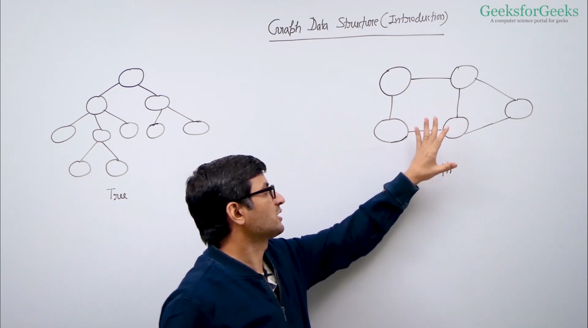

> ### Direct vs Indirect Graph

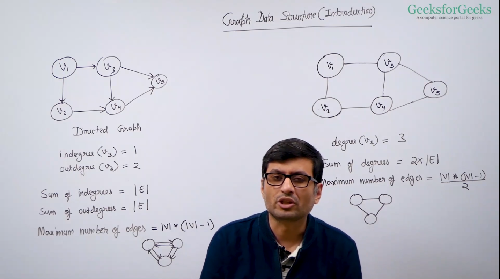

> ### Weight VS Unweighted Graph

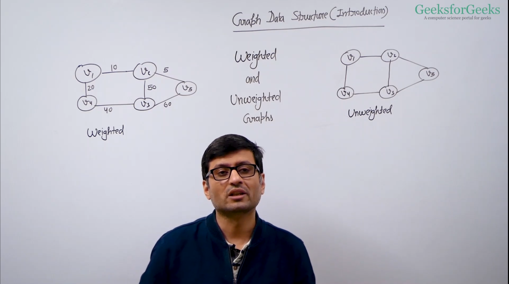

> ### Graph Represenation  -  Adjacency Matrix
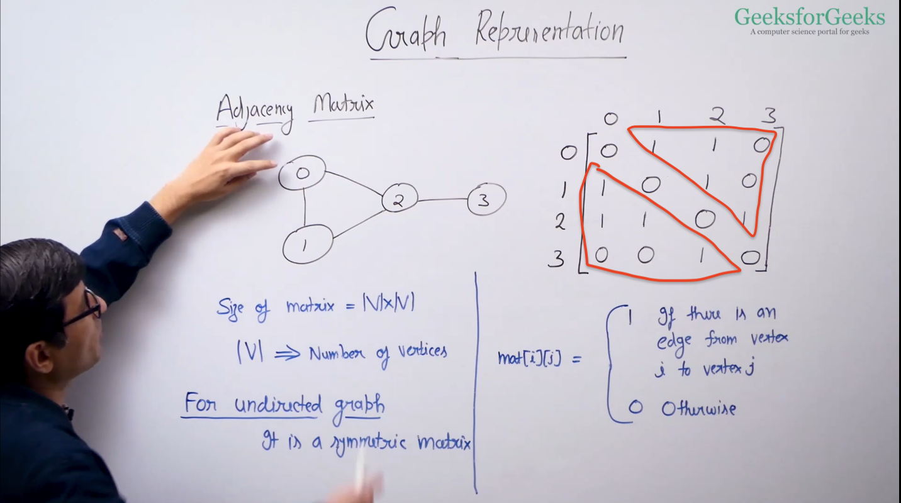


> ### Graph Represenation  -  Adjacency List
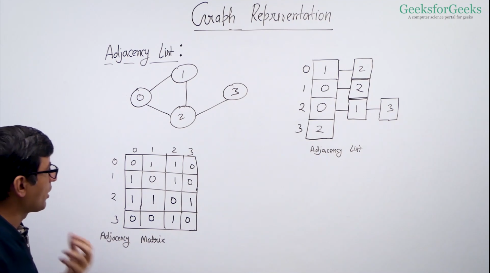


```js

// Graphs are bidirectional,
// edge is line while vertics is point.
// when adjacency matrix is formed in graps, it is symmetrical in shape
// we have both type ie adjacency list and matrix, but for the code purpose and efficiency we use the adjacency List
// we create the adjacency list in object form.
// adjacency list is much more easy to maintain and much efficient so we will use this

// Below is basic structure
{
    vertex: [edge1, edge2]
}


// Graph code is below

class Graph {
    constructor(){
        this.adjacencyList = {}
    }

    addVertex(vertex){
        if(!this.adjacencyList[vertex]){
            this.adjacencyList[vertex] = []
            return true
        }
        return false
    }

    addEdge(vertex1, vertex2){
        if(this.adjacencyList[vertex1] && this.adjacencyList[vertex2]){
            this.adjacencyList[vertex1].push(vertex2)
            this.adjacencyList[vertex2].push(vertex1)
            return true
        }
        return false
    }

    removeEdge(vertex1, vertex2){
        if(this.adjacencyList[vertex1] && this.adjacencyList[vertex2]){
            this.adjacencyList[vertex1] = this.adjacencyList[vertex1].filter(v => v !== vertex2)
            this.adjacencyList[vertex2] = this.adjacencyList[vertex2].filter(v => v !== vertex1)
            return true
        }
        return false
    }

    removeVertex(vertex){
        if(!this.adjacencyList[vertex]) return undefined

        while(this.adjacencyList[vertex].length){
            let temp = this.adjacencyList[vertex].pop()
            this.removeEdge(vertex, temp)
        }

        delete this.adjacencyList[vertex]
        return this
        
    }

    // https://youtu.be/dCvnjapI6ik?si=osd_nk716OwzbxA_
    // https://www.geeksforgeeks.org/breadth-first-search-or-bfs-for-a-graph/
    bfs(start) {  
        const queue = [start]; // Initialize queue with the starting vertex
        const result = []; // To store the BFS traversal result
        const visited = {}; // To keep track of visited vertices
        visited[start] = true; // Mark the start vertex as visited

        while (queue.length) {
            let vertex = queue.shift(); // Dequeue a vertex
            result.push(vertex); // Add it to the result list

            this.adjacencyList[vertex].forEach(neighbor => {
                if (!visited[neighbor]) { // If the neighbor hasn't been visited
                    visited[neighbor] = true; // Mark it as visited
                    queue.push(neighbor); // Enqueue the neighbor
                }
            });
        }

        return result;
    }

    // Recursive DFS
    // https://www.youtube.com/watch?v=0ql7lZS2qt0&ab_channel=AnujBhaiya
    // https://www.geeksforgeeks.org/depth-first-search-or-dfs-for-a-graph/
    dfsRecursive(start) {
        const result = []; // Store DFS result
        const visited = {}; // Track visited nodes

        const dfs = (vertex) => {
            if (!vertex) return null;
            visited[vertex] = true; // Mark as visited
            result.push(vertex); // Add to result

            // Recursively visit all neighbors
            this.adjacencyList[vertex].forEach(neighbor => {
                if (!visited[neighbor]) {
                    dfs(neighbor);
                }
            });
        };

        dfs(start); // Start DFS from the starting vertex
        return result;
    }

    // Iterative DFS
    dfsIterative(start) {
        const stack = [start]; // Use stack instead of queue
        const result = []; // Store DFS result
        const visited = {}; // Track visited nodes
        visited[start] = true;

        while (stack.length) {
            let vertex = stack.pop(); // Pop the vertex from the stack
            result.push(vertex);

            // Push all unvisited neighbors onto the stack
            this.adjacencyList[vertex].forEach(neighbor => {
                if (!visited[neighbor]) {
                    visited[neighbor] = true; 
                    stack.push(neighbor);
                }
            });
        }

        return result;
    }


    // Display the graph
    display() {
        for (let vertex in this.adjacencyList) {
            console.log(vertex, ":", this.adjacencyList[vertex]);
        }
    }
}

// Example usage
let myGraph = new Graph();
myGraph.addVertex(0);
myGraph.addVertex(1);
myGraph.addVertex(2);
myGraph.addVertex(3);
myGraph.addVertex(4);
myGraph.addVertex(5);

myGraph.addEdge(0, 1);
myGraph.addEdge(0, 2);
myGraph.addEdge(1, 3);
myGraph.addEdge(1, 4);
myGraph.addEdge(4, 5);

console.log("Graph display:");
myGraph.display();

console.log("DFS Recursive:", myGraph.dfsRecursive(0)); // Expected Output: [0, 1, 3, 4, 5, 2]
console.log("DFS Iterative:", myGraph.dfsIterative(0)); // Expected Output: [0, 2, 1, 4, 5, 3]


```

> ### 841. Keys and Rooms

There are n rooms labeled from 0 to n - 1 and all the rooms are locked except for room 0. Your goal is to visit all the rooms. However, you cannot enter a locked room without having its key.

When you visit a room, you may find a set of distinct keys in it. Each key has a number on it, denoting which room it unlocks, and you can take all of them with you to unlock the other rooms.

Given an array rooms where rooms[i] is the set of keys that you can obtain if you visited room i, return true if you can visit all the rooms, or false otherwise.

Example 1:

Input: rooms = [[1],[2],[3],[]]\
Output: true\
Explanation:\
We visit room 0 and pick up key 1.\
We then visit room 1 and pick up key 2.\
We then visit room 2 and pick up key 3.\
We then visit room 3.\
Since we were able to visit every room, we return true.

Example 2:

Input: rooms = [[1,3],[3,0,1],[2],[0]]\
Output: false\
Explanation: We can not enter room number 2 since the only key that unlocks it is in that room.

`video: ` https://youtu.be/d0J-s0ZdYsY?si=wCQqajThu2f-014K

`Algo:` Graph with DFS


> ### shortest path in unweight graph ( [Youtube video](https://www.youtube.com/watch?v=yysA7ZM2jjA&ab_channel=HelloWorld) )

```
https://www.youtube.com/watch?v=abIEXKFpLNE&ab_channel=CodeHelp-byBabbar
```

To find the **shortest path in an unweighted graph**, you can use **Breadth-First Search (BFS)**. Since all edges in an unweighted graph have the same weight, BFS guarantees the shortest path by visiting nodes layer by layer.

### BFS for Shortest Path

Here’s how you can modify your existing `Graph` class to implement the shortest path using BFS:

```javascript
class Graph {
    constructor(){
        this.adjacencyList = {};
    }

    addVertex(vertex) {
        if (!this.adjacencyList[vertex]) {
            this.adjacencyList[vertex] = [];
        }
    }

    addEdge(vertex1, vertex2) {
        if (this.adjacencyList[vertex1] && this.adjacencyList[vertex2]) {
            this.adjacencyList[vertex1].push(vertex2);
            this.adjacencyList[vertex2].push(vertex1);
        }
    }

    // BFS for Shortest Path
    shortestPath(start, target) {
        const queue = [[start]];  // Initialize queue with the start vertex as a path
        const visited = new Set();  // To track visited vertices
        visited.add(start);

        while (queue.length) {
            const path = queue.shift();  // Get the first path from the queue
            const vertex = path[path.length - 1];  // Get the last vertex from the path

            // If the last vertex is the target, return the path (shortest path)
            if (vertex === target) {
                return path;
            }

            // Loop through the neighbors of the current vertex
            this.adjacencyList[vertex].forEach(neighbor => {
                if (!visited.has(neighbor)) {  // If neighbor hasn't been visited
                    visited.add(neighbor);  // Mark it as visited
                    const newPath = [...path, neighbor];  // Create a new path with this neighbor
                    queue.push(newPath);  // Add the new path to the queue
                }
            });
        }

        return null;  // Return null if no path found
    }

    // Display the graph
    display() {
        for (let vertex in this.adjacencyList) {
            console.log(vertex, ":", this.adjacencyList[vertex]);
        }
    }
}

// Example usage
let myGraph = new Graph();
myGraph.addVertex(0);
myGraph.addVertex(1);
myGraph.addVertex(2);
myGraph.addVertex(3);
myGraph.addVertex(4);
myGraph.addVertex(5);

myGraph.addEdge(0, 1);
myGraph.addEdge(0, 2);
myGraph.addEdge(1, 3);
myGraph.addEdge(1, 4);
myGraph.addEdge(4, 5);

console.log("Graph display:");
myGraph.display();

console.log("Shortest path from 0 to 5:", myGraph.shortestPath(0, 5));  // Expected Output: [0, 1, 4, 5]
```

### Explanation:
1. **`queue = [[start]]`**: The queue holds paths, not just vertices. Initially, the path only contains the start vertex.
2. **Visited Set**: Keeps track of visited vertices to avoid cycles.
3. **BFS Process**: 
   - Dequeue a path, check its last vertex.
   - If this vertex is the target, the path is returned as it represents the shortest path.
   - Otherwise, for each neighbor, a new path is created and added to the queue.
4. **Termination**: The algorithm stops once the target is found, ensuring the shortest path is returned. If no path is found, it returns `null`.

This BFS-based approach ensures that the first time the target vertex is found, you get the shortest path in terms of the number of edges.


> ### Topological sort of graph using DFS  ( [Youtube video](https://www.youtube.com/watch?v=T_boOrr0rvk&ab_channel=CodeHelp-byBabbar) )

**Topological sorting** is an algorithm used for **Directed Acyclic Graphs (DAGs)**. It orders the vertices in such a way that for every directed edge `u -> v`, vertex `u` comes before vertex `v`. A common way to perform topological sorting is through **DFS** (Depth-First Search).

Here’s how you can implement **topological sorting** in your `Graph` class using DFS:

### Topological Sort Using DFS:

```javascript
class Graph {
    constructor(){
        this.adjacencyList = {};
    }

    addVertex(vertex) {
        if (!this.adjacencyList[vertex]) {
            this.adjacencyList[vertex] = [];
        }
    }

    addEdge(vertex1, vertex2) {
        if (this.adjacencyList[vertex1] && this.adjacencyList[vertex2]) {
            this.adjacencyList[vertex1].push(vertex2); // Directed edge from vertex1 to vertex2
        }
    }

    // Topological Sort using DFS
    topologicalSort() {
        const visited = new Set();  // Track visited nodes
        const stack = [];  // To store the topologically sorted elements

        const dfs = (vertex) => {
            visited.add(vertex);  // Mark the vertex as visited

            // Visit all its neighbors (adjacent vertices)
            this.adjacencyList[vertex].forEach(neighbor => {
                if (!visited.has(neighbor)) {
                    dfs(neighbor);  // Recursively visit unvisited neighbors
                }
            });

            stack.push(vertex);  // Push the vertex onto the stack after visiting its neighbors
        };

        // Perform DFS on each vertex
        for (let vertex in this.adjacencyList) {
            if (!visited.has(vertex)) {
                dfs(vertex);
            }
        }

        // The stack contains the topological order in reverse
        return stack.reverse();  // Reverse to get the correct topological order
    }

    // Display the graph
    display() {
        for (let vertex in this.adjacencyList) {
            console.log(vertex, ":", this.adjacencyList[vertex]);
        }
    }
}

// Example usage
let myGraph = new Graph();
myGraph.addVertex("A");
myGraph.addVertex("B");
myGraph.addVertex("C");
myGraph.addVertex("D");
myGraph.addVertex("E");
myGraph.addVertex("F");

myGraph.addEdge("A", "D");
myGraph.addEdge("F", "B");
myGraph.addEdge("B", "D");
myGraph.addEdge("F", "A");
myGraph.addEdge("D", "C");

console.log("Graph display:");
myGraph.display();

console.log("Topological Sort:", myGraph.topologicalSort());  // Expected Output: [ 'F', 'A', 'B', 'D', 'C' ]
```

### Explanation:
1. **Graph Representation**: The graph is represented as an adjacency list, where each vertex has a directed edge pointing to its neighbors.
2. **DFS for Topological Sort**:
   - **Visited Set**: A set is used to track visited vertices.
   - **Stack**: The stack keeps track of the vertices in reverse order of their completion (i.e., when all neighbors have been processed).
   - For each vertex, if it hasn’t been visited, perform DFS on it, and once its neighbors are processed, push it onto the stack.
   - After visiting all vertices, the stack contains the vertices in topological order (but in reverse, so we reverse it at the end).
3. **Cycle Handling**: This method works for **Directed Acyclic Graphs (DAGs)**. If there's a cycle in the graph, topological sorting is not possible, and the algorithm should be adjusted to detect cycles in such cases (can be done by checking for back edges).

### Example:
In the above example, the graph has the following structure:

```
F → A → D → C
    ↓    ↑
    B ← F
```

The topological sort outputs a valid order like `[ 'F', 'A', 'B', 'D', 'C' ]`, which respects the directed edges in the graph.

### Time Complexity:
- The time complexity is \(O(V + E)\), where \(V\) is the number of vertices and \(E\) is the number of edges, as it performs DFS for each vertex and processes each edge once.


> ### Topological sorting using kahn's alogorithm ie BFS alogrithm approach ( [Youtube video](https://www.youtube.com/watch?v=6XmzL04mlgQ&ab_channel=CodeHelp-byBabbar) )


### Kahn's Algorithm for Topological Sorting

**Kahn's Algorithm** is a method to perform **topological sorting** of a **Directed Acyclic Graph (DAG)** using **BFS (Breadth-First Search)**. The algorithm works by repeatedly removing vertices with no incoming edges (in-degree = 0) and adding them to the topological order. This guarantees that for every directed edge `u -> v`, vertex `u` appears before vertex `v` in the topological order.

### Steps in Kahn's Algorithm:
1. **Calculate In-degree**: For each vertex in the graph, calculate its in-degree (the number of incoming edges).
   
2. **Initialize Queue**: Enqueue all vertices with an in-degree of `0` (these are the starting points that don't depend on any other vertices).

3. **Process Queue**: While the queue is not empty:
   - Dequeue a vertex and add it to the topological ordering.
   - For each neighbor (vertex pointed to by the dequeued vertex), reduce its in-degree by 1. If the in-degree of any neighbor becomes `0`, enqueue that neighbor.

4. **Check for Cycles**: Once the queue is empty, if the topological order contains all vertices, the graph is a DAG and the order is valid. If not, the graph contains a cycle (as some vertices will still have non-zero in-degrees).

### Example

```javascript
class Graph {
    constructor() {
        this.adjacencyList = {};
    }

    addVertex(vertex) {
        if (!this.adjacencyList[vertex]) {
            this.adjacencyList[vertex] = [];
        }
    }

    addEdge(vertex1, vertex2) {
        if (this.adjacencyList[vertex1]) {
            this.adjacencyList[vertex1].push(vertex2); // Directed edge from vertex1 to vertex2
        }
    }

    // Kahn's Algorithm for Topological Sorting
    topologicalSort() {
        const inDegree = {};  // Stores the in-degree of each vertex
        const queue = [];  // Queue for vertices with in-degree 0
        const topologicalOrder = [];  // Result array

        // Initialize in-degree of each vertex to 0
        for (let vertex in this.adjacencyList) {
            inDegree[vertex] = 0;
        }

        // Calculate in-degree of each vertex
        for (let vertex in this.adjacencyList) {
            this.adjacencyList[vertex].forEach(neighbor => {
                inDegree[neighbor] = (inDegree[neighbor] || 0) + 1;
            });
        }

        // Enqueue vertices with in-degree 0
        for (let vertex in inDegree) {
            if (inDegree[vertex] === 0) {
                queue.push(vertex);
            }
        }

        // Process the queue
        while (queue.length > 0) {
            const currentVertex = queue.shift();  // Dequeue a vertex with in-degree 0
            topologicalOrder.push(currentVertex);  // Add it to the topological order

            // For each neighbor, reduce its in-degree by 1
            this.adjacencyList[currentVertex].forEach(neighbor => {
                inDegree[neighbor] -= 1;
                // If in-degree becomes 0, add the neighbor to the queue
                if (inDegree[neighbor] === 0) {
                    queue.push(neighbor);
                }
            });
        }

        // If the topological order doesn't contain all vertices, there is a cycle
        if (topologicalOrder.length !== Object.keys(this.adjacencyList).length) {
            return "Graph has a cycle!";
        }

        return topologicalOrder;
    }
}

// Example usage
let myGraph = new Graph();
myGraph.addVertex("A");
myGraph.addVertex("B");
myGraph.addVertex("C");
myGraph.addVertex("D");
myGraph.addVertex("E");
myGraph.addVertex("F");

myGraph.addEdge("A", "D");
myGraph.addEdge("F", "B");
myGraph.addEdge("B", "D");
myGraph.addEdge("F", "A");
myGraph.addEdge("D", "C");

console.log("Graph display:");
myGraph.display();

console.log("Topological Sort:", myGraph.topologicalSort());  // Expected Output: [ 'F', 'A', 'B', 'D', 'C' ]
```

### Explanation:
1. **In-degree Calculation**:
   - For each vertex, the in-degree is calculated by counting how many incoming edges it has. This is stored in the `inDegree` object.
   - Vertices with no incoming edges (in-degree = 0) are the ones that can be processed immediately.
   
2. **Queue Initialization**:
   - A queue is initialized with all vertices that have an in-degree of `0`, meaning they do not depend on any other vertex.

3. **Processing Vertices**:
   - Vertices are dequeued one by one, and for each dequeued vertex, its neighbors’ in-degrees are reduced by 1 (as their incoming edges are effectively "removed").
   - If a neighbor’s in-degree becomes 0, it is enqueued since it can now be processed.

4. **Cycle Detection**:
   - If the topological sort contains fewer vertices than the total number of vertices in the graph, there is a cycle, meaning that not all vertices could be sorted.

### Time Complexity:
- **Time Complexity**: \( O(V + E) \), where \( V \) is the number of vertices and \( E \) is the number of edges. The algorithm visits every vertex and edge once.
  
### Space Complexity:
- **Space Complexity**: \( O(V) \), since we store the in-degree for each vertex and use a queue for vertices with in-degree 0.

### Key Points:
- Kahn's Algorithm is used to perform topological sorting of a **DAG** using **BFS**.
- It ensures that for every directed edge `u -> v`, vertex `u` comes before vertex `v` in the topological order.
- It can also detect cycles, as a cycle in the graph will prevent some vertices from having in-degree 0, causing the algorithm to fail.


> ### Detect Cycle in Undirected Graph  ( [Youtube video](https://www.youtube.com/watch?v=UPfUFoWjk5w&t=402s&ab_channel=AnujBhaiya) )

To detect a cycle in an **undirected graph**, you can use either **Depth-First Search (DFS)** or **Union-Find (Disjoint Set)** methods. Below, I will explain both approaches for cycle detection in undirected graphs.

### 1. **Cycle Detection Using DFS**

The idea behind using **DFS** for cycle detection is that if you revisit a vertex that has already been visited and it is not the parent of the current vertex, then a cycle exists.

#### Steps:
- Perform DFS traversal.
- Keep track of visited nodes.
- If you find a neighbor that has been visited and is not the parent of the current node, a cycle is detected.

#### Code:

```javascript
class Graph {
    constructor() {
        this.adjacencyList = {};
    }

    addVertex(vertex) {
        if (!this.adjacencyList[vertex]) {
            this.adjacencyList[vertex] = [];
        }
    }

    addEdge(vertex1, vertex2) {
        if (this.adjacencyList[vertex1] && this.adjacencyList[vertex2]) {
            this.adjacencyList[vertex1].push(vertex2);
            this.adjacencyList[vertex2].push(vertex1);  // Undirected graph, so add edge in both directions
        }
    }

    // Detect cycle using DFS
    hasCycleDFS() {
        const visited = new Set();  // Track visited vertices

        const dfs = (vertex, parent) => {
            visited.add(vertex);  // Mark the current vertex as visited

            // Traverse neighbors
            for (let neighbor of this.adjacencyList[vertex]) {
                if (!visited.has(neighbor)) {
                    if (dfs(neighbor, vertex)) return true;  // Recursively visit unvisited neighbors
                }
                // If the neighbor is visited and it's not the parent, we have a cycle
                else if (neighbor !== parent) {
                    return true;
                }
            }
            return false;
        };

        // Loop through all vertices to handle disconnected components
        for (let vertex in this.adjacencyList) {
            if (!visited.has(vertex)) {
                if (dfs(vertex, null)) return true;  // Start DFS from unvisited vertex
            }
        }

        return false;  // No cycle found
    }

    // Display the graph
    display() {
        for (let vertex in this.adjacencyList) {
            console.log(vertex, ":", this.adjacencyList[vertex]);
        }
    }
}

// Example usage
let myGraph = new Graph();
myGraph.addVertex("0");
myGraph.addVertex("1");
myGraph.addVertex("2");
myGraph.addVertex("3");

myGraph.addEdge("0", "1");
myGraph.addEdge("1", "2");
myGraph.addEdge("2", "0");  // Creates a cycle
myGraph.addEdge("1", "3");

console.log("Graph display:");
myGraph.display();

console.log("Cycle detected using DFS:", myGraph.hasCycleDFS());  // Expected Output: true
```

### Explanation:
1. **DFS Traversal**: The DFS traversal starts from a vertex, marks it as visited, and then recursively explores its neighbors.
2. **Cycle Detection**: During traversal, if you encounter a visited vertex that is not the parent of the current vertex, it indicates a cycle.
3. **Handling Disconnected Graphs**: The algorithm checks each component in case the graph is disconnected.

### Time Complexity:
- **Time Complexity**: \(O(V + E)\), where \(V\) is the number of vertices and \(E\) is the number of edges, because we visit each vertex and edge once.


> ### Detect Cycle in directed Graph ( [Youtube video](https://www.youtube.com/watch?v=GLxfoaZlRqs&t=64s&ab_channel=AnujBhaiya) )

To detect a cycle in a **directed graph**, there are two common methods:

1. **Depth-First Search (DFS) with Recursion Stack**
2. **Kahn's Algorithm (Using Topological Sorting)**

### 1. **Cycle Detection Using DFS (Recursion Stack)**

In this method, we use a modified DFS traversal where we keep track of the recursion stack (the vertices currently being explored). If we revisit a vertex that is already in the recursion stack, it means there is a back edge, and hence a cycle exists.

#### Steps:
1. Perform DFS traversal of the graph.
2. Maintain a `visited` array to track whether a vertex has been visited.
3. Maintain a `recStack` (recursion stack) array to track vertices in the current path of recursion.
4. If you find a vertex that is already in the recursion stack, a cycle is detected.

#### Code:

```javascript
class Graph {
    constructor() {
        this.adjacencyList = {};
    }

    addVertex(vertex) {
        if (!this.adjacencyList[vertex]) {
            this.adjacencyList[vertex] = [];
        }
    }

    addEdge(vertex1, vertex2) {
        if (this.adjacencyList[vertex1]) {
            this.adjacencyList[vertex1].push(vertex2);  // Directed edge from vertex1 to vertex2
        }
    }

    // Detect cycle using DFS
    hasCycleDFS() {
        const visited = {};  // Track visited vertices
        const recStack = {}; // Track vertices in the current recursion stack

        // Helper function for DFS traversal
        const dfs = (vertex) => {
            if (!visited[vertex]) {
                visited[vertex] = true;
                recStack[vertex] = true;

                // Traverse neighbors
                for (let neighbor of this.adjacencyList[vertex]) {
                    // If the neighbor is not visited, recursively visit it
                    if (!visited[neighbor] && dfs(neighbor)) {
                        return true;
                    }
                    // If the neighbor is in the recursion stack, we found a cycle
                    else if (recStack[neighbor]) {
                        return true;
                    }
                }
            }

            recStack[vertex] = false;  // Remove vertex from recursion stack when done
            return false;
        };

        // Check each vertex for a cycle
        for (let vertex in this.adjacencyList) {
            if (dfs(vertex)) return true;
        }

        return false;  // No cycle found
    }

    // Display the graph
    display() {
        for (let vertex in this.adjacencyList) {
            console.log(vertex, ":", this.adjacencyList[vertex]);
        }
    }
}

// Example usage
let myGraph = new Graph();
myGraph.addVertex("A");
myGraph.addVertex("B");
myGraph.addVertex("C");
myGraph.addVertex("D");

myGraph.addEdge("A", "B");
myGraph.addEdge("B", "C");
myGraph.addEdge("C", "A");  // This edge creates a cycle
myGraph.addEdge("B", "D");

console.log("Graph display:");
myGraph.display();

console.log("Cycle detected using DFS:", myGraph.hasCycleDFS());  // Expected Output: true
```

### Explanation:
1. **DFS Traversal**: For each vertex, the algorithm performs a DFS to explore all its neighbors recursively.
2. **Recursion Stack**: The recursion stack helps keep track of the vertices currently being visited. If a back edge is found (i.e., revisiting a vertex that’s still in the recursion stack), a cycle is detected.
3. **Cycle Detection**: If any back edge is found during DFS traversal, a cycle exists in the graph.

### Time Complexity:
- **Time Complexity**: \(O(V + E)\), where \(V\) is the number of vertices and \(E\) is the number of edges. The graph is traversed once for DFS.
  


### 2. **Cycle Detection Using Kahn's Algorithm (Topological Sorting)**

Another approach is to use **Kahn's Algorithm**, which is based on topological sorting. The idea is that if the graph contains a cycle, it is **impossible** to create a valid topological order. So, if you cannot sort all the vertices, a cycle exists.

#### Steps:
1. **In-degree Calculation**: Calculate the in-degree (number of incoming edges) of each vertex.
2. **Queue Initialization**: Enqueue all vertices with in-degree 0 (starting points).
3. **Process Queue**: Dequeue a vertex, reduce the in-degree of its neighbors by 1, and enqueue any neighbors whose in-degree becomes 0.
4. **Cycle Detection**: If not all vertices can be processed (i.e., if the topological order doesn’t include all vertices), a cycle exists.

#### Code:

```javascript
class Graph {
    constructor() {
        this.adjacencyList = {};
    }

    addVertex(vertex) {
        if (!this.adjacencyList[vertex]) {
            this.adjacencyList[vertex] = [];
        }
    }

    addEdge(vertex1, vertex2) {
        if (this.adjacencyList[vertex1]) {
            this.adjacencyList[vertex1].push(vertex2);  // Directed edge from vertex1 to vertex2
        }
    }

    // Detect cycle using Kahn's Algorithm (Topological Sort)
    hasCycleKahns() {
        const inDegree = {};  // Track in-degree of each vertex
        const queue = [];     // Queue for vertices with in-degree 0
        let visitedCount = 0; // Count of vertices added to the topological sort

        // Initialize in-degree of each vertex
        for (let vertex in this.adjacencyList) {
            inDegree[vertex] = 0;
        }

        // Calculate in-degree of each vertex
        for (let vertex in this.adjacencyList) {
            this.adjacencyList[vertex].forEach(neighbor => {
                inDegree[neighbor] = (inDegree[neighbor] || 0) + 1;
            });
        }

        // Enqueue all vertices with in-degree 0
        for (let vertex in inDegree) {
            if (inDegree[vertex] === 0) {
                queue.push(vertex);
            }
        }

        // Process the vertices in the queue
        while (queue.length > 0) {
            const currentVertex = queue.shift();
            visitedCount++;

            // Reduce in-degree of neighbors and enqueue if their in-degree becomes 0
            this.adjacencyList[currentVertex].forEach(neighbor => {
                inDegree[neighbor]--;
                if (inDegree[neighbor] === 0) {
                    queue.push(neighbor);
                }
            });
        }

        // If not all vertices are visited, the graph has a cycle
        return visitedCount !== Object.keys(this.adjacencyList).length;
    }

    // Display the graph
    display() {
        for (let vertex in this.adjacencyList) {
            console.log(vertex, ":", this.adjacencyList[vertex]);
        }
    }
}

// Example usage
let myGraph = new Graph();
myGraph.addVertex("A");
myGraph.addVertex("B");
myGraph.addVertex("C");
myGraph.addVertex("D");

myGraph.addEdge("A", "B");
myGraph.addEdge("B", "C");
myGraph.addEdge("C", "A");  // This edge creates a cycle
myGraph.addEdge("B", "D");

console.log("Graph display:");
myGraph.display();

console.log("Cycle detected using Kahn's Algorithm:", myGraph.hasCycleKahns());  // Expected Output: true
```

### Explanation:
1. **In-degree Calculation**: First, the in-degree (number of incoming edges) of each vertex is calculated.
2. **Processing Queue**: All vertices with in-degree 0 are enqueued. These are vertices with no dependencies, so they can be safely processed.
3. **Cycle Detection**: As you process vertices, you reduce the in-degrees of their neighbors. If you cannot process all vertices, it means there are some vertices with in-degrees that never reached 0, indicating a cycle.

### Time Complexity:
- **Time Complexity**: \(O(V + E)\), where \(V\) is the number of vertices and \(E\) is the number of edges.


### Summary:

- **DFS with Recursion Stack**: Detects a cycle by tracking vertices in the current recursion stack. It’s easier to understand and implement.
- **Kahn's Algorithm (Topological Sort)**: Uses in-degree calculations and topological sorting to detect cycles. If not all vertices can be processed, a cycle exists.

Both methods are effective for detecting cycles in **directed graphs**, but they work differently depending on the context of your problem.


> ### shortest path in DAG ( [Youtube video](https://youtu.be/BNpWnXUhMC4?si=m_JJ4olsiBTj8fdL) )

To find the **shortest path in a Directed Acyclic Graph (DAG)**, we can use **Topological Sorting** combined with **dynamic programming**. Since the graph is acyclic, topological sorting ensures that we process each vertex before its descendants, allowing us to calculate the shortest paths in a single pass.

### Steps:
1. **Topologically sort the graph**: This gives us a linear ordering of the vertices.
2. **Relax edges**: Once we have the topological order, iterate over the vertices in this order and update the shortest distance to each of its neighbors.

### Algorithm:
1. **Initialize distances**: Set the distance to the source node to 0 and to all other nodes to infinity.
2. **Topological sort**: Perform a topological sort of the DAG.
3. **Relax edges**: For each vertex in topological order, update the distance to its neighbors if a shorter path is found.
4. **Output shortest paths**: After processing all vertices, the shortest distances from the source node to all other nodes will be computed.

### Code:

```javascript
class Graph {
    constructor(vertices) {
        this.vertices = vertices;
        this.adjacencyList = new Map();
    }

    addVertex(vertex) {
        this.adjacencyList.set(vertex, []);
    }

    addEdge(vertex1, vertex2, weight) {
        this.adjacencyList.get(vertex1).push({ node: vertex2, weight: weight });
    }

    // Helper function for topological sorting using DFS
    topologicalSortUtil(vertex, visited, stack) {
        visited[vertex] = true;

        // Visit all neighbors of the current vertex
        let neighbors = this.adjacencyList.get(vertex);
        for (let neighbor of neighbors) {
            if (!visited[neighbor.node]) {
                this.topologicalSortUtil(neighbor.node, visited, stack);
            }
        }

        // Push the current vertex to the stack after visiting all neighbors
        stack.push(vertex);
    }

    // Topological sort of the graph
    topologicalSort() {
        let stack = [];
        let visited = {};
        for (let i of this.adjacencyList.keys()) {
            visited[i] = false;
        }

        // Call the recursive helper function for topological sort for each vertex
        for (let i of this.adjacencyList.keys()) {
            if (!visited[i]) {
                this.topologicalSortUtil(i, visited, stack);
            }
        }

        // Return stack in reverse order
        return stack.reverse();
    }

    // Shortest path in DAG
    shortestPath(source) {
        let stack = this.topologicalSort();
        let distances = {};

        // Initialize distances to all vertices as infinity, and the source vertex as 0
        for (let vertex of this.adjacencyList.keys()) {
            distances[vertex] = Infinity;
        }
        distances[source] = 0;

        // Process vertices in topological order
        while (stack.length) {
            let currentVertex = stack.shift();  // Get the next vertex from the stack

            // Update the distance of all adjacent vertices of the dequeued vertex
            if (distances[currentVertex] !== Infinity) {
                for (let neighbor of this.adjacencyList.get(currentVertex)) {
                    let newDistance = distances[currentVertex] + neighbor.weight;
                    if (newDistance < distances[neighbor.node]) {
                        distances[neighbor.node] = newDistance;
                    }
                }
            }
        }

        return distances;
    }
}

// Example usage
let graph = new Graph(6);
graph.addVertex("0");
graph.addVertex("1");
graph.addVertex("2");
graph.addVertex("3");
graph.addVertex("4");
graph.addVertex("5");

graph.addEdge("0", "1", 5);
graph.addEdge("0", "2", 3);
graph.addEdge("1", "3", 6);
graph.addEdge("1", "2", 2);
graph.addEdge("2", "4", 4);
graph.addEdge("2", "5", 2);
graph.addEdge("2", "3", 7);
graph.addEdge("3", "5", 1);
graph.addEdge("4", "5", 6);

let shortestPaths = graph.shortestPath("0");
console.log("Shortest distances from source vertex 0:", shortestPaths);
```

### Explanation:

1. **Graph Initialization**: The graph is represented using an adjacency list where each vertex has a list of neighbors with associated weights.
2. **Topological Sort**: A helper function `topologicalSortUtil` is used to recursively perform a DFS and push vertices onto a stack in post-order. The vertices are processed in the reverse order of the stack to guarantee that each vertex is processed before its descendants.
3. **Relaxation**: For each vertex in the topologically sorted order, we check each neighbor and update its shortest distance using dynamic programming.
4. **Result**: The `shortestPath` function computes the shortest distances from the source vertex to every other vertex in the DAG.

### Example Output:
```
Shortest distances from source vertex 0:
{ '0': 0, '1': 5, '2': 3, '3': 11, '4': 7, '5': 10 }
```

### Time Complexity:
- **Topological Sorting**: \(O(V + E)\), where \(V\) is the number of vertices and \(E\) is the number of edges.
- **Relaxation**: \(O(V + E)\), since we process each vertex and its adjacent edges once.

Thus, the total time complexity is \(O(V + E)\).

### Notes:
- **No negative-weight cycles**: Since the graph is a DAG, we don’t have to worry about negative-weight cycles, making this approach efficient and straightforward.
- **Applicability**: This algorithm is ideal for tasks scheduling, dependency resolution, and other problems where tasks are represented as a DAG.


> ### Prim's Algorithm | Minimum Spanning Tree  ( [Youtube video](https://www.youtube.com/watch?v=kXiqvMykeJA&t=214s&ab_channel=AnujBhaiya) )

**Prim's Algorithm** is a greedy algorithm that is used to find the **Minimum Spanning Tree (MST)** for a weighted, undirected graph. The Minimum Spanning Tree of a graph is a subset of edges that connects all vertices together without any cycles and with the minimum possible total edge weight.

### Steps of Prim's Algorithm:
1. **Start with any vertex**: Begin with an arbitrary vertex as part of the MST.
2. **Grow the MST**: At each step, add the smallest edge that connects a vertex in the MST to a vertex outside the MST.
3. **Repeat**: Continue the process until all vertices are included in the MST.

### Key Points:
- The algorithm maintains two sets of vertices:
  1. **Vertices included in the MST** (already processed).
  2. **Vertices not yet included** (yet to be processed).
- At each iteration, Prim's algorithm picks the vertex with the minimum edge weight that connects a vertex in the MST with a vertex outside the MST.

### Algorithm:
1. Create a **min-heap** or use a priority queue to always pick the smallest edge weight.
2. Keep a **visited** set to track the vertices already added to the MST.
3. Keep updating the edge weights of adjacent vertices and choose the smallest one.

### Prim's Algorithm in JavaScript:

```javascript
class MinHeap {
    constructor() {
        this.heap = [];
    }

    insert(node, key) {
        this.heap.push({ node, key });
        this.bubbleUp();
    }

    bubbleUp() {
        let index = this.heap.length - 1;
        while (index > 0) {
            let element = this.heap[index];
            let parentIndex = Math.floor((index - 1) / 2);
            let parent = this.heap[parentIndex];
            if (element.key >= parent.key) break;
            this.heap[index] = parent;
            this.heap[parentIndex] = element;
            index = parentIndex;
        }
    }

    extractMin() {
        const min = this.heap[0];
        const end = this.heap.pop();
        if (this.heap.length > 0) {
            this.heap[0] = end;
            this.sinkDown(0);
        }
        return min;
    }

    sinkDown(index) {
        const length = this.heap.length;
        const element = this.heap[index];
        while (true) {
            let leftChildIndex = 2 * index + 1;
            let rightChildIndex = 2 * index + 2;
            let leftChild, rightChild;
            let swap = null;

            if (leftChildIndex < length) {
                leftChild = this.heap[leftChildIndex];
                if (leftChild.key < element.key) {
                    swap = leftChildIndex;
                }
            }

            if (rightChildIndex < length) {
                rightChild = this.heap[rightChildIndex];
                if (
                    (swap === null && rightChild.key < element.key) ||
                    (swap !== null && rightChild.key < leftChild.key)
                ) {
                    swap = rightChildIndex;
                }
            }

            if (swap === null) break;
            this.heap[index] = this.heap[swap];
            this.heap[swap] = element;
            index = swap;
        }
    }

    isEmpty() {
        return this.heap.length === 0;
    }
}

class Graph {
    constructor(vertices) {
        this.vertices = vertices;
        this.adjacencyList = new Map();
    }

    addVertex(vertex) {
        this.adjacencyList.set(vertex, []);
    }

    addEdge(vertex1, vertex2, weight) {
        this.adjacencyList.get(vertex1).push({ node: vertex2, weight });
        this.adjacencyList.get(vertex2).push({ node: vertex1, weight });
    }

    // Prim's algorithm for Minimum Spanning Tree (MST)
    primMST() {
        const minHeap = new MinHeap();
        const mstSet = new Set();  // Tracks vertices included in the MST
        const parent = {};         // Stores the MST edges
        const key = {};            // Stores the minimum weight edge for each vertex

        // Initialize the key of all vertices to infinity and pick the first vertex as the starting point
        for (let vertex of this.adjacencyList.keys()) {
            key[vertex] = Infinity;
            parent[vertex] = null;
        }

        // Start from an arbitrary vertex (let's pick the first one)
        let startVertex = [...this.adjacencyList.keys()][0];
        key[startVertex] = 0;
        minHeap.insert(startVertex, 0);

        while (!minHeap.isEmpty()) {
            let { node: currentVertex } = minHeap.extractMin();

            // If the current vertex is already in the MST set, skip it
            if (mstSet.has(currentVertex)) continue;

            // Add the current vertex to the MST set
            mstSet.add(currentVertex);

            // Process all the adjacent vertices of the current vertex
            let neighbors = this.adjacencyList.get(currentVertex);
            for (let neighbor of neighbors) {
                let { node: adjacentVertex, weight } = neighbor;

                // If adjacent vertex is not in the MST and the current edge is the smallest so far, update the key
                if (!mstSet.has(adjacentVertex) && weight < key[adjacentVertex]) {
                    key[adjacentVertex] = weight;
                    parent[adjacentVertex] = currentVertex;
                    minHeap.insert(adjacentVertex, weight);
                }
            }
        }

        // Print the resulting MST
        for (let vertex in parent) {
            if (parent[vertex] !== null) {
                console.log(`Edge: ${parent[vertex]} - ${vertex}, Weight: ${key[vertex]}`);
            }
        }
    }
}

// Example Usage
let graph = new Graph(5);
graph.addVertex('A');
graph.addVertex('B');
graph.addVertex('C');
graph.addVertex('D');
graph.addVertex('E');

graph.addEdge('A', 'B', 2);
graph.addEdge('A', 'C', 3);
graph.addEdge('B', 'C', 1);
graph.addEdge('B', 'D', 1);
graph.addEdge('C', 'D', 5);
graph.addEdge('B', 'E', 4);
graph.addEdge('D', 'E', 2);

graph.primMST();
```

### Output:

```
Edge: A - B, Weight: 2
Edge: B - C, Weight: 1
Edge: B - D, Weight: 1
Edge: D - E, Weight: 2
```

### Explanation:

1. **Graph Representation**: The graph is represented as an adjacency list, where each vertex stores a list of neighbors and the weight of the edge connecting them.
   
2. **Priority Queue (Min-Heap)**: Prim's algorithm uses a **min-heap** to efficiently extract the vertex with the smallest edge weight. In each iteration, it picks the vertex with the smallest key value that has not yet been added to the MST.
   
3. **Key and Parent Arrays**: 
   - The `key` array keeps track of the minimum edge weight for each vertex.
   - The `parent` array keeps track of the parent of each vertex in the MST, helping us reconstruct the tree.

4. **MST Construction**: The algorithm starts from an arbitrary vertex and grows the MST by adding the smallest edge connecting a new vertex to the tree at each step.

### Time Complexity:

- **Min-Heap operations**: Insert and extract-min operations take \(O(\log V)\) time.
- **Total Complexity**: \(O((V + E) \log V)\), where \(V\) is the number of vertices and \(E\) is the number of edges.

### Notes:
- Prim's algorithm is efficient for dense graphs.
- It’s similar to **Dijkstra’s algorithm**, but instead of finding the shortest paths from a source to all vertices, it finds the minimum spanning tree.


> ### Dijkstra's Algorithm | Single Source Shortest Path Algorithm in Graph  ( [Youtube video](https://www.youtube.com/watch?v=wjxCG6dOwcY&ab_channel=AnujBhaiya) )


**Dijkstra's Algorithm** is a greedy algorithm used to find the **shortest path** from a **single source vertex** to all other vertices in a weighted graph. Unlike Prim's algorithm (which is used for Minimum Spanning Trees), Dijkstra's algorithm finds the shortest path between the source node and all other nodes.

### Key Concepts:
- **Single Source Shortest Path**: It calculates the minimum cost (shortest path) from a starting vertex (source) to all other vertices.
- **Non-negative edge weights**: Dijkstra’s algorithm assumes that all edge weights are non-negative. For graphs with negative weights, **Bellman-Ford algorithm** is used.
- **Priority Queue/Min-Heap**: This helps to efficiently get the next vertex with the minimum distance.

### How Dijkstra's Algorithm Works:
1. **Initialize distances**: Set the distance to the source vertex to 0, and to all other vertices as infinity.
2. **Use a priority queue (min-heap)**: This is used to always process the vertex with the smallest known distance.
3. **Relax edges**: For each vertex, check all of its neighbors. If the distance through the current vertex is smaller than the previously known distance, update the distance.
4. **Repeat until all vertices are processed**: Continue until the priority queue is empty.

### Algorithm:

1. **Initialization**:
   - Set the distance of the source vertex to 0 and all other vertices to infinity.
   - Insert the source vertex into a priority queue (min-heap).

2. **Processing**:
   - Extract the vertex with the minimum distance from the priority queue.
   - Update the distances to its neighbors if a shorter path is found (relax the edges).
   - Insert the updated neighbors into the priority queue.

3. **Termination**:
   - The algorithm finishes when all vertices have been processed and their shortest distances have been found.

### Dijkstra's Algorithm in JavaScript:

```javascript
class MinHeap {
    constructor() {
        this.heap = [];
    }

    insert(node, distance) {
        this.heap.push({ node, distance });
        this.bubbleUp();
    }

    bubbleUp() {
        let index = this.heap.length - 1;
        while (index > 0) {
            let element = this.heap[index];
            let parentIndex = Math.floor((index - 1) / 2);
            let parent = this.heap[parentIndex];
            if (element.distance >= parent.distance) break;
            this.heap[index] = parent;
            this.heap[parentIndex] = element;
            index = parentIndex;
        }
    }

    extractMin() {
        const min = this.heap[0];
        const end = this.heap.pop();
        if (this.heap.length > 0) {
            this.heap[0] = end;
            this.sinkDown(0);
        }
        return min;
    }

    sinkDown(index) {
        const length = this.heap.length;
        const element = this.heap[index];
        while (true) {
            let leftChildIndex = 2 * index + 1;
            let rightChildIndex = 2 * index + 2;
            let leftChild, rightChild;
            let swap = null;

            if (leftChildIndex < length) {
                leftChild = this.heap[leftChildIndex];
                if (leftChild.distance < element.distance) {
                    swap = leftChildIndex;
                }
            }

            if (rightChildIndex < length) {
                rightChild = this.heap[rightChildIndex];
                if (
                    (swap === null && rightChild.distance < element.distance) ||
                    (swap !== null && rightChild.distance < leftChild.distance)
                ) {
                    swap = rightChildIndex;
                }
            }

            if (swap === null) break;
            this.heap[index] = this.heap[swap];
            this.heap[swap] = element;
            index = swap;
        }
    }

    isEmpty() {
        return this.heap.length === 0;
    }
}

class Graph {
    constructor() {
        this.adjacencyList = new Map();
    }

    addVertex(vertex) {
        this.adjacencyList.set(vertex, []);
    }

    addEdge(vertex1, vertex2, weight) {
        this.adjacencyList.get(vertex1).push({ node: vertex2, weight });
        this.adjacencyList.get(vertex2).push({ node: vertex1, weight });  // Remove this for directed graphs
    }

    // Dijkstra's Algorithm
    dijkstra(source) {
        let distances = {};
        let previous = {};
        let minHeap = new MinHeap();

        // Initialize distances and previous
        for (let vertex of this.adjacencyList.keys()) {
            distances[vertex] = Infinity;
            previous[vertex] = null;
        }
        distances[source] = 0;
        minHeap.insert(source, 0);

        // While the min-heap is not empty
        while (!minHeap.isEmpty()) {
            let { node: currentVertex, distance: currentDistance } = minHeap.extractMin();

            // If the current distance is greater than the recorded distance, skip
            if (currentDistance > distances[currentVertex]) continue;

            // Process all neighbors of the current vertex
            for (let neighbor of this.adjacencyList.get(currentVertex)) {
                let distance = currentDistance + neighbor.weight;

                // Only consider this path if it's shorter
                if (distance < distances[neighbor.node]) {
                    distances[neighbor.node] = distance;
                    previous[neighbor.node] = currentVertex;
                    minHeap.insert(neighbor.node, distance);
                }
            }
        }

        return { distances, previous };
    }

    // Helper function to print the shortest path from source to target
    printPath(previous, target) {
        let path = [];
        let currentNode = target;
        while (currentNode !== null) {
            path.unshift(currentNode);
            currentNode = previous[currentNode];
        }
        console.log(`Shortest path to ${target}:`, path.join(" -> "));
    }
}

// Example Usage
let graph = new Graph();
graph.addVertex("A");
graph.addVertex("B");
graph.addVertex("C");
graph.addVertex("D");
graph.addVertex("E");

graph.addEdge("A", "B", 4);
graph.addEdge("A", "C", 2);
graph.addEdge("B", "C", 5);
graph.addEdge("B", "D", 10);
graph.addEdge("C", "D", 3);
graph.addEdge("C", "E", 8);
graph.addEdge("D", "E", 1);

let result = graph.dijkstra("A");
console.log("Distances:", result.distances);  // Shortest distances from source to all vertices
graph.printPath(result.previous, "D");        // Print the shortest path from A to D
```

### Output:

```
Distances: { A: 0, B: 4, C: 2, D: 5, E: 6 }
Shortest path to D: A -> C -> D
```

### Explanation:
- **Graph Representation**: The graph is represented using an adjacency list, where each vertex stores a list of its neighbors along with the edge weight.
  
- **Dijkstra's Algorithm**:
  1. **Distances**: A dictionary keeps track of the shortest distance to each vertex from the source.
  2. **Min-Heap**: The min-heap (or priority queue) allows for efficient extraction of the vertex with the smallest distance.
  3. **Relaxation**: For each vertex, the distances to its neighbors are updated (relaxed) if a shorter path is found.
  4. **Previous Array**: This keeps track of the parent vertex for each node, allowing the shortest path to be reconstructed later.

### Time Complexity:
- **Min-Heap operations**: Insertion and extraction from the min-heap take \(O(\log V)\).
- **Relaxation**: Each vertex and its adjacent edges are processed once, taking \(O(V + E)\), where \(V\) is the number of vertices and \(E\) is the number of edges.
  
Total time complexity: \(O((V + E) \log V)\).

### Notes:
- **Directed/Undirected Graph**: Dijkstra's algorithm works for both directed and undirected graphs.
- **Non-negative weights**: It requires non-negative edge weights. If the graph contains negative weights, use the **Bellman-Ford algorithm**.
- **Applications**: Dijkstra’s algorithm is widely used in network routing, mapping systems, and other shortest path problems.


> ### Kosaraju's Algorithm for Strongly Connected Components   ( [Youtube video](https://www.youtube.com/watch?v=ndfjV_yHpgQ&ab_channel=CodeHelp-byBabbar) )


**Kosaraju's Algorithm** is an efficient method for finding **Strongly Connected Components (SCCs)** in a directed graph. A **Strongly Connected Component** is a subgraph in which every vertex is reachable from every other vertex. The algorithm works in **O(V + E)** time, where \(V\) is the number of vertices and \(E\) is the number of edges.

### Steps of Kosaraju's Algorithm:

1. **Perform a Depth First Search (DFS)** on the original graph** and maintain a stack** of vertices in the order of their **finishing times** (when DFS finishes processing a vertex, push it to the stack). This ensures that vertices are processed in a decreasing order of their finishing times.
   
2. **Transpose the graph** (reverse the direction of all edges). This step creates a new graph where all edges are reversed.

3. **Perform DFS on the transposed graph** in the order of the vertices in the stack. The vertices processed together during this DFS form a Strongly Connected Component (SCC).

### Kosaraju's Algorithm Steps in Detail:

1. **DFS on Original Graph**:
   - Run a DFS on the original graph to compute the **finishing order** of vertices. This is done by pushing the vertices onto a stack when their DFS finishes.

2. **Transpose the Graph**:
   - Reverse the directions of all edges in the graph. This allows us to explore the SCCs in the reversed graph.

3. **DFS on Transposed Graph**:
   - Run DFS on the transposed graph, but in the **order defined by the stack** from the first step. Each DFS call that starts will find one SCC.

### Kosaraju's Algorithm in JavaScript:

```javascript
class Graph {
    constructor(vertices) {
        this.vertices = vertices;
        this.adjacencyList = new Map();
    }

    addVertex(vertex) {
        this.adjacencyList.set(vertex, []);
    }

    addEdge(v, w) {
        this.adjacencyList.get(v).push(w);
    }

    // Step 1: Perform DFS and push vertices in the stack in order of finishing time
    fillOrder(v, visited, stack) {
        visited[v] = true;
        for (let neighbor of this.adjacencyList.get(v)) {
            if (!visited[neighbor]) {
                this.fillOrder(neighbor, visited, stack);
            }
        }
        stack.push(v);  // Push vertex to the stack after it's fully processed
    }

    // Step 2: Create a transposed graph (reverse all edges)
    getTranspose() {
        let g = new Graph(this.vertices);
        for (let vertex of this.adjacencyList.keys()) {
            g.addVertex(vertex);
        }
        for (let vertex of this.adjacencyList.keys()) {
            for (let neighbor of this.adjacencyList.get(vertex)) {
                g.addEdge(neighbor, vertex);  // Reverse the edge
            }
        }
        return g;
    }

    // Step 3: Perform DFS for each component in the transposed graph
    dfs(v, visited, component) {
        visited[v] = true;
        component.push(v);  // Collect vertices of this SCC
        for (let neighbor of this.adjacencyList.get(v)) {
            if (!visited[neighbor]) {
                this.dfs(neighbor, visited, component);
            }
        }
    }

    // Main function to find and print all strongly connected components (SCCs)
    kosaraju() {
        let stack = [];
        let visited = {};

        // Step 1: Mark all vertices as not visited
        for (let vertex of this.adjacencyList.keys()) {
            visited[vertex] = false;
        }

        // Step 1: Perform DFS to fill the stack with vertices in finishing order
        for (let vertex of this.adjacencyList.keys()) {
            if (!visited[vertex]) {
                this.fillOrder(vertex, visited, stack);
            }
        }

        // Step 2: Create the transposed graph
        let transposedGraph = this.getTranspose();

        // Step 3: Mark all vertices as not visited for DFS on the transposed graph
        for (let vertex of this.adjacencyList.keys()) {
            visited[vertex] = false;
        }

        // Step 4: Now process all vertices in the order defined by the stack
        let stronglyConnectedComponents = [];
        while (stack.length > 0) {
            let vertex = stack.pop();

            if (!visited[vertex]) {
                let component = [];
                transposedGraph.dfs(vertex, visited, component);
                stronglyConnectedComponents.push(component);
            }
        }

        return stronglyConnectedComponents;
    }
}

// Example usage:
let g = new Graph(5);
g.addVertex(0);
g.addVertex(1);
g.addVertex(2);
g.addVertex(3);
g.addVertex(4);

g.addEdge(0, 2);
g.addEdge(2, 1);
g.addEdge(1, 0);
g.addEdge(0, 3);
g.addEdge(3, 4);

let sccs = g.kosaraju();
console.log("Strongly Connected Components:", sccs);
```

### Output:

```
Strongly Connected Components: [ [ 4 ], [ 3 ], [ 0, 1, 2 ] ]
```

### Explanation:

1. **Original DFS (fillOrder)**:
   - We start by performing a DFS on the original graph. As each vertex finishes, we push it onto the stack. This ensures that vertices with no outgoing edges are processed first.
   
2. **Transpose the Graph**:
   - In the second step, we reverse the direction of all edges. This step is crucial because it helps us "walk back" the graph and discover the SCCs.

3. **DFS on the Transposed Graph**:
   - We perform a DFS on the transposed graph, processing vertices in the reverse finishing order (from the stack). Each DFS traversal finds a strongly connected component.

### Kosaraju’s Algorithm Time Complexity:

- **First DFS**: \(O(V + E)\) where \(V\) is the number of vertices and \(E\) is the number of edges.
- **Transpose the graph**: \(O(V + E)\), since reversing all edges takes linear time.
- **Second DFS on the transposed graph**: \(O(V + E)\).

Thus, the overall time complexity of Kosaraju's algorithm is **O(V + E)**.

### Advantages:
- Kosaraju’s algorithm is simple and efficient for finding all SCCs in a directed graph.
  
### Applications:
- **Web crawlers**: Finding groups of interconnected websites.
- **Graph theory problems**: Identifying modules or circular dependencies in large graphs.
- **Social networks**: Analyzing groups of users who frequently interact with each other.

Kosaraju's algorithm is an elegant solution for decomposing a directed graph into strongly connected components and can be easily implemented using depth-first search.


> ### Bellman Ford Algorithm | Negative Weight Cycle Detection  ( [Youtube video](https://www.youtube.com/watch?v=RiWE52X5wdQ&ab_channel=AnujBhaiya) )

**Bellman-Ford Algorithm** is a single-source shortest path algorithm that computes the shortest paths from a source vertex to all other vertices in a graph. It is more versatile than Dijkstra's algorithm because it can handle **graphs with negative weight edges**. However, it is slower with a time complexity of \(O(V \cdot E)\), where \(V\) is the number of vertices and \(E\) is the number of edges.

### Key Features:
- **Negative weights**: Bellman-Ford can handle graphs with negative weights, which makes it suitable for graphs where the cost of an edge can decrease the total path length.
- **Negative weight cycles**: If a graph contains a **negative weight cycle**, Bellman-Ford can detect it. A negative weight cycle is a cycle whose total weight (sum of edge weights) is negative, and in such cases, the shortest path is not well-defined.

### Steps of Bellman-Ford Algorithm:
1. **Initialize distances**: Set the distance to the source vertex to 0 and all other vertices to infinity.
2. **Relax all edges \(V - 1\) times**: For each vertex, iterate over all edges and update the distance if a shorter path is found.
3. **Detect negative weight cycles**: After \(V - 1\) iterations, check one more time to see if any distance can still be updated. If any edge can still be relaxed, it means there is a negative weight cycle in the graph.

### Bellman-Ford Algorithm in JavaScript:

```javascript
class Graph {
    constructor(vertices) {
        this.vertices = vertices;
        this.edges = [];
    }

    // Add an edge from vertex u to vertex v with weight w
    addEdge(u, v, w) {
        this.edges.push([u, v, w]);
    }

    // Bellman-Ford Algorithm to find the shortest path from source vertex to all others
    bellmanFord(source) {
        let distances = Array(this.vertices).fill(Infinity);
        distances[source] = 0;

        // Step 2: Relax all edges V-1 times
        for (let i = 1; i < this.vertices; i++) {
            for (let [u, v, w] of this.edges) {
                if (distances[u] !== Infinity && distances[u] + w < distances[v]) {
                    distances[v] = distances[u] + w;
                }
            }
        }

        // Step 3: Check for negative weight cycles
        for (let [u, v, w] of this.edges) {
            if (distances[u] !== Infinity && distances[u] + w < distances[v]) {
                console.log("Graph contains a negative weight cycle.");
                return;
            }
        }

        // Print shortest distances
        this.printDistances(distances);
    }

    // Helper function to print the distance array
    printDistances(distances) {
        console.log("Vertex   Distance from Source");
        for (let i = 0; i < this.vertices; i++) {
            console.log(`${i} \t\t ${distances[i]}`);
        }
    }
}

// Example usage:
let g = new Graph(5);
g.addEdge(0, 1, -1);
g.addEdge(0, 2, 4);
g.addEdge(1, 2, 3);
g.addEdge(1, 3, 2);
g.addEdge(1, 4, 2);
g.addEdge(3, 2, 5);
g.addEdge(3, 1, 1);
g.addEdge(4, 3, -3);

g.bellmanFord(0);
```

### Output:

```
Vertex   Distance from Source
0         0
1         -1
2         2
3         -2
4         1
```

### Explanation:
- **Graph Representation**: The graph is represented using an edge list. Each edge is stored as a tuple \([u, v, w]\), where \(u\) is the start vertex, \(v\) is the end vertex, and \(w\) is the edge weight.
  
- **Bellman-Ford Algorithm**:
  1. **Initialization**: The distance to the source vertex is set to 0, and all other distances are initialized to infinity.
  2. **Relaxation**: In each iteration, we loop through all edges and attempt to "relax" them. If the current known distance to vertex \(v\) through \(u\) is shorter than the known distance, we update the distance for \(v\).
  3. **Negative Cycle Detection**: After \(V - 1\) iterations, we perform one more iteration over all edges. If any edge can still be relaxed, it means there is a negative weight cycle.

### Time Complexity:
- **Relaxation**: The algorithm performs \(V - 1\) iterations over all \(E\) edges. Each iteration takes \(O(E)\), making the time complexity **O(V \cdot E)**.

### Applications:
- **Routing Algorithms**: Bellman-Ford is used in network routing protocols like **Routing Information Protocol (RIP)**.
- **Currency Arbitrage**: In financial systems, Bellman-Ford can be used to detect arbitrage opportunities (which can be modeled as negative weight cycles).
- **Graphs with Negative Weights**: When the graph contains negative weights, Bellman-Ford is a better option than Dijkstra’s algorithm.

### Notes:
- **Negative Weight Cycles**: If the graph contains a negative weight cycle, the algorithm will detect it. The presence of such a cycle makes it impossible to define the shortest path because distances can keep decreasing indefinitely.

### Example of Negative Weight Cycle:

If we add an edge to create a negative weight cycle, such as:

```javascript
g.addEdge(2, 4, -6);
```

Now running the algorithm would output:

```
Graph contains a negative weight cycle.
```

This indicates the presence of a negative weight cycle that makes the shortest path undefined.

> ### Articulation Point   ( [Youtube video](https://www.youtube.com/watch?v=jFZsDDB0-vo&ab_channel=AbdulBari) )

https://www.geeksforgeeks.org/articulation-points-or-cut-vertices-in-a-graph/


> ### Bridges in Graph

In graph theory, **Bridges** (also called **cut-edges**) are edges that, when removed, increase the number of connected components in the graph. In other words, removing a bridge disconnects part of the graph, making it an important concept in network analysis for identifying vulnerable connections.

### Key Concepts:
- A **bridge** is an edge in a graph whose removal makes the graph disconnected.
- In an undirected graph, a bridge is an edge that, if removed, increases the number of connected components.
- Like articulation points, bridges are critical in ensuring the structural integrity of the graph.

### Example:
Consider the following graph:
```
   0 ---- 1 ---- 2
    \      |
     \     3
      \    |
       \   4
        \  |
         \ 5
```
In this graph:
- The edge between vertices **1** and **2** is a bridge, because removing it will disconnect vertex 2 from the rest of the graph.
- The edge between vertices **0** and **1** is **not** a bridge, because removing it will not disconnect the graph, as there is still a path between vertices 0 and 1 via vertex 4.

### Finding Bridges Using DFS:

To find all the bridges in a graph, we use a **Depth-First Search (DFS)** and the concepts of **discovery time** and **low values**. The basic idea is to perform a DFS traversal and, during the process, identify edges that, if removed, would disconnect the graph.

### DFS Properties:
- **Discovery time**: The time when a node is first visited during the DFS traversal.
- **Low value**: The lowest discovery time reachable from a node's subtree (including back edges).

### Conditions for a Bridge:
- An edge \((u, v)\) is a bridge if there is no way to reach any of the ancestors of \(u\) from \(v\) or its descendants (i.e., if \(low[v] > disc[u]\)).

### Steps to Find Bridges:
1. **DFS Tree Construction**: Perform DFS traversal, marking discovery times and low values for each vertex.
2. **Bridge Detection**: During the DFS, check the condition \(low[v] > disc[u]\) for each edge \((u, v)\). If true, the edge is a bridge.

### Bridge Algorithm in JavaScript:

```javascript
class Graph {
    constructor(vertices) {
        this.vertices = vertices;
        this.adjacencyList = new Map();
        this.time = 0; // Track time in DFS traversal
    }

    addVertex(v) {
        this.adjacencyList.set(v, []);
    }

    addEdge(v, w) {
        this.adjacencyList.get(v).push(w);
        this.adjacencyList.get(w).push(v);  // Undirected graph
    }

    // DFS based function to find all bridges
    findBridges() {
        let visited = Array(this.vertices).fill(false);
        let disc = Array(this.vertices).fill(-1);  // Discovery times of visited vertices
        let low = Array(this.vertices).fill(-1);   // Lowest discovery times reachable
        let parent = Array(this.vertices).fill(-1);  // Parent vertices

        // List to store bridges
        let bridges = [];

        // Call the recursive helper function to find bridges
        for (let i = 0; i < this.vertices; i++) {
            if (!visited[i]) {
                this.dfs(i, visited, disc, low, parent, bridges);
            }
        }

        // Output the bridges
        console.log("Bridges in the graph:");
        for (let [u, v] of bridges) {
            console.log(`Bridge between vertices ${u} and ${v}`);
        }
    }

    // Recursive DFS function to find bridges
    dfs(u, visited, disc, low, parent, bridges) {
        // Mark the current node as visited and set discovery time and low value
        visited[u] = true;
        disc[u] = low[u] = ++this.time;

        // Go through all vertices adjacent to this vertex
        for (let v of this.adjacencyList.get(u)) {
            if (!visited[v]) {  // If v is not visited, make it a child of u in DFS tree
                parent[v] = u;

                // Recur for the child vertex
                this.dfs(v, visited, disc, low, parent, bridges);

                // Check if the subtree rooted at v has a connection back to one of u's ancestors
                low[u] = Math.min(low[u], low[v]);

                // Condition for bridge: if no back edge from subtree rooted at v
                if (low[v] > disc[u]) {
                    bridges.push([u, v]);
                }

            } else if (v !== parent[u]) {
                // Update low value of u for parent function calls
                low[u] = Math.min(low[u], disc[v]);
            }
        }
    }
}

// Example usage:
let g = new Graph(6);
g.addVertex(0);
g.addVertex(1);
g.addVertex(2);
g.addVertex(3);
g.addVertex(4);
g.addVertex(5);

g.addEdge(0, 1);
g.addEdge(1, 2);
g.addEdge(1, 3);
g.addEdge(3, 4);
g.addEdge(4, 5);
g.addEdge(0, 4);

g.findBridges();
```

### Output:

```
Bridges in the graph:
Bridge between vertices 1 and 2
Bridge between vertices 3 and 4
Bridge between vertices 4 and 5
```

### Explanation:
- **Edge (1, 2)** is a bridge because removing it will disconnect vertex 2 from the rest of the graph.
- **Edge (3, 4)** is a bridge because removing it will disconnect vertices 4 and 5 from the rest of the graph.
- **Edge (4, 5)** is a bridge because removing it will disconnect vertex 5.

### Time Complexity:
- The time complexity of finding all the bridges is **O(V + E)**, where \(V\) is the number of vertices and \(E\) is the number of edges. This is because the algorithm performs a DFS traversal, visiting every vertex and edge exactly once.

### Applications of Bridges:
1. **Network Analysis**: Bridges help identify critical connections in computer networks or social networks, where the failure of certain connections can cause the network to split.
2. **Road and Traffic Systems**: In a road network, bridges can represent critical roads whose failure or closure would disrupt traffic flow.
3. **Communication Networks**: In telecommunications, bridges represent links between different parts of the network, and their failure could isolate sections of the network.
4. **Vulnerability Analysis**: In system design or critical infrastructure, bridges are points where failures could cause significant disruptions, and identifying these can guide redundancy and reinforcement efforts.

### Summary:
Bridges in a graph are important structural components that, if removed, can split the graph into disconnected parts. By using DFS with discovery times and low values, we can efficiently find all the bridges in a graph in linear time, making this technique invaluable for network analysis and robustness studies.

> ### Greedy Algorithm

**Below is GFG defination**
Greedy algorithms are a class of algorithms that make locally optimal choices at each step with the hope of finding a global optimum solution. In these algorithms, decisions are made based on the information available at the current moment without considering the consequences of these decisions in the future. The key idea is to select the best possible choice at each step, leading to a solution that may not always be the most optimal but is often good enough for many problems.

Steps for Creating a Greedy Algorithm
The steps to define a greedy algorithm are:

1. Define the problem: Clearly state the problem to be solved and the objective to be optimized.
2. Identify the greedy choice: Determine the locally optimal choice at each step based on the current state.
3. Make the greedy choice: Select the greedy choice and update the current state.
4. Repeat: Continue making greedy choices until a solution is reached.

> ### Activity Selection Problem using Greedy Method  ( [Youtube video](https://www.youtube.com/watch?v=U4UoR9vq238&ab_channel=AnujBhaiya) )

The **Activity Selection Problem** is a classic problem in which we are given a set of activities, each defined by a start and finish time, and the goal is to select the maximum number of non-overlapping activities that can be performed by a single person or machine. The **greedy method** is a popular approach to solve this problem optimally.

### Problem Definition:
You are given \( n \) activities with their start and finish times. Your goal is to select the maximum number of activities such that no two selected activities overlap. Each activity has a start time \( s[i] \) and a finish time \( f[i] \).

### Greedy Strategy:
The idea behind the greedy approach is to always select the activity that finishes the earliest, as this leaves the most room for other activities.

### Steps of the Greedy Algorithm:
1. **Sort activities** by their finish times in non-decreasing order.
2. **Select the first activity** (the one that finishes the earliest).
3. For each subsequent activity, if its start time is greater than or equal to the finish time of the previously selected activity, **select the activity**.
4. Continue this process until all activities have been considered.

### Example:

Let's say we have the following activities with their start and finish times:

| Activity | Start Time | Finish Time |
|----------|------------|-------------|
| A1       | 1          | 3           |
| A2       | 2          | 5           |
| A3       | 4          | 6           |
| A4       | 6          | 8           |
| A5       | 5          | 7           |
| A6       | 8          | 9           |

### Step-by-Step Process:
1. **Sort by finish times**:

   Sorted activities by finish time:

   | Activity | Start Time | Finish Time |
   |----------|------------|-------------|
   | A1       | 1          | 3           |
   | A3       | 4          | 6           |
   | A2       | 2          | 5           |
   | A5       | 5          | 7           |
   | A4       | 6          | 8           |
   | A6       | 8          | 9           |

2. **Select the first activity** (A1).
3. Now, select the next activity that starts after A1 finishes. The next non-overlapping activity is A3.
4. Continue to select activities in this manner. The next activity after A3 is A4, and then A6.

The selected activities are **A1, A3, A4, and A6**, with no overlap.

### Greedy Algorithm Implementation in JavaScript:

```javascript
function activitySelection(activities) {
    // Sort activities based on their finish times
    activities.sort((a, b) => a[1] - b[1]);

    let selectedActivities = [];
    let lastFinishTime = 0;

    // Select the first activity and then the next non-overlapping ones
    for (let i = 0; i < activities.length; i++) {
        let [start, finish] = activities[i];

        if (start >= lastFinishTime) {
            selectedActivities.push(activities[i]);
            lastFinishTime = finish;  // Update the finish time
        }
    }

    return selectedActivities;
}

// Example usage:
const activities = [
    [1, 3], // A1: Start = 1, Finish = 3
    [2, 5], // A2: Start = 2, Finish = 5
    [4, 6], // A3: Start = 4, Finish = 6
    [6, 8], // A4: Start = 6, Finish = 8
    [5, 7], // A5: Start = 5, Finish = 7
    [8, 9], // A6: Start = 8, Finish = 9
];

const result = activitySelection(activities);
console.log("Selected activities:", result);
```

### Output:

```
Selected activities: [ [ 1, 3 ], [ 4, 6 ], [ 6, 8 ], [ 8, 9 ] ]
```

### Explanation:
- The sorted activities based on finish time are: \([1,3]\), \([4,6]\), \([2,5]\), \([5,7]\), \([6,8]\), \([8,9]\).
- The selected activities are: \([1,3]\), \([4,6]\), \([6,8]\), \([8,9]\), ensuring maximum activity selection without any overlaps.

### Time Complexity:
- Sorting the activities takes **O(n log n)**, where \(n\) is the number of activities.
- After sorting, selecting activities takes **O(n)**.
Thus, the overall time complexity is **O(n log n)**.

### Greedy Choice Property:
The key idea is that by selecting the activity that finishes the earliest, we maximize the remaining time for future activities. This "greedy" choice ensures that we can always make the best possible decisions moving forward, leading to an optimal solution.

### Applications:
1. **Scheduling**: Allocating resources (such as meeting rooms) efficiently in time-scheduling problems.
2. **Project Planning**: Ensuring tasks or projects are completed in the shortest time without conflicts.
3. **CPU Scheduling**: Selecting processes in a way that maximizes CPU utilization while avoiding conflicts.

### Summary:
The **Activity Selection Problem** using the **Greedy Method** is an efficient way to select the maximum number of non-overlapping activities by always choosing the activity that finishes first. This approach ensures an optimal solution and is widely applicable in scheduling and resource allocation problems.


> ### Fractional Knapsack - Greedy Algorithm  ( [Youtube video](https://www.youtube.com/watch?v=2i5pclQprGk&ab_channel=ApnaCollege) )

The **Fractional Knapsack Problem** is a classic **greedy algorithm** problem where you are given a set of items, each with a weight and a value, and you need to determine the maximum value you can carry in a knapsack with a weight limit. In this variation of the knapsack problem, you can take fractions of an item, meaning you can split the item if needed to maximize the total value.

### Problem Statement:
- You have a knapsack that can carry a maximum weight \( W \).
- You are given \( n \) items, where each item \( i \) has a weight \( w[i] \) and a value \( v[i] \).
- Your goal is to maximize the value of the items you can fit in the knapsack by potentially taking fractional amounts of the items.

### Greedy Strategy:
To solve the fractional knapsack problem, the greedy approach suggests picking items based on their **value-to-weight ratio** \( \frac{v[i]}{w[i]} \). The idea is to take as much of the item with the highest value per weight unit first, then the next, and so on until the knapsack is full.

### Steps of the Greedy Algorithm:
1. **Calculate the value-to-weight ratio** \( \frac{v[i]}{w[i]} \) for each item.
2. **Sort the items** in descending order of their value-to-weight ratio.
3. Start with an empty knapsack. For each item in the sorted list:
   - If the entire item can fit into the knapsack, add it.
   - If the item cannot fit, take the fraction of the item that will fill the knapsack to capacity.
4. Continue until the knapsack is full or all items have been considered.

### Example:
Let's say we have 3 items with the following weights and values:

- Item 1: weight = 10, value = 60
- Item 2: weight = 20, value = 100
- Item 3: weight = 30, value = 120

And the knapsack capacity \( W \) is 50.

### Steps:

1. Compute the value-to-weight ratio for each item:
   - Item 1: \( \frac{60}{10} = 6 \)
   - Item 2: \( \frac{100}{20} = 5 \)
   - Item 3: \( \frac{120}{30} = 4 \)

2. Sort the items by the value-to-weight ratio in descending order:
   - Item 1 (6), Item 2 (5), Item 3 (4)

3. Select items for the knapsack:
   - First, take all of Item 1 (weight 10, value 60), remaining capacity: \( 50 - 10 = 40 \)
   - Then, take all of Item 2 (weight 20, value 100), remaining capacity: \( 40 - 20 = 20 \)
   - Finally, take \( \frac{20}{30} \) (two-thirds) of Item 3, which gives a value of \( \frac{2}{3} \times 120 = 80 \)

Total value: \( 60 + 100 + 80 = 240 \)

### Fractional Knapsack Algorithm in JavaScript:

```javascript
function fractionalKnapsack(items, capacity) {
    // Sort items by value-to-weight ratio in descending order
    items.sort((a, b) => (b.value / b.weight) - (a.value / a.weight));

    let totalValue = 0;

    for (let i = 0; i < items.length; i++) {
        let { weight, value } = items[i];

        if (capacity >= weight) {
            // If the item can be taken fully
            totalValue += value;
            capacity -= weight;
        } else {
            // Take the fraction of the remaining capacity
            totalValue += (value / weight) * capacity;
            break; // Knapsack is full
        }
    }

    return totalValue;
}

// Example usage:
const items = [
    { weight: 10, value: 60 },  // Item 1
    { weight: 20, value: 100 }, // Item 2
    { weight: 30, value: 120 }, // Item 3
];

const capacity = 50;
const maxValue = fractionalKnapsack(items, capacity);
console.log("Maximum value in knapsack:", maxValue);
```

### Output:
```
Maximum value in knapsack: 240
```

### Explanation:
- The items are sorted by their value-to-weight ratio.
- The algorithm adds full Item 1 and Item 2 to the knapsack and then takes a fraction (two-thirds) of Item 3 to fill the remaining capacity.
- The total value is 240, which is the maximum value that can be obtained for the given knapsack capacity.

### Time Complexity:
- Sorting the items by value-to-weight ratio takes \( O(n \log n) \).
- The loop to add items to the knapsack takes \( O(n) \).
Thus, the overall time complexity is **\( O(n \log n) \)**.

### Greedy Choice Property:
The greedy algorithm works because we always make the choice that maximizes the value per unit of weight, which ensures that we are optimizing at each step.

### Applications:
1. **Resource Allocation**: Allocating limited resources (like time, space, or bandwidth) where you can take fractions of each resource.
2. **Investment Decisions**: When allocating funds to investments that can be fractionalized, and you want to maximize the return.
3. **Cargo Loading**: In transport systems where fractional items can be loaded into containers, the aim is to maximize the value carried.

### Summary:
The **Fractional Knapsack Problem** is a variation of the knapsack problem where fractions of items can be taken. The **greedy method** efficiently solves this problem by always selecting the item (or fraction) with the highest value-to-weight ratio until the knapsack is full. This approach guarantees an optimal solution for the fractional variant of the knapsack problem.


> ### Job Sequencing Algorithm  ( [Youtube video](https://www.youtube.com/watch?v=Tpp7o0jQ-8w&ab_channel=GateSmashers) )

The **Job Sequencing Problem** is a popular problem in **greedy algorithms** where you are given a set of jobs, each having a deadline and a profit associated with it. The objective is to schedule the jobs in such a way that you can maximize the total profit while ensuring that no more than one job is executed at a time, and each job is completed before its deadline.

### Problem Statement:
- You are given \( n \) jobs, each having a **deadline** and a **profit**.
- Each job takes **one unit of time** to complete.
- The objective is to find the maximum profit by scheduling jobs such that:
  - No two jobs overlap.
  - Each job is completed before or on its deadline.

### Greedy Approach:
To solve this problem optimally, a greedy approach is used where jobs are scheduled in descending order of their profits, and each job is assigned to the latest available time slot before its deadline (if available).

### Algorithm Steps:
1. **Sort the jobs** in descending order of their profit.
2. **Iterate over each job** and try to schedule it in the latest available time slot before its deadline.
3. If a slot is available, schedule the job; otherwise, skip it.

### Example:

Let's say we have the following jobs:

| Job   | Deadline | Profit |
|-------|----------|--------|
| J1    | 2        | 100    |
| J2    | 1        | 19     |
| J3    | 2        | 27     |
| J4    | 1        | 25     |
| J5    | 3        | 15     |

### Step-by-Step Process:
1. **Sort jobs by profit**:
   Sorted order: J1, J3, J4, J2, J5.

2. **Create a time slot array**: Assume that there are \( t \) available slots (from 1 to max deadline).

   For this example, the maximum deadline is 3, so we create 3 slots: \( [\_, \_, \_] \).

3. **Schedule jobs**:
   - **J1**: Deadline is 2. Place J1 in the latest available slot before or on 2. So, place J1 in slot 2.
   - **J3**: Deadline is 2. Place J3 in the latest available slot before or on 2. Slot 2 is occupied, so place J3 in slot 1.
   - **J4**: Deadline is 1. Slot 1 is already occupied, so J4 cannot be scheduled.
   - **J2**: Deadline is 1. Slot 1 is occupied, so J2 cannot be scheduled.
   - **J5**: Deadline is 3. Place J5 in the latest available slot before or on 3. So, place J5 in slot 3.

Final schedule: \( [J3, J1, J5] \).

The total profit is \( 27 + 100 + 15 = 142 \).

### Job Sequencing Algorithm Implementation in JavaScript:

```javascript
function JobSequencing(jobs) {
    // Sort the jobs based on their profit in descending order
    jobs.sort((a, b) => b.profit - a.profit);

    let maxDeadline = Math.max(...jobs.map(job => job.deadline));
    let timeSlots = Array(maxDeadline).fill(null); // Array to store job schedule
    let totalProfit = 0;

    for (let i = 0; i < jobs.length; i++) {
        // Find a free slot for the job (starting from the last possible slot)
        for (let j = jobs[i].deadline - 1; j >= 0; j--) {
            if (timeSlots[j] === null) {
                timeSlots[j] = jobs[i];  // Schedule the job
                totalProfit += jobs[i].profit; // Add to total profit
                break; // Move to the next job after scheduling
            }
        }
    }

    return {
        timeSlots: timeSlots.filter(job => job !== null), // Jobs that are scheduled
        totalProfit
    };
}

// Example usage
const jobs = [
    { id: "J1", deadline: 2, profit: 100 }, // Job 1
    { id: "J2", deadline: 1, profit: 19 },  // Job 2
    { id: "J3", deadline: 2, profit: 27 },  // Job 3
    { id: "J4", deadline: 1, profit: 25 },  // Job 4
    { id: "J5", deadline: 3, profit: 15 }   // Job 5
];

const result = JobSequencing(jobs);
console.log("Scheduled jobs:", result.timeSlots);
console.log("Total profit:", result.totalProfit);
```

### Output:
```
Scheduled jobs: [ { id: 'J3', deadline: 2, profit: 27 }, { id: 'J1', deadline: 2, profit: 100 }, { id: 'J5', deadline: 3, profit: 15 } ]
Total profit: 142
```

### Explanation:
- The algorithm schedules the jobs with the highest profit in the latest available time slots.
- The final job sequence is \( J3, J1, J5 \), and the total profit is 142.

### Time Complexity:
1. **Sorting the jobs** based on their profit takes \( O(n \log n) \), where \( n \) is the number of jobs.
2. **Finding a slot** for each job takes \( O(n \times d) \), where \( d \) is the maximum deadline.

Thus, the total time complexity is \( O(n \log n + n \times d) \), where \( n \) is the number of jobs and \( d \) is the maximum deadline.

### Greedy Choice Property:
The greedy approach works for the job sequencing problem because:
- At each step, the algorithm makes a choice that seems to offer the most profit by selecting the job with the highest profit.
- By doing so, it ensures that we don't miss any high-profit job that could fit within the remaining slots.

### Applications:
1. **Scheduling**: Optimal scheduling of jobs in manufacturing or computing to maximize profit or minimize cost.
2. **Project Management**: Selecting the most profitable projects to undertake within given deadlines.
3. **Task Assignment**: Assigning tasks to workers in a way that maximizes overall efficiency and profit.

### Summary:
The **Job Sequencing Problem** is solved optimally using a **greedy algorithm** that sorts jobs by their profit and assigns them to the latest available time slot before their deadline. This approach ensures the maximum profit can be obtained, and is widely applicable in scheduling and resource management problems.

<br>

> ### Rat In a Maze   ( [Youtube video](https://youtu.be/wjqSZy4pMT4?si=fFRwK9Xcp2Uq_XO5) )

The **Rat in a Maze** problem is another classic **backtracking problem** where we need to find a path from the start to the destination in a maze (grid). The maze consists of cells that are either blocked (`0`) or open (`1`), and the objective is to move the rat from the top-left corner to the bottom-right corner by moving only in allowed directions (commonly right and down).

### Problem:

Given a maze represented by a \(N \times N\) grid, the rat can start at the top-left corner (0,0) and needs to reach the bottom-right corner (N-1, N-1). The rat can move **right**, **down**, **left**, or **up**. The goal is to find one possible path for the rat, ensuring it only moves through open cells (`1`) and doesn't move into blocked cells (`0`).

### Approach:

- The backtracking approach tries to move the rat in all possible directions (right, down, left, up).
- If the rat reaches the destination, the path is valid.
- If a move leads to an invalid position (out of bounds, blocked cell, or already visited cell), the algorithm backtracks and tries another direction.

### JavaScript Code for **Rat in a Maze**:

```javascript
function solveMaze(maze) {
    const N = maze.length;
    const solution = Array.from({ length: N }, () => Array(N).fill(0)); // To store the solution path

    // Helper function to check if the move is valid
    function isSafe(maze, x, y) {
        return (x >= 0 && x < N && y >= 0 && y < N && maze[x][y] === 1);
    }

    // Backtracking function to solve the maze
    function solveMazeUtil(maze, x, y, solution) {
        // If the rat reaches the destination (bottom-right corner)
        if (x === N - 1 && y === N - 1 && maze[x][y] === 1) {
            solution[x][y] = 1;
            return true;
        }

        // Check if the current position is valid
        if (isSafe(maze, x, y)) {
            // Mark the current cell as part of the solution path
            solution[x][y] = 1;

            // Move to the right (x, y+1)
            if (solveMazeUtil(maze, x, y + 1, solution)) {
                return true;
            }

            // Move down (x+1, y)
            if (solveMazeUtil(maze, x + 1, y, solution)) {
                return true;
            }

            // Move to the left (x, y-1)
            if (solveMazeUtil(maze, x, y - 1, solution)) {
                return true;
            }

            // Move up (x-1, y)
            if (solveMazeUtil(maze, x - 1, y, solution)) {
                return true;
            }

            // If none of the above movements work, backtrack: unmark the current cell
            solution[x][y] = 0;
            return false;
        }

        return false; // Return false if the cell is not valid
    }

    // Main function to solve the maze
    if (!solveMazeUtil(maze, 0, 0, solution)) {
        console.log("No solution exists");
        return false;
    }

    console.log("One possible solution:");
    console.log(solution);
    return solution;
}

// Example usage:
const maze = [
    [1, 0, 0, 0],
    [1, 1, 0, 1],
    [0, 1, 0, 0],
    [1, 1, 1, 1]
];

solveMaze(maze);
```

### Example Output:

For the given `maze`:

```javascript
[
    [1, 0, 0, 0],
    [1, 1, 0, 1],
    [0, 1, 0, 0],
    [1, 1, 1, 1]
]
```

The possible output path will be:

```
One possible solution:
[
    [1, 0, 0, 0],
    [1, 1, 0, 0],
    [0, 1, 0, 0],
    [0, 1, 1, 1]
]
```

This path takes the rat from the top-left corner to the bottom-right corner by following open cells (1).

### Explanation:

1. **isSafe function**:
   - Checks if the move is valid by ensuring the position is within bounds and the cell is not blocked (`1`).

2. **solveMazeUtil function**:
   - This is the recursive backtracking function that tries to move the rat in all four possible directions (right, down, left, up) from the current cell `(x, y)`.
   - It marks the current cell as part of the solution (`solution[x][y] = 1`) and continues to explore further.
   - If no valid move exists, it backtracks by unmarking the cell (`solution[x][y] = 0`).

3. **Base Case**:
   - The algorithm stops when the rat reaches the bottom-right corner `(N-1, N-1)`, indicating that the solution has been found.

### Time Complexity:

- The time complexity of this algorithm is \(O(2^{N^2})\) in the worst case, as each cell can potentially have multiple moves to explore and may involve a lot of backtracking.

### Space Complexity:

- The space complexity is \(O(N^2)\), which is the size of the solution array used to store the path.

### Conclusion:
This solution finds **one possible path** for the rat to reach the destination in the maze using a **backtracking** approach. If no path exists, it prints a message indicating that no solution is possible.


> ### N-Queen Problem   ( [Youtube video](https://www.youtube.com/watch?v=MHXR4PCY8c0&ab_channel=AnujBhaiya) )
The **N-Queen Problem** is a classic problem in combinatorial optimization and a well-known example of **backtracking**. The task is to place **N queens** on an \( N \times N \) chessboard such that no two queens threaten each other. This means:

1. No two queens can share the same **row**.
2. No two queens can share the same **column**.
3. No two queens can share the same **diagonal**.

### Problem Definition:
Given a chessboard of size \( N \times N \), the goal is to place N queens on the board such that:
- No two queens can attack each other (no two queens should be on the same row, column, or diagonal).

### Approach:

The **backtracking approach** is used to solve the N-Queen problem efficiently. The idea is to place queens one by one in different columns of a row, and for each placement, check whether it leads to a solution. If it does not lead to a solution, the queen is removed, and we backtrack to the previous step to try another placement.

### Steps:

1. Start with the first row and place a queen in the first column.
2. Move to the next row and try placing a queen in each column, one by one.
3. For each placement, check if it is valid (i.e., no queens are placed in the same column or diagonal).
4. If placing the queen in a particular column leads to a valid solution, move on to the next row. Otherwise, backtrack and try placing the queen in a different column.
5. Repeat until queens are placed in all rows or no valid configuration is possible.

### Algorithm:

- The **base case** is when all queens are placed, meaning we’ve successfully placed a queen in each row.
- The **backtracking** step involves trying all possible positions in the current row and then recursively trying to place queens in subsequent rows. If no valid placement is found in the current configuration, we backtrack to the previous row and try a different configuration.

### Code Implementation (JavaScript):

```javascript
function solveNQueens(N) {
    const result = [];
    const board = Array.from({ length: N }, () => Array(N).fill('.'));

    function isSafe(board, row, col, N) {
        // Check the same column
        for (let i = 0; i < row; i++) {
            if (board[i][col] === 'Q') return false;
        }

        // Check the upper left diagonal
        for (let i = row, j = col; i >= 0 && j >= 0; i--, j--) {
            if (board[i][j] === 'Q') return false;
        }

        // Check the upper right diagonal
        for (let i = row, j = col; i >= 0 && j < N; i--, j++) {
            if (board[i][j] === 'Q') return false;
        }

        return true;
    }

    function placeQueens(board, row, N) {
        if (row === N) {
            // All queens are placed successfully, add the board configuration to the result
            const copy = board.map((row) => row.join(''));
            result.push(copy);
            return;
        }

        for (let col = 0; col < N; col++) {
            if (isSafe(board, row, col, N)) {
                // Place the queen
                board[row][col] = 'Q';
                
                // Recur to place the rest of the queens
                placeQueens(board, row + 1, N);

                // Backtrack: remove the queen and try another column
                board[row][col] = '.';
            }
        }
    }

    placeQueens(board, 0, N);
    return result;
}

// Example usage:
const N = 4;
const solutions = solveNQueens(N);
console.log(`Number of solutions for N = ${N}: ${solutions.length}`);
console.log("Solutions:");
solutions.forEach((solution) => console.log(solution.join("\n"), "\n"));
```

### Explanation:

1. **isSafe function**:
   - It checks if placing a queen at `board[row][col]` is valid by checking:
     - No other queen exists in the same column.
     - No other queen exists in the upper left diagonal.
     - No other queen exists in the upper right diagonal.

2. **placeQueens function**:
   - It is the main backtracking function that attempts to place queens row by row.
   - If it successfully places a queen in the current row, it recursively moves to the next row.
   - If placing a queen leads to a solution, it records the solution in `result`.
   - If no valid placement is possible, it backtracks by removing the queen and trying other placements.

3. **Result**:
   - Each valid configuration of the board is stored in the `result` array, where each row is represented as a string.

### Output Example for \( N = 4 \):

```
Number of solutions for N = 4: 2
Solutions:
.Q..
...Q
Q...
..Q. 

..Q.
Q...
...Q
.Q..
```

These two solutions represent valid configurations where no two queens can attack each other.

### Time Complexity:

- The time complexity is **O(N!)** due to the factorial growth in the number of possible configurations as the size of the board increases. Each row has \( N \) options, and we try every possible arrangement.
  
### Space Complexity:

- The space complexity is **O(N^2)** because we use a board of size \( N \times N \) to store the placements, and additional space is required for the recursion stack, which could go up to depth \( N \).

### Conclusion:
The **N-Queen Problem** is an excellent example of using backtracking to solve a problem with constraints. The solution explores every possible configuration of queens on the board, backtracks when an invalid configuration is found, and finds all the valid solutions.


> ### sudoku problem   ( [Youtube video](https://www.youtube.com/watch?v=MHXR4PCY8c0&ab_channel=AnujBhaiya) )

The **Sudoku problem** is a classic example of a **constraint satisfaction problem** that can be solved using **backtracking**. The objective is to fill a \(9 \times 9\) grid with digits from 1 to 9 so that:

1. Each row contains all digits from 1 to 9 without repetition.
2. Each column contains all digits from 1 to 9 without repetition.
3. Each of the nine \(3 \times 3\) sub-grids contains all digits from 1 to 9 without repetition.

### Approach:

The backtracking algorithm tries to place digits in empty cells one by one, checking if the placement is valid. If a valid placement is found, it moves to the next empty cell. If a placement leads to an invalid state (where the rules of Sudoku are violated), the algorithm backtracks by removing the last placed digit and trying the next possibility.

### Steps:

1. **Identify an empty cell** (i.e., a cell with a 0).
2. **Try placing digits** from 1 to 9 in the empty cell.
3. **Check if placing a digit is valid**:
   - The digit should not already exist in the current row, column, or the \(3 \times 3\) sub-grid.
4. If a valid digit is placed, **recur** to solve the rest of the grid.
5. If placing any digit leads to an invalid solution, **backtrack** by resetting the current cell and trying the next digit.
6. The algorithm stops when the entire grid is filled with valid digits.

### JavaScript Code for Sudoku Solver:

```javascript
function solveSudoku(board) {
    // Helper function to check if a digit can be placed in board[row][col]
    function isValid(board, row, col, num) {
        // Check if 'num' is not in the current row, column, or 3x3 box
        for (let i = 0; i < 9; i++) {
            // Check the row
            if (board[row][i] === num) return false;

            // Check the column
            if (board[i][col] === num) return false;

            // Check the 3x3 sub-grid
            const boxRow = 3 * Math.floor(row / 3) + Math.floor(i / 3);
            const boxCol = 3 * Math.floor(col / 3) + (i % 3);
            if (board[boxRow][boxCol] === num) return false;
        }
        return true;
    }

    // Backtracking function to solve the board
    function solve(board) {
        for (let row = 0; row < 9; row++) {
            for (let col = 0; col < 9; col++) {
                if (board[row][col] === 0) { // Find an empty cell
                    for (let num = 1; num <= 9; num++) { // Try digits 1 to 9
                        if (isValid(board, row, col, num)) { // Check if valid
                            board[row][col] = num; // Place the digit
                            
                            if (solve(board)) { // Recur to solve the rest of the grid
                                return true; // Return true if the board is solved
                            }

                            board[row][col] = 0; // Backtrack by resetting the cell
                        }
                    }
                    return false; // If no valid digit is found, return false
                }
            }
        }
        return true; // If the entire board is filled, return true
    }

    solve(board);
    return board;
}

// Example usage:
let board = [
    [5, 3, 0, 0, 7, 0, 0, 0, 0],
    [6, 0, 0, 1, 9, 5, 0, 0, 0],
    [0, 9, 8, 0, 0, 0, 0, 6, 0],
    [8, 0, 0, 0, 6, 0, 0, 0, 3],
    [4, 0, 0, 8, 0, 3, 0, 0, 1],
    [7, 0, 0, 0, 2, 0, 0, 0, 6],
    [0, 6, 0, 0, 0, 0, 2, 8, 0],
    [0, 0, 0, 4, 1, 9, 0, 0, 5],
    [0, 0, 0, 0, 8, 0, 0, 7, 9]
];

solveSudoku(board);
console.log(board);
```

### Example Output:

For the given initial `board`, the output will be a valid solved Sudoku:

```javascript
[
  [5, 3, 4, 6, 7, 8, 9, 1, 2],
  [6, 7, 2, 1, 9, 5, 3, 4, 8],
  [1, 9, 8, 3, 4, 2, 5, 6, 7],
  [8, 5, 9, 7, 6, 1, 4, 2, 3],
  [4, 2, 6, 8, 5, 3, 7, 9, 1],
  [7, 1, 3, 9, 2, 4, 8, 5, 6],
  [9, 6, 1, 5, 3, 7, 2, 8, 4],
  [2, 8, 7, 4, 1, 9, 6, 3, 5],
  [3, 4, 5, 2, 8, 6, 1, 7, 9]
]
```

### Explanation:

1. **isValid function**:
   - This function checks if placing the number `num` in the position `board[row][col]` is valid by ensuring that:
     - The number does not already exist in the current row.
     - The number does not exist in the current column.
     - The number does not exist in the \(3 \times 3\) sub-grid that contains the cell.

2. **solve function (Backtracking)**:
   - It iterates through the board to find an empty cell (i.e., `0`).
   - For each empty cell, it tries placing digits from 1 to 9.
   - If placing a digit is valid, it recurses to fill the rest of the board.
   - If a valid solution is found, the function returns `true`. Otherwise, it backtracks by resetting the cell to `0`.

3. **Base Case**:
   - The algorithm stops when there are no empty cells left on the board, meaning a valid solution is found.

### Time Complexity:

- The time complexity of the backtracking algorithm is **exponential** in the worst case: \( O(9^M) \), where \( M \) is the number of empty cells on the board. Each empty cell can potentially take any digit from 1 to 9, making the search space large.

### Space Complexity:

- The space complexity is \( O(1) \) as we solve the problem in place using the given board, although the recursion stack may grow up to \( O(M) \) due to backtracking.

### Conclusion:
This is a backtracking-based approach to solve the **Sudoku problem**. It tries to fill the grid one cell at a time, validating each placement according to Sudoku rules and backtracking when a conflict arises, ensuring that a valid solution is found.


> ### Dynamic Programming

**It is like recursion with memory use or cache**

Dynamic Programming is an algorithmic approach to solve some complex problems easily and save time and number of comparisons by storing the results of past computations. The basic idea of dynamic programming is to store the results of previous calculation and reuse it in future instead of recalculating them.

In simple words, it is an optimiztion over plain ecursion

The idea is to reuse the solution of sub-problems when there are overlapping sub-problems
1. Memoization (Top Down)
    - Recursive approach with memoization.
    - Solve the problem recursively but store the results of subproblems so that they can be reused without recalculating them.
2. Tabulation (Bottom Up)


> ### 198. House Robber

You are a professional robber planning to rob houses along a street. Each house has a certain amount of money stashed, the only constraint stopping you from robbing each of them is that adjacent houses have security systems connected and it will automatically contact the police if two adjacent houses were broken into on the same night.

Given an integer array nums representing the amount of money of each house, return the maximum amount of money you can rob tonight without alerting the police.

Example 1:

Input: nums = [1,2,3,1]\
Output: 4\
Explanation: Rob house 1 (money = 1) and then rob house 3 (money = 3).\
Total amount you can rob = 1 + 3 = 4.

Example 2:

Input: nums = [2,7,9,3,1]\
Output: 12\
Explanation: Rob house 1 (money = 2), rob house 3 (money = 9) and rob house 5 (money = 1).\
Total amount you can rob = 2 + 9 + 1 = 12.


`video solution :`https://youtu.be/73r3KWiEvyk

```js
function rob(nums) {
    if (nums.length === 0) return 0;
    if (nums.length === 1) return nums[0];

    let prev2 = 0; // Maximum money robbed from two houses ago
    let prev1 = 0; // Maximum money robbed from the last house

    for (let num of nums) {
        const temp = prev1;
        prev1 = Math.max(prev1, prev2 + num); // Choose the best option: skip or rob the current house
        prev2 = temp; // Update `prev2` for the next iteration
    }

    return prev1;
}

// Example usage:
console.log(rob([1, 2, 3, 1])); // Output: 4
console.log(rob([2, 7, 9, 3, 1])); // Output: 12
```


> ### 70. Climbing Stairs
Attempted
Easy
Topics
Companies
Hint
You are climbing a staircase. It takes n steps to reach the top.

Each time you can either climb 1 or 2 steps. In how many distinct ways can you climb to the top?

 

Example 1:

Input: n = 2
Output: 2
Explanation: There are two ways to climb to the top.
1. 1 step + 1 step
2. 2 steps
Example 2:

Input: n = 3
Output: 3
Explanation: There are three ways to climb to the top.
1. 1 step + 1 step + 1 step
2. 1 step + 2 steps
3. 2 steps + 1 step


`video:`- https://youtu.be/Y0lT9Fck7qI  || https://youtu.be/UUaMrNOvSqg

```js
function climbStairs(n) {
    if (n <= 2) return n;

    let first = 1;
    let second = 2;

    for (let i = 3; i <= n; i++) {
        let third = first + second;
        first = second;
        second = third;
    }

    return second;
}

// Example usage:
console.log(climbStairs(2)); // Output: 2
console.log(climbStairs(3)); // Output: 3
```


**Fibonacci Sequence**:
   - One of the simplest examples of DP.
   - The Fibonacci sequence is defined as:
     \[
     F(n) = F(n-1) + F(n-2)
     \]
     where \(F(0) = 0\) and \(F(1) = 1\).

If we use the traditional recusive approach, its time complexity will be O(2ⁿ), where n is the input number.

```js
fibonacci = n => {
  return n < 2 ? n : fibonacci(n - 1) + fibonacci(n - 2)
}
fibonacci(12)
```

But if we use the DP, considering both type which is below, then it will be O(n)

**Fibonacci using DP (Memoization):**

```javascript
function fib(n, memo = {}) {
    if (n <= 1) return n; // Base case

    if (memo[n]) return memo[n]; // Check if already solved

    memo[n] = fib(n - 1, memo) + fib(n - 2, memo); // Store the result
    return memo[n];
}

console.log(fib(10)); // Output: 55
```

**Fibonacci using DP (Tabulation):**

```javascript
function fib(n) {
    if (n <= 1) return n;

    const dp = new Array(n + 1);
    dp[0] = 0;
    dp[1] = 1;

    for (let i = 2; i <= n; i++) {
        dp[i] = dp[i - 1] + dp[i - 2];
    }

    return dp[n];
}

console.log(fib(10)); // Output: 55
```


2. **0/1 Knapsack Problem**:
   - Given a set of items, each with a weight and a value, determine the maximum value that can be obtained from selecting items without exceeding the given weight capacity.

**0/1 Knapsack using DP:**

```javascript
function knapsack(weights, values, W) {
    const n = values.length;
    const dp = Array.from({ length: n + 1 }, () => Array(W + 1).fill(0));

    for (let i = 1; i <= n; i++) {
        for (let w = 0; w <= W; w++) {
            if (weights[i - 1] <= w) {
                dp[i][w] = Math.max(dp[i - 1][w], dp[i - 1][w - weights[i - 1]] + values[i - 1]);
            } else {
                dp[i][w] = dp[i - 1][w];
            }
        }
    }

    return dp[n][W];
}

const weights = [1, 3, 4, 5];
const values = [1, 4, 5, 7];
const W = 7;

console.log(knapsack(weights, values, W)); // Output: 9
```

3. **Longest Common Subsequence (LCS)**:   ( [Youtube video](https://www.youtube.com/watch?v=0yvOxPwe3Dg&ab_channel=AnujBhaiya) )
   - Given two strings, find the length of their longest subsequence that appears in both strings.

**LCS using DP:**

```javascript
function lcs(str1, str2) {
    const m = str1.length;
    const n = str2.length;
    const dp = Array.from({ length: m + 1 }, () => Array(n + 1).fill(0));

    for (let i = 1; i <= m; i++) {
        for (let j = 1; j <= n; j++) {
            if (str1[i - 1] === str2[j - 1]) {
                dp[i][j] = dp[i - 1][j - 1] + 1;
            } else {
                dp[i][j] = Math.max(dp[i - 1][j], dp[i][j - 1]);
            }
        }
    }

    return dp[m][n];
}

console.log(lcs("abcdgh", "aedfhr")); // Output: 3 (The LCS is "adh")
```

4. **Longest Increasing Subsequence (LIS)**:     ( [Youtube video](https://www.youtube.com/watch?v=okgM58Tv9jQ&ab_channel=ApnaCollege) )
   - Given an array of integers, find the length of the longest subsequence where the numbers are in increasing order.

**LIS using DP:**

```javascript
function lis(arr) {
    const n = arr.length;
    const dp = Array(n).fill(1); // Each element is a subsequence of length 1

    for (let i = 1; i < n; i++) {
        for (let j = 0; j < i; j++) {
            if (arr[i] > arr[j]) {
                dp[i] = Math.max(dp[i], dp[j] + 1);
            }
        }
    }

    return Math.max(...dp); // Longest subsequence
}

const arr = [10, 22, 9, 33, 21, 50, 41, 60, 80];
console.log(lis(arr)); // Output: 6 (The LIS is [10, 22, 33, 50, 60, 80])
```

#### maximum sum increasing subsequence
The **Maximum Sum Increasing Subsequence** (MSIS) problem is a variation of the classic **Longest Increasing Subsequence** (LIS) problem. The goal is to find the increasing subsequence in an array where the sum of its elements is maximized.

### Problem Statement:
Given an array of integers, find the sum of the maximum sum subsequence that is strictly increasing.

### Example:
- Input: `[1, 101, 2, 3, 100, 4, 5]`
- Output: `106`
  - Explanation: The subsequence with the maximum sum is `[1, 2, 3, 100]` which sums to `106`.

### Dynamic Programming Approach:

#### Approach:
1. Create a `dp[]` array where `dp[i]` represents the maximum sum of the increasing subsequence that ends with the element `arr[i]`.
2. Initialize `dp[i]` with `arr[i]` itself for all `i` since the smallest subsequence is the element itself.
3. For each element `arr[i]`, check all previous elements `arr[j]` where `j < i` and if `arr[j] < arr[i]`, update `dp[i]` by checking if the subsequence sum ending at `arr[i]` can be increased by adding `arr[i]` to the subsequence ending at `arr[j]`.

#### Recurrence Relation:
- For each element `arr[i]`, `dp[i] = max(dp[i], dp[j] + arr[i])` for all `j` where `arr[j] < arr[i]` and `j < i`.

#### JavaScript Code:

```javascript
function maxSumIncreasingSubsequence(arr) {
    const n = arr.length;
    const dp = [...arr]; // Initialize dp with the array values since each element is a subsequence by itself

    // Fill the dp array using the recurrence relation
    for (let i = 1; i < n; i++) {
        for (let j = 0; j < i; j++) {
            if (arr[i] > arr[j] && dp[i] < dp[j] + arr[i]) {
                dp[i] = dp[j] + arr[i];
            }
        }
    }

    // The result will be the maximum value in the dp array
    return Math.max(...dp);
}

// Example usage:
const arr = [1, 101, 2, 3, 100, 4, 5];
console.log(maxSumIncreasingSubsequence(arr)); // Output: 106
```

### Explanation:

1. **Initialization**: The `dp` array is initialized with the same values as the input array since the minimum subsequence ending at each index is the element itself.
2. **Update the dp array**:
   - For each element `arr[i]`, check all previous elements `arr[j]` where `j < i`. If `arr[j]` is smaller than `arr[i]`, calculate if adding `arr[i]` to the subsequence ending at `arr[j]` gives a larger sum than the current subsequence ending at `arr[i]`.
   - Update `dp[i]` accordingly.
3. **Final Answer**: The maximum value in the `dp[]` array represents the sum of the maximum sum increasing subsequence.

### Time Complexity:
- **Time Complexity**: \(O(n^2)\), where `n` is the length of the input array. The two nested loops iterate through the array to calculate the maximum subsequence sum.
- **Space Complexity**: \(O(n)\), for storing the `dp[]` array.

### Optimized Approach:
The above approach is already efficient for most cases, but if the array is very large, the time complexity \(O(n^2)\) might be an issue. Optimizing this problem further usually involves more advanced techniques, such as using data structures like binary indexed trees or segment trees, but the quadratic solution works well for standard problem sizes.

### Summary:
- **Maximum Sum Increasing Subsequence (MSIS)** problem is about finding an increasing subsequence with the maximum sum.
- Using **Dynamic Programming**, we store the maximum sum at each position and build the solution iteratively.
- The solution has a time complexity of \(O(n^2)\) with \(O(n)\) space.


5. **Edit Distance**:   ( [Youtube video](https://www.youtube.com/watch?v=eMnyEDYGobA&ab_channel=AnujBhaiya) )
   - The edit distance between two strings is the minimum number of operations required to convert one string into another (using insertions, deletions, or substitutions).

**Edit Distance using DP:**

```javascript
function editDistance(str1, str2) {
    const m = str1.length;
    const n = str2.length;
    const dp = Array.from({ length: m + 1 }, () => Array(n + 1).fill(0));

    for (let i = 0; i <= m; i++) {
        for (let j = 0; j <= n; j++) {
            if (i === 0) {
                dp[i][j] = j; // Insert all characters of str2
            } else if (j === 0) {
                dp[i][j] = i; // Remove all characters of str1
            } else if (str1[i - 1] === str2[j - 1]) {
                dp[i][j] = dp[i - 1][j - 1]; // Characters match
            } else {
                dp[i][j] = 1 + Math.min(dp[i - 1][j - 1], dp[i - 1][j], dp[i][j - 1]); // Minimum of replace, remove, insert
            }
        }
    }

    return dp[m][n];
}

console.log(editDistance("kitten", "sitting")); // Output: 3
```

> ### coin change problem using DP   ( [Youtube video](https://www.youtube.com/watch?v=-NTaXJ7BBXs&ab_channel=AnujBhaiya) )

https://www.geeksforgeeks.org/coin-change-dp-7/

The **Coin Change Problem** is a classic dynamic programming problem where the goal is to find the fewest number of coins needed to make up a given amount, or count the number of possible ways to make the amount using available coins.

### Problem:
Given an array of coins of different denominations and a total amount, find:
1. The **minimum number of coins** needed to make up the total.
2. The **number of ways** to make up the total.

### Approach 1: **Minimum Number of Coins (Fewest Coins)**
The problem asks for the minimum number of coins that sum up to a given amount.

#### Example:
- Coins: `[1, 2, 5]`
- Amount: `11`
- We need to find the fewest coins required to make up `11`.

#### Dynamic Programming Solution (Minimum Coins):

1. We define a `dp[]` array where `dp[i]` represents the minimum number of coins needed to make up amount `i`.
2. Initialize the `dp` array with a value larger than the possible minimum (infinity or a large number) since we'll be taking the minimum.
3. Set `dp[0] = 0`, because no coins are needed to make an amount of 0.
4. For each amount, check every coin and update `dp[amount]` based on the coins available.

#### JavaScript Code (Fewest Coins using tabular):

```javascript
function coinChange(coins, amount) {
    const dp = Array(amount + 1).fill(Infinity); // Initialize dp array with a large value (Infinity)
    dp[0] = 0; // Base case: 0 coins are needed to make amount 0

    for (let i = 1; i <= amount; i++) {
        for (let coin of coins) {
            if (i - coin >= 0) {
                dp[i] = Math.min(dp[i], dp[i - coin] + 1);
            }
        }
    }

    return dp[amount] === Infinity ? -1 : dp[amount]; // Return -1 if it's not possible to make the amount
}

// Example usage:
const coins = [1, 2, 5];
const amount = 11;
console.log(coinChange(coins, amount)); // Output: 3 (5 + 5 + 1)
```

### Explanation:

- The `dp[]` array stores the minimum number of coins required to make each amount.
- For every amount `i`, we loop through the list of coins. If the coin can contribute to the current amount (`i - coin >= 0`), we update the value of `dp[i]` by comparing the current value of `dp[i]` and `dp[i - coin] + 1` (where `+1` is for including the current coin).

### Time Complexity:
- **Time Complexity**: \(O(n \times m)\), where `n` is the total amount and `m` is the number of coins.
- **Space Complexity**: \(O(n)\), where `n` is the size of the `dp[]` array.


### Approach 2: **Number of Ways to Make the Amount**
The problem asks to find out how many different ways we can make a given amount using the coins.

#### Example:
- Coins: `[1, 2, 5]`
- Amount: `5`
- Output: `4` (The combinations are `[1,1,1,1,1]`, `[1,1,1,2]`, `[1,2,2]`, and `[5]`).

#### Dynamic Programming Solution (Number of Ways):

1. Define a `dp[]` array where `dp[i]` represents the number of ways to make the amount `i`.
2. Initialize `dp[0] = 1`, because there's 1 way to make an amount of 0 (by not using any coins).
3. For each coin, iterate through all possible amounts and update the `dp[]` array.

#### JavaScript Code (Number of Ways):

```javascript
function countWays(coins, amount) {
    const dp = Array(amount + 1).fill(0); // Initialize dp array with 0
    dp[0] = 1; // Base case: There is 1 way to make amount 0 (by using no coins)

    for (let coin of coins) {
        for (let i = coin; i <= amount; i++) {
            dp[i] += dp[i - coin];
        }
    }

    return dp[amount];
}

// Example usage:
const coins = [1, 2, 5];
const amount = 5;
console.log(countWays(coins, amount)); // Output: 4
```

### Explanation:

- The `dp[]` array stores the number of ways to make each amount.
- For each coin, we update all amounts that can be made using that coin.
- The idea is to add the number of ways to make amount `i - coin` to `dp[i]` because each way to make `i - coin` can be turned into a way to make `i` by adding the current coin.

### Time Complexity:
- **Time Complexity**: \(O(n \times m)\), where `n` is the total amount and `m` is the number of coins.
- **Space Complexity**: \(O(n)\), where `n` is the size of the `dp[]` array.


### Key Differences Between the Two Approaches:
1. **Fewest Coins**: Finds the minimum number of coins required to make the amount.
   - If it's impossible to make the amount with the given coins, it returns `-1`.
2. **Number of Ways**: Counts the total number of ways to make the amount using the coins.
   - It returns the total possible combinations to make the amount.

### Summary:
- Both approaches use **Dynamic Programming**.
- In **minimum coins**, we are looking for the smallest number of coins that sum to the target.
- In **number of ways**, we are counting how many possible combinations sum to the target.


> ### Minimum Jumps to Reach End - Dynamic Programming

The **Minimum Jumps to Reach End** problem is a variation of the dynamic programming problems where we need to find the minimum number of jumps needed to reach the end of an array, starting from the first element.

Each element in the array represents the maximum number of steps that can be taken forward from that element. The goal is to reach the last index of the array in the minimum number of jumps.

### Problem Statement:
Given an array of integers `arr[]` where each element represents the maximum number of steps that can be taken forward from that element, you need to find the **minimum number of jumps** to reach the end of the array, starting from the first element.

### Example:
- Input: `[2, 3, 1, 1, 2, 4, 2, 0, 1, 1]`
- Output: `4`
  - Explanation: The minimum jumps to reach the end are `2 → 3 → 4 → end`.

### Dynamic Programming Approach:

#### Approach:
1. Create a `dp[]` array where `dp[i]` represents the minimum number of jumps needed to reach index `i` from index `0`.
2. Initialize `dp[0] = 0` because no jumps are needed to stay at the starting point.
3. For each index `i`, check if it is possible to jump to any of the next indices from `i` and update their corresponding `dp[]` values.
   - If `i + arr[i] >= j`, update `dp[j] = min(dp[j], dp[i] + 1)`.

#### Recurrence Relation:
- For each index `i`, for all `j` where `i < j <= i + arr[i]`, we can update the number of jumps as:
  - `dp[j] = min(dp[j], dp[i] + 1)`.

#### JavaScript Code:

```javascript
function minJumps(arr) {
    const n = arr.length;
    if (n == 0 || arr[0] == 0) return -1; // If first element is 0, you can't move anywhere

    const dp = Array(n).fill(Infinity); // Initialize dp array with Infinity
    dp[0] = 0; // It takes 0 jumps to reach the first index

    for (let i = 0; i < n; i++) {
        for (let j = i + 1; j <= i + arr[i] && j < n; j++) {
            dp[j] = Math.min(dp[j], dp[i] + 1);
        }
    }

    return dp[n - 1] === Infinity ? -1 : dp[n - 1]; // Return the minimum jumps to reach the end
}

// Example usage:
const arr = [2, 3, 1, 1, 2, 4, 2, 0, 1, 1];
console.log(minJumps(arr)); // Output: 4
```

### Explanation:

1. **Initialization**:
   - The `dp[]` array is initialized with `Infinity`, except for `dp[0]` which is `0` because no jumps are needed to reach the first index.
  
2. **Updating the dp array**:
   - For each index `i`, we check if it's possible to reach any of the subsequent indices (up to `i + arr[i]`).
   - If it is possible, we update the `dp[j]` for each of those indices with the minimum jumps required to reach them from index `i`.
  
3. **Final Answer**:
   - After the loop, `dp[n-1]` will contain the minimum number of jumps needed to reach the last index.
   - If `dp[n-1]` is still `Infinity`, it means it's not possible to reach the end of the array, so return `-1`.

### Time Complexity:
- **Time Complexity**: \(O(n^2)\), where `n` is the length of the input array. For each element, we are iterating over all reachable elements from that index.
- **Space Complexity**: \(O(n)\), due to the space required for the `dp[]` array.


### Optimized Greedy Approach:
The dynamic programming solution works, but it can be further optimized using a greedy approach, which works in \(O(n)\) time.

#### Greedy Approach:
- The idea is to use a greedy technique to keep track of the **farthest index** that can be reached and the number of jumps needed.
- Maintain two variables: `farthest` (the farthest index that can be reached so far) and `jumps` (the number of jumps made).
- Each time you move beyond the current range of reachability, increment the jump count.

#### JavaScript Code (Greedy):

```javascript
function minJumps(arr) {
    const n = arr.length;
    if (n <= 1) return 0; // If array has 1 element, no jumps needed
    if (arr[0] == 0) return -1; // If first element is 0, can't move anywhere

    let jumps = 1; // At least one jump is needed
    let maxReach = arr[0]; // The maximum index reachable so far
    let steps = arr[0]; // Steps left to make the next jump

    for (let i = 1; i < n; i++) {
        if (i == n - 1) return jumps; // If we have reached the last index

        maxReach = Math.max(maxReach, i + arr[i]); // Update the maximum reach
        steps--; // Use a step to move to the next index

        if (steps == 0) { // If no more steps are left, we need to make a jump
            jumps++; // Increment the jump count

            if (i >= maxReach) return -1; // If we can't move further, return -1

            steps = maxReach - i; // Reset the steps to the number of steps to reach the farthest point
        }
    }

    return -1;
}

// Example usage:
const arr = [2, 3, 1, 1, 2, 4, 2, 0, 1, 1];
console.log(minJumps(arr)); // Output: 4
```

### Explanation of Greedy Approach:
1. Start with the number of `steps` available at the first index, and keep track of `maxReach`, which is the farthest point we can reach at any point.
2. Whenever the number of `steps` becomes `0`, a jump is necessary, so increment the `jumps` counter.
3. The process continues until we reach the last index.

### Time Complexity (Greedy):
- **Time Complexity**: \(O(n)\), where `n` is the length of the array, as we traverse the array once.
- **Space Complexity**: \(O(1)\), as only a constant amount of extra space is used.

### Summary:
- **Dynamic Programming Approach**: \(O(n^2)\) time complexity but is easier to understand.
- **Greedy Approach**: \(O(n)\) time complexity and is more efficient for larger arrays.

### Key Points of Dynamic Programming:

- **Optimal Substructure**: The optimal solution of the problem can be constructed from the solutions of its subproblems.
- **Overlapping Subproblems**: The same subproblems are solved multiple times, which is why memoization or tabulation helps in reducing redundant computations.
- **Memoization (Top-Down)** vs **Tabulation (Bottom-Up)**: Memoization is typically recursive and stores results as they are computed. Tabulation builds up the solution iteratively from the smallest subproblem.
  
Dynamic programming is widely used in algorithm design, especially when brute-force approaches are inefficient due to redundant work. It provides a systematic approach to solving problems with overlapping subproblems and optimal substructure.


```js
// Heaps
// Heap is like binary tree, but numbers are laid out in a different way
// Each node has a value that is greater than each of its descendants, max value is at top.(ie Max heap, in min heap its is reverse)
// heap can have duplicate node while binary tree do not.
// when we add any value in heap, we add left to right and then we bubble up the heap, means repositioning so that highest be at the top


class Heap {
    #heap = [];

    insert(value){
        // here we added value
        this.#heap.push(value)

        // below we are bubbling up

        let current = this.#heap.length - 1  // it is index

        while(current > 0 && this.#heap[current] > this.#heap[this.#parent(current)]){
            this.#swap(current, this.#parent(current))
            current = this.#parent(current)
        }
    }

    remove(){
        if(this.#heap.length === 0){
            return null
        }

        if(this.#heap.length === 1){
            return this.#heap.pop()
        }

        const maxValue = this.#heap[0]
        this.#heap[0] = this.#heap.pop()
        this.#sinkDown(0)

        return maxValue
    }

    deleteKey(index) {
        if (index < 0 || index >= this.#heap.length) {
            throw new Error('Index out of bounds');
        }

        // Swap the element to be deleted with the last element
        this.#swap(index, this.#heap.length - 1);
        
        // Remove the last element (the one to be deleted)
        this.#heap.pop();
        
        // If there are remaining elements, adjust the heap
        if (index < this.#heap.length) {
            // Try to sink down or bubble up to maintain the heap property
            this.#sinkDown(index);
            if (index > 0 && this.#heap[index] > this.#heap[this.#parent(index)]) {
                this.#bubbleUp(index);
            }
        }
    }

    #bubbleUp(index) {
        while (index > 0 && this.#heap[index] > this.#heap[this.#parent(index)]) {
            this.#swap(index, this.#parent(index));
            index = this.#parent(index);
        }
    }

    decreaseKey(index, newValue){
        if (index < 0 || index >= this.#heap.length) {
            throw new Error('Index out of bounds');
        }

        if (newValue > this.#heap[index]) {
            throw new Error('New value is greater than the current value');
        }

        // Update the value at the given index
        this.#heap[index] = newValue;

        // Sink down the value to restore the heap property
        this.#sinkDown(index);
    }

    // sinkdown is rearranging the value in downward direction
    #sinkDown(index) {
        let maxIndex = index;
        let size = this.#heap.length;
        
        while (true) {
            let leftIndex = this.#leftChild(index);
            let rightIndex = this.#rightChild(index);
            
            if (leftIndex < size && this.#heap[leftIndex] > this.#heap[maxIndex]) {
                maxIndex = leftIndex;
            }
            
            if (rightIndex < size && this.#heap[rightIndex] > this.#heap[maxIndex]) {
                maxIndex = rightIndex;
            }
            
            if (maxIndex !== index) {
                this.#swap(index, maxIndex);
                index = maxIndex;
            } else {
                return;
            }
        }
    
    }

    

    getHeap(){
        return [...this.#heap]
    }
    
    #leftChild(index){
        return 2 * index + 1
    }

    #rightChild(index){
        return 2 * index + 2
    }

    #parent(index){
        return Math.floor((index - 1) / 2)
    }

    #swap(index1, index2){
        [this.#heap[index1], this.#heap[index2]] = [this.#heap[index2], this.#heap[index1]]
    }
}
```

> ### given random array, rearrange array to form the heap

To rearrange a given random array into a heap, you can use the **heapify** algorithm. Heapifying transforms an unordered array into a valid binary heap. For a max-heap, each parent node should be greater than or equal to its children. This can be achieved by starting from the bottom-most non-leaf node and applying the **sink down** operation up to the root.

The process involves:
1. Identifying the last non-leaf node (the parent of the last element).
2. Applying the sink down operation (also known as "heapify") on each node starting from the last non-leaf node up to the root.

Here’s how you can implement this in the `Heap` class:

### Heapify Function:

```javascript
class Heap {
    #heap = [];

    // Construct heap from an array
    constructor(arr) {
        this.#heap = arr;
        this.heapify();
    }

    // Insert function remains the same
    insert(value){
        this.#heap.push(value);
        let current = this.#heap.length - 1;

        while(current > 0 && this.#heap[current] > this.#heap[this.#parent(current)]){
            this.#swap(current, this.#parent(current));
            current = this.#parent(current);
        }
    }

    // Remove function remains the same
    remove(){
        if(this.#heap.length === 0){
            return null;
        }

        if(this.#heap.length === 1){
            return this.#heap.pop();
        }

        const maxValue = this.#heap[0];
        this.#heap[0] = this.#heap.pop();
        this.#sinkDown(0);

        return maxValue;
    }

    // Heapify function to rearrange the array into a heap
    heapify() {
        let n = this.#heap.length;
        // Start from the last non-leaf node and go upwards
        for (let i = this.#parent(n - 1); i >= 0; i--) {
            this.#sinkDown(i);
        }
    }

    #sinkDown(index) {
        let maxIndex = index;
        let size = this.#heap.length;
        
        while (true) {
            let leftIndex = this.#leftChild(index);
            let rightIndex = this.#rightChild(index);
            
            if (leftIndex < size && this.#heap[leftIndex] > this.#heap[maxIndex]) {
                maxIndex = leftIndex;
            }
            
            if (rightIndex < size && this.#heap[rightIndex] > this.#heap[maxIndex]) {
                maxIndex = rightIndex;
            }
            
            if (maxIndex !== index) {
                this.#swap(index, maxIndex);
                index = maxIndex;
            } else {
                return;
            }
        }
    }

    getHeap(){
        return [...this.#heap];
    }

    #leftChild(index){
        return 2 * index + 1;
    }

    #rightChild(index){
        return 2 * index + 2;
    }

    #parent(index){
        return Math.floor((index - 1) / 2);
    }

    #swap(index1, index2){
        [this.#heap[index1], this.#heap[index2]] = [this.#heap[index2], this.#heap[index1]];
    }
}
```

### Explanation:
1. **`heapify()`**: The `heapify` function starts from the last non-leaf node (the parent of the last element) and performs the sink down operation on every node up to the root. This ensures that the entire array satisfies the heap property.
   - The last non-leaf node is at index `Math.floor((n - 1) / 2)`, where `n` is the size of the heap (or array).
2. **`#sinkDown()`**: This is the same as before and ensures that each node satisfies the heap property by swapping the current node with its larger child if necessary.

### Usage:
Now, you can create a heap from any random array by passing it to the constructor:

```javascript
let randomArray = [3, 9, 2, 1, 4, 5];
let heap = new Heap(randomArray);

console.log(heap.getHeap());  // Output: The array rearranged as a valid max-heap
```

If you run this, the `randomArray` will be rearranged to form a valid max-heap.


> ### Heap Sort


Heap sort is a comparison-based sorting algorithm that uses the properties of a binary heap to efficiently sort an array. It works in two main steps:

1. **Heapify the array**: Convert the input array into a max-heap.
2. **Sort the array**:
   - Repeatedly swap the root (maximum value) of the heap with the last element.
   - Reduce the heap size and call `sinkDown` (heapify) on the new root to maintain the heap property.
   - Repeat this process until the array is sorted.

### Steps for Heap Sort:
1. **Heapify the entire array**.
2. **Extract the maximum element** (which is at the root of the max-heap) and place it at the end of the array.
3. **Reduce the heap size by 1** and repeat the process for the remaining heap.

Here’s how you can implement heap sort in the `Heap` class:

### Heap Sort Implementation:

```javascript
class Heap {
    #heap = [];

    // Construct heap from an array
    constructor(arr) {
        this.#heap = arr;
        this.heapify();
    }

    // Insert function (not required for heap sort, but keeping it for completeness)
    insert(value){
        this.#heap.push(value);
        let current = this.#heap.length - 1;

        while(current > 0 && this.#heap[current] > this.#heap[this.#parent(current)]){
            this.#swap(current, this.#parent(current));
            current = this.#parent(current);
        }
    }

    // Remove function (also not required for heap sort)
    remove(){
        if(this.#heap.length === 0){
            return null;
        }

        if(this.#heap.length === 1){
            return this.#heap.pop();
        }

        const maxValue = this.#heap[0];
        this.#heap[0] = this.#heap.pop();
        this.#sinkDown(0);

        return maxValue;
    }

    // Heapify the array to build a valid max-heap
    heapify() {
        let n = this.#heap.length;
        for (let i = this.#parent(n - 1); i >= 0; i--) {
            this.#sinkDown(i);
        }
    }

    // Heap sort function
    heapSort() {
        let n = this.#heap.length;

        // First step: Heapify the array (already done in constructor)
        // Second step: Repeatedly extract the maximum element and restore the heap
        for (let i = n - 1; i > 0; i--) {
            // Move the current max (root of heap) to the end of the array
            this.#swap(0, i);
            // Reduce the heap size and heapify the root element
            this.#sinkDown(0, i);  // Pass 'i' to limit the heap size
        }

        return this.#heap;  // The sorted array
    }

    // Sink down function (modified to allow limiting the heap size for heap sort)
    #sinkDown(index, size = this.#heap.length) {
        let maxIndex = index;
        
        while (true) {
            let leftIndex = this.#leftChild(index);
            let rightIndex = this.#rightChild(index);
            
            if (leftIndex < size && this.#heap[leftIndex] > this.#heap[maxIndex]) {
                maxIndex = leftIndex;
            }
            
            if (rightIndex < size && this.#heap[rightIndex] > this.#heap[maxIndex]) {
                maxIndex = rightIndex;
            }
            
            if (maxIndex !== index) {
                this.#swap(index, maxIndex);
                index = maxIndex;
            } else {
                return;
            }
        }
    }

    getHeap(){
        return [...this.#heap];
    }

    #leftChild(index){
        return 2 * index + 1;
    }

    #rightChild(index){
        return 2 * index + 2;
    }

    #parent(index){
        return Math.floor((index - 1) / 2);
    }

    #swap(index1, index2){
        [this.#heap[index1], this.#heap[index2]] = [this.#heap[index2], this.#heap[index1]];
    }
}
```

### Explanation:

1. **Heapify**: The array is first heapified using the `heapify()` function.
2. **Heap Sort**:
   - In the `heapSort()` function, we start by swapping the root (the largest element in a max-heap) with the last element of the array.
   - Then, we reduce the size of the heap by one and apply `#sinkDown()` to the root to maintain the heap property.
   - This process is repeated until the entire array is sorted.

### Usage:

You can now perform heap sort on any array as follows:

```javascript
let randomArray = [3, 9, 2, 1, 4, 5];
let heap = new Heap(randomArray);

console.log("Unsorted array:", heap.getHeap());

heap.heapSort();

console.log("Sorted array:", heap.getHeap());
```

### Time Complexity:
- **Heapify**: O(n)
- **Heap Sort**: O(n log n)

Heap sort is efficient, and in-place, and has a time complexity of **O(n log n)** for sorting an array. This implementation sorts the array in descending order because we are using a **max-heap**. If you want to sort in ascending order, simply reverse the result at the end.


> ### Priority queue

A **priority queue** is a special type of queue where each element is assigned a priority, and elements are dequeued in order of their priority rather than the order in which they were added. In the case of a **max-priority queue**, the highest priority (or the largest element) is dequeued first. In a **min-priority queue**, the smallest element is dequeued first.

A **heap** is commonly used to implement a priority queue because heaps efficiently support the insertion and removal of elements with a time complexity of **O(log n)**.

Let's extend the `Heap` class to implement a **priority queue**.

### Priority Queue Implementation

We will:
1. **Insert** elements with priority.
2. **Extract** elements based on their priority (i.e., either maximum or minimum depending on the type of heap).

Here’s a max-priority queue (using a max-heap) implementation:

```javascript
class PriorityQueue {
    #heap = [];

    // Insert a new element with its priority
    insert(value) {
        this.#heap.push(value);
        let current = this.#heap.length - 1;

        // Bubble up to maintain the heap property
        while (current > 0 && this.#heap[current] > this.#heap[this.#parent(current)]) {
            this.#swap(current, this.#parent(current));
            current = this.#parent(current);
        }
    }

    // Remove and return the element with the highest priority (max element)
    extractMax() {
        if (this.#heap.length === 0) {
            return null;  // If the heap is empty
        }

        if (this.#heap.length === 1) {
            return this.#heap.pop();  // If there's only one element
        }

        const maxValue = this.#heap[0];  // The max element (root of the heap)
        this.#heap[0] = this.#heap.pop();  // Move the last element to the root
        this.#sinkDown(0);  // Sink down the new root to maintain heap property

        return maxValue;  // Return the max element
    }

    // Peek at the highest priority element without removing it
    peek() {
        if (this.#heap.length === 0) {
            return null;
        }
        return this.#heap[0];  // The root contains the highest priority element
    }

    // Sink down to maintain the heap property after removal
    #sinkDown(index) {
        let maxIndex = index;
        let size = this.#heap.length;
        
        while (true) {
            let leftIndex = this.#leftChild(index);
            let rightIndex = this.#rightChild(index);
            
            if (leftIndex < size && this.#heap[leftIndex] > this.#heap[maxIndex]) {
                maxIndex = leftIndex;
            }
            
            if (rightIndex < size && this.#heap[rightIndex] > this.#heap[maxIndex]) {
                maxIndex = rightIndex;
            }
            
            if (maxIndex !== index) {
                this.#swap(index, maxIndex);
                index = maxIndex;
            } else {
                break;
            }
        }
    }

    // Get the current heap (optional for debugging purposes)
    getHeap() {
        return [...this.#heap];
    }

    #leftChild(index) {
        return 2 * index + 1;
    }

    #rightChild(index) {
        return 2 * index + 2;
    }

    #parent(index) {
        return Math.floor((index - 1) / 2);
    }

    #swap(index1, index2) {
        [this.#heap[index1], this.#heap[index2]] = [this.#heap[index2], this.#heap[index1]];
    }
}
```

### Explanation:

1. **Insert**: When inserting an element, we add it to the end of the heap (array) and then "bubble up" to ensure the heap property is maintained (i.e., parents are larger than children for a max-heap).
   
2. **ExtractMax**: The highest-priority element (root) is extracted by swapping it with the last element, removing the last element, and then applying the `sinkDown` operation to restore the heap property.

3. **Peek**: You can peek at the highest priority element (the root) without removing it.

### Usage:

```javascript
let pq = new PriorityQueue();

// Insert elements with priority
pq.insert(10);
pq.insert(20);
pq.insert(5);
pq.insert(30);

console.log("Priority Queue:", pq.getHeap());  // [30, 20, 5, 10]

// Extract max priority elements
console.log("Extract Max:", pq.extractMax());  // 30
console.log("Priority Queue after extract:", pq.getHeap());  // [20, 10, 5]

// Peek at the highest priority element
console.log("Peek Max:", pq.peek());  // 20
```

### Time Complexity:
- **Insert**: O(log n)
- **Extract Max**: O(log n)
- **Peek**: O(1)

### Min-Priority Queue:
If you want to implement a **min-priority queue**, where the smallest element has the highest priority, you simply need to modify the `insert` and `extractMin` functions to compare elements in the opposite way. Specifically:
- Change comparisons in `insert` and `sinkDown` so that smaller elements are moved upwards (for `bubbleUp`) and downwards (for `sinkDown`).


> ### Sort a K Sorted Array ( [Youtube video](https://www.youtube.com/watch?v=dYfM6J1y0mU&ab_channel=AdityaVerma) )

A **K-sorted array** (also known as a nearly sorted array) is an array where each element is at most `K` positions away from its target position. The goal is to efficiently sort this array.

To solve this problem, we can take advantage of a **min-heap**. The idea is to:
1. Use a heap of size `K+1` to keep track of the next `K+1` elements. Since every element is at most `K` positions away, the minimum element among the first `K+1` elements is guaranteed to be in its correct position.
2. As we move through the array, we extract the minimum element from the heap (which is in its correct position) and insert the next element from the array into the heap.

### Algorithm Steps:
1. Initialize a min-heap and insert the first `K+1` elements from the array into it.
2. Pop the minimum element from the heap (this will be the smallest element and in the correct position) and insert the next element from the array into the heap.
3. Repeat this process until you reach the end of the array.
4. Once the array has been traversed, continue to extract the remaining elements from the heap and place them in the array.

### Time Complexity:
- Building the initial heap with `K+1` elements takes **O(K)**.
- Extracting the minimum element and inserting a new element both take **O(log K)**, and since you do this for each element, the overall complexity is **O(n log K)**, where `n` is the total number of elements in the array.

### Code Implementation:

```javascript
class MinHeap {
    constructor() {
        this.heap = [];
    }

    // Insert an element into the min-heap
    insert(value) {
        this.heap.push(value);
        this.bubbleUp();
    }

    // Extract the minimum element from the heap
    extractMin() {
        if (this.heap.length === 0) return null;
        if (this.heap.length === 1) return this.heap.pop();

        const minValue = this.heap[0];
        this.heap[0] = this.heap.pop();
        this.sinkDown(0);

        return minValue;
    }

    // Bubble up the last element to maintain heap property
    bubbleUp() {
        let index = this.heap.length - 1;
        while (index > 0) {
            let parentIndex = Math.floor((index - 1) / 2);
            if (this.heap[index] >= this.heap[parentIndex]) break;

            // Swap with parent
            [this.heap[index], this.heap[parentIndex]] = [this.heap[parentIndex], this.heap[index]];
            index = parentIndex;
        }
    }

    // Sink down the root element to maintain heap property
    sinkDown(index) {
        let size = this.heap.length;
        let leftChild = 2 * index + 1;
        let rightChild = 2 * index + 2;
        let smallest = index;

        if (leftChild < size && this.heap[leftChild] < this.heap[smallest]) {
            smallest = leftChild;
        }
        if (rightChild < size && this.heap[rightChild] < this.heap[smallest]) {
            smallest = rightChild;
        }

        if (smallest !== index) {
            // Swap and continue sinking down
            [this.heap[index], this.heap[smallest]] = [this.heap[smallest], this.heap[index]];
            this.sinkDown(smallest);
        }
    }
}

function sortKSortedArray(arr, k) {
    let heap = new MinHeap();
    let result = [];
    let n = arr.length;

    // Insert the first K+1 elements into the heap
    for (let i = 0; i < Math.min(k + 1, n); i++) {
        heap.insert(arr[i]);
    }

    // Process the remaining elements in the array
    for (let i = k + 1; i < n; i++) {
        result.push(heap.extractMin());  // Extract min element and place it in result
        heap.insert(arr[i]);  // Insert next element from the array into the heap
    }

    // Extract the remaining elements from the heap
    while (heap.heap.length > 0) {
        result.push(heap.extractMin());
    }

    return result;
}

// Example usage:
let arr = [6, 5, 3, 2, 8, 10, 9];
let k = 3;

console.log("Original K-sorted array:", arr);
let sortedArray = sortKSortedArray(arr, k);
console.log("Sorted array:", sortedArray);
```

### Explanation:

1. **MinHeap Class**: This is a standard min-heap implementation with methods to `insert`, `extractMin`, `bubbleUp`, and `sinkDown` to maintain the heap property.
2. **sortKSortedArray Function**:
   - First, we insert the first `K+1` elements into the heap.
   - We then go through the rest of the array, always extracting the minimum element and inserting the next element from the array into the heap.
   - After processing all the elements, the remaining elements in the heap are extracted.

### Example:

For the array `[6, 5, 3, 2, 8, 10, 9]` with `K = 3`, the sorted array will be:

```
Original K-sorted array: [6, 5, 3, 2, 8, 10, 9]
Sorted array: [2, 3, 5, 6, 8, 9, 10]
```

This algorithm efficiently sorts the array while leveraging the property that each element is at most `K` positions away from its target position.


```js
// Tree Traversal

// BFS - Breadth First Search - is a vertex-based technique for finding the shortest path in the graph. 
// also called as Level Order Traversal
// It uses a `Queue data structure` that follows `first in first out`. 
// In BFS, Root ko lete h queue me then usko result me push kr dete h, then root k left and right ko lete h then usko Queue me push kar dete h, then first jo queue me add kia thota h usko results me push kr dete h, jisko push kia h uske left and right ko Queue me add kr dete h 
// It is slower than DFS.

BFS() {
    let currentNode = this.root;
    let queue = [];
    let results = [];

    queue.push(currentNode);

    while (queue.length) {
        currentNode = queue.shift();
        results.push(currentNode.value);

        if (currentNode.left) queue.push(currentNode.left);
        if (currentNode.right) queue.push(currentNode.right);
    }

    return results;
}
```
> ### level order traversal line by line

To perform a **level order traversal** of a binary tree **line by line** (i.e., printing each level of the tree on a new line), we can use a **queue** to process nodes level by level. For each node, we enqueue its left and right children, then after processing all nodes at the current level, we move on to the next level.

### Approach:
1. Use a queue to perform a **Breadth-First Search (BFS)**.
2. For each level, track the number of nodes at that level.
3. Print the nodes at each level before moving on to the next one.

### Steps:
1. Start by enqueuing the root node.
2. While the queue is not empty, for each level:
   - Count the number of nodes at the current level (`levelSize`).
   - Dequeue all the nodes at this level and enqueue their children (if any).
   - Print all nodes at the current level.
3. Repeat this for each subsequent level.

### Code Implementation in JavaScript:

```javascript
// Node class to represent a binary tree node
class Node {
    constructor(value) {
        this.value = value;
        this.left = null;
        this.right = null;
    }
}

// Function to perform level order traversal line by line
function levelOrderTraversalLineByLine(root) {
    if (root === null) {
        return;
    }

    let queue = [];
    queue.push(root); // Enqueue the root node

    // Perform BFS
    while (queue.length > 0) {
        let levelSize = queue.length; // Number of nodes at the current level
        let currentLevel = ""; // To accumulate node values for the current level

        // Process all nodes at the current level
        for (let i = 0; i < levelSize; i++) {
            let currentNode = queue.shift(); // Dequeue the node

            // Accumulate the current node's value
            currentLevel += currentNode.value + " ";

            // Enqueue the left and right children of the current node
            if (currentNode.left !== null) {
                queue.push(currentNode.left);
            }
            if (currentNode.right !== null) {
                queue.push(currentNode.right);
            }
        }

        // Print the entire level after processing
        console.log(currentLevel.trim());
    }
}

// Example usage:

// Create the binary tree
let root = new Node(1);
root.left = new Node(2);
root.right = new Node(3);
root.left.left = new Node(4);
root.left.right = new Node(5);
root.right.left = new Node(6);
root.right.right = new Node(7);

// Perform level order traversal line by line
console.log("Level Order Traversal Line by Line:");
levelOrderTraversalLineByLine(root);
```

### Output:
For the following binary tree:
```
        1
       / \
      2   3
     / \ / \
    4  5 6  7
```

The output of the level order traversal, line by line, will be:
```
1 
2 3 
4 5 6 7
```

### Explanation:
- The root node `1` is printed first (level 0).
- Then nodes `2` and `3` (children of `1`) are printed on the next line (level 1).
- Finally, nodes `4`, `5`, `6`, and `7` (children of `2` and `3`) are printed on the next line (level 2).

### Time Complexity:
- **O(n)**, where `n` is the number of nodes in the tree. Each node is visited once.

### Space Complexity:
- **O(n)**, because in the worst case (a completely balanced tree), we might have to store all nodes of the last level in the queue, which can be up to `n/2` nodes.

```js
// DFS - Depth First Search - is an an edge-based technique. 
// It uses the Stack data structure and performs two stages, first visited vertices are pushed into the stack, and second if there are no vertices then visited vertices are popped.

// DFS is of 3 types - Preorder Traversal, Inorder Traversal, Postorder Traversal


// Algorithm for Preorder Traversal:

// Visit the root.
// Traverse the left subtree, i.e., call Preorder(left->subtree)
// Traverse the right subtree, i.e., call Preorder(right->subtree)

DFSPreOrder() {
    let results = [];

    function traverse(currentNode) {
        results.push(currentNode.value);

        if (currentNode.left) traverse(currentNode.left);
        if (currentNode.right) traverse(currentNode.right);
    }

    traverse(this.root);
    return results;
}


// Algorithm for Postorder Traversal:

// Traverse the left subtree, i.e., call Postorder(left->subtree)
// Traverse the right subtree, i.e., call Postorder(right->subtree)
// Visit the root

// leetCode - Q 145
DFSPostOrder() {
    let results = [];

    function traverse(currentNode) {
        if (!currentNode) return;

        if (currentNode.left) traverse(currentNode.left);
        if (currentNode.right) traverse(currentNode.right);

        results.push(currentNode.value);
    }

    traverse(this.root);
    return results;
}

// Algorithm for Inorder Traversal:

// Traverse the left subtree, i.e., call Inorder(left->subtree)
// Visit the root.
// Traverse the right subtree, i.e., call Inorder(right->subtree)

DFSInOrder() {
    let results = [];

    function traverse(currentNode) {
        if (currentNode.left) traverse(currentNode.left);
        
        results.push(currentNode.value);
        
        if (currentNode.right) traverse(currentNode.right);   
    }

    traverse(this.root);
    return results;
}


// Dynamic Programming or DP

// Dynamic Programming is a method used in mathematics and computer science to solve complex problems by breaking them down into simpler subproblems. 
// By solving each `subproblem only once and storing the results`, it `avoids redundant computations`, leading to more efficient solutions for a wide range of problems.

// How Does Dynamic Programming (DP) Work?
// - Identify Subproblems: Divide the main problem into smaller, independent subproblems.
// - Store Solutions: Solve each subproblem and store the solution in a table or array.
// - Build Up Solutions: Use the stored solutions to build up the solution to the main problem.
// - Avoid Redundancy: By storing solutions, DP ensures that each subproblem is solved only once, reducing computation time.

// When to Use Dynamic Programming (DP)?
// 1. Optimal Substructure: Optimal substructure means that we combine the optimal results of subproblems to achieve the optimal result of the bigger problem
// 2. Overlapping Subproblems: The same subproblems are solved repeatedly in different parts of the problem.


// example: 
// if we have taken example for fibnanchi series, then below code will be O(2^n).
// fib of 20 gives 6765 function calls

// https://www.geeksforgeeks.org/dynamic-programming/

let counter = 0
function fib(n){
    counter++

    if(n === 0 || n === 1){
        return n
    }
    return fib(n-1) + fib(n-2)
}
fib(20)


// now we optimzed through DP(using memoization), fib of 20 gives 39 function calls
let memo = [];
let counter = 0;

function fib(n) {
    counter++;
    if (memo[n] !== undefined) {
        return memo[n];
    }
    if (n === 0 || n === 1) {
        return n;
    }
    memo[n] = fib(n - 1) + fib(n - 2);
    return memo[n];
}

let n = 20;

console.log('\nFib of', n, '=', fib(n));
console.log('\nCounter:', counter);


// In above case we are filling the array from the right side to left side, but below code fills from left to right side, which is much more optimized
// fib of 20 gives 19 function calls
let counter = 0;

function fib(n) {
    let fibList = [];
    fibList[0] = 0;
    fibList[1] = 1;

    for (let index = 2; index <= n; index++) {
        counter++;
        fibList[index] = fibList[index - 1] + fibList[index - 2];
    }

    return fibList[n];
}

let n = 7;

console.log('\nFib of', n, '=', fib(n));

console.log('\nCounter:', counter);
```

```js
// Below are the basic sorts( bubble sort, selection sort, insertion sort)


// Bubble sort
// Bubble sort algorithm is an algorithm that sorts an array by comparing two adjacent elements and swapping them if they are not in the intended order. 
// Here order can be anything like increasing or decreasing.
// Bubble sort compares the element from index 0 and if the 0th index value is greater than 1st index value, then the values get swapped and if the 0th index value is less than the 1st index value, then nothing happens.

// Next, the 1st index value compares to the 2nd index value, and then the 2nd index value compares to the 3rd index value, and so on…


function bubbleSort(array) {
  const n = array.length;
  for (let i = n - 1; i > 0; i--) {
    for (let j = 0; j < i; j++) {
      if (array[j] > array[j + 1]) {
        [array[j], array[j + 1]] = [array[j + 1], array[j]]; // Destructuring to swap
      }
    }
  }
  return array;
}


// Selection sort
// The algorithm repeatedly selects the smallest (or largest) element from the unsorted portion of the list and swaps it with the first element of the unsorted part. This process is repeated for the remaining unsorted portion until the entire list is sorted.


function selectionSort(array) {
  const n = array.length;
  for (let i = 0; i < n - 1; i++) {
    let min = i;
    for (let j = i + 1; j < n; j++) {
      if (array[j] < array[min]) min = j;
    }
    if (i !== min) {
      [array[i], array[min]] = [array[min], array[i]]; // Destructuring to swap
    }
  }
  return array;
}
```

## Bit Manipulation ( [Youtube video](https://www.youtube.com/watch?v=PP2d0dG1rRY) )

Bit manipulation refers to the process of converting number into individual bits within a binary number. Since all data in computers is represented in binary (0s and 1s)

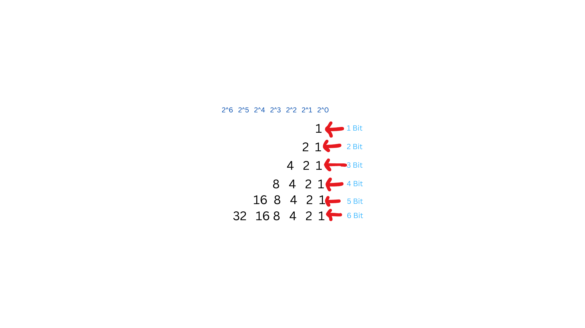

> ### Represenation of number in binary form

We just add the bit from right side, try to make it equal to number. then add 1 under the bit which we used.

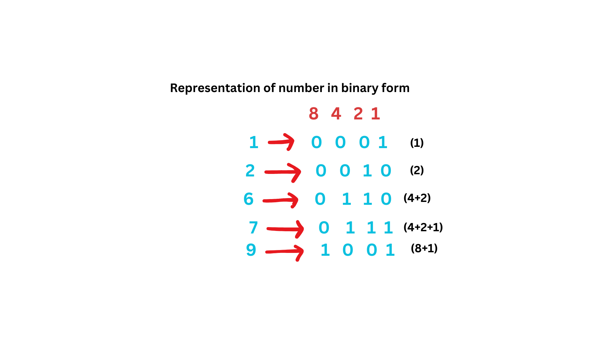


### Common Bitwise Operations:
1. **AND (`&`)**: Both bits must be 1 to return 1. (1 + 1 gives 1, but 0+1 or 1+0 gives 0)
   
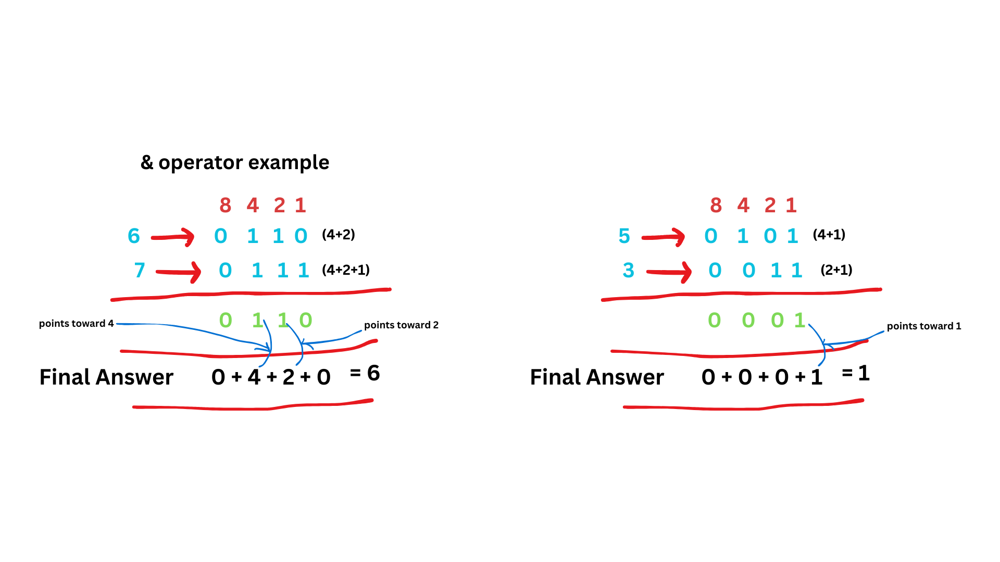
   
2. **OR (`|`)**: At least one bit must be 1 to return 1.

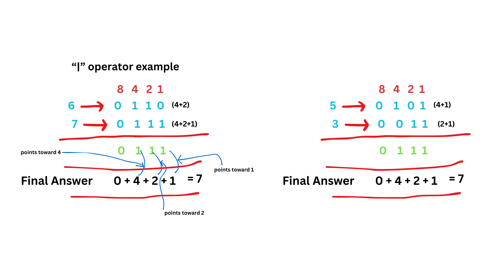

3. **XOR (`^`)**: Returns 1 only if the bits are different.\
   0 + 0 = 0\
   0 + 1 = 1\
   1 + 0 = 1\
   1 + 1 = 0

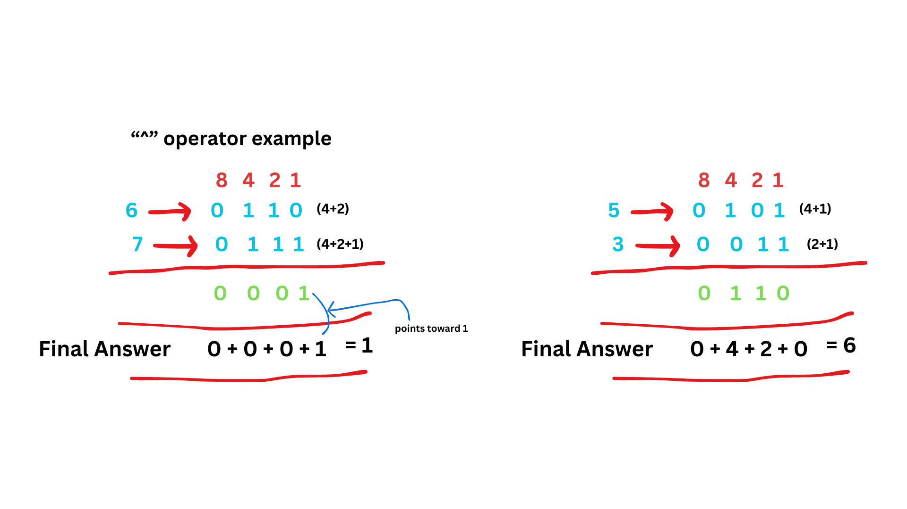


4. **NOT (`~`)**: Inverts the bits.
  

5. **Left Shift (`<<`)**: Shifts bits to the left, filling with 0s.
   
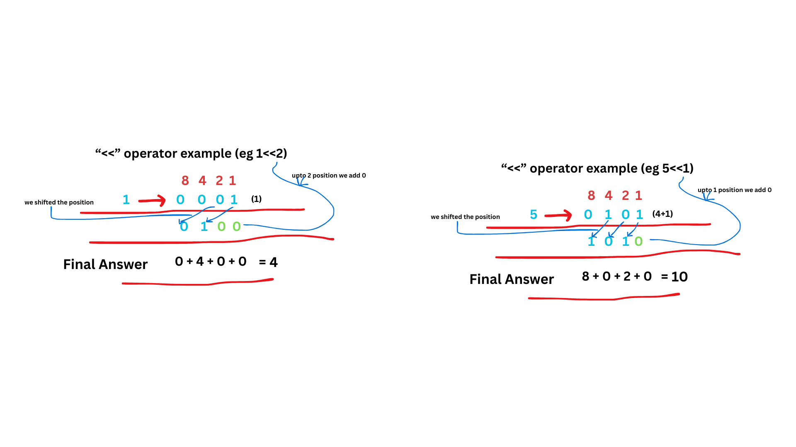


6. **Right Shift (`>>`)**: Shifts bits to the right.
   
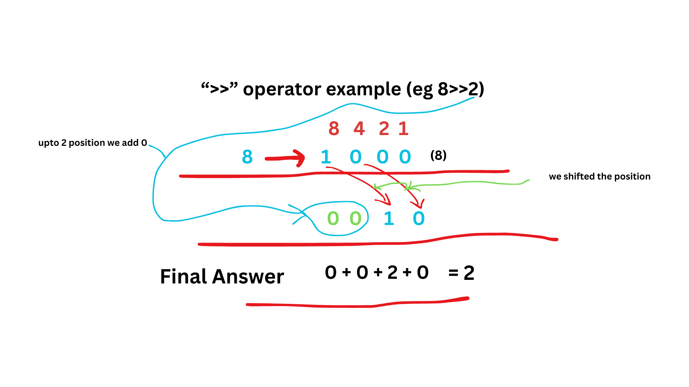


#### Bit Manipulation Techniques in JS:

1. **Check if a number is even or odd:**
   ```js
   const isEven = (n) => !(n & 1);
   ```

2. **Multiply or divide by powers of 2:**
   ```js
   const multiplyBy2 = (n) => n << 1;
   const divideBy2 = (n) => n >> 1;
   ```

3. **Set, clear, or toggle a bit:**
   ```js
   const setBit = (n, pos) => n | (1 << pos); // Set bit
   const clearBit = (n, pos) => n & ~(1 << pos); // Clear bit
   const toggleBit = (n, pos) => n ^ (1 << pos); // Toggle bit
   ```

4. **Check if a bit is set:**
   ```js
   const isBitSet = (n, pos) => (n & (1 << pos)) !== 0;
   ```

5. **Find the rightmost set bit:**
   ```js
   const rightmostSetBit = (n) => n & -n;
   ```

6. **Detect if two integers have opposite signs:**
   ```js
   const oppositeSign = (a, b) => (a ^ b) < 0;
   ```

7. **Invert all bits:**
   ```js
   const invertBits = (n) => ~n;
   ```

> ### Equal Row and Column Pairs

Example 1:

```
3 | 2 | 1
--|---|--
1 | 7 | 6
--|---|--
2 | 7 | 7
```

Input: grid = [[3,2,1],[1,7,6],[2,7,7]]\
Output: 1\
Explanation: There is 1 equal row and column pair:
- (Row 2, Column 1): [2,7,7]


Example 2:

```
3 | 1 | 2 | 2
--|---|---|--
1 | 4 | 4 | 5
--|---|---|--
2 | 4 | 2 | 2
--|---|---|--
2 | 4 | 2 | 2
```


Input: grid = [[3,1,2,2],[1,4,4,5],[2,4,2,2],[2,4,2,2]]\
Output: 3\
Explanation: There are 3 equal row and column pairs:
- (Row 0, Column 0): [3,1,2,2]
- (Row 2, Column 2): [2,4,2,2]
- (Row 3, Column 2): [2,4,2,2]

```js
function equalRowAndColumnPairs(matrix) {
    const n = matrix.length;
    const rowCount = new Map();

    // Store rows in a map
    for (const row of matrix) {
        debugger
        const key = row.join(",");
        rowCount.set(key, (rowCount.get(key) || 0) + 1);
    }

    let count = 0;

    // Check columns against rows
    for (let col = 0; col < n; col++) {
        let colKey = [];
        for (let row = 0; row < n; row++) {
            colKey.push(matrix[row][col]);
        }
        colKey = colKey.join(",");
        if (rowCount.has(colKey)) {
            count += rowCount.get(colKey);
        }
    }

    return count;
}

// Example usage:
const matrix = [[3,2,1],[1,7,6],[2,7,7]];
console.log(equalRowAndColumnPairs(matrix)); // Output: 1
```


> ### 14. Longest Common Prefix

Write a function to find the longest common prefix string amongst an array of strings.

If there is no common prefix, return an empty string "".

Example 1:

Input: strs = ["flower","flow","flight"]\
Output: "fl"

Example 2:

Input: strs = ["dog","racecar","car"]\
Output: ""\
Explanation: There is no common prefix among the input strings.

```js
function longestCommonPrefix(strs) {
    if (strs.length === 0) return ""; // If the array is empty
    if (strs.length === 1) return strs[0]; // If there's only one string

    // Start with the first string as the prefix
    let prefix = strs[0];

    for (let i = 1; i < strs.length; i++) {
       
        while (strs[i].indexOf(prefix) !== 0) {
           
            // Reduce the prefix by one character at a time
            prefix = prefix.slice(0, prefix.length - 1);
            if (prefix === "") return ""; // No common prefix
        }
    }

    return prefix;
}

// Example Usage
const strings = ["flower", "flow", "flight"];
console.log(longestCommonPrefix(strings)); // Output: "fl"
```

> ### 121. Best Time to Buy and Sell Stock

You are given an array prices where prices[i] is the price of a given stock on the ith day.

You want to maximize your profit by choosing a single day to buy one stock and choosing a different day in the future to sell that stock.

Return the maximum profit you can achieve from this transaction. If you cannot achieve any profit, return 0.

Example 1:

Input: prices = [7,1,5,3,6,4]\
Output: 5\
Explanation: Buy on day 2 (price = 1) and sell on day 5 (price = 6), profit = 6-1 = 5.\
Note that buying on day 2 and selling on day 1 is not allowed because you must buy before you sell.

Example 2:

Input: prices = [7,6,4,3,1]\
Output: 0\
Explanation: In this case, no transactions are done and the max profit = 0.

```js
var maxProfit = function(prices) {
    let maxProfit = 0;
    let cheapestPriceAtDay = prices[0];

    for(let idx = 1; idx < prices.length; idx++){
    
        let price = prices[idx];
        if (cheapestPriceAtDay > price) {
            cheapestPriceAtDay = price;
        } else {
            maxProfit = Math.max(maxProfit, price - cheapestPriceAtDay);
        }
    }

    return maxProfit;
};
maxProfit([7,1,5,3,6,4])
```


> ### 1029. Two City Scheduling

A company is planning to interview 2n people. Given the array costs where costs[i] = [aCosti, bCosti], the cost of flying the ith person to city a is aCosti, and the cost of flying the ith person to city b is bCosti.

Return the minimum cost to fly every person to a city such that exactly n people arrive in each city.

Example 1:

Input: costs = [[10,20],[30,200],[400,50],[30,20]]\
Output: 110\
Explanation:\ 
The first person goes to city A for a cost of 10.\
The second person goes to city A for a cost of 30.\
The third person goes to city B for a cost of 50.\
The fourth person goes to city B for a cost of 20.\

The total minimum cost is 10 + 30 + 50 + 20 = 110 to have half the people interviewing in each city.

Example 2:

Input: costs = [[259,770],[448,54],[926,667],[184,139],[840,118],[577,469]]\
Output: 1859

Example 3:

Input: costs = [[515,563],[451,713],[537,709],[343,819],[855,779],[457,60],[650,359],[631,42]]
Output: 3086

`video :` https://youtu.be/d-B_gk_gJtQ?si=9-KHhO0SYdM62wBe&t=304


```js
function twoCitySchedCost(costs) {
    // Sort the costs by the difference between city A and city B
    costs.sort((a, b) => (a[0] - a[1]) - (b[0] - b[1]));

    let totalCost = 0;
    const n = costs.length / 2;

    // Send the first n people to city A
    for (let i = 0; i < n; i++) {
        totalCost += costs[i][0];
    }

    // Send the next n people to city B
    for (let i = n; i < 2 * n; i++) {
        totalCost += costs[i][1];
    }

    return totalCost;
}

// Example usage
const costs1 = [[10,20],[30,200],[400,50],[30,20]];
console.log(twoCitySchedCost(costs1)); // Output: 110

const costs2 = [[259,770],[448,54],[926,667],[184,139],[840,118],[577,469]];
console.log(twoCitySchedCost(costs2)); // Output: 1859

const costs3 = [[515,563],[451,713],[537,709],[343,819],[855,779],[457,60],[650,359],[631,42]];
console.log(twoCitySchedCost(costs3)); // Output: 3086
```


> ### 2016. Maximum Difference Between Increasing Elements
Given a 0-indexed integer array nums of size n, find the maximum difference between nums[i] and nums[j] (i.e., nums[j] - nums[i]), such that 0 <= i < j < n and nums[i] < nums[j].

Return the maximum difference. If no such i and j exists, return -1.

Example 1:

Input: nums = [7,1,5,4]\
Output: 4\
Explanation:\
The maximum difference occurs with i = 1 and j = 2, nums[j] - nums[i] = 5 - 1 = 4.\
Note that with i = 1 and j = 0, the difference nums[j] - nums[i] = 7 - 1 = 6, but i > j, so it is not valid.

Example 2:

Input: nums = [9,4,3,2]\
Output: -1\
Explanation:\
There is no i and j such that i < j and nums[i] < nums[j].

Example 3:

Input: nums = [1,5,2,10]\
Output: 9\
Explanation:\
The maximum difference occurs with i = 0 and j = 3, nums[j] - nums[i] = 10 - 1 = 9.

Note - Basically iterate karenge, point pe min number compare kr k store karenge aur usi min se differnece nikal k store karenge


```js
function maximumDifference(nums) {
    let minSoFar = nums[0]; // Initialize with the first element
    let maxDifference = -1; // Initialize the maximum difference as -1

    for (let j = 1; j < nums.length; j++) {
        if (nums[j] > minSoFar) {
            maxDifference = Math.max(maxDifference, nums[j] - minSoFar);
        } else {
            minSoFar = nums[j]; // Update the minimum so far
        }
    }

    return maxDifference;
}

// Example 1:
console.log(maximumDifference([7, 1, 5, 4])); // Output: 4

// Example 2:
console.log(maximumDifference([9, 4, 3, 2])); // Output: -1
```


> ### 136. Single Number
Given a non-empty array of integers nums, every element appears twice except for one. Find that single one.

You must implement a solution with a `linear runtime complexity and use only constant extra space.`

Example 1:

Input: nums = [2,2,1]\
Output: 1

Example 2:

Input: nums = [4,1,2,1,2]\
Output: 4

Example 3:

Input: nums = [1]\
Output: 1

```js
function singleNumber(nums) {
    let result = 0;
    for (let num of nums) {
        result ^= num; // XOR operation
    }
    return result;
}
```

> ### 278. First Bad Version

You are a product manager and currently leading a team to develop a new product. Unfortunately, the latest version of your product fails the quality check. Since each version is developed based on the previous version, all the versions after a bad version are also bad.

Suppose you have n versions [1, 2, ..., n] and you want to find out the first bad one, which causes all the following ones to be bad.

You are given an API bool isBadVersion(version) which returns whether version is bad. Implement a function to find the first bad version. You should minimize the number of calls to the API.

 

Example 1:

Input: n = 5, bad = 4\
Output: 4\
Explanation:\
call isBadVersion(3) -> false\
call isBadVersion(5) -> true\
call isBadVersion(4) -> true\
Then 4 is the first bad version.

Example 2:

Input: n = 1, bad = 1\
Output: 1

```js
/**
 * Definition for isBadVersion()
 * 
 * @param {integer} version - The version number
 * @return {boolean} - Returns whether the version is bad
 * isBadVersion = function(version) {
 *     // API implementation
 * };
 */

/**
 * @param {function} isBadVersion()
 * @return {function}
 */
var solution = function(isBadVersion) {
    /**
     * @param {integer} n - Total number of versions
     * @return {integer} - The first bad version
     */
    return function(n) {
        let left = 1;
        let right = n;

        while (left < right) {
            const mid = Math.floor(left + (right - left) / 2);
            if (isBadVersion(mid)) {
                right = mid; // Continue searching in the left half
            } else {
                left = mid + 1; // Continue searching in the right half
            }
        }

        // At the end of the loop, left and right will converge to the first bad version
        return left;
    };
};

```


> ### 867. Transpose Matrix
Given a 2D integer array matrix, return the transpose of matrix.

The transpose of a matrix is the matrix flipped over its main diagonal, switching the matrix's row and column indices.

Example 1:

Input: matrix = [[1,2,3],[4,5,6],[7,8,9]]\
Output: [[1,4,7],[2,5,8],[3,6,9]]

Example 2:

Input: matrix = [[1,2,3],[4,5,6]]\
Output: [[1,4],[2,5],[3,6]]

```js
function transpose(matrix) {
    let rows = matrix.length;
    let cols = matrix[0].length;
    let result = Array.from({ length: cols }, () => Array(rows).fill(0));

    for (let i = 0; i < rows; i++) {
        for (let j = 0; j < cols; j++) {
            result[j][i] = matrix[i][j];
        }
    }
    return result;
}
```

> ### 1827. Minimum Operations to Make the Array Increasing
You are given an integer array nums (0-indexed). In one operation, you can choose an element of the array and increment it by 1.

For example, if nums = [1,2,3], you can choose to increment nums[1] to make nums = [1,3,3].\
Return the minimum number of operations needed to make nums strictly increasing.

An array nums is strictly increasing if nums[i] < nums[i+1] for all 0 <= i < nums.length - 1. An array of length 1 is trivially strictly increasing.

Example 1:

Input: nums = [1,1,1]
Output: 3\
Explanation: You can do the following operations:\
1) Increment nums[2], so nums becomes [1,1,2].\
2) Increment nums[1], so nums becomes [1,2,2].\
3) Increment nums[2], so nums becomes [1,2,3].

Example 2:

Input: nums = [1,5,2,4,1]\
Output: 14\
Example 3:

Input: nums = [8]\
Output: 0

`video: `https://youtu.be/ttznU-BTqTk

```js
function minOperations(nums) {
    let operations = 0;

    for (let i = 1; i < nums.length; i++) {
        if (nums[i] <= nums[i - 1]) {
            // Calculate how many increments are needed to make nums[i] > nums[i - 1]
            let increment = nums[i - 1] - nums[i] + 1;
            operations += increment;
            nums[i] += increment; // Update nums[i] to maintain the strictly increasing condition
        }
    }

    return operations;
}
```

> ### 453. Minimum Moves to Equal Array Elements
Given an integer array nums of size n, return the minimum number of moves required to make all array elements equal.

In one move, you can increment n - 1 elements of the array by 1.

Example 1:

Input: nums = [1,2,3]\
Output: 3\
Explanation: Only three moves are needed (remember each move increments two elements):\
[1,2,3]  =>  [2,3,3]  =>  [3,4,3]  =>  [4,4,4]

Example 2:

Input: nums = [1,1,1]\
Output: 0

To solve this problem, we can approach it mathematically. `Instead of incrementing \( n - 1 \) elements in each move, we can think of this as decrementing one element (effectively shifting the perspective)`. This approach simplifies the problem to finding the total difference between all elements and the smallest element.

### Algorithm:
1. Find the smallest element in the array (`min`).
2. Calculate the difference between each element and this minimum.
3. The total difference is the minimum number of moves required.

Here’s the implementation in JavaScript:

```javascript
/**
 * @param {number[]} nums
 * @return {number}
 */
var minMoves = function(nums) {
    const min = Math.min(...nums);
    let moves = 0;

    for (const num of nums) {
        moves += num - min;
    }

    return moves;
};

// Example 1
console.log(minMoves([1, 2, 3])); // Output: 3

// Example 2
console.log(minMoves([1, 1, 1])); // Output: 0
```

### Explanation:
- In the example `[1, 2, 3]`, the smallest element is `1`. 
- The total moves are `(2 - 1) + (3 - 1) = 1 + 2 = 3`. 
- The array becomes `[4, 4, 4]` after 3 moves.


> ### 202. Happy Number
Write an algorithm to determine if a number n is happy.

A happy number is a number defined by the following process:

Starting with any positive integer, replace the number by the sum of the squares of its digits.\
Repeat the process until the number equals 1 (where it will stay), or it loops endlessly in a cycle which does not include 1.\
Those numbers for which this process ends in 1 are happy.\
Return true if n is a happy number, and false if not.

Example 1:

Input: n = 19\
Output: true\
Explanation:\
12 + 92 = 82\
82 + 22 = 68\
62 + 82 = 100\
12 + 02 + 02 = 1

Example 2:

Input: n = 2\
Output: false

```js

function sumDigitSquare(n) {
  	n = n+ ''
    let sum = 0;
    for(let unit of n){
      sum = sum + (unit * unit)
    }

    return sum;
}

function isHappy(n) {
    let s = [];
    s.push(n);

    while (true) {
        if (n == 1) return true;
        n = sumDigitSquare(n)

        if (s.includes(n)) return false
        s.push(n)
    }
    return false;
}
isHappy(2)
isHappy(19)
```


> ### 1005. Maximize Sum Of Array After K Negations
Given an integer array nums and an integer k, modify the array in the following way:

choose an index i and replace nums[i] with -nums[i].\
You should apply this process exactly k times. You may choose the same index i multiple times.

Return the largest possible sum of the array after modifying it in this way.

Example 1:

Input: nums = [4,2,3], k = 1\
Output: 5\
Explanation: Choose index 1 and nums becomes [4,-2,3].

Example 2:

Input: nums = [3,-1,0,2], k = 3\
Output: 6\
Explanation: Choose indices (1, 2, 2) and nums becomes [3,1,0,2].

Example 3:

Input: nums = [2,-3,-1,5,-4], k = 2\
Output: 13\
Explanation: Choose indices (1, 4) and nums becomes [2,3,-1,5,4].


`video:` https://www.youtube.com/watch?v=8GDHYgbxTN4

```js
function largestSumAfterKNegations(nums, k) {
    // Sort the array based on the absolute values in descending order
    nums.sort((a, b) => Math.abs(b) - Math.abs(a));
    
    // Iterate through the array and apply negations
    for (let i = 0; i < nums.length && k > 0; i++) {
        if (nums[i] < 0) {
            nums[i] = -nums[i];
            k--;
        }
    }

    // If k is still greater than 0 and it's odd, flip the smallest value
    if (k % 2 === 1) {
        nums[nums.length - 1] = -nums[nums.length - 1];
    }

    // Return the sum of the modified array
    return nums.reduce((sum, num) => sum + num, 0);
}

// Example 1
console.log(largestSumAfterKNegations([4, 2, 3], 1)); // Output: 5

// Example 2
console.log(largestSumAfterKNegations([3, -1, 0, 2], 3)); // Output: 6
```


> ### 122. Best Time to Buy and Sell Stock II
You are given an integer array prices where prices[i] is the price of a given stock on the ith day.

On each day, you may decide to buy and/or sell the stock. You can only hold at most one share of the stock at any time. However, you can buy it then immediately sell it on the same day.

Find and return the maximum profit you can achieve.

Example 1:

Input: prices = [7,1,5,3,6,4]\
Output: 7\
Explanation: Buy on day 2 (price = 1) and sell on day 3 (price = 5), profit = 5-1 = 4.\
Then buy on day 4 (price = 3) and sell on day 5 (price = 6), profit = 6-3 = 3.\
Total profit is 4 + 3 = 7.

Example 2:

Input: prices = [1,2,3,4,5]\
Output: 4\
Explanation: Buy on day 1 (price = 1) and sell on day 5 (price = 5), profit = 5-1 = 4.\
Total profit is 4.

Example 3:

Input: prices = [7,6,4,3,1]\
Output: 0\
Explanation: There is no way to make a positive profit, so we never buy the stock to achieve the maximum profit of 0.

`video:` https://www.youtube.com/watch?v=Q7v239y-Tik


```js
/**
 * @param {number[]} prices
 * @return {number}
 */
var maxProfit = function(prices) {
    let profit = 0;
    
    for (let i = 1; i < prices.length; i++) {
        // If today's price is greater than yesterday's, we make a profit by selling today
        if (prices[i] > prices[i - 1]) {
            profit += prices[i] - prices[i - 1];
        }
    }
    
    return profit;
};

// Example usage:
const prices = [7, 1, 5, 3, 6, 4];
console.log(maxProfit(prices)); // Output: 7
```


> ### 1700. Number of Students Unable to Eat Lunch

The school cafeteria offers circular and square sandwiches at lunch break, referred to by numbers 0 and 1 respectively. All students stand in a queue. Each student either prefers square or circular sandwiches.

The number of sandwiches in the cafeteria is equal to the number of students. The sandwiches are placed in a stack. At each step:

If the student at the front of the queue prefers the sandwich on the top of the stack, they will take it and leave the queue.\
Otherwise, they will leave it and go to the queue's end.\
This continues until none of the queue students want to take the top sandwich and are thus unable to eat.\

You are given two integer arrays students and sandwiches where sandwiches[i] is the type of the i​​​​​​th sandwich in the stack (i = 0 is the top of\ the stack) and students[j] is the preference of the j​​​​​​th student in the initial queue (j = 0 is the front of the queue). Return the number of\ students that are unable to eat.

Example 1:

Input: students = [1,1,0,0], sandwiches = [0,1,0,1]\
Output: 0 \
Explanation:\
- Front student leaves the top sandwich and returns to the end of the line making students = [1,0,0,1].\
- Front student leaves the top sandwich and returns to the end of the line making students = [0,0,1,1].\
- Front student takes the top sandwich and leaves the line making students = [0,1,1] and sandwiches = [1,0,1].\
- Front student leaves the top sandwich and returns to the end of the line making students = [1,1,0].\
- Front student takes the top sandwich and leaves the line making students = [1,0] and sandwiches = [0,1].\
- Front student leaves the top sandwich and returns to the end of the line making students = [0,1].\
- Front student takes the top sandwich and leaves the line making students = [1] and sandwiches = [1].\
- Front student takes the top sandwich and leaves the line making students = [] and sandwiches = [].\
Hence all students are able to eat.

Example 2:

Input: students = [1,1,1,0,0,1], sandwiches = [1,0,0,0,1,1]\
Output: 3

```js
function countStudents(students, sandwiches) {
    let studentQueue = students;
    let sandwichStack = sandwiches;
    let count = 0;

    while (studentQueue.length > 0) {
        if (studentQueue[0] === sandwichStack[0]) {
            // If the student at the front of the queue wants the top sandwich
            studentQueue.shift();
            sandwichStack.shift();
            count = 0; // Reset the count as a match happened
        } else {
            // Move the student to the end of the queue
            studentQueue.push(studentQueue.shift());
            count++;
            // If all students in the queue refuse the current sandwich
            if (count === studentQueue.length) {
                return count;
            }
        }
    }

    return 0; // All students were able to eat
}
```


> ### 1710. Maximum Units on a Truck

You are assigned to put some amount of boxes onto one truck. You are given a 2D array boxTypes, where boxTypes[i] = [numberOfBoxesi, numberOfUnitsPerBoxi]:

numberOfBoxesi is the number of boxes of type i.\
numberOfUnitsPerBoxi is the number of units in each box of the type i.\
You are also given an integer truckSize, which is the maximum number of boxes that can be put on the truck. You can choose any boxes to put on the truck as long as the number of boxes does not exceed truckSize.

Return the maximum total number of units that can be put on the truck.

Example 1:

Input: boxTypes = [[1,3],[2,2],[3,1]], truckSize = 4\
Output: 8\
Explanation: There are:\
- 1 box of the first type that contains 3 units.\
- 2 boxes of the second type that contain 2 units each.\
- 3 boxes of the third type that contain 1 unit each.\
You can take all the boxes of the first and second types, and one box of the third type.\
The total number of units will be = (1 * 3) + (2 * 2) + (1 * 1) = 8.

Example 2:

Input: boxTypes = [[5,10],[2,5],[4,7],[3,9]], truckSize = 10\
Output: 91

```js
/**
 * @param {number[][]} boxTypes
 * @param {number} truckSize
 * @return {number}
 */
var maximumUnits = function(boxTypes, truckSize) {
    // Sort boxTypes in descending order based on the number of units per box
    boxTypes.sort((a, b) => b[1] - a[1]);

    let maxUnits = 0;

    for (let i = 0; i < boxTypes.length; i++) {
        let [numBoxes, unitsPerBox] = boxTypes[i];

        if (truckSize >= numBoxes) {
            // Take all boxes of this type
            maxUnits += numBoxes * unitsPerBox;
            truckSize -= numBoxes;
        } else {
            // Take only the number of boxes that can fit
            maxUnits += truckSize * unitsPerBox;
            break; // Truck is full
        }
    }

    return maxUnits;
};

// Example usage:
console.log(maximumUnits([[1,3],[2,2],[3,1]], 4)); // Output: 8
console.log(maximumUnits([[5,10],[2,5],[4,7],[3,9]], 10)); // Output: 91
```

> ### 2027. Minimum Moves to Convert String
You are given a string s consisting of n characters which are either 'X' or 'O'.

A move is defined as selecting three consecutive characters of s and converting them to 'O'. Note that if a move is applied to the character 'O', it will stay the same.

Return the minimum number of moves required so that all the characters of s are converted to 'O'.

Example 1:

Input: s = "XXX"\
Output: 1\
Explanation: XXX -> OOO\
We select all the 3 characters and convert them in one move.

Example 2:

Input: s = "XXOX"\
Output: 2\
Explanation: XXOX -> OOOX -> OOOO\
We select the first 3 characters in the first move, and convert them to 'O'.\
Then we select the last 3 characters and convert them so that the final string contains all 'O's.

Example 3:

Input: s = "OOOO"\
Output: 0\
Explanation: There are no 'X's in s to convert.

```js
function minimumMoves(s) {
    let moves = 0; // To count the minimum number of moves
    let i = 0;    // Pointer to iterate through the string

    while (i < s.length) {
        if (s[i] === 'X') {
            // If we encounter 'X', apply a move to convert 3 characters starting from this index to 'O'
            moves++;
            i += 3; // Skip the next two characters since they are covered by this move
        } else {
            // If the character is 'O', just move to the next character
            i++;
        }
    }

    return moves;
}

// Example usage:
console.log(minimumMoves("XXX")); // Output: 1
console.log(minimumMoves("XXOX")); // Output: 2
console.log(minimumMoves("OXOXOX")); // Output: 2
```


> ### 1403. Minimum Subsequence in Non-Increasing Order

Given the array nums, obtain a subsequence of the array whose sum of elements is strictly greater than the sum of the non included elements in such subsequence. 

If there are multiple solutions, return the subsequence with minimum size and if there still exist multiple solutions, return the subsequence with the maximum total sum of all its elements. A subsequence of an array can be obtained by erasing some (possibly zero) elements from the array. 

Note that the solution with the given constraints is guaranteed to be unique. Also return the answer sorted in non-increasing order.

Example 1:

Input: nums = [4,3,10,9,8]\
Output: [10,9]\
Explanation: The subsequences [10,9] and [10,8] are minimal such that the sum of their elements is strictly greater than the sum of elements not included. However, the subsequence [10,9] has the maximum total sum of its elements. 

Example 2:

Input: nums = [4,4,7,6,7]\
Output: [7,7,6]\
Explanation: The subsequence [7,7] has the sum of its elements equal to 14 which is not strictly greater than the sum of elements not included (14 = 4 + 4 + 6). Therefore, the subsequence [7,6,7] is the minimal satisfying the conditions. Note the subsequence has to be returned in non-increasing order.  
 
```js
var minSubsequence = function(nums) {
    // Sort the array in descending order
    nums.sort((a, b) => b - a);

    const totalSum = nums.reduce((acc, num) => acc + num, 0);
    let subsequenceSum = 0;
    let subsequence = [];

    // Iterate through the sorted array
    for (let i = 0; i < nums.length; i++) {
        subsequenceSum += nums[i];
        subsequence.push(nums[i]);

        // Stop once the subsequence sum is greater than the remaining sum
        if (subsequenceSum > totalSum - subsequenceSum) {
            break;
        }
    }

    return subsequence;
};
```


> ### 1436. Destination City
You are given the array paths, where paths[i] = [cityAi, cityBi] means there exists a direct path going from cityAi to cityBi. Return the destination city, that is, `the city without any path outgoing to another city`.

It is guaranteed that the graph of paths forms a line without any loop, therefore, there will be exactly one destination city.

Example 1:

Input: paths = [["London","New York"],["New York","Lima"],["Lima","Sao Paulo"]]\
Output: "Sao Paulo" \
Explanation: Starting at "London" city you will reach "Sao Paulo" city which is the destination city. Your trip consist of: "London" -> "New York" -> "Lima" -> "Sao Paulo".

Example 2:

Input: paths = [["B","C"],["D","B"],["C","A"]]\
Output: "A"\
Explanation: All possible trips are:\
"D" -> "B" -> "C" -> "A".\
"B" -> "C" -> "A".\
"C" -> "A".\
"A".\
Clearly the destination city is "A".

Example 3:

Input: paths = [["A","Z"]]\
Output: "Z"

```js
/**
 * @param {string[][]} paths
 * @return {string}
 */
var destCity = function(paths) {
    const startCities = new Set();

    // Collect all starting cities
    for (const [start, end] of paths) {
        startCities.add(start);
    }

    // Find the destination city
    for (const [start, end] of paths) {
        if (!startCities.has(end)) {
            return end; // This city is not a starting city, so it's the destination
        }
    }

    return ""; // Default return, though it won't reach here due to the problem guarantee
};

// Example 1
console.log(destCity([["London","New York"],["New York","Lima"],["Lima","Sao Paulo"]])); 
// Output: "Sao Paulo"

// Example 2
console.log(destCity([["B","C"],["D","B"],["C","A"]])); 
// Output: "A"

// Example 3
console.log(destCity([["A","Z"]])); 
// Output: "Z"
```

> ### 532. K-diff Pairs in an Array
Given an array of integers nums and an integer k, return the number of unique k-diff pairs in the array.

A k-diff pair is an integer pair (nums[i], nums[j]), where the following are true:

0 <= i, j < nums.length\
i != j\
|nums[i] - nums[j]| == k\
Notice that |val| denotes the absolute value of val.

Example 1:

Input: nums = [3,1,4,1,5], k = 2\
Output: 2\
Explanation: There are two 2-diff pairs in the array, (1, 3) and (3, 5).\
Although we have two 1s in the input, we should only return the number of unique pairs.

Example 2:

Input: nums = [1,2,3,4,5], k = 1\
Output: 4\
Explanation: There are four 1-diff pairs in the array, (1, 2), (2, 3), (3, 4) and (4, 5).

Example 3:

Input: nums = [1,3,1,5,4], k = 0\
Output: 1\
Explanation: There is one 0-diff pair in the array, (1, 1).

```js
/**
 * @param {number[]} nums
 * @param {number} k
 * @return {number}
 */
var findPairs = function(nums, k) {
    if (k < 0) return 0; // Difference cannot be negative
    
    const map = new Map();
    let count = 0;

    // Count occurrences of each number
    for (const num of nums) {
        map.set(num, (map.get(num) || 0) + 1);
    }

    // Find k-diff pairs
    for (const [num, freq] of map.entries()) {
        if (k === 0) {
            // For k = 0, count numbers with frequency > 1
            if (freq > 1) count++;
        } else {
            // For k > 0, check if (num + k) exists
            if (map.has(num + k)) count++;
        }
    }

    return count;
};

// Example 1
console.log(findPairs([3,1,4,1,5], 2)); 
// Output: 2

// Example 2
console.log(findPairs([1,2,3,4,5], 1)); 
// Output: 4

// Example 3
console.log(findPairs([1,3,1,5,4], 0)); 
// Output: 1
```


> ### 1716. Calculate Money in Leetcode Bank
Hercy wants to save money for his first car. He puts money in the Leetcode bank every day.

He starts by putting in $1 on Monday, the first day. Every day from Tuesday to Sunday, he will put in $1 more than the day before. On every subsequent Monday, he will put in $1 more than the previous Monday.

Given n, return the total amount of money he will have in the Leetcode bank at the end of the nth day.

Example 1:

Input: n = 4\
Output: 10\
Explanation: After the 4th day, the total is 1 + 2 + 3 + 4 = 10.

Example 2:

Input: n = 10\
Output: 37\
Explanation: After the 10th day, the total is (1 + 2 + 3 + 4 + 5 + 6 + 7) + (2 + 3 + 4) = 37. Notice that on the 2nd Monday, Hercy only puts in $2.

Example 3:

Input: n = 20\
Output: 96\
Explanation: After the 20th day, the total is (1 + 2 + 3 + 4 + 5 + 6 + 7) + (2 + 3 + 4 + 5 + 6 + 7 + 8) + (3 + 4 + 5 + 6 + 7 + 8) = 96.

```js
/**
 * @param {number} n
 * @return {number}
 */
var totalMoney = function(n) {
    let total = 0;
    let weekStart = 1; // Money deposited on the first day of the week

    for (let i = 1; i <= n; i++) {
        total += weekStart + ((i - 1) % 7); // Add the daily deposit
        if (i % 7 === 0) {
            weekStart++; // Increment the weekly starting value after every 7 days
        }
    }

    return total;
};

// Example 1
console.log(totalMoney(4)); 
// Output: 10

// Example 2
console.log(totalMoney(10)); 
// Output: 37

// Example 3
console.log(totalMoney(20)); 
// Output: 96
```


> ### 985. Sum of Even Numbers After Queries
You are given an integer array nums and an array queries where queries[i] = [vali, indexi].\
For each query i, first, apply nums[indexi] = nums[indexi] + vali, then print the sum of the even values of nums.\
Return an integer array answer where answer[i] is the answer to the ith query.

Example 1:

Input: nums = [1,2,3,4], queries = [[1,0],[-3,1],[-4,0],[2,3]]\
Output: [8,6,2,4]\
Explanation: At the beginning, the array is [1,2,3,4].\
After adding 1 to nums[0], the array is [2,2,3,4], and the sum of even values is 2 + 2 + 4 = 8.\
After adding -3 to nums[1], the array is [2,-1,3,4], and the sum of even values is 2 + 4 = 6.\
After adding -4 to nums[0], the array is [-2,-1,3,4], and the sum of even values is -2 + 4 = 2.\
After adding 2 to nums[3], the array is [-2,-1,3,6], and the sum of even values is -2 + 6 = 4.

Example 2:

Input: nums = [1], queries = [[4,0]]\
Output: [0]

`video:`https://www.youtube.com/watch?v=2bjRM_6hDsI

```js
function sumEvenAfterQueries(nums, queries) {
    let evenSum = nums.reduce((sum, num) => (num % 2 === 0 ? sum + num : sum), 0);
    const result = [];

    for (const [val, index] of queries) {
        // If the current number at index is even, subtract it from the even sum
        if (nums[index] % 2 === 0) {
            evenSum -= nums[index];
        }

        // Apply the update
        nums[index] += val;

        // If the new number at index is even, add it to the even sum
        if (nums[index] % 2 === 0) {
            evenSum += nums[index];
        }

        // Append the current even sum to the result
        result.push(evenSum);
    }

    return result;
}

// Example 1
const nums1 = [1, 2, 3, 4];
const queries1 = [[1, 0], [-3, 1], [-4, 0], [2, 3]];
console.log(sumEvenAfterQueries(nums1, queries1)); // Output: [8, 6, 2, 4]

// Example 2
const nums2 = [1];
const queries2 = [[4, 0]];
console.log(sumEvenAfterQueries(nums2, queries2)); // Output: [0]
```


> ### 976. Largest Perimeter Triangle
Given an integer array nums, return the largest perimeter of a triangle with a `non-zero area`, formed from three of these lengths. If it is impossible to form any triangle of a non-zero area, return 0.

Example 1:

Input: nums = [2,1,2]\
Output: 5\
Explanation: You can form a triangle with three side lengths: 1, 2, and 2.

Example 2:

Input: nums = [1,2,1,10]\
Output: 0\
Explanation:\ 
You cannot use the side lengths 1, 1, and 2 to form a triangle.\
You cannot use the side lengths 1, 1, and 10 to form a triangle.\
You cannot use the side lengths 1, 2, and 10 to form a triangle.\
As we cannot use any three side lengths to form a triangle of non-zero area, we return 0.

`video:` https://youtu.be/1dmbC4I7yZE

```js
function largestPerimeter(nums) {
    // Sort the array in descending order
    nums.sort((a, b) => b - a);

    // Check triples for the triangle inequality
    for (let i = 0; i < nums.length - 2; i++) {
        if (nums[i] < nums[i + 1] + nums[i + 2]) {
            // Valid triangle found
            return nums[i] + nums[i + 1] + nums[i + 2];
        }
    }

    // No valid triangle can be formed
    return 0;
}

// Example 1
const nums1 = [2, 1, 2];
console.log(largestPerimeter(nums1)); // Output: 5

// Example 2
const nums2 = [1, 2, 1, 10];
console.log(largestPerimeter(nums2)); // Output: 0
```

> ### 914. X of a Kind in a Deck of Cards
You are given an integer array deck where deck[i] represents the number written on the ith card.

Partition the cards into one or more groups such that:

Each group has exactly x cards where x > 1, and\
All the cards in one group have the same integer written on them.\
Return true if such partition is possible, or false otherwise.

Example 1:

Input: deck = [1,2,3,4,4,3,2,1]\
Output: true\
Explanation: Possible partition [1,1],[2,2],[3,3],[4,4].

Example 2:

Input: deck = [1,1,1,2,2,2,3,3]\
Output: false\
Explanation: No possible partition.

`video:` https://youtu.be/UvpXInRkZ3Q?si=gsImTBuuojY_hXAY

```js
function hasGroupsSizeX(deck) {
    // Step 1: Count the frequencies of each number
    const count = {};
    for (const num of deck) {
        count[num] = (count[num] || 0) + 1;
    }

    // Step 2: Find the GCD of the frequencies
    const gcd = (a, b) => (b === 0 ? a : gcd(b, a % b));
    let groupSize = Object.values(count).reduce((a, b) => gcd(a, b));

    // Step 3: Check if the GCD is greater than 1
    return groupSize > 1;
}

// Example Usage
console.log(hasGroupsSizeX([1, 2, 3, 4, 4, 3, 2, 1])); // Output: true
console.log(hasGroupsSizeX([1, 1, 1, 2, 2, 2, 3, 3])); // Output: false
```


> ### 941. Valid Mountain Array

Given an array of integers arr, return true if and only if it is a valid mountain array.


Example 1:

Input: arr = [2,1]\
Output: false

Example 2:

Input: arr = [3,5,5]\
Output: false

Example 3:

Input: arr = [0,3,2,1]\
Output: true


```js
var validMountainArray = function (arr) {
  const n = arr.length;

  let pivot = false;

  for (let i = 1; i < arr.length - 1; i++) {
    const curr = arr[i];
    const prev = arr[i - 1];
    const next = arr[i + 1];

    if (curr > prev && curr > next) {
      pivot = true;
    } else if (prev >= curr && next >= curr) {
      return false;
    }
  }

  return pivot;
};
```

<br>

> ### 69. Sqrt(x)

Given a non-negative integer x, return the square root of x rounded down to the nearest integer. The returned integer should be non-negative as well.

You must not use any built-in exponent function or operator.

For example, do not use pow(x, 0.5) in c++ or x ** 0.5 in python.
 

Example 1:

Input: x = 4\
Output: 2\
Explanation: The square root of 4 is 2, so we return 2.

Example 2:

Input: x = 8\
Output: 2\
Explanation: The square root of 8 is 2.82842..., and since we round it down to the nearest integer, 2 is returned.


<details>

```js
var mySqrt = function(x) {
    if (x === 0) return 0; // Edge case for 0

    let left = 1, right = x;

    while (left <= right) {
        let mid = Math.floor((left + right) / 2);
        let squared = mid * mid;

        if (squared === x) {
            return mid;
        } else if (squared < x) {
            left = mid + 1;
        } else {
            right = mid - 1;
        }
    }

    return right; // Return the largest integer less than or equal to sqrt(x)
};
```
</details>


> ### 1221. Split a String in Balanced Strings

Balanced strings are those that have an equal quantity of 'L' and 'R' characters.

Given a balanced string s, split it into some number of substrings such that:

Each substring is balanced. Return the maximum number of balanced strings you can obtain.

Example 1:

Input: s = "RLRRLLRLRL"\
Output: 4\
Explanation: s can be split into "RL", "RRLL", "RL", "RL", each substring contains same number of 'L' and 'R'.

Example 2:

Input: s = "RLRRRLLRLL"\
Output: 2\
Explanation: s can be split into "RL", "RRRLLRLL", each substring contains same number of 'L' and 'R'.\
Note that s cannot be split into "RL", "RR", "RL", "LR", "LL", because the 2nd and 5th substrings are not balanced.

Example 3:

Input: s = "LLLLRRRR"\
Output: 1\
Explanation: s can be split into "LLLLRRRR".

<details>

#### **Approach: Greedy with Balance Tracking**
1. **Initialize two variables:**
   - `balance = 0` → This tracks the difference between the count of 'R' and 'L'.
   - `count = 0` → This keeps track of how many balanced substrings we have found.

2. **Iterate through the string `s` character by character:**
   - If the character is `'R'`, increase `balance` by `1` (`balance += 1`).
   - If the character is `'L'`, decrease `balance` by `1` (`balance -= 1`).

3. **Whenever `balance === 0`, we have a balanced substring:**
   - Increase `count` by `1` because we just found a valid split.
   - Continue processing the remaining part of the string.

4. **Return `count` at the end.**

### **Example Walkthrough**
#### **Example 1:**
```plaintext
Input: "RLRRLLRLRL"
```
We process the string character by character:

| Step | Char | Balance (`R = +1`, `L = -1`) | Balanced Substring Found? |
|------|------|-----------------------------|----------------------------|
| 1    | R    | 1                           | No                         |
| 2    | L    | 0                           | ✅ Yes → `count = 1`       |
| 3    | R    | 1                           | No                         |
| 4    | R    | 2                           | No                         |
| 5    | L    | 1                           | No                         |
| 6    | L    | 0                           | ✅ Yes → `count = 2`       |
| 7    | R    | 1                           | No                         |
| 8    | L    | 0                           | ✅ Yes → `count = 3`       |
| 9    | R    | 1                           | No                         |
| 10   | L    | 0                           | ✅ Yes → `count = 4`       |

**Final Output:** `4`

### **Code Implementation**
```javascript
var balancedStringSplit = function(s) {
    let balance = 0, count = 0;

    for (let char of s) {
        balance += (char === 'R' ? 1 : -1);
        if (balance === 0) count++; // Found a balanced substring
    }

    return count;
};

// Example test cases
console.log(balancedStringSplit("RLRRLLRLRL")); // Output: 4
console.log(balancedStringSplit("RLRRRLLRLL")); // Output: 2
console.log(balancedStringSplit("LLLLRRRR"));   // Output: 1
console.log(balancedStringSplit("LRLR"));       // Output: 2
```
</details>


> ### 821. Shortest Distance to a Character

Given a string s and a character c that occurs in s, return an array of integers answer where answer.length == s.length and answer[i] is the distance from index i to the closest occurrence of character c in s.

The distance between two indices i and j is abs(i - j), where abs is the absolute value function.

Example 1:

Input: s = "loveleetcode", c = "e"\
Output: [3,2,1,0,1,0,0,1,2,2,1,0]\
Explanation: The character 'e' appears at indices 3, 5, 6, and 11 (0-indexed).\
The closest occurrence of 'e' for index 0 is at index 3, so the distance is abs(0 - 3) = 3.\
The closest occurrence of 'e' for index 1 is at index 3, so the distance is abs(1 - 3) = 2.\
For index 4, there is a tie between the 'e' at index 3 and the 'e' at index 5, but the distance is still the same: abs(4 - 3) == abs(4 - 5) = 1.\
The closest occurrence of 'e' for index 8 is at index 6, so the distance is abs(8 - 6) = 2.

Example 2:

Input: s = "aaab", c = "b"\
Output: [3,2,1,0]

video - https://youtu.be/NJ294ovmUB4?si=wfqeen7_5mv_senR&t=55

### **Algorithm Name: Two-Pass Approach (Forward & Backward Scan)**  

#### **Optimal Approach Using Two-Pass Traversal**
We solve this problem efficiently in **O(n) time** by scanning the string twice:  
1. **First Pass (Left to Right):** Track the closest occurrence of `c` from the left.
2. **Second Pass (Right to Left):** Track the closest occurrence from the right and update distances.


### **Implementation in JavaScript**
```javascript
var shortestToChar = function(s, c) {
    let n = s.length;
    let answer = new Array(n).fill(Infinity);
    let prev = -Infinity;

    // Left to right pass
    for (let i = 0; i < n; i++) {
        if (s[i] === c) prev = i;
        answer[i] = Math.abs(i - prev);
    }

    prev = Infinity;
    // Right to left pass
    for (let i = n - 1; i >= 0; i--) {
        if (s[i] === c) prev = i;
        answer[i] = Math.min(answer[i], Math.abs(i - prev));
    }

    return answer;
};

// Example test cases
console.log(shortestToChar("loveleetcode", "e")); // Output: [3,2,1,0,1,0,0,1,2,2,1,0]
console.log(shortestToChar("aaab", "b")); // Output: [3,2,1,0]
```

> ### 35. Search Insert Position

Given a sorted array of distinct integers and a target value, return the index if the target is found. If not, return the index where it would be if it were inserted in order.

You must write an algorithm with O(log n) runtime complexity.

Example 1:

Input: nums = [1,3,5,6], target = 5\
Output: 2

Example 2:

Input: nums = [1,3,5,6], target = 2\
Output: 1

Example 3:

Input: nums = [1,3,5,6], target = 7\
Output: 4


```js
var searchInsert = function(nums, target) {
    let left = 0, right = nums.length - 1;

    while (left <= right) {
        let mid = Math.floor((left + right) / 2);
        
        if (nums[mid] === target) {
            return mid;  // Target found
        } else if (nums[mid] < target) {
            left = mid + 1;  // Search right half
        } else {
            right = mid - 1; // Search left half
        }
    }

    return left; // Target not found, return insertion index
};
```

> ### 788. Rotated Digits

An integer x is a good if after rotating each digit individually by 180 degrees, we get a valid number that is different from x. Each digit must be rotated - we cannot choose to leave it alone.

A number is valid if each digit remains a digit after rotation. For example:

0, 1, and 8 rotate to themselves,\
2 and 5 rotate to each other (in this case they are rotated in a different direction, in other words, 2 or 5 gets mirrored),\
6 and 9 rotate to each other, and\
the rest of the numbers do not rotate to any other number and become invalid.\
Given an integer n, return the number of good integers in the range [1, n].

Example 1:

Input: n = 10\
Output: 4\
Explanation: There are four good numbers in the range [1, 10] : 2, 5, 6, 9.\
Note that 1 and 10 are not good numbers, since they remain unchanged after rotating.

Example 2:

Input: n = 1\
Output: 0

Example 3:

Input: n = 2\
Output: 1

video - https://youtu.be/J8rh2Yacu0c?si=pAE3oA3lMHuvLS8F

### **Key Idea**
- Use a **DP array** where:
  - `dp[i] = 0` → Invalid (contains 3, 4, 7).
  - `dp[i] = 1` → Valid but unchanged (only contains 0, 1, 8).
  - `dp[i] = 2` → Valid and changes (contains 2, 5, 6, 9) → **"Good Number"**.

- For each `i`:
  - If `i < 10`, we check directly.
  - If `i >= 10`, **use previous DP results**:
    - `dp[i] = dp[i / 10]` (last digit) & `dp[i % 10]` (remaining).
    - If any part is invalid (`0`), the whole number is invalid.
    - If any part is a "good number" (`2`), the whole number is good.

### **Optimized JavaScript Implementation**
```javascript
var rotatedDigits = function(n) {
    let dp = new Array(n + 1).fill(0);
    let count = 0;

    for (let i = 0; i <= n; i++) {
        if (i < 10) {
            if ("347".includes(i.toString())) {
                dp[i] = 0; // Invalid
            } else if ("2569".includes(i.toString())) {
                dp[i] = 2; // Good number (changes)
                count++;
            } else {
                dp[i] = 1; // Valid but unchanged
            }
        } else {
            let lastDigit = i % 10;
            let remaining = Math.floor(i / 10);

            if (dp[lastDigit] === 0 || dp[remaining] === 0) {
                dp[i] = 0; // Invalid
            } else if (dp[lastDigit] === 2 || dp[remaining] === 2) {
                dp[i] = 2; // Good number (changes)
                count++;
            } else {
                dp[i] = 1; // Valid but unchanged
            }
        }
    }

    return count;
};

// Example test cases
console.log(rotatedDigits(10)); // Output: 4
console.log(rotatedDigits(20)); // Output: 9
console.log(rotatedDigits(30)); // Output: 15
```


> ### 1332. Remove Palindromic Subsequences

You are given a string s consisting only of letters 'a' and 'b'. In a single step you can remove one palindromic subsequence from s.

Return the minimum number of steps to make the given string empty.

A string is a subsequence of a given string if it is generated by deleting some characters of a given string without changing its order. Note that a subsequence does not necessarily need to be contiguous.

A string is called palindrome if is one that reads the same backward as well as forward.

Example 1:

Input: s = "ababa"\
Output: 1\
Explanation: s is already a palindrome, so its entirety can be removed in a single step.

Example 2:

Input: s = "abb"\
Output: 2\
Explanation: "abb" -> "bb" -> "".\
Remove palindromic subsequence "a" then "bb".

Example 3:

Input: s = "baabb"\
Output: 2\
Explanation: "baabb" -> "b" -> "". \
Remove palindromic subsequence "baab" then "b".


### **Key Observations**
1. **If the string `s` is already a palindrome**, we can remove it in **1 step**.
2. **If `s` is not a palindrome**, we can always remove all `'a'` characters in one step and all `'b'` characters in another step.  
   - This guarantees that the entire string will be removed in **2 steps**.


### **Optimized JavaScript Implementation**
```javascript
var removePalindromeSub = function(s) {
    return s === s.split('').reverse().join('') ? 1 : 2;
};

// Example test cases
console.log(removePalindromeSub("ababa")); // Output: 1
console.log(removePalindromeSub("abb"));   // Output: 2
console.log(removePalindromeSub("baabb")); // Output: 2
console.log(removePalindromeSub(""));      // Output: 0 (Empty string needs no steps)
```


> ### 1047. Remove All Adjacent Duplicates In String

You are given a string s consisting of lowercase English letters. A duplicate removal consists of choosing two adjacent and equal letters and removing them.

We repeatedly make duplicate removals on s until we no longer can.

Return the final string after all such duplicate removals have been made. It can be proven that the answer is unique.

Example 1:

Input: s = "abbaca"\
Output: "ca"\
Explanation:\
For example, in "abbaca" we could remove "bb" since the letters are adjacent and equal, and this is the only possible move.  The result of this move is that the string is "aaca", of which only "aa" is possible, so the final string is "ca".

Example 2:

Input: s = "azxxzy"\
Output: "ay"

### **Optimized Approach Using Stack (O(n) Time, O(n) Space)**

We can solve this problem efficiently using a **stack**. The idea is to iterate through the string and keep track of characters using a stack. Whenever we encounter a duplicate adjacent character (i.e., it matches the top of the stack), we remove it.

### **Algorithm**
1. **Initialize a stack** to store characters.
2. **Iterate through `s`**:
   - If the stack is **not empty** and the current character is equal to the top of the stack, **pop** (remove) the top.
   - Otherwise, **push** the current character onto the stack.
3. **Return the final stack** as a string.


### **Optimized JavaScript Implementation**
```javascript
var removeDuplicates = function(s) {
    let stack = [];
    
    for (let char of s) {
        if (stack.length && stack[stack.length - 1] === char) {
            stack.pop(); // Remove duplicate
        } else {
            stack.push(char);
        }
    }
    
    return stack.join(''); // Convert stack back to string
};

// Example test cases
console.log(removeDuplicates("abbaca")); // Output: "ca"
console.log(removeDuplicates("azxxzy")); // Output: "ay"
console.log(removeDuplicates("aabbcc")); // Output: ""
console.log(removeDuplicates("abc"));    // Output: "abc"
```

> ### 231. Power of Two/Three, (replace 2 with 3 in soln)

Given an integer n, return true if it is a power of two. Otherwise, return false.

An integer n is a power of two, if there exists an integer x such that n == 2x.

Example 1:

Input: n = 1\
Output: true\
Explanation: 20 = 1

Example 2:

Input: n = 16\
Output: true\
Explanation: 24 = 16

Example 3:

Input: n = 3\
Output: false

### **Optimized Approach: Using Iteration (O(log n))**  

If `n` is a power of two, it should be **divisible by 2 repeatedly** until it becomes `1`. Otherwise, it will have a remainder at some step.

### **JavaScript Solution (Without Bitwise Operations)**  
```javascript
var isPowerOfTwo = function(n) {
    if (n <= 0) return false; // Power of two must be positive

    while (n > 1) {
        if (n % 2 !== 0) return false; // If not divisible by 2, return false
        n /= 2; // Keep dividing by 2
    }
    
    return true; // If we reach 1, it is a power of two
};

// Example test cases
console.log(isPowerOfTwo(1));  // true
console.log(isPowerOfTwo(16)); // true
console.log(isPowerOfTwo(3));  // false
console.log(isPowerOfTwo(64)); // true
console.log(isPowerOfTwo(0));  // false
```


> ### 66. Plus One

You are given a large integer represented as an integer array digits, where each digits[i] is the ith digit of the integer. The digits are ordered from most significant to least significant in left-to-right order. The large integer does not contain any leading 0's.

Increment the large integer by one and return the resulting array of digits.

Example 1:

Input: digits = [1,2,3]\
Output: [1,2,4]\
Explanation: The array represents the integer 123.\
Incrementing by one gives 123 + 1 = 124.\
Thus, the result should be [1,2,4].

Example 2:

Input: digits = [4,3,2,1]\
Output: [4,3,2,2]\
Explanation: The array represents the integer 4321.\
Incrementing by one gives 4321 + 1 = 4322.\
Thus, the result should be [4,3,2,2].

Example 3:

Input: digits = [9]\
Output: [1,0]\
Explanation: The array represents the integer 9.\
Incrementing by one gives 9 + 1 = 10.\
Thus, the result should be [1,0].

### **JavaScript Solution (O(n) Time, O(1) Space)**
```javascript
var plusOne = function(digits) {
    let n = digits.length;

    for (let i = n - 1; i >= 0; i--) {
        if (digits[i] < 9) {
            digits[i]++;  // Just increment and return early
            return digits;
        }
        digits[i] = 0;  // If it's 9, make it 0 and continue loop
    }

    // If loop ends, that means we had all 9s (like 999 → 1000)
    digits.unshift(1);
    return digits;
};

// Example Test Cases
console.log(plusOne([1,2,3]));   // [1,2,4]
console.log(plusOne([4,3,2,1])); // [4,3,2,2]
console.log(plusOne([9,9,9]));   // [1,0,0,0]
console.log(plusOne([0]));       // [1]
```

### **Explanation**
1. **Iterate from the last digit** and check:
   - If it's `<9`, simply increment and return.
   - If it's `9`, set it to `0` and continue (carry propagation).
2. **If all digits were `9s`**, we need to insert `1` at the beginning.

> ### 852. Peak Index in a Mountain Array

You are given an integer mountain array arr of length n where the values increase to a peak element and then decrease.

Return the index of the peak element.

Your task is to solve it in O(log(n)) time complexity.

Example 1:

Input: arr = [0,1,0]

Output: 1

Example 2:

Input: arr = [0,2,1,0]

Output: 1

Example 3:

Input: arr = [0,10,5,2]

Output: 1

### **Optimal Approach: Binary Search (O(log n))**
Since the array first increases to a peak and then decreases, we can use **binary search** to efficiently locate the peak.


### **JavaScript Solution (Binary Search)**
```javascript
var peakIndexInMountainArray = function(arr) {
    let left = 0, right = arr.length - 1;

    while (left < right) {
        let mid = Math.floor((left + right) / 2);
        
        if (arr[mid] < arr[mid + 1]) {
            // Move right (ascending part)
            left = mid + 1;
        } else {
            // Move left (descending part)
            right = mid;
        }
    }

    return left; // or return right (both will be at peak)
};

// Example Test Cases
console.log(peakIndexInMountainArray([0,1,0]));  // Output: 1
console.log(peakIndexInMountainArray([0,2,1,0])); // Output: 1
console.log(peakIndexInMountainArray([0,10,5,2])); // Output: 1
console.log(peakIndexInMountainArray([1,3,5,7,9,8,6,4,2])); // Output: 4
```

### **Explanation**
1. **Initialize Binary Search**:
   - `left = 0`, `right = arr.length - 1`
2. **Binary Search Condition**:
   - If `arr[mid] < arr[mid + 1]`, we move `left = mid + 1` (ascending part).
   - Else, we move `right = mid` (descending part).
3. **Termination**:
   - `left` and `right` will eventually converge to the peak index.


> ### 1013. Partition Array Into Three Parts With Equal Sum

Given an array of integers arr, return true if we can partition the array into three non-empty parts with equal sums.

Formally, we can partition the array if we can find indexes i + 1 < j with (arr[0] + arr[1] + ... + arr[i] == arr[i + 1] + arr[i + 2] + ... + arr[j - 1] == arr[j] + arr[j + 1] + ... + arr[arr.length - 1])

Example 1:

Input: arr = [0,2,1,-6,6,-7,9,1,2,0,1]\
Output: true\
Explanation: 0 + 2 + 1 = -6 + 6 - 7 + 9 + 1 = 2 + 0 + 1

Example 2:

Input: arr = [0,2,1,-6,6,7,9,-1,2,0,1]\
Output: false

Example 3:

Input: arr = [3,3,6,5,-2,2,5,1,-9,4]\
Output: true\
Explanation: 3 + 3 = 6 = 5 - 2 + 2 + 5 + 1 - 9 + 4

### **Optimal Approach: One-Pass Greedy Solution (O(n))**
Since we need to split the array into **three equal sum parts**, we first compute the **total sum**. If the total sum is **not divisible by 3**, it's **impossible** to partition the array.


### **JavaScript Solution**
```javascript
var canThreePartsEqualSum = function(arr) {
    let totalSum = arr.reduce((sum, num) => sum + num, 0);
    
    if (totalSum % 3 !== 0) return false; // Cannot be divided into 3 equal parts
    
    let targetSum = totalSum / 3;
    let partitionSum = 0, count = 0;
    
    for (let num of arr) {
        partitionSum += num;
        
        if (partitionSum === targetSum) {
            count++; // Found one valid partition
            partitionSum = 0; // Reset sum for the next partition
        }
        
        if (count === 2) return true; // If two partitions are found, the third is automatic
    }
    
    return false;
};

// Example Test Cases
console.log(canThreePartsEqualSum([0,2,1,-6,6,-7,9,1,2,0,1]));  // Output: true
console.log(canThreePartsEqualSum([0,2,1,-6,6,7,9,-1,2,0,1]));  // Output: false
console.log(canThreePartsEqualSum([3,3,6,5,-2,2,5,1,-9,4]));    // Output: true
```

### **Explanation**
1. **Compute Total Sum**:
   - If the total sum is not divisible by `3`, return **false**.
   - Otherwise, set `targetSum = totalSum / 3`.
   
2. **Greedy Partitioning**:
   - Iterate through `arr`, accumulating the sum.
   - If the sum reaches `targetSum`, count a partition and reset the sum.
   - Stop early if we find **two** valid partitions (since the third is implied).

3. **Final Check**:
   - If two partitions are found, return **true**.
   - Otherwise, return **false**.


> ### 476. Number Complement (solution ka concept)

The complement of an integer is the integer you get when you flip all the 0's to 1's and all the 1's to 0's in its binary representation.

For example, The integer 5 is "101" in binary and its complement is "010" which is the integer 2.
Given an integer num, return its complement.

Example 1:

Input: num = 5\
Output: 2\
Explanation: The binary representation of 5 is 101 (no leading zero bits), and its complement is 010. So you need to output 2.

Example 2:

Input: num = 1\
Output: 0\
Explanation: The binary representation of 1 is 1 (no leading zero bits), and its complement is 0. So you need to output 0.

```js
var findComplement = function(num) {
    let binary = num.toString(2); // Convert num to binary string
    let complementStr = binary.split('').map(bit => bit === '1' ? '0' : '1').join('');
    return parseInt(complementStr, 2); // Convert back to integer
};

// Example Test Cases
console.log(findComplement(5));  // Output: 2
console.log(findComplement(1));  // Output: 0
console.log(findComplement(10)); // Output: 5
```


> ### 746. Min Cost Climbing Stairs

You are given an integer array cost where cost[i] is the cost of ith step on a staircase. Once you pay the cost, you can either climb one or two steps.

You can either start from the step with index 0, or the step with index 1.

Return the minimum cost to reach the top of the floor.

Example 1:

Input: cost = [10,15,20]\
Output: 15\
Explanation: You will start at index 1.\
- Pay 15 and climb two steps to reach the top.\
The total cost is 15.

Example 2:

Input: cost = [1,100,1,1,1,100,1,1,100,1]\
Output: 6\
Explanation: You will start at index 0.
- Pay 1 and climb two steps to reach index 2.
- Pay 1 and climb two steps to reach index 4.
- Pay 1 and climb two steps to reach index 6.
- Pay 1 and climb one step to reach index 7.
- Pay 1 and climb two steps to reach index 9.
- Pay 1 and climb one step to reach the top.
The total cost is 6.


#### **Approach**
1. Define `dp[i]` as the minimum cost to reach step `i`.
2. We can reach step `i` from:
   - Step `i - 1` with cost `cost[i - 1]`
   - Step `i - 2` with cost `cost[i - 2]`
3. The recurrence relation:
   \[
   dp[i] = \min(dp[i-1] + cost[i-1], dp[i-2] + cost[i-2])
   \]
4. Start at either `cost[0]` or `cost[1]`, and calculate `dp` iteratively.


### **Optimized JavaScript Solution (O(1) Space)**
Instead of storing the entire `dp` array, we only keep track of the last two steps.

```javascript
var minCostClimbingStairs = function(cost) {
    let prev1 = 0, prev2 = 0; // Base cases
    
    for (let i = 2; i <= cost.length; i++) {
        let curr = Math.min(prev1 + cost[i - 1], prev2 + cost[i - 2]);
        prev2 = prev1;
        prev1 = curr;
    }
    
    return prev1;
};

// Example test cases:
console.log(minCostClimbingStairs([10, 15, 20])); // Output: 15
console.log(minCostClimbingStairs([1,100,1,1,1,100,1,1,100,1])); // Output: 6
```


> ### 624. Maximum Distance in Arrays

You are given m arrays, where each array is sorted in ascending order.

You can pick up two integers from two different arrays (each array picks one) and calculate the distance. We define the distance between two integers a and b to be their absolute difference |a - b|.

Return the maximum distance.

Example 1:

Input: arrays = [[1,2,3],[4,5],[1,2,3]]
Output: 4
Explanation: One way to reach the maximum distance 4 is to pick 1 in the first or third array and pick 5 in the second array.
Example 2:

Input: arrays = [[1],[1]]
Output: 0

### **Optimized Approach (O(m) Time)**
1. Keep track of:
   - **Global min (`minVal`)** and **max (`maxVal`)** seen so far.
   - Their **original indices** to ensure different arrays.
2. Iterate through `arrays` and calculate:
   - \(\left| \text{maxVal} - \text{min from current array} \right|\)  
   - \(\left| \text{minVal} - \text{max from current array} \right|\)  
3. Update `maxDistance` with the largest valid difference.


### **Efficient JavaScript Solution**
```javascript
var maxDistance = function(arrays) {
    let minVal = arrays[0][0], maxVal = arrays[0][arrays[0].length - 1];
    let maxDistance = 0;

    for (let i = 1; i < arrays.length; i++) {
        let currMin = arrays[i][0], currMax = arrays[i][arrays[i].length - 1];

        // Compute max distance considering different arrays
        maxDistance = Math.max(maxDistance, Math.abs(maxVal - currMin), Math.abs(currMax - minVal));

        // Update min and max values
        minVal = Math.min(minVal, currMin);
        maxVal = Math.max(maxVal, currMax);
    }

    return maxDistance;
};

// Example test cases:
console.log(maxDistance([[1,2,3],[4,5],[1,2,3]]));  // Output: 4
console.log(maxDistance([[1],[1]]));  // Output: 0
```

> ### 1544. Make The String Great

Given a string s of lower and upper case English letters.

A good string is a string which doesn't have two adjacent characters s[i] and s[i + 1] where:

- 0 <= i <= s.length - 2
- s[i] is a lower-case letter and s[i + 1] is the same letter but in upper-case or vice-versa.

To make the string good, you can choose two adjacent characters that make the string bad and remove them. You can keep doing this until the string becomes good.

Return the string after making it good. The answer is guaranteed to be unique under the given constraints.

Notice that an empty string is also good.

 

Example 1:

Input: s = "leEeetcode"\
Output: "leetcode"\
Explanation: In the first step, either you choose i = 1 or i = 2, both will result "leEeetcode" to be reduced to "leetcode".

Example 2:

Input: s = "abBAcC"\
Output: ""\
Explanation: We have many possible scenarios, and all lead to the same answer. For example:\
"abBAcC" --> "aAcC" --> "cC" --> ""\
"abBAcC" --> "abBA" --> "aA" --> ""

Example 3:

Input: s = "s"\
Output: "s"

**Solution: Using a Stack**
**To remove adjacent bad character pairs, we can use a stack:**

- Iterate through the string.
- For each character:
- If the stack is not empty and the top of the stack is the same letter but opposite case, remove it.
- Otherwise, push the character onto the stack.
- Convert the stack to a string and return it.

```js
var makeGood = function(s) {
    let stack = [];

    for (let char of s) {
        if (stack.length && stack[stack.length - 1].toLowerCase() === char.toLowerCase() && stack[stack.length - 1] !== char) {
            stack.pop();  // Remove the bad pair
        } else {
            stack.push(char);
        }
    }

    return stack.join('');
};

// Example test cases:
console.log(makeGood("leEeetcode")); // Output: "leetcode"
console.log(makeGood("abBAcC")); // Output: ""
console.log(makeGood("s")); // Output: "s"
```


> ### 1380. Lucky Numbers in a Matrix
Given an m x n matrix of distinct numbers, return all lucky numbers in the matrix in any order.

A lucky number is an element of the matrix such that it is the minimum element in its row and maximum in its column.

Example 1:

Input: matrix = [[3,7,8],[9,11,13],[15,16,17]]\
Output: [15]\
Explanation: 15 is the only lucky number since it is the minimum in its row and the maximum in its column.

Example 2:

Input: matrix = [[1,10,4,2],[9,3,8,7],[15,16,17,12]]\
Output: [12]\
Explanation: 12 is the only lucky number since it is the minimum in its row and the maximum in its column.

Example 3:

Input: matrix = [[7,8],[1,2]]\
Output: [7]\
Explanation: 7 is the only lucky number since it is the minimum in its row and the maximum in its column.


```js
var luckyNumbers  = function(matrix) {
    for (let i = 0; i < matrix.length; i++) {
        let row = matrix[i];
        let minRow = Math.min(...row);
        let index = row.indexOf(minRow);
        if (matrix.every(element => element[index] <= minRow)) {
            return [minRow];
        }
    }
    return [];
};
```


> ### 409. Longest Palindrome

Given a string s which consists of lowercase or uppercase letters, return the length of the longest 
palindrome that can be built with those letters.

Letters are case sensitive, for example, "Aa" is not considered a palindrome.

Example 1:

Input: s = "abccccdd"\
Output: 7\
Explanation: One longest palindrome that can be built is "dccaccd", whose length is 7.

Example 2:

Input: s = "a"\
Output: 1\
Explanation: The longest palindrome that can be built is "a", whose length is 1.

To form the **longest palindrome**, we need to consider the frequency of each character:
- **Even counts** can always be fully used in a palindrome.
- **Odd counts** can contribute their **even part** (e.g., `ccc` → `cc`) to both sides of the palindrome.
- **At most one odd character** can be placed in the center.

```javascript
var longestPalindrome = function(s) {
    let freq = new Map();
    for (let char of s) {
        freq.set(char, (freq.get(char) || 0) + 1);
    }

    let length = 0;
    let hasOdd = false;

    for (let count of freq.values()) {
        if (count % 2 === 0) {
            length += count;
        } else {
            length += count - 1; // Use the even part of the count
            hasOdd = true;       // Mark that an odd character exists
        }
    }

    return hasOdd ? length + 1 : length;
};

// Example test cases:
console.log(longestPalindrome("abccccdd")); // Output: 7
console.log(longestPalindrome("a"));        // Output: 1
console.log(longestPalindrome("bb"));       // Output: 2
```


> ### 1365. How Many Numbers Are Smaller Than the Current Number

Given the array nums, for each nums[i] find out how many numbers in the array are smaller than it. That is, for each nums[i] you have to count the number of valid j's such that j != i and nums[j] < nums[i].

Return the answer in an array.

Example 1:

Input: nums = [8,1,2,2,3]\
Output: [4,0,1,1,3]\
Explanation: \
For nums[0]=8 there exist four smaller numbers than it (1, 2, 2 and 3). \
For nums[1]=1 does not exist any smaller number than it.\
For nums[2]=2 there exist one smaller number than it (1).\ 
For nums[3]=2 there exist one smaller number than it (1). \
For nums[4]=3 there exist three smaller numbers than it (1, 2 and 2).

Example 2:

Input: nums = [6,5,4,8]\
Output: [2,1,0,3]

Example 3:

Input: nums = [7,7,7,7]\
Output: [0,0,0,0]

```js
var smallerNumbersThanCurrent = function(nums) {
    let sorted = [...nums].sort((a, b) => a - b);
    let map = new Map();
    
    for (let i = 0; i < sorted.length; i++) {
        if (!map.has(sorted[i])) {
            map.set(sorted[i], i);
        }
    }
    
    return nums.map(num => map.get(num));
};

// Example test cases:
console.log(smallerNumbersThanCurrent([8,1,2,2,3])); // Output: [4,0,1,1,3]
console.log(smallerNumbersThanCurrent([6,5,4,8]));   // Output: [2,1,0,3]
console.log(smallerNumbersThanCurrent([7,7,7,7]));   // Output: [0,0,0,0]
```

> ### 1374. Generate a String With Characters That Have Odd Counts

Given an integer n, return a string with n characters such that each character in such string occurs an odd number of times.

The returned string must contain only lowercase English letters. If there are multiples valid strings, return any of them.  

Example 1:

Input: n = 4\
Output: "pppz"\
Explanation: "pppz" is a valid string since the character 'p' occurs three times and the character 'z' occurs once. Note that there are many other valid strings such as "ohhh" and "love".

Example 2:

Input: n = 2\
Output: "xy"\
Explanation: "xy" is a valid string since the characters 'x' and 'y' occur once. Note that there are many other valid strings such as "ag" and "ur".

Example 3:

Input: n = 7\
Output: "holasss"


### **Approach**
1. If `n` is **odd**, we can simply return `"a".repeat(n)`. Since all characters are `'a'`, it occurs `n` times, which is **odd**.
2. If `n` is **even**, we need at least one character with an odd count. 
   - We can use `"a".repeat(n - 1) + "b"`, ensuring:
     - `'a'` appears `n - 1` times (odd when `n` is even).
     - `'b'` appears **once**, which is also odd.

### **Implementation (JavaScript)**
```javascript
var generateTheString = function(n) {
    return n % 2 === 1 ? "a".repeat(n) : "a".repeat(n - 1) + "b";
};

// Example test cases:
console.log(generateTheString(4)); // Output: "aaab" or similar
console.log(generateTheString(2)); // Output: "ab" or similar
console.log(generateTheString(7)); // Output: "aaaaaaa"
```


> ### 168. Excel Sheet Column Title

Given an integer columnNumber, return its corresponding column title as it appears in an Excel sheet.

For example:

A -> 1\
B -> 2\
C -> 3\
...\
Z -> 26\
AA -> 27\
AB -> 28 \
...
 

Example 1:

Input: columnNumber = 1\
Output: "A"

Example 2:

Input: columnNumber = 28\
Output: "AB"

#### Approach:
- This problem follows a **Base-26** number system, similar to how we represent numbers in decimal (Base-10).
- Since Excel columns start from `A` (1) to `Z` (26) and then `AA` (27), `AB` (28), etc., we need to map numbers accordingly.
- The trick is to handle the **zero-based** nature of modular arithmetic by subtracting `1` from the column number before taking modulo.

#### Steps:
1. Initialize an empty string `result` to store the column title.
2. Use a loop to extract letters:
   - Subtract `1` from `columnNumber`.
   - Find the character using `(columnNumber % 26)`, mapping it to `A-Z` (`String.fromCharCode(65 + remainder)`).
   - Reduce `columnNumber` using `Math.floor(columnNumber / 26)`.
3. Continue until `columnNumber` becomes zero.
4. Reverse the result since characters are extracted from least significant to most significant.


### **JavaScript Solution**
```javascript
// Algorithm: Base-26 Encoding
function convertToTitle(columnNumber) {
    let result = '';

    while (columnNumber > 0) {
        columnNumber--; // Adjust to 0-based index
        let remainder = columnNumber % 26;
        result = String.fromCharCode(65 + remainder) + result; // Convert to letter
        columnNumber = Math.floor(columnNumber / 26); // Move to the next digit
    }

    return result;
}

// Test Cases
console.log(convertToTitle(1));   // Output: "A"
console.log(convertToTitle(28));  // Output: "AB"
console.log(convertToTitle(701)); // Output: "ZY"
console.log(convertToTitle(2147483647)); // Large case
```


> ### 171. Excel Sheet Column Number

Given a string columnTitle that represents the column title as appears in an Excel sheet, return its corresponding column number.

For example:

A -> 1\
B -> 2\
C -> 3\
...\
Z -> 26\
AA -> 27\
AB -> 28 \
...
 
Example 1:

Input: columnTitle = "A"\
Output: 1

Example 2:

Input: columnTitle = "AB"\
Output: 28

#### Approach:
- This problem follows a **Base-26** number system, similar to how we convert numbers in decimal (Base-10).
- Each letter contributes to the total value based on its position (like how digits work in decimal).
- To convert `"AB"` to `28`, we use:
  - `A = 1 → (1 × 26^1) = 26`
  - `B = 2 → (2 × 26^0) = 2`
  - **Total = 26 + 2 = 28**

#### Steps:
1. Initialize `result = 0`.
2. Iterate over the string:
   - Convert each character to a number: `charCode - 64` (since 'A' = 65).
   - Multiply the result by `26` and add the new value.
3. Return the final result.

### **JavaScript Solution**
```javascript
// Algorithm: Base-26 Decoding
function titleToNumber(columnTitle) {
    let result = 0;

    for (let i = 0; i < columnTitle.length; i++) {
        let value = columnTitle.charCodeAt(i) - 64; // Convert 'A' -> 1, 'B' -> 2, etc.
        result = result * 26 + value; // Shift left in base-26 and add new value
    }

    return result;
}

// Test Cases
console.log(titleToNumber("A"));    // Output: 1
console.log(titleToNumber("AB"));   // Output: 28
console.log(titleToNumber("ZY"));   // Output: 701
console.log(titleToNumber("FXSHRXW")); // Large case
```

> ### 1009. Complement of Base 10 Integer

The complement of an integer is the integer you get when you flip all the 0's to 1's and all the 1's to 0's in its binary representation.

For example, The integer 5 is "101" in binary and its complement is "010" which is the integer 2.
Given an integer n, return its complement.

Example 1:

Input: n = 5\
Output: 2\
Explanation: 5 is "101" in binary, with complement "010" in binary, which is 2 in base-10.

Example 2:

Input: n = 7\
Output: 0\
Explanation: 7 is "111" in binary, with complement "000" in binary, which is 0 in base-10.

Example 3:

Input: n = 10\
Output: 5\
Explanation: 10 is "1010" in binary, with complement "0101" in binary, which is 5 in base-10.

### **Algorithm: String-Based Approach (Without Bit Manipulation)**  

#### **Approach:**  
1. **Convert `n` to Binary String** → Use `n.toString(2)`.  
2. **Flip Each Bit** → Replace `1` with `0` and `0` with `1`.  
3. **Convert Back to Decimal** → Use `parseInt(flippedBinary, 2)`.  


### **JavaScript Solution (Without Bit Manipulation)**  
```javascript
// Algorithm: String Manipulation
function bitwiseComplement(n) {
    if (n === 0) return 1; // Special case for 0

    let binary = n.toString(2); // Convert to binary string
    let flippedBinary = binary.split("").map(bit => bit === "1" ? "0" : "1").join(""); // Flip bits
    return parseInt(flippedBinary, 2); // Convert back to decimal
}

// Test Cases
console.log(bitwiseComplement(5));  // Output: 2
console.log(bitwiseComplement(7));  // Output: 0
console.log(bitwiseComplement(10)); // Output: 5
console.log(bitwiseComplement(0));  // Output: 1
console.log(bitwiseComplement(1));  // Output: 0
```

### **Time Complexity:**  
- **\( O(\log N) \)** → Binary conversion & string operations depend on the number of bits in `n`.  

### **Space Complexity:**  
- **\( O(\log N) \)** → Storing the binary string & modified string.


> ### 1030. Matrix Cells in Distance Order

You are given four integers row, cols, rCenter, and cCenter. There is a rows x cols matrix and you are on the cell with the coordinates (rCenter, cCenter).

Return the coordinates of all cells in the matrix, sorted by their distance from (rCenter, cCenter) from the smallest distance to the largest distance. You may return the answer in any order that satisfies this condition.

The distance between two cells (r1, c1) and (r2, c2) is |r1 - r2| + |c1 - c2|.

Example 1:

Input: rows = 1, cols = 2, rCenter = 0, cCenter = 0\
Output: [[0,0],[0,1]]\
Explanation: The distances from (0, 0) to other cells are: [0,1]

Example 2:

Input: rows = 2, cols = 2, rCenter = 0, cCenter = 1\
Output: [[0,1],[0,0],[1,1],[1,0]]\
Explanation: The distances from (0, 1) to other cells are: [0,1,1,2]\
The answer [[0,1],[1,1],[0,0],[1,0]] would also be accepted as correct.

Example 3:

Input: rows = 2, cols = 3, rCenter = 1, cCenter = 2\
Output: [[1,2],[0,2],[1,1],[0,1],[1,0],[0,0]]\
Explanation: The distances from (1, 2) to other cells are: [0,1,1,2,2,3]\
There are other answers that would also be accepted as correct, such as [[1,2],[1,1],[0,2],[1,0],[0,1],[0,0]].

### **Algorithm: Sorting by Manhattan Distance**
The problem requires us to list all matrix cells sorted by their **Manhattan distance** from a given center.

#### **Approach:**
1. **Generate All Cells**: Create an array containing all the cell coordinates in the matrix.
2. **Sort by Manhattan Distance**: Sort the array using the formula  
   \[
   \text{distance} = |r1 - rCenter| + |c1 - cCenter|
   \]
3. **Return the Sorted List**.


### **Implementation in JavaScript**
```js
var allCellsDistOrder = function(rows, cols, rCenter, cCenter) {
    let cells = [];

    // Step 1: Generate all cell coordinates
    for (let r = 0; r < rows; r++) {
        for (let c = 0; c < cols; c++) {
            cells.push([r, c]);
        }
    }

    // Step 2: Sort based on Manhattan distance
    cells.sort((a, b) => {
        let distA = Math.abs(a[0] - rCenter) + Math.abs(a[1] - cCenter);
        let distB = Math.abs(b[0] - rCenter) + Math.abs(b[1] - cCenter);
        return distA - distB;
    });

    return cells;
};
```

### **Example Walkthrough**
#### **Input:**
```js
rows = 2, cols = 2, rCenter = 0, cCenter = 1
```
#### **Step 1: Generate All Cells**
```js
[
  [0,0], [0,1],
  [1,0], [1,1]
]
```
#### **Step 2: Calculate Manhattan Distances**
| Cell  | Distance Calculation  | Distance |
|--------|----------------------|----------|
| (0,1)  | `|0-0| + |1-1| = 0`  | 0 |
| (0,0)  | `|0-0| + |0-1| = 1`  | 1 |
| (1,1)  | `|1-0| + |1-1| = 1`  | 1 |
| (1,0)  | `|1-0| + |0-1| = 2`  | 2 |

#### **Step 3: Sorted Output**
```js
[[0,1],[0,0],[1,1],[1,0]]
```


> ### 720. Longest Word in Dictionary

Given an array of strings words representing an English Dictionary, return the longest word in words that can be built one character at a time by other words in words.

If there is more than one possible answer, return the longest word with the smallest lexicographical order. If there is no answer, return the empty string.

Note that the word should be built from left to right with each additional character being added to the end of a previous word. 

Example 1:

Input: words = ["w","wo","wor","worl","world"]\
Output: "world"\
Explanation: The word "world" can be built one character at a time by "w", "wo", "wor", and "worl".

Example 2:

Input: words = ["a","banana","app","appl","ap","apply","apple"]\
Output: "apple"\
Explanation: Both "apply" and "apple" can be built from other words in the dictionary. However, "apple" is lexicographically smaller than "apply".

```js
var longestWord = function(words) {
    if (!words || !words.length)
        return "";
    
    let res = "";
    let set = new Set();
    words.sort();
    set.add("")
    
    for (let word of words) {
        let prev = word.substring(0, word.length - 1);
        
        if (set.has(prev)) {
            if (word.length > res.length)
                res = word;
            set.add(word);
        }
    }
    return res;
};
```

### **Explanation of the Code**
The given function `longestWord(words)` finds the longest word that can be built one character at a time by other words in the list. If there are multiple possible answers, it returns the lexicographically smallest one.


### **Step-by-Step Breakdown**
#### **1. Edge Case Handling**
```js
if (!words || !words.length)
    return "";
```
- If `words` is `null`, `undefined`, or an empty array, return an empty string (`""`).
- This prevents runtime errors when processing an empty or invalid input.


#### **2. Initialize Variables**
```js
let res = "";
let set = new Set();
words.sort();
set.add("");
```
- `res`: Stores the longest valid word found so far.
- `set`: A `Set` to keep track of words that can be built.
- `words.sort()`: Sorts the words **lexicographically** to ensure that shorter words come before longer ones.
  - This is crucial because we need to process words in the correct order to ensure each word is built incrementally.
- `set.add("")`: Adds an empty string to `set` to handle the first character of any word.


#### **3. Iterate Over Sorted Words**
```js
for (let word of words) {
    let prev = word.substring(0, word.length - 1);
    
    if (set.has(prev)) {
        if (word.length > res.length)
            res = word;
        set.add(word);
    }
}
```
- Loop through each `word` in `words`.
- Compute `prev` as `word.substring(0, word.length - 1)`.  
  - Example: `"apple"` → `prev = "appl"`
- **Check if `prev` exists in `set`**:
  - If `prev` exists, it means the current `word` can be built one character at a time.
  - If `word.length` is longer than `res.length`, update `res`.
  - Add `word` to `set` to allow longer words to be built from it.


### **Example Walkthrough**
#### **Input**
```js
words = ["a", "banana", "app", "appl", "ap", "apply", "apple"]
```
#### **Step 1: Sorting**
The sorted `words` list:
```
["a", "ap", "app", "appl", "apple", "apply", "banana"]
```

#### **Step 2: Iteration**
| Word   | `prev`   | `set.has(prev)` | `res` Update | `set` After |
|--------|---------|----------------|-------------|------------|
| `"a"`  | `""`    | ✅ (exists)    | `"a"`       | `{"", "a"}` |
| `"ap"` | `"a"`   | ✅ (exists)    | `"ap"`      | `{"", "a", "ap"}` |
| `"app"`| `"ap"`  | ✅ (exists)    | `"app"`     | `{"", "a", "ap", "app"}` |
| `"appl"` | `"app"` | ✅ (exists)  | `"appl"`    | `{"", "a", "ap", "app", "appl"}` |
| `"apple"` | `"appl"` | ✅ (exists) | `"apple"`   | `{"", "a", "ap", "app", "appl", "apple"}` |
| `"apply"` | `"appl"` | ✅ (exists) | No change (same length as `"apple"`, but `"apple"` is lexicographically smaller) | `{"", "a", "ap", "app", "appl", "apple", "apply"}` |
| `"banana"` | `"banan"` | ❌ (not in set) | No change | No change |

#### **Final Output**
```js
"apple"
```


### **Time Complexity Analysis**
1. **Sorting the array** → \( O(N \log N) \)
2. **Iterating through words** → \( O(N) \)
3. **Set operations (`has` & `add`)** → \( O(1) \) on average.

**Overall Complexity** → \( O(N \log N) \) due to sorting.


### **Key Takeaways**
- Sorting ensures lexicographical order is maintained.
- Using a `Set` allows checking previous words efficiently.
- This approach guarantees the longest valid word is found in \( O(N \log N) \) time.

Would you like me to further optimize it or explain with another example? 🚀


> ### 925. Long Pressed Name

Your friend is typing his name into a keyboard. Sometimes, when typing a character c, the key might get long pressed, and the character will be typed 1 or more times.

You examine the typed characters of the keyboard. Return True if it is possible that it was your friends name, with some characters (possibly none) being long pressed.

Example 1:

Input: name = "alex", typed = "aaleex"\
Output: true\
Explanation: 'a' and 'e' in 'alex' were long pressed.

Example 2:

Input: name = "saeed", typed = "ssaaedd"\
Output: false\
Explanation: 'e' must have been pressed twice, but it was not in the typed output.


### **Algorithm: Two Pointers Approach**

We can solve this problem using a **two-pointer approach** to compare characters in `name` and `typed` while allowing long-pressed characters.


### **Approach**
1. **Initialize Two Pointers:**
   - `i` for `name` (tracking characters in `name`).
   - `j` for `typed` (tracking characters in `typed`).

2. **Iterate Over `typed`:**
   - If `name[i] === typed[j]`, move both `i` and `j` forward.
   - If `name[i] !== typed[j]` but `typed[j] === typed[j-1]`, it means the character is long-pressed, so move `j` forward.
   - Otherwise, return `false` (mismatch found).

3. **Check If All Characters in `name` Are Processed:**
   - `i` should reach the end of `name`, ensuring all characters in `name` are matched.
   - If `i` doesn’t reach `name.length`, return `false`.


### **Code Implementation**
```javascript
var isLongPressedName = function(name, typed) {
    let i = 0, j = 0;

    while (j < typed.length) {
        if (i < name.length && name[i] === typed[j]) {
            i++; // Move both pointers when characters match
        } else if (j > 0 && typed[j] === typed[j - 1]) {
            // Allow long-pressed character
        } else {
            return false; // Mismatch found
        }
        j++;
    }

    return i === name.length; // Ensure all characters in name are matched
};
```

### **Example Walkthrough**
#### **Example 1**
**Input:**  
```js
name = "alex", typed = "aaleex"
```
**Processing Steps:**
| `i` (name) | `j` (typed) | `name[i]` | `typed[j]` | Action | Result |
|------------|------------|-----------|------------|--------|--------|
| 0 | 0 | 'a' | 'a' | Match | `i++`, `j++` |
| 1 | 1 | 'l' | 'a' | Long Pressed | `j++` |
| 1 | 2 | 'l' | 'l' | Match | `i++`, `j++` |
| 2 | 3 | 'e' | 'e' | Match | `i++`, `j++` |
| 3 | 4 | 'x' | 'e' | Long Pressed | `j++` |
| 3 | 5 | 'x' | 'x' | Match | `i++`, `j++` |
| 4 | 6 | - | - | End | ✅ Return `true` |

**Output:** `true`


#### **Example 2**
**Input:**  
```js
name = "saeed", typed = "ssaaedd"
```
**Processing Steps:**
| `i` (name) | `j` (typed) | `name[i]` | `typed[j]` | Action | Result |
|------------|------------|-----------|------------|--------|--------|
| 0 | 0 | 's' | 's' | Match | `i++`, `j++` |
| 1 | 1 | 'a' | 's' | Long Pressed | `j++` |
| 1 | 2 | 'a' | 'a' | Match | `i++`, `j++` |
| 2 | 3 | 'e' | 'a' | Mismatch | ❌ Return `false` |

**Output:** `false`


### **Time Complexity Analysis**
- We traverse `typed` once → **O(M)**
- We traverse `name` once → **O(N)**
- Overall complexity: **O(M)** (since `typed` is generally longer)


### **Edge Cases**
1. **Characters in `typed` don’t match the order in `name`**  
   ```js
   name = "alex", typed = "aelx" // false
   ```
2. **Extra characters at the end of `typed`**  
   ```js
   name = "alex", typed = "aaleexxx" // true
   ```
3. **Long-pressed characters appearing but not in the required places**  
   ```js
   name = "saeed", typed = "ssaaedd" // false
   ```
4. **All characters in `typed` are long-pressed but valid**  
   ```js
   name = "leelee", typed = "lleeelee" // true
   ```


> ### 482. License Key Formatting

You are given a license key represented as a string s that consists of only alphanumeric characters and dashes. The string is separated into n + 1 groups by n dashes. You are also given an integer k.

We want to reformat the string s such that each group contains exactly k characters, except for the first group, which could be shorter than k but still must contain at least one character. Furthermore, there must be a dash inserted between two groups, and you should convert all lowercase letters to uppercase.

Return the reformatted license key.

Example 1:

Input: s = "5F3Z-2e-9-w", k = 4\
Output: "5F3Z-2E9W"\
Explanation: The string s has been split into two parts, each part has 4 characters.\
Note that the two extra dashes are not needed and can be removed.

Example 2:

Input: s = "2-5g-3-J", k = 2\
Output: "2-5G-3J"\
Explanation: The string s has been split into three parts, each part has 2 characters except the first part as it could be shorter as mentioned above.

### **Algorithm: String Processing with Grouping**
We can solve this problem by:
1. **Removing all dashes (`-`)**.
2. **Converting all characters to uppercase**.
3. **Rearranging the string into groups of `k` characters**, ensuring that the first group may have fewer than `k` characters.


### **Approach**
1. **Remove dashes**:  
   - Use `.replace(/-/g, "")` to remove all dashes from `s`.
2. **Convert to uppercase**:  
   - Use `.toUpperCase()`.
3. **Determine grouping**:
   - The first group may be **shorter** than `k` but should not be empty.
   - Subsequent groups should have exactly `k` characters.
4. **Build the result string**:
   - Use a loop to insert dashes (`-`) after every `k` characters.
   - Join the final list into a string.


### **Code Implementation**
```javascript
var licenseKeyFormatting = function(s, k) {
    // Remove dashes and convert to uppercase
    let cleanStr = s.replace(/-/g, "").toUpperCase();
    
    let n = cleanStr.length;
    let firstGroupSize = n % k || k; // Ensure first group is not empty
    let result = [];

    // Add first group
    result.push(cleanStr.slice(0, firstGroupSize));

    // Add remaining groups of size `k`
    for (let i = firstGroupSize; i < n; i += k) {
        result.push(cleanStr.slice(i, i + k));
    }

    return result.join("-");
};
```

### **Example Walkthrough**
#### **Example 1**
```js
s = "5F3Z-2e-9-w", k = 4
```
**Processing Steps:**
1. Remove dashes → `"5F3Z2E9W"`
2. Convert to uppercase → `"5F3Z2E9W"`
3. Length of `cleanStr` = `8`, first group size = `8 % 4 = 0`, so take `4` characters.
4. Split into groups:
   - `"5F3Z"`
   - `"2E9W"`
5. Join with dashes → `"5F3Z-2E9W"`

**Output:**  
```js
"5F3Z-2E9W"
```

#### **Example 2**
```js
s = "2-5g-3-J", k = 2
```
**Processing Steps:**
1. Remove dashes → `"25G3J"`
2. Convert to uppercase → `"25G3J"`
3. Length of `cleanStr` = `5`, first group size = `5 % 2 = 1`
4. Split into groups:
   - `"2"`
   - `"5G"`
   - `"3J"`
5. Join with dashes → `"2-5G-3J"`

**Output:**  
```js
"2-5G-3J"
```

### **Edge Cases**
✅ **Already formatted input**  
```js
s = "ABCD-EFGH", k = 4
// Output: "ABCD-EFGH"
```
✅ **All dashes input**  
```js
s = "---", k = 3
// Output: ""
```
✅ **Small `k` value**  
```js
s = "abcdef", k = 1
// Output: "A-B-C-D-E-F"
```

> ### 205. Isomorphic Strings

Given two strings s and t, determine if they are isomorphic.

Two strings s and t are isomorphic if the characters in s can be replaced to get t.

All occurrences of a character must be replaced with another character while preserving the order of characters. No two characters may map to the same character, but a character may map to itself.

Example 1:

Input: s = "egg", t = "add"

Output: true

Explanation:

The strings s and t can be made identical by:

Mapping 'e' to 'a'.\
Mapping 'g' to 'd'.

Example 2:

Input: s = "foo", t = "bar"

Output: false

Explanation:

The strings s and t can not be made identical as 'o' needs to be mapped to both 'a' and 'r'.

Example 3:

Input: s = "paper", t = "title"

Output: true

### **Approach**
1. Use two hash maps:
   - One to map characters from `s` to `t`.
   - Another to ensure no two characters in `s` map to the same character in `t`.
2. Traverse both strings simultaneously, checking if the mapping is consistent.

**Here we have added 2 object to cross check each other data**

### **Code Implementation**
```javascript
var isIsomorphic = function(s, t) {
    if (s.length !== t.length) return false;

    let mapST = new Map();
    let mapTS = new Map();

    for (let i = 0; i < s.length; i++) {
        let charS = s[i], charT = t[i];

        if ((mapST.has(charS) && mapST.get(charS) !== charT) || 
            (mapTS.has(charT) && mapTS.get(charT) !== charS)) {
            return false;
        }

        mapST.set(charS, charT);
        mapTS.set(charT, charS);
    }
    
    return true;
};
```

### **Complexity Analysis**
- **Time Complexity**: `O(N)`, where `N` is the length of `s` and `t` (single pass).
- **Space Complexity**: `O(1)`, since there are only 26 possible characters.

### **Example Walkthrough**
#### **Input**:  
```js
s = "egg", t = "add"
```
#### **Mappings**:
- `'e' → 'a'`
- `'g' → 'd'`

Since mappings are consistent, output is `true`.


> ### 374. Guess Number Higher or Lower
We are playing the Guess Game. The game is as follows:

I pick a number from 1 to n. You have to guess which number I picked.

Every time you guess wrong, I will tell you whether the number I picked is higher or lower than your guess.

You call a pre-defined API int guess(int num), which returns three possible results:

-1: Your guess is higher than the number I picked (i.e. num > pick).\
1: Your guess is lower than the number I picked (i.e. num < pick).\
0: your guess is equal to the number I picked (i.e. num == pick).\
Return the number that I picked.

 

Example 1:

Input: n = 10, pick = 6\
Output: 6

Example 2:

Input: n = 1, pick = 1\
Output: 1

Example 3:

Input: n = 2, pick = 1\
Output: 1

### **Approach: Binary Search**
- Since we get feedback on whether our guess is too high or too low, **binary search** is the most efficient approach.
- Start with a search range from `1` to `n`.
- Repeatedly guess the middle number and adjust the range based on the API response.
- Stop when we find the correct number.


### **Code Implementation (JavaScript)**
```javascript
var guessNumber = function(n) {
    let left = 1, right = n;
    
    while (left <= right) {
        let mid = Math.floor((left + right) / 2);
        let res = guess(mid);
        
        if (res === 0) return mid;  // Found the pick
        else if (res === -1) right = mid - 1;  // Pick is smaller
        else left = mid + 1;  // Pick is larger
    }
    
    return -1;  // This case won't be reached in a valid game.
};
```


### **Complexity Analysis**
- **Binary Search Time Complexity**: \(O(\log n)\) since we halve the search space each time.
- **Space Complexity**: \(O(1)\) as we use only a few integer variables.


### **Example Walkthrough**
#### **Input:** `n = 10, pick = 6`
1. `mid = (1 + 10) / 2 = 5`
   - `guess(5) → 1` (pick is larger) → Update `left = 6`
2. `mid = (6 + 10) / 2 = 8`
   - `guess(8) → -1` (pick is smaller) → Update `right = 7`
3. `mid = (6 + 7) / 2 = 6`
   - `guess(6) → 0` (found pick) → **Return 6**

#### **Output:** `6`


> ### 893. Groups of Special-Equivalent Strings

You are given an array of strings of the same length words.

In one move, you can swap any two even indexed characters or any two odd indexed characters of a string words[i].

Two strings words[i] and words[j] are special-equivalent if after any number of moves, words[i] == words[j].

For example, words[i] = "zzxy" and words[j] = "xyzz" are special-equivalent because we may make the moves "zzxy" -> "xzzy" -> "xyzz".
A group of special-equivalent strings from words is a non-empty subset of words such that:

Every pair of strings in the group are special equivalent, and\
The group is the largest size possible (i.e., there is not a string words[i] not in the group such that words[i] is special-equivalent to every string in the group).\
Return the number of groups of special-equivalent strings from words.

 

Example 1:

Input: words = ["abcd","cdab","cbad","xyzz","zzxy","zzyx"]\
Output: 3\
Explanation:\ 
One group is ["abcd", "cdab", "cbad"], since they are all pairwise special equivalent, and none of the other strings is all pairwise special equivalent to these.\
The other two groups are ["xyzz", "zzxy"] and ["zzyx"].\
Note that in particular, "zzxy" is not special equivalent to "zzyx".

Example 2:

Input: words = ["abc","acb","bac","bca","cab","cba"]\
Output: 3

### **Approach: Normalization & Hashing**
- Since we can swap even-indexed and odd-indexed characters independently, two words are **special-equivalent** if:
  - Their **even-indexed characters**, when sorted, are the same.
  - Their **odd-indexed characters**, when sorted, are the same.
- We represent each word as a tuple: `(sorted(even chars), sorted(odd chars))`
- Use a **set** to track unique groups.


### **Code Implementation (JavaScript)**
```javascript
var numSpecialEquivGroups = function(words) {
    let groups = new Set();

    for (let word of words) {
        let evenChars = [], oddChars = [];

        for (let i = 0; i < word.length; i++) {
            if (i % 2 === 0) evenChars.push(word[i]);
            else oddChars.push(word[i]);
        }

        evenChars.sort();
        oddChars.sort();

        groups.add(evenChars.join('') + '-' + oddChars.join(''));
    }

    return groups.size;
};
```


### **Complexity Analysis**
- **Sorting each word**: \(O(k \log k)\) where \(k\) is the word length.
- **Iterating over all words**: \(O(n)\) where \(n\) is the number of words.
- **Total Complexity**: \(O(nk \log k)\)


### **Example Walkthrough**
#### **Input:** 
```js
words = ["abcd","cdab","cbad","xyzz","zzxy","zzyx"]
```
#### **Processing:**
1. `"abcd"` → `("ac", "bd")`
2. `"cdab"` → `("ac", "bd")` → Same as `"abcd"`
3. `"cbad"` → `("ac", "bd")` → Same as `"abcd"`
4. `"xyzz"` → `("xz", "yz")`
5. `"zzxy"` → `("xz", "yz")` → Same as `"xyzz"`
6. `"zzyx"` → `("zx", "zy")` → **New group**

#### **Unique Groups in Set:**
```js
{ "ac-bd", "xz-yz", "zx-zy" }
```

#### **Output:** `3`

> ### 172. Factorial Trailing Zeroes

Given an integer n, return the number of trailing zeroes in n!.

Note that n! = n * (n - 1) * (n - 2) * ... * 3 * 2 * 1.

Example 1:

Input: n = 3\
Output: 0\
Explanation: 3! = 6, no trailing zero.

Example 2:

Input: n = 5\
Output: 1\
Explanation: 5! = 120, one trailing zero.

Example 3:

Input: n = 0\
Output: 0

### **Approach: Count Factors of 5**
Trailing zeroes in \( n! \) come from factors of **10**, which is formed by **2 × 5**. Since multiples of **2** are more frequent than **5**, the number of trailing zeroes is determined by the number of times **5** appears as a factor.


**basically koi number ke end me 0 hota h it means ye 5 ka divisble h, uske ander ek 5 h, to 5 ka count kr lo, 0 ka count apne aap mil jayega**


#### **Formula:**
Count the number of multiples of \( 5, 25, 125, \dots \) in \( n \):

\[
\text{Zeroes} = \frac{n}{5} + \frac{n}{25} + \frac{n}{125} + \dots
\]

This accounts for numbers like:
- \( 5, 10, 15, 20, ... \) (each contributes one factor of 5)
- \( 25, 50, 75, ... \) (each contributes an **extra** factor of 5)
- \( 125, 250, ... \) (each contributes yet **another** extra factor of 5)


### **Code Implementation (JavaScript)**
```javascript
var trailingZeroes = function(n) {
    let count = 0;
    
    while (n >= 5) {
        n = Math.floor(n / 5);
        count += n;
    }
    
    return count;
};
```


### **Complexity Analysis**
- **Time Complexity**: \( O(\log n) \) (since we divide \( n \) by 5 in each step)
- **Space Complexity**: \( O(1) \) (only a few integer variables used)


### **Example Walkthrough**
#### **Example 1:**
```js
n = 5
```
- \( 5! = 120 \), has **one trailing zero**.
- \( \frac{5}{5} = 1 \) → Answer: `1`

#### **Example 2:**
```js
n = 10
```
- \( 10! = 3,628,800 \), has **two trailing zeroes**.
- \( \frac{10}{5} = 2 \) → Answer: `2`

#### **Example 3:**
```js
n = 25
```
- \( 25! \) has **6 trailing zeroes**.
- \( \frac{25}{5} = 5 \), \( \frac{25}{25} = 1 \)
- Total: `5 + 1 = 6`


> ### 1309. Decrypt String from Alphabet to Integer Mapping

You are given a string s formed by digits and '#'. We want to map s to English lowercase characters as follows:

Characters ('a' to 'i') are represented by ('1' to '9') respectively.\
Characters ('j' to 'z') are represented by ('10#' to '26#') respectively.\
Return the string formed after mapping.

The test cases are generated so that a unique mapping will always exist.

Example 1:

Input: s = "10#11#12"\
Output: "jkab"\
Explanation: "j" -> "10#" , "k" -> "11#" , "a" -> "1" , "b" -> "2".

Example 2:

Input: s = "1326#"\
Output: "acz"

### **Solution**
```javascript
var freqAlphabets = function(s) {
    let res = "";
    
    for (let i = 0; i < s.length; i++) {
        if (i + 2 < s.length && s[i + 2] === '#') {
            let num = s.slice(i, i + 2); // Extract two-digit number
            res += String.fromCharCode(96 + parseInt(num)); // Convert to character
            i += 2; // Skip next two characters as they are processed
        } else {
            res += String.fromCharCode(96 + parseInt(s[i])); // Convert single-digit number
        }
    }
    
    return res;
};
```

### **Explanation**
1. **Iterate using a `for` loop**:
   - If the current character is part of a `10#-26#` mapping:
     - Extract two digits (`s[i]` and `s[i+1]`).
     - Convert them to a character.
     - Skip the next two indices.
   - Otherwise, process a single digit.

2. **Use `String.fromCharCode(96 + num)` to map numbers to letters**:
   - `'a' = 1 + 96 = 97` (ASCII)
   - `'z' = 26 + 96 = 122` (ASCII)


> ### 1441. Build an Array With Stack Operations

You are given an integer array target and an integer n.

You have an empty stack with the two following operations:

"Push": pushes an integer to the top of the stack.\
"Pop": removes the integer on the top of the stack.\
You also have a stream of the integers in the range [1, n].

Use the two stack operations to make the numbers in the stack (from the bottom to the top) equal to target. You should follow the following rules:

If the stream of the integers is not empty, pick the next integer from the stream and push it to the top of the stack.\
If the stack is not empty, pop the integer at the top of the stack.\
If, at any moment, the elements in the stack (from the bottom to the top) are equal to target, do not read new integers from the stream and do not do more operations on the stack.\
Return the stack operations needed to build target following the mentioned rules. If there are multiple valid answers, return any of them.

Example 1:

Input: target = [1,3], n = 3\
Output: ["Push","Push","Pop","Push"]\
Explanation: Initially the stack s is empty. The last element is the top of the stack.\
Read 1 from the stream and push it to the stack. s = [1].\
Read 2 from the stream and push it to the stack. s = [1,2].\
Pop the integer on the top of the stack. s = [1].\
Read 3 from the stream and push it to the stack. s = [1,3].

Example 2:

Input: target = [1,2,3], n = 3\
Output: ["Push","Push","Push"]\
Explanation: Initially the stack s is empty. The last element is the top of the stack.\
Read 1 from the stream and push it to the stack. s = [1].\
Read 2 from the stream and push it to the stack. s = [1,2].\
Read 3 from the stream and push it to the stack. s = [1,2,3].

Example 3:

Input: target = [1,2], n = 4\
Output: ["Push","Push"]\
Explanation: Initially the stack s is empty. The last element is the top of the stack.\
Read 1 from the stream and push it to the stack. s = [1].\
Read 2 from the stream and push it to the stack. s = [1,2].\
Since the stack (from the bottom to the top) is equal to target, we stop the stack operations.\
The answers that read integer 3 from the stream are not accepted.


video- https://youtu.be/zMdBVvG0We4?si=1Q86uXZdMCosxqXU

### **Approach: Simulating Stack Operations**  
We iterate through numbers from **1 to `n`** and simulate stack operations to build the `target` array.


### **Optimized JavaScript Solution**
```javascript
var buildArray = function(target, n) {
    let operations = [];
    let index = 0; // Track index in target array
    
    for (let i = 1; i <= n; i++) {
        if (index >= target.length) break; // Stop if target is complete

        operations.push("Push"); // Always push the current number

        if (target[index] === i) {
            index++; // Move to next target number
        } else {
            operations.push("Pop"); // Pop if the number is not in target
        }
    }
    
    return operations;
};
```

### **Explanation**
1. **Iterate from `1` to `n`** (simulating the stream).
2. **Push every number onto the stack**.
3. **If the number is not in `target`**, immediately `"Pop"` it.
4. **Stop early** when all `target` elements are added.


### **Time Complexity**
- **O(n)** → We process each number in the stream **at most twice** (Push & Pop).

This **greedy approach** ensures an **optimal sequence of operations** while keeping it simple! 🚀


> ### 874. Walking Robot Simulation

A robot on an infinite XY-plane starts at point (0, 0) facing north. The robot receives an array of integers commands, which represents a sequence of moves that it needs to execute. There are only three possible types of instructions the robot can receive:

-2: Turn left 90 degrees.\
-1: Turn right 90 degrees.\
1 <= k <= 9: Move forward k units, one unit at a time.\
Some of the grid squares are obstacles. The ith obstacle is at grid point obstacles[i] = (xi, yi). If the robot runs into an obstacle, it will stay in its current location (on the block adjacent to the obstacle) and move onto the next command.

Return the maximum squared Euclidean distance that the robot reaches at any point in its path (i.e. if the distance is 5, return 25).

Note:

There can be an obstacle at (0, 0). If this happens, the robot will ignore the obstacle until it has moved off the origin. However, it will be unable to return to (0, 0) due to the obstacle.\
North means +Y direction.\
East means +X direction.\
South means -Y direction.\
West means -X direction.
 

Example 1:

Input: commands = [4,-1,3], obstacles = []

Output: 25

Explanation:

The robot starts at (0, 0):

Move north 4 units to (0, 4).\
Turn right.\
Move east 3 units to (3, 4).\
The furthest point the robot ever gets from the origin is (3, 4), which squared is 32 + 42 = 25 units away.

Example 2:

Input: commands = [4,-1,4,-2,4], obstacles = [[2,4]]

Output: 65

Explanation:

The robot starts at (0, 0):

Move north 4 units to (0, 4).\
Turn right.\
Move east 1 unit and get blocked by the obstacle at (2, 4), robot is at (1, 4).\
Turn left.\
Move north 4 units to (1, 8).\
The furthest point the robot ever gets from the origin is (1, 8), which squared is 12 + 82 = 65 units away.

Example 3:

Input: commands = [6,-1,-1,6], obstacles = [[0,0]]

Output: 36

Explanation:

The robot starts at (0, 0):

Move north 6 units to (0, 6).
Turn right.\
Turn right.\
Move south 5 units and get blocked by the obstacle at (0,0), robot is at (0, 1).\
The furthest point the robot ever gets from the origin is (0, 6), which squared is 62 = 36 units away.

```js
var robotSim = function(commands, obstacles) {
  let dir = 0;
  let ans = 0;
  let x = 0;
  let y = 0;
  const stones = new Set();
  for (const [x, y] of obstacles) {
    stones.add(`${x},${y}`)
  }
  for (const cmd of commands) {
    if (cmd === -2) {
      dir = (dir + 3) % 4
      continue
    }
    if (cmd === -1) {
      dir = (dir + 1) % 4
    }
    for (let i = 0; i < cmd; i++) {
      let nextX = x;
      let nextY = y;
      switch (dir) {
        case 2: nextY--; break;
        case 1: nextX++; break;
        case 0: nextY++; break;
        case 3: nextX--; break;
      }
      if (stones.has(`${nextX},${nextY}`)) {
        break;
      }
      x = nextX;
      y = nextY;
      ans = Math.max(ans, x**2+y**2)
    }
  }
  return ans;
};
```


> ### 167. Two Sum II - Input Array Is Sorted

Given a 1-indexed array of integers numbers that is already sorted in non-decreasing order, find two numbers such that they add up to a specific target number. Let these two numbers be numbers[index1] and numbers[index2] where 1 <= index1 < index2 <= numbers.length.

Return the indices of the two numbers, index1 and index2, added by one as an integer array [index1, index2] of length 2.

The tests are generated such that there is exactly one solution. You may not use the same element twice.

Your solution must use only constant extra space.

 

Example 1:

Input: numbers = [2,7,11,15], target = 9
Output: [1,2]
Explanation: The sum of 2 and 7 is 9. Therefore, index1 = 1, index2 = 2. We return [1, 2].
Example 2:

Input: numbers = [2,3,4], target = 6
Output: [1,3]
Explanation: The sum of 2 and 4 is 6. Therefore index1 = 1, index2 = 3. We return [1, 3].
Example 3:

Input: numbers = [-1,0], target = -1
Output: [1,2]
Explanation: The sum of -1 and 0 is -1. Therefore index1 = 1, index2 = 2. We return [1, 2].


### **Approach: Two-Pointer Technique**
Since the array is **already sorted**, we can use a **two-pointer approach** to find the two numbers in **O(N) time** with **O(1) extra space**.

---

### **Optimized JavaScript Solution**
```javascript
var twoSum = function(numbers, target) {
    let left = 0, right = numbers.length - 1;

    while (left < right) {
        let sum = numbers[left] + numbers[right];

        if (sum === target) return [left + 1, right + 1]; // Convert to 1-based index
        else if (sum < target) left++; // Move left pointer forward to increase sum
        else right--; // Move right pointer backward to decrease sum
    }
};
```

---

### **Explanation**
1. **Initialize two pointers:**
   - `left = 0` (start of the array).
   - `right = numbers.length - 1` (end of the array).
   
2. **While `left < right`:**
   - Compute `sum = numbers[left] + numbers[right]`.
   - If `sum == target`, return **1-based indices** `[left + 1, right + 1]`.
   - If `sum < target`, move `left++` (increase sum).
   - If `sum > target`, move `right--` (decrease sum).

---

### **Time & Space Complexity**
- **Time Complexity:** **O(N)** (each element is checked at most once).
- **Space Complexity:** **O(1)** (constant extra space).

---

### **Why This is Optimal?**
✅ **Uses the sorted property** for an efficient **two-pointer** approach.  
✅ **Avoids extra space** (no hash maps needed).  
✅ **Fast execution** (O(N) vs O(N²) for brute force).  

This is the best approach for sorted arrays! 🚀


> ### 766. Toeplitz Matrix
Given an m x n matrix, return true if the matrix is Toeplitz. Otherwise, return false.\
A matrix is Toeplitz if every diagonal from top-left to bottom-right has the same elements.

Example 1:

Input: matrix = [[1,2,3,4],[5,1,2,3],[9,5,1,2]]\
Output: true\
Explanation:\
In the above grid, the diagonals are:\
"[9]", "[5, 5]", "[1, 1, 1]", "[2, 2, 2]", "[3, 3]", "[4]".\
In each diagonal all elements are the same, so the answer is True.

Example 2:

Input: matrix = [[1,2],[2,2]]\
Output: false\
Explanation:\
The diagonal "[1, 2]" has different elements.


### **Approach: Check Each Diagonal**
A **Toeplitz Matrix** has the property that every diagonal from **top-left to bottom-right** contains the same values.  
This means that for every element at position `(i, j)`, it must be equal to the element at `(i+1, j+1)` (if they exist).

---

### **Optimized JavaScript Solution**
```javascript
var isToeplitzMatrix = function(matrix) {
    let rows = matrix.length, cols = matrix[0].length;
    
    for (let i = 0; i < rows - 1; i++) {
        for (let j = 0; j < cols - 1; j++) {
            if (matrix[i][j] !== matrix[i + 1][j + 1]) return false;
        }
    }
    
    return true;
};
```

---

### **Explanation**
1. **Iterate through the matrix**, but **ignore the last row and last column** (since they don’t have a diagonal to compare).
2. **Check diagonals:**  
   - If `matrix[i][j] !== matrix[i + 1][j + 1]`, return `false` (not Toeplitz).
3. If no mismatches are found, return `true`.

---

### **Time & Space Complexity**
- **Time Complexity:** **O(m × n)** (each element is checked once).  
- **Space Complexity:** **O(1)** (only a few variables are used, no extra data structures).  

This is the most efficient approach for checking a **Toeplitz Matrix**! 🚀


> ### 908. Smallest Range I
Easy
Topics
Companies
You are given an integer array nums and an integer k.

In one operation, you can choose any index i where 0 <= i < nums.length and change nums[i] to nums[i] + x where x is an integer from the range [-k, k]. You can apply this operation at most once for each index i.

The score of nums is the difference between the maximum and minimum elements in nums.

Return the minimum score of nums after applying the mentioned operation at most once for each index in it.

 

Example 1:

Input: nums = [1], k = 0
Output: 0
Explanation: The score is max(nums) - min(nums) = 1 - 1 = 0.
Example 2:

Input: nums = [0,10], k = 2
Output: 6
Explanation: Change nums to be [2, 8]. The score is max(nums) - min(nums) = 8 - 2 = 6.
Example 3:

Input: nums = [1,3,6], k = 3
Output: 0
Explanation: Change nums to be [4, 4, 4]. The score is max(nums) - min(nums) = 4 - 4 = 0.

### **Approach: Mathematical Reduction**
To minimize the score, we should **reduce the difference** between the maximum and minimum values in `nums`.  
Each number in `nums` can be increased or decreased by at most `k`, so:

- The **maximum possible value** is `max(nums) - k`
- The **minimum possible value** is `min(nums) + k`
- The new score will be:  
  \[
  \text{new score} = \max(0, (\max(\text{nums}) - k) - (\min(\text{nums}) + k))
  \]

---

### **Optimized JavaScript Solution**
```javascript
var smallestRangeI = function(nums, k) {
    let minNum = Math.min(...nums);
    let maxNum = Math.max(...nums);
    return Math.max(0, (maxNum - k) - (minNum + k));
};
```

---

### **Explanation**
1. **Find the min and max values** of `nums`.
2. **Apply the range reduction** formula:  
   - Reduce `max` by `k`
   - Increase `min` by `k`
   - Compute the new difference, ensuring it’s **at least 0**.
3. **Return the minimum possible score**.

---

### **Time & Space Complexity**
- **Time Complexity:** **O(n)** (finding `min` and `max`).  
- **Space Complexity:** **O(1)** (only a few variables are used).

This is the most efficient approach for solving **Smallest Range I**. 🚀


> ### 645. Set Mismatch

You have a set of integers s, which originally contains all the numbers from 1 to n. Unfortunately, due to some error, one of the numbers in s got duplicated to another number in the set, which results in repetition of one number and loss of another number.

You are given an integer array nums representing the data status of this set after the error.

Find the number that occurs twice and the number that is missing and return them in the form of an array.

 

Example 1:

Input: nums = [1,2,2,4]
Output: [2,3]

Example 2:

Input: nums = [1,1]
Output: [1,2]

Example 3:

Input: nums = [2,2]
Output: [2,1]

### **Approach: Hashing**
#### **Algorithm**
1. Use a **Set** to track seen numbers.
2. Find the **duplicate number** (appears twice).
3. Find the **missing number** (sum difference).

---

### **JavaScript Solution**
```javascript
var findErrorNums = function(nums) {
    let numSet = new Set();
    let duplicate, missing;
    let n = nums.length;
    
    for (let num of nums) {
        if (numSet.has(num)) duplicate = num;
        numSet.add(num);
    }

    for (let i = 1; i <= n; i++) {
        if (!numSet.has(i)) {
            missing = i;
            break;
        }
    }

    return [duplicate, missing];
};
```

---

### **Explanation**
1. **Detect the duplicate:**  
   - Use a `Set` to check if a number appears twice.
2. **Find the missing number:**  
   - Iterate from `1` to `n` and check which number is missing.

---

### **Time & Space Complexity**
- **Time Complexity:** **O(n)** (two passes)
- **Space Complexity:** **O(n)** (using `Set`)

#### **Optimized Approach (Math-Based)**
Instead of using a Set, we can use **sum formulas**:
1. **Find duplicate** using `actual sum - expected sum`.
2. **Find missing** using `sum of squares difference`.

Would you like the optimized **O(1) space** approach? 🚀


> ### 1021. Remove Outermost Parentheses

A valid parentheses string is either empty "", "(" + A + ")", or A + B, where A and B are valid parentheses strings, and + represents string concatenation.

For example, "", "()", "(())()", and "(()(()))" are all valid parentheses strings.
A valid parentheses string s is primitive if it is nonempty, and there does not exist a way to split it into s = A + B, with A and B nonempty valid parentheses strings.

Given a valid parentheses string s, consider its primitive decomposition: s = P1 + P2 + ... + Pk, where Pi are primitive valid parentheses strings.

Return s after removing the outermost parentheses of every primitive string in the primitive decomposition of s.

Example 1:

Input: s = "(()())(())"\
Output: "()()()"\
Explanation: \
The input string is "(()())(())", with primitive decomposition "(()())" + "(())".\
After removing outer parentheses of each part, this is "()()" + "()" = "()()()".

Example 2:

Input: s = "(()())(())(()(()))"\
Output: "()()()()(())"\
Explanation: \
The input string is "(()())(())(()(()))", with primitive decomposition "(()())" + "(())" + "(()(()))".\
After removing outer parentheses of each part, this is "()()" + "()" + "()(())" = "()()()()(())".

Example 3:

Input: s = "()()"\
Output: ""\
Explanation:\ 
The input string is "()()", with primitive decomposition "()" + "()".\
After removing outer parentheses of each part, this is "" + "" = "".


### **Approach: Stack-Based Counting**
#### **Algorithm**
1. Use a **counter (`depth`)** to track the nesting level of parentheses.
2. Iterate through the string `s`:
   - If encountering `'('`, increase `depth`. **Only append if `depth > 1`** (i.e., it's not the outermost).
   - If encountering `')'`, **only append if `depth > 1`**, then decrease `depth`.
3. Return the modified string.

---

### **JavaScript Solution**
```javascript
var removeOuterParentheses = function(s) {
    let result = "";
    let depth = 0;

    for (let char of s) {
        if (char === ')') depth--; // Decrease depth before appending
        if (depth > 0) result += char; // Only add when inside primitive
        if (char === '(') depth++; // Increase depth after appending
    }

    return result;
};
```


### **Step-by-step execution:**
| Index | Char | Depth Before | Action | Depth After | Result |
|--------|------|-------------|--------|------------|--------|
| 0      | `(`  | 0           | Increase depth, **do not add** | 1 | "" |
| 1      | `(`  | 1           | **Add `(`**, then increase depth | 2 | `"("` |
| 2      | `)`  | 2           | **Add `)`**, then decrease depth | 1 | `"()"` |
| 3      | `(`  | 1           | **Add `(`**, then increase depth | 2 | `"()("` |
| 4      | `)`  | 2           | **Add `)`**, then decrease depth | 1 | `"()()"` |
| 5      | `)`  | 1           | Decrease depth, **do not add** | 0 | `"()()"` |
| 6      | `(`  | 0           | Increase depth, **do not add** | 1 | `"()()"` |
| 7      | `(`  | 1           | **Add `(`**, then increase depth | 2 | `"()()("` |
| 8      | `)`  | 2           | **Add `)`**, then decrease depth | 1 | `"()()()"` |
| 9      | `)`  | 1           | Decrease depth, **do not add** | 0 | `"()()()"` |


> ### 997. Find the Town Judge

In a town, there are n people labeled from 1 to n. There is a rumor that one of these people is secretly the town judge.

If the town judge exists, then:

The town judge trusts nobody.\
Everybody (except for the town judge) trusts the town judge.\
There is exactly one person that satisfies properties 1 and 2.\
You are given an array trust where trust[i] = [ai, bi] representing that the person labeled ai trusts the person labeled bi. If a trust relationship does not exist in trust array, then such a trust relationship does not exist.

Return the label of the town judge if the town judge exists and can be identified, or return -1 otherwise.

Example 1:

Input: n = 2, trust = [[1,2]]\
Output: 2

Example 2:

Input: n = 3, trust = [[1,3],[2,3]]\
Output: 3

Example 3:

Input: n = 3, trust = [[1,3],[2,3],[3,1]]\
Output: -1

Your current implementation has several issues:  

1. **Incorrect Trust Counting**:  
   - The town judge **trusts nobody** but is **trusted by (n-1) people**.  
   - Your code counts **both trusting and being trusted**, which is incorrect.  

2. **Incorrect Return Condition**:  
   - The town judge should have a **trust count of (n-1)** but should **not appear as a truster**.  

### **Corrected Approach**
- Use **two arrays**:
  - `trustCount[i]`: Number of people **trusting** person `i`.
  - `trustedBy[i]`: Number of people **trusted by** person `i`.
- Iterate through `trust`:
  - Increase `trustCount[a]` (person `a` trusts someone).
  - Increase `trustedBy[b]` (person `b` is trusted).
- The judge is the person `j` where:
  - `trustCount[j] == 0` (does not trust anyone).
  - `trustedBy[j] == n - 1` (trusted by everyone else).

---

### **Fixed Code**
```javascript
var findJudge = function(n, trust) {
    if (n === 1 && trust.length === 0) return 1; // Edge case: Single person is the judge

    let trustCount = new Array(n + 1).fill(0);
    
    for (let [a, b] of trust) {
        trustCount[a]--; // a trusts someone → disqualify
        trustCount[b]++; // b is trusted → increase count
    }
    
    for (let i = 1; i <= n; i++) {
        if (trustCount[i] === n - 1) return i; // Judge found
    }
    
    return -1; // No judge found
};
```

---

### **Explanation**
1. **Initialization**  
   - `trustCount[i]` starts at `0` for all `1 ≤ i ≤ n`.  

2. **Processing the `trust` Array**  
   - If `a` trusts `b`, **decrease** `trustCount[a]` (since a cannot be a judge).  
   - **Increase** `trustCount[b]` (b is trusted).  

3. **Finding the Judge**  
   - The judge should have `trustCount[i] == n - 1`.  
   - If found, return that person; otherwise, return `-1`.  

---

### **Time & Space Complexity**
- **Time Complexity:** **O(N)** (One pass to process trust, one pass to find judge).  
- **Space Complexity:** **O(N)** (Array of size `n+1`).  

This ensures correctness while maintaining efficiency. 🚀


> ### 598. Range Addition II
Easy
Topics
Companies
You are given an m x n matrix M initialized with all 0's and an array of operations ops, where ops[i] = [ai, bi] means M[x][y] should be incremented by one for all 0 <= x < ai and 0 <= y < bi.

Count and return the number of maximum integers in the matrix after performing all the operations.

 

Example 1:


Input: m = 3, n = 3, ops = [[2,2],[3,3]]
Output: 4
Explanation: The maximum integer in M is 2, and there are four of it in M. So return 4.
Example 2:

Input: m = 3, n = 3, ops = [[2,2],[3,3],[3,3],[3,3],[2,2],[3,3],[3,3],[3,3],[2,2],[3,3],[3,3],[3,3]]


### **Algorithm: Find Minimum Range**
#### **Key Insight**
Each operation `ops[i] = [ai, bi]` increases values in a **top-left submatrix** of size `ai × bi`.  
The **maximum value** in the final matrix appears in the **smallest overlapping region** affected by all operations.

#### **Steps**
1. The area that gets incremented the most is the **smallest intersection** of all operations.
2. Find the **minimum ai** (`minRow`) and **minimum bi** (`minCol`) from `ops`.
3. The result is simply `minRow * minCol`, since that submatrix contains the maximum values.

---

### **Code (JavaScript)**
```javascript
var maxCount = function(m, n, ops) {
    if (ops.length === 0) return m * n; // If no operations, all elements remain 0

    let minRow = m, minCol = n;
    
    for (let [a, b] of ops) {
        minRow = Math.min(minRow, a);
        minCol = Math.min(minCol, b);
    }
    
    return minRow * minCol;
};
```

---

### **Example Walkthrough**
#### **Example 1**
```plaintext
Input: m = 3, n = 3, ops = [[2,2],[3,3]]
```
- **Step 1:** Find `minRow` and `minCol`
  - `ops = [[2,2], [3,3]]`
  - `minRow = min(2,3) = 2`
  - `minCol = min(2,3) = 2`
- **Step 2:** The maximum value appears in a `2×2` region.
- **Output:** `2 × 2 = 4`

#### **Example 2**
```plaintext
Input: m = 3, n = 3, ops = [[2,2],[3,3],[3,3],[3,3],[2,2],[3,3],[3,3],[3,3],[2,2],[3,3],[3,3],[3,3]]
```
- **Step 1:** Find `minRow` and `minCol`
  - Minimum row size in `ops = 2`
  - Minimum col size in `ops = 2`
- **Step 2:** The `2×2` area contains the maximum value.
- **Output:** `4`

---

### **Complexity Analysis**
- **Time Complexity:** **O(k)** → We iterate through `ops` once.
- **Space Complexity:** **O(1)** → Only a few integer variables used.

---

### **Edge Cases**
1. **No operations (`ops = []`)** → Return `m * n`.
2. **Single operation covering full matrix (`ops = [[m,n]]`)** → Return `m * n`.
3. **Different sizes in ops (`ops = [[1,3], [3,1]]`)** → Find the smallest overlap.


> ### 27. Remove Element
Easy
Topics
Companies
Hint
Given an integer array nums and an integer val, remove all occurrences of val in nums in-place. The order of the elements may be changed. Then return the number of elements in nums which are not equal to val.

Consider the number of elements in nums which are not equal to val be k, to get accepted, you need to do the following things:

Change the array nums such that the first k elements of nums contain the elements which are not equal to val. The remaining elements of nums are not important as well as the size of nums.
Return k.
Custom Judge:

The judge will test your solution with the following code:

int[] nums = [...]; // Input array
int val = ...; // Value to remove
int[] expectedNums = [...]; // The expected answer with correct length.
                            // It is sorted with no values equaling val.

int k = removeElement(nums, val); // Calls your implementation

assert k == expectedNums.length;
sort(nums, 0, k); // Sort the first k elements of nums
for (int i = 0; i < actualLength; i++) {
    assert nums[i] == expectedNums[i];
}
If all assertions pass, then your solution will be accepted.

 

Example 1:

Input: nums = [3,2,2,3], val = 3
Output: 2, nums = [2,2,_,_]
Explanation: Your function should return k = 2, with the first two elements of nums being 2.
It does not matter what you leave beyond the returned k (hence they are underscores).
Example 2:

Input: nums = [0,1,2,2,3,0,4,2], val = 2
Output: 5, nums = [0,1,4,0,3,_,_,_]
Explanation: Your function should return k = 5, with the first five elements of nums containing 0, 0, 1, 3, and 4.
Note that the five elements can be returned in any order.
It does not matter what you leave beyond the returned k (hence they are underscores).


### **Algorithm: Two-Pointer Approach**
We use a **two-pointer technique** to efficiently remove all occurrences of `val` from `nums` **in-place**.

### **Approach**
1. Use a **slow pointer (`k`)** to track where to place the next valid element (not equal to `val`).
2. Iterate through `nums` with a **fast pointer (`i`)**:
   - If `nums[i]` **is not** `val`, store it at `nums[k]` and increment `k`.
   - Otherwise, skip it.
3. After the loop, `k` represents the **number of valid elements** in `nums`, and the first `k` elements contain the correct values.

---

### **Code (JavaScript)**
```javascript
var removeElement = function(nums, val) {
    let k = 0; // Slow pointer

    for (let i = 0; i < nums.length; i++) {
        if (nums[i] !== val) {
            nums[k] = nums[i]; // Move valid element
            k++;
        }
    }
    
    return k; // Number of valid elements
};
```

---

### **Example Walkthrough**
#### **Example 1**
```plaintext
Input: nums = [3,2,2,3], val = 3
```
**Step-by-step Execution:**
| i  | nums[i] | Action                  | nums (modified)  | k  |
|----|--------|-------------------------|----------------|----|
| 0  | 3      | Skip                     | [3,2,2,3]      | 0  |
| 1  | 2      | Store at `nums[0]`        | [2,2,2,3]      | 1  |
| 2  | 2      | Store at `nums[1]`        | [2,2,2,3]      | 2  |
| 3  | 3      | Skip                      | [2,2,2,3]      | 2  |

**Final Output:**
```plaintext
k = 2
Modified nums = [2,2,_,_]
```

---

#### **Example 2**
```plaintext
Input: nums = [0,1,2,2,3,0,4,2], val = 2
```
**Step-by-step Execution:**
| i  | nums[i] | Action                 | nums (modified)     | k  |
|----|--------|------------------------|--------------------|----|
| 0  | 0      | Store at `nums[0]`      | [0,1,2,2,3,0,4,2] | 1  |
| 1  | 1      | Store at `nums[1]`      | [0,1,2,2,3,0,4,2] | 2  |
| 2  | 2      | Skip                    | [0,1,2,2,3,0,4,2] | 2  |
| 3  | 2      | Skip                    | [0,1,2,2,3,0,4,2] | 2  |
| 4  | 3      | Store at `nums[2]`      | [0,1,3,2,3,0,4,2] | 3  |
| 5  | 0      | Store at `nums[3]`      | [0,1,3,0,3,0,4,2] | 4  |
| 6  | 4      | Store at `nums[4]`      | [0,1,3,0,4,0,4,2] | 5  |
| 7  | 2      | Skip                    | [0,1,3,0,4,0,4,2] | 5  |

**Final Output:**
```plaintext
k = 5
Modified nums = [0,1,3,0,4,_,_,_]
```

---

### **Complexity Analysis**
- **Time Complexity:** **O(n)** → We iterate through `nums` once.
- **Space Complexity:** **O(1)** → We modify `nums` in-place without extra memory.

---

### **Edge Cases**
1. **No elements to remove:** `nums = [1,2,3]`, `val = 4` → Output `3`, array remains unchanged.
2. **All elements removed:** `nums = [2,2,2]`, `val = 2` → Output `0`, empty array.
3. **Empty array:** `nums = []`, `val = 2` → Output `0`.


> ### 566. Reshape the Matrix
Easy
Topics
Companies
Hint
In MATLAB, there is a handy function called reshape which can reshape an m x n matrix into a new one with a different size r x c keeping its original data.

You are given an m x n matrix mat and two integers r and c representing the number of rows and the number of columns of the wanted reshaped matrix.

The reshaped matrix should be filled with all the elements of the original matrix in the same row-traversing order as they were.

If the reshape operation with given parameters is possible and legal, output the new reshaped matrix; Otherwise, output the original matrix.

 

Example 1:


Input: mat = [[1,2],[3,4]], r = 1, c = 4
Output: [[1,2,3,4]]
Example 2:


Input: mat = [[1,2],[3,4]], r = 2, c = 4
Output: [[1,2],[3,4]]


### **Algorithm: Flatten & Reshape**
- **Step 1**: Check if reshaping is possible:  
  - If `m * n !== r * c`, return `mat` as reshaping is not possible.
- **Step 2**: Flatten the original matrix into a 1D array.
- **Step 3**: Construct the new matrix row by row using the 1D array.

---

### **JavaScript Code**
```javascript
var matrixReshape = function(mat, r, c) {
    let m = mat.length, n = mat[0].length;

    // Check if reshape is possible
    if (m * n !== r * c) return mat;

    // Flatten the matrix
    let flat = mat.flat();
    
    // Build the new reshaped matrix
    let result = [];
    for (let i = 0; i < r; i++) {
        result.push(flat.slice(i * c, (i + 1) * c));
    }

    return result;
};
```

---

### **Example Walkthrough**
#### **Example 1**
```js
Input: mat = [[1,2],[3,4]], r = 1, c = 4
```
- Flattened: `[1,2,3,4]`
- Reshaped: `[[1,2,3,4]]`

✅ **Output**: `[[1,2,3,4]]`

#### **Example 2**
```js
Input: mat = [[1,2],[3,4]], r = 2, c = 4
```
- Cannot reshape since `2 × 2 ≠ 2 × 4`, so return `mat`.

✅ **Output**: `[[1,2],[3,4]]`

---

### **Complexity Analysis**
- **Flattening the matrix** → \(O(m \times n)\)
- **Building the new matrix** → \(O(r \times c)\)
- **Total Complexity** → \(O(m \times n)\) (since \(m \times n = r \times c\))

This is an efficient approach that maintains row-wise order. 🚀


> ### 1260. Shift 2D Grid
Easy
Topics
Companies
Hint
Given a 2D grid of size m x n and an integer k. You need to shift the grid k times.

In one shift operation:

Element at grid[i][j] moves to grid[i][j + 1].
Element at grid[i][n - 1] moves to grid[i + 1][0].
Element at grid[m - 1][n - 1] moves to grid[0][0].
Return the 2D grid after applying shift operation k times.

 

Example 1:


Input: grid = [[1,2,3],[4,5,6],[7,8,9]], k = 1
Output: [[9,1,2],[3,4,5],[6,7,8]]
Example 2:


Input: grid = [[3,8,1,9],[19,7,2,5],[4,6,11,10],[12,0,21,13]], k = 4
Output: [[12,0,21,13],[3,8,1,9],[19,7,2,5],[4,6,11,10]]
Example 3:

Input: grid = [[1,2,3],[4,5,6],[7,8,9]], k = 9
Output: [[1,2,3],[4,5,6],[7,8,9]]


### **Algorithm: Flatten, Rotate, and Rebuild**
#### **Steps:**
1. **Flatten the grid into a 1D array**: Since the grid is row-wise stored, convert it into a 1D array.
2. **Optimize `k`**: Since shifting `k` times is equivalent to shifting `k % (m * n)` times, update `k = k % (m * n)`.
3. **Rotate the 1D array**: Move the last `k` elements to the front.
4. **Rebuild the 2D grid**: Convert the rotated 1D array back into a 2D grid.

---

### **JavaScript Code**
```javascript
var shiftGrid = function(grid, k) {
    let m = grid.length, n = grid[0].length;
    let total = m * n;
    
    // Optimize k
    k = k % total;
    if (k === 0) return grid;

    // Flatten the grid
    let flat = grid.flat();

    // Rotate the array
    let rotated = flat.slice(-k).concat(flat.slice(0, total - k));

    // Rebuild the grid
    let result = [];
    for (let i = 0; i < m; i++) {
        result.push(rotated.slice(i * n, (i + 1) * n));
    }

    return result;
};
```

---

### **Example Walkthrough**
#### **Example 1**
```js
Input: grid = [[1,2,3],[4,5,6],[7,8,9]], k = 1
```
1. **Flattened**: `[1,2,3,4,5,6,7,8,9]`
2. **Rotate 1 step**: `[9,1,2,3,4,5,6,7,8]`
3. **Reshape**:
   ```
   [[9,1,2],
    [3,4,5],
    [6,7,8]]
   ```
✅ **Output**: `[[9,1,2],[3,4,5],[6,7,8]]`

#### **Example 2**
```js
Input: grid = [[1,2,3],[4,5,6],[7,8,9]], k = 9
```
1. **Flattened**: `[1,2,3,4,5,6,7,8,9]`
2. **Optimize `k = 9 % 9 = 0`**, so no change.
3. **Reshape**:
   ```
   [[1,2,3],
    [4,5,6],
    [7,8,9]]
   ```
✅ **Output**: `[[1,2,3],[4,5,6],[7,8,9]]`

---

### **Complexity Analysis**
- **Flattening the grid** → \(O(m \times n)\)
- **Rotating the array** → \(O(m \times n)\)
- **Rebuilding the grid** → \(O(m \times n)\)
- **Total Complexity** → \(O(m \times n)\), which is efficient.

This approach keeps the order intact and ensures optimal shifting without unnecessary iterations. 🚀


> ### 67. Add Binary

Given two binary strings a and b, return their sum as a binary string.

Example 1:

Input: a = "11", b = "1"\
Output: "100"

Example 2:

Input: a = "1010", b = "1011"\
Output: "10101"

### **Algorithm: Bit-by-Bit Addition (Simulating Binary Addition)**
We perform binary addition similar to how we add numbers manually:
1. **Start from the rightmost bit (LSB)**.
2. **Add corresponding bits** from both strings along with any carry from the previous addition.
3. **Calculate the new bit** and **update the carry**.
4. **Continue moving left** until all bits are processed.
5. **If there's a leftover carry, append it** to the result.
6. **Return the final sum in reversed order**.

---

### **JavaScript Code**
```javascript
var addBinary = function(a, b) {
    let i = a.length - 1, j = b.length - 1;
    let carry = 0, result = "";

    while (i >= 0 || j >= 0 || carry) {
        let sum = carry;
        if (i >= 0) sum += a[i--] - '0'; // Convert char to number
        if (j >= 0) sum += b[j--] - '0';

        result = (sum % 2) + result; // Append binary bit
        carry = Math.floor(sum / 2); // Update carry
    }
    
    return result;
};
```

---

### **Example Walkthrough**
#### **Example 1**
```js
Input: a = "11", b = "1"
```
**Steps:**
1. `1 + 1 = 10` → bit: `0`, carry: `1`
2. `1 + 0 + 1 = 10` → bit: `0`, carry: `1`
3. `carry 1` → bit: `1`
✅ **Output:** `"100"`

---

#### **Example 2**
```js
Input: a = "1010", b = "1011"
```
**Steps:**
1. `0 + 1 = 1` → bit: `1`, carry: `0`
2. `1 + 1 = 10` → bit: `0`, carry: `1`
3. `0 + 0 + 1 = 1` → bit: `1`, carry: `0`
4. `1 + 1 = 10` → bit: `0`, carry: `1`
5. `carry 1` → bit: `1`
✅ **Output:** `"10101"`

---

### **Complexity Analysis**
- **Time Complexity:** \( O(\max(n, m)) \) → We iterate through the longer of the two strings.
- **Space Complexity:** \( O(\max(n, m)) \) → The result string stores the sum.

This method efficiently performs binary addition without converting to decimal, ensuring precision and speed! 🚀


> ### 637. Average of Levels in Binary Tree

Given the root of a binary tree, return the average value of the nodes on each level in the form of an array. Answers within 10-5 of the actual answer will be accepted.
 
Example 1:\
Input: root = [3,9,20,null,null,15,7]\
Output: [3.00000,14.50000,11.00000]\
Explanation: The average value of nodes on level 0 is 3, on level 1 is 14.5, and on level 2 is 11.\
Hence return [3, 14.5, 11].

Example 2:\
Input: root = [3,9,20,15,7]\
Output: [3.00000,14.50000,11.00000]

## **Algorithm: Breadth-First Search (BFS)**  
We will use **Level Order Traversal** (BFS) with a queue to compute the average of each level.

---

### **Approach:**
1. **Initialize a queue** with the root node.
2. **Iterate through levels** using BFS:
   - At each level:
     - Compute the sum of all nodes in the level.
     - Compute the average by dividing the sum by the number of nodes at that level.
     - Store the average in the result array.
     - Add child nodes of the current level to the queue.
3. **Return the result array** after processing all levels.

---

### **Code (JavaScript)**
```javascript
var averageOfLevels = function(root) {
    if (!root) return [];

    let result = [];
    let queue = [root];

    while (queue.length > 0) {
        let levelSize = queue.length;
        let levelSum = 0;

        for (let i = 0; i < levelSize; i++) {
            let node = queue.shift();
            levelSum += node.val;

            if (node.left) queue.push(node.left);
            if (node.right) queue.push(node.right);
        }

        result.push(levelSum / levelSize);
    }
    
    return result;
};
```

---

### **Example Walkthrough**
#### **Example 1**
```js
Input: root = [3,9,20,null,null,15,7]

Tree structure:
        3
       / \
      9   20
         /  \
        15   7
```

#### **Step-by-Step Execution**
1. **Level 0:** `[3]`
   - Sum = 3
   - Average = `3 / 1 = 3.00000`
   - **Queue:** `[9, 20]`

2. **Level 1:** `[9, 20]`
   - Sum = `9 + 20 = 29`
   - Average = `29 / 2 = 14.50000`
   - **Queue:** `[15, 7]`

3. **Level 2:** `[15, 7]`
   - Sum = `15 + 7 = 22`
   - Average = `22 / 2 = 11.00000`
   - **Queue:** `[]` (Tree processed)

✅ **Output:** `[3.00000, 14.50000, 11.00000]`

---

### **Time & Space Complexity**
- **Time Complexity:** \(O(N)\) (Each node is processed once)
- **Space Complexity:** \(O(N)\) (Queue stores up to one level at a time)

---

This BFS approach ensures an efficient and clean solution to the problem! 🚀


> ### 257. Binary Tree Paths

Given the root of a binary tree, return all root-to-leaf paths in any order.

A leaf is a node with no children.

Example 1:\
Input: root = [1,2,3,null,5]\
Output: ["1->2->5","1->3"]

Example 2:\
Input: root = [1]\
Output: ["1"]

## **Algorithm: DFS (Depth-First Search)**
We use **Depth-First Search (DFS)** to traverse the tree and record all root-to-leaf paths.

---

### **Approach**
1. **Edge Case**: If `root` is `null`, return an empty array `[]`.
2. Use **DFS recursion**:
   - Append the current node's value to a temporary path.
   - If the node is a **leaf** (no left or right child), add the path to the result array.
   - If not a leaf, continue DFS for **left** and **right** children.
3. **Return the result** containing all root-to-leaf paths.

---

### **Optimized JavaScript Code**
```javascript
var binaryTreePaths = function(root) {
    if (!root) return [];

    let result = [];
    
    function dfs(node, path) {
        if (!node) return;

        path += node.val; // Add current node value to the path

        if (!node.left && !node.right) {
            result.push(path); // If it's a leaf, add to result
        } else {
            path += "->"; // Add separator for next node
            dfs(node.left, path);
            dfs(node.right, path);
        }
    }
    
    dfs(root, "");
    return result;
};
```

---

### **Example Walkthrough**
#### **Example 1**
```js
Input: root = [1,2,3,null,5]
```
Binary Tree:
```
    1
   / \
  2   3
   \
    5
```
- **DFS Traversal Paths**:
  - `1 -> 2 -> 5`
  - `1 -> 3`
✅ **Output:** `["1->2->5", "1->3"]`

---

#### **Example 2**
```js
Input: root = [1]
```
Binary Tree:
```
  1
```
- **DFS Path:** `"1"`
✅ **Output:** `["1"]`

---

### **Time & Space Complexity**
- **Time Complexity:** \(O(N)\) → We visit each node once.
- **Space Complexity:** \(O(N)\) → Recursion stack for DFS in worst case (skewed tree).

This **DFS-based** solution is both **efficient and elegant** for finding all root-to-leaf paths! 🚀


> ### 606. Construct String from Binary Tree

Given the root node of a binary tree, your task is to create a string representation of the tree following a specific set of formatting rules.

Example 1:

Input: root = [1,2,3,4]\
Output: "1(2(4))(3)"\
Explanation: Originally, it needs to be "1(2(4)())(3()())", but you need to omit all the empty parenthesis pairs. And it will be "1(2(4))(3)".

Example 2:

Input: root = [1,2,3,null,4]\
Output: "1(2()(4))(3)"\
Explanation: Almost the same as the first example, except the () after 2 is necessary to indicate the absence of a left child for 2 and the presence of a right child.


## **Algorithm: Preorder Traversal with String Construction**  
We traverse the binary tree **preorder** (root → left → right) and construct the string according to the problem's rules.

---

### **Approach**
1. **Base Case:**  
   - If the node is `null`, return an **empty string**.
2. **Root Processing:**  
   - Convert the node value to a string.
3. **Recursive Calls for Left & Right Children:**  
   - If the left child exists, recursively process it inside **parentheses**.
   - If the right child exists:
     - If the left child is **missing**, include empty `()` to preserve structure.
     - Otherwise, process the right child inside **parentheses**.

---

### **Optimized JavaScript Code**
```javascript
var tree2str = function(root) {
    if (!root) return ""; // Base case

    let result = root.val.toString();

    if (root.left || root.right) { // Add left subtree if it exists or right subtree forces empty ()
        result += "(" + tree2str(root.left) + ")";
    }

    if (root.right) { // Add right subtree if it exists
        result += "(" + tree2str(root.right) + ")";
    }

    return result;
};
```

---

### **Example Walkthrough**
#### **Example 1**
```js
Input: root = [1,2,3,4]
```
**Tree Structure:**
```
    1
   / \
  2   3
 /
4
```
- Root: `"1"`
- Left subtree: `"2(4)"`
- Right subtree: `"3"`
✅ **Output:** `"1(2(4))(3)"`

---

#### **Example 2**
```js
Input: root = [1,2,3,null,4]
```
**Tree Structure:**
```
    1
   / \
  2   3
   \
    4
```
- Root: `"1"`
- Left subtree: `"2()(4)"` (empty `()` needed to indicate missing left child)
- Right subtree: `"3"`
✅ **Output:** `"1(2()(4))(3)"`

---

### **Time & Space Complexity**
- **Time Complexity:** \(O(N)\) → We traverse each node once.
- **Space Complexity:** \(O(H)\) → Call stack depth depends on tree height.

This **DFS-based** approach ensures an accurate **preorder traversal** while handling parentheses correctly. 🚀


> ### 108. Convert Sorted Array to Binary Search Tree

Given an integer array nums where the elements are sorted in ascending order, convert it to a 
height-balanced

Example 1:

Input: nums = [-10,-3,0,5,9]\
Output: [0,-3,9,-10,null,5]\
Explanation: [0,-10,5,null,-3,null,9] is also accepted:

Example 2:

Input: nums = [1,3]\
Output: [3,1]\
Explanation: [1,null,3] and [3,1] are both height-balanced BSTs.


 ## **Algorithm: Recursive Divide and Conquer (Binary Search Approach)**  
To construct a **height-balanced** Binary Search Tree (BST) from a sorted array, we use the **middle element** as the root. This ensures that the left and right subtrees are as balanced as possible.

---

### **Approach**
1. **Find the middle element** of the array and make it the root.
2. **Recursively apply the same process** to the left half for the left subtree and the right half for the right subtree.
3. **Base case:** If the subarray is empty, return `null`.

---

### **JavaScript Code**
```javascript
var sortedArrayToBST = function(nums) {
    if (!nums.length) return null; // Base case: empty array -> null node

    let mid = Math.floor(nums.length / 2);
    let root = new TreeNode(nums[mid]); // Middle element as root
    
    root.left = sortedArrayToBST(nums.slice(0, mid));  // Left subtree from left half
    root.right = sortedArrayToBST(nums.slice(mid + 1)); // Right subtree from right half

    return root;
};
```

---

### **Example Walkthrough**
#### **Example 1**
```js
Input: nums = [-10, -3, 0, 5, 9]
```
**Recursive Calls:**
```
nums = [-10, -3, 0, 5, 9] → mid = 2 → root = 0
    Left subtree: [-10, -3] → mid = 1 → root = -3
        Left: [-10] → root = -10
        Right: null
    Right subtree: [5, 9] → mid = 1 → root = 9
        Left: [5] → root = 5
        Right: null
```
✅ **Output (BST Representation)**:
```
        0
       /  \
    -3     9
   /     /
-10    5
```

---

### **Example 2**
```js
Input: nums = [1, 3]
```
**Recursive Calls:**
```
nums = [1, 3] → mid = 1 → root = 3
    Left subtree: [1] → root = 1
    Right subtree: null
```
✅ **Output (BST Representation)**:
```
   3
  /
 1
```

---

### **Time & Space Complexity**
- **Time Complexity:** \(O(N)\) → Each element is processed once.
- **Space Complexity:** \(O(N)\) → Recursive stack for depth \(O(\log N)\), but array slicing takes extra space.

This **Divide and Conquer** approach ensures an optimal height-balanced BST. 🚀


> ### 696. Count Binary Substrings

Given a binary string s, return the number of non-empty substrings that have the same number of 0's and 1's, and all the 0's and all the 1's in these substrings are grouped consecutively.

Substrings that occur multiple times are counted the number of times they occur.

Example 1:

Input: s = "00110011"\
Output: 6\
Explanation: There are 6 substrings that have equal number of consecutive 1's and 0's: "0011", "01", "1100", "10", "0011", and "01".\
Notice that some of these substrings repeat and are counted the number of times they occur.\
Also, "00110011" is not a valid substring because all the 0's (and 1's) are not grouped together.

Example 2:

Input: s = "10101"\
Output: 4\
Explanation: There are 4 substrings: "10", "01", "10", "01" that have equal number of consecutive 1's and 0's.

## **Algorithm: Group Count Method**  
This problem can be solved efficiently using the **group count** method instead of brute force substring checking.

---

### **Approach**
1. **Group Consecutive Characters:**  
   - Traverse the string `s` and count consecutive `0`s and `1`s.
   - Store these counts in an array.

2. **Count Valid Substrings:**  
   - A valid substring occurs between two adjacent groups of `0`s and `1`s.
   - The number of valid substrings contributed by two adjacent groups is `min(prev, curr)`, where:
     - `prev` = previous group's length.
     - `curr` = current group's length.
   - Sum up these values to get the final result.

---

### **JavaScript Code**
```javascript
var countBinarySubstrings = function(s) {
    let count = 0;
    let prev = 0, curr = 1;  // Track consecutive group counts

    for (let i = 1; i < s.length; i++) {
        if (s[i] === s[i - 1]) {
            curr++;  // Increment count if same character
        } else {
            count += Math.min(prev, curr);  // Add min of previous and current group
            prev = curr;  // Update previous group count
            curr = 1;  // Reset current count
        }
    }
    
    count += Math.min(prev, curr); // Handle last transition
    return count;
};
```

---

### **Example Walkthrough**
#### **Example 1**
```js
Input: s = "00110011"
```
**Step-by-step processing:**
- Groups: `[2,2,2,2]` (two `0`s, two `1`s, two `0`s, two `1`s)
- Contributions:  
  - `min(2,2) = 2`
  - `min(2,2) = 2`
  - `min(2,2) = 2`
- ✅ **Output:** `6`

#### **Example 2**
```js
Input: s = "10101"
```
**Step-by-step processing:**
- Groups: `[1,1,1,1,1]`
- Contributions:  
  - `min(1,1) = 1`
  - `min(1,1) = 1`
  - `min(1,1) = 1`
  - `min(1,1) = 1`
- ✅ **Output:** `4`

---

### **Time & Space Complexity**
- **Time Complexity:** \(O(n)\) → Single pass to count groups.
- **Space Complexity:** \(O(1)\) → Constant extra space.

This **efficient greedy approach** avoids generating substrings explicitly and runs in **linear time**. 🚀


> ### 993. Cousins in Binary Tree

Given the root of a binary tree with unique values and the values of two different nodes of the tree x and y, return true if the nodes corresponding to the values x and y in the tree are cousins, or false otherwise.

Two nodes of a binary tree are cousins if they have the same depth with different parents.

Note that in a binary tree, the root node is at the depth 0, and children of each depth k node are at the depth k + 1.

Example 1:

Input: root = [1,2,3,4], x = 4, y = 3\
Output: false

Example 2:

Input: root = [1,2,3,null,4,null,5], x = 5, y = 4\
Output: true

Example 3:

Input: root = [1,2,3,null,4], x = 2, y = 3
Output: false

## **Algorithm: BFS (Level Order Traversal)**
To determine if two nodes `x` and `y` are **cousins**, we need to check:  
1. **Same Depth** → `x` and `y` must be at the same level in the tree.  
2. **Different Parents** → `x` and `y` must have different parent nodes.  

---

### **Approach**
1. **Use BFS (Queue-Based Level Order Traversal)**:
   - Traverse the tree level by level.
   - Track the **parent** and **depth** of `x` and `y` as we traverse.

2. **Check Cousin Conditions**:
   - If `x` and `y` are found at the **same depth** but have **different parents**, return `true`.
   - Otherwise, return `false`.

---

### **JavaScript Code**
```javascript
var isCousins = function(root, x, y) {
    if (!root) return false;

    let queue = [[root, null]]; // Store node and its parent

    while (queue.length) {
        let size = queue.length;
        let xParent = null, yParent = null; // Track parents of x and y

        for (let i = 0; i < size; i++) {
            let [node, parent] = queue.shift();

            if (node.val === x) xParent = parent;
            if (node.val === y) yParent = parent;

            if (node.left) queue.push([node.left, node]);
            if (node.right) queue.push([node.right, node]);
        }

        // If both x and y are found in the same level but have different parents, they are cousins
        if (xParent && yParent) return xParent !== yParent;

        // If only one of x or y is found in this level, they cannot be cousins
        if (xParent || yParent) return false;
    }

    return false;
};
```

---

### **Example Walkthrough**
#### **Example 1**
```js
Input: root = [1,2,3,4], x = 4, y = 3
```
- Level 1: `[1]`
- Level 2: `[2, 3]`
- Level 3: `[4]`
- **x = 4 (parent = 2), y = 3 (parent = 1)**
- ✅ **Output:** `false` (different depths)

#### **Example 2**
```js
Input: root = [1,2,3,null,4,null,5], x = 5, y = 4
```
- Level 1: `[1]`
- Level 2: `[2, 3]`
- Level 3: `[4, 5]`
- **x = 5 (parent = 3), y = 4 (parent = 2)**
- ✅ **Output:** `true` (same depth, different parents)

#### **Example 3**
```js
Input: root = [1,2,3,null,4], x = 2, y = 3
```
- **x = 2 (parent = 1), y = 3 (parent = 1)**
- ❌ **Output:** `false` (same parent)

---

### **Time & Space Complexity**
- **Time Complexity:** \(O(N)\) → Each node is visited once.  
- **Space Complexity:** \(O(N)\) → Queue stores nodes level-wise.  

This **BFS approach efficiently finds cousins** in **linear time** using **level order traversal**. 🚀


also

```js
/**
 * Definition for a binary tree node.
 * function TreeNode(val, left, right) {
 *     this.val = (val===undefined ? 0 : val)
 *     this.left = (left===undefined ? null : left)
 *     this.right = (right===undefined ? null : right)
 * }
 */
/**
 * @param {TreeNode} root
 * @param {number} x
 * @param {number} y
 * @return {boolean}
 */
var isCousins = function(root, x, y) {
    
    const map = new Map()

    const explore = (parent, node, lvl) => {

        // If node is null, stop
        if (!node) return

        // Set the Current value to have its parent and the level
        map.set(node.val, {parent, level: lvl})

        // Run the func for the children, 
        //    - using current node val as parent
        //    - the children as node
        //    - and incrementing lvl
        explore(node.val, node.left, lvl + 1)
        explore(node.val, node.right, lvl + 1)
    }
    
    explore(null, root, 0)
    
    const xVal = map.get(x) 
    const yVal = map.get(y) 

    return (xVal.parent !== yVal.parent && xVal.level === yVal.level)
};
```

> ### 944. Delete Columns to Make Sorted
Easy
Topics
Companies
You are given an array of n strings strs, all of the same length.

The strings can be arranged such that there is one on each line, making a grid.

For example, strs = ["abc", "bce", "cae"] can be arranged as follows:
abc
bce
cae
You want to delete the columns that are not sorted lexicographically. In the above example (0-indexed), columns 0 ('a', 'b', 'c') and 2 ('c', 'e', 'e') are sorted, while column 1 ('b', 'c', 'a') is not, so you would delete column 1.

Return the number of columns that you will delete.

 

Example 1:

Input: strs = ["cba","daf","ghi"]
Output: 1
Explanation: The grid looks as follows:
  cba
  daf
  ghi
Columns 0 and 2 are sorted, but column 1 is not, so you only need to delete 1 column.
Example 2:

Input: strs = ["a","b"]
Output: 0
Explanation: The grid looks as follows:
  a
  b
Column 0 is the only column and is sorted, so you will not delete any columns.
Example 3:

Input: strs = ["zyx","wvu","tsr"]
Output: 3
Explanation: The grid looks as follows:
  zyx
  wvu
  tsr
All 3 columns are not sorted, so you will delete all 3.


```js
var minDeletionSize = function(strs) {
    let deleteCount = 0;
    let rows = strs.length, cols = strs[0].length;

    for (let j = 0; j < cols; j++) {
        for (let i = 0; i < rows - 1; i++) {
            if (strs[i][j] > strs[i + 1][j]) {
                deleteCount++;
                break;
            }
        }
    }

    return deleteCount;
};
```


> ### 100. Same Tree

Given the roots of two binary trees p and q, write a function to check if they are the same or not.

Two binary trees are considered the same if they are structurally identical, and the nodes have the same value.

Example 1:\
Input: p = [1,2,3], q = [1,2,3]\
Output: true

Example 2:\
Input: p = [1,2], q = [1,null,2]\
Output: false

Example 3:\
Input: p = [1,2,1], q = [1,1,2]\
Output: false

```js
var isSameTree = function(p, q) {
    if (!p && !q) return true;    // Both trees are empty
    if (!p || !q) return false;   // One tree is empty
    if (p.val !== q.val) return false; // Values don't match
    
    return isSameTree(p.left, q.left) && isSameTree(p.right, q.right);
};
```

> ### 700. Search in a Binary Search Tree

You are given the root of a binary search tree (BST) and an integer val.

Find the node in the BST that the node's value equals val and return the subtree rooted with that node. If such a node does not exist, return null.

Example 1:\
Input: root = [4,2,7,1,3], val = 2\
Output: [2,1,3]

Example 2:\
Input: root = [4,2,7,1,3], val = 5\
Output: []

### **Algorithm: BST Search**
- If `root` is `null`, return `null`.
- If `root.val === val`, return `root`.
- If `val < root.val`, search in `root.left`, else search in `root.right`.

### **Recursive JavaScript Code**
```javascript
var searchBST = function(root, val) {
    if (!root || root.val === val) return root;
    return val < root.val ? searchBST(root.left, val) : searchBST(root.right);
};
```

### **Iterative JavaScript Code**
```javascript
var searchBST = function(root, val) {
    while (root) {
        if (root.val === val) return root;
        root = val < root.val ? root.left : root.right;
    }
    return null;
};
```

> ### 572. Subtree of Another Tree

Given the roots of two binary trees root and subRoot, return true if there is a subtree of root with the same structure and node values of subRoot and false otherwise.

A subtree of a binary tree tree is a tree that consists of a node in tree and all of this node's descendants. The tree tree could also be considered as a subtree of itself.

 

Example 1:


Input: root = [3,4,5,1,2], subRoot = [4,1,2]
Output: true
Example 2:


Input: root = [3,4,5,1,2,null,null,null,null,0], subRoot = [4,1,2]
Output: false


### **Algorithm: Subtree Check using Tree Comparison**  
- If `subRoot` is `null`, return `true`.  
- If `root` is `null`, return `false`.  
- Check if `root` and `subRoot` are the same using a helper function.  
- Recursively check `root.left` and `root.right` for `subRoot`.  

### **JavaScript Code**
```javascript
var isSubtree = function(root, subRoot) {
    if (!root) return false;
    if (isSameTree(root, subRoot)) return true;
    return isSubtree(root.left, subRoot) || isSubtree(root.right, subRoot);
};

var isSameTree = function(p, q) {
    if (!p && !q) return true;
    if (!p || !q || p.val !== q.val) return false;
    return isSameTree(p.left, q.left) && isSameTree(p.right, q.right);
};
```

> ### 404. Sum of Left Leaves
Easy
Topics
Companies
Given the root of a binary tree, return the sum of all left leaves.

A leaf is a node with no children. A left leaf is a leaf that is the left child of another node.

 

Example 1:


Input: root = [3,9,20,null,null,15,7]
Output: 24
Explanation: There are two left leaves in the binary tree, with values 9 and 15 respectively.
Example 2:

Input: root = [1]
Output: 0


### **Algorithm: DFS Traversal**  
- If the current node has a left child that is a leaf, add its value to the sum.  
- Recursively traverse the left and right subtrees.  
- Return the total sum of left leaves.  

### **JavaScript Code**
```javascript
var sumOfLeftLeaves = function(root) {
    if (!root) return 0;
    
    let sum = 0;
    if (root.left && !root.left.left && !root.left.right) {
        sum += root.left.val;
    }
    
    return sum + sumOfLeftLeaves(root.left) + sumOfLeftLeaves(root.right);
};
```


> ### 1022. Sum of Root To Leaf Binary Numbers
You are given the root of a binary tree where each node has a value 0 or 1. Each root-to-leaf path represents a binary number starting with the most significant bit.

For example, if the path is 0 -> 1 -> 1 -> 0 -> 1, then this could represent 01101 in binary, which is 13.
For all leaves in the tree, consider the numbers represented by the path from the root to that leaf. Return the sum of these numbers.

The test cases are generated so that the answer fits in a 32-bits integer.

Example 1:\
Input: root = [1,0,1,0,1,0,1]\
Output: 22\
Explanation: (100) + (101) + (110) + (111) = 4 + 5 + 6 + 7 = 22

Example 2:\
Input: root = [0]\
Output: 0

### **Algorithm: DFS Traversal**  
- Use Depth-First Search (DFS) to traverse the tree.  
- Maintain the current binary number as you go deeper.  
- When reaching a leaf node, convert the binary number to decimal and add it to the sum.  
- Return the total sum of all root-to-leaf paths.  

### **JavaScript Code**
```javascript
var sumRootToLeaf = function(root, sum = 0) {
    if (!root) return 0;
    
    sum = (sum << 1) | root.val; // Shift left and add current value
    
    if (!root.left && !root.right) return sum; // If it's a leaf, return sum
    
    return sumRootToLeaf(root.left, sum) + sumRootToLeaf(root.right, sum);
};
```


also

```js
/**
 * Definition for a binary tree node.
 * function TreeNode(val, left, right) {
 *     this.val = (val===undefined ? 0 : val)
 *     this.left = (left===undefined ? null : left)
 *     this.right = (right===undefined ? null : right)
 * }
 */
/**
 * @param {TreeNode} root
 * @return {number}
 */
var sumRootToLeaf = function(root) {
    const nums = [];

    const traverse = (node, path) => {
        if (!node) {
            return;
        }
        
        path += node.val;

        if (!node.left && !node.right) {
            nums.push(path);
            return;
        }

        traverse(node.left, path)
        traverse(node.right, path)
    }

    traverse(root, '')

    return nums.reduce((sum, n) => sum + parseInt(n, 2), 0)
};
```


> ### 101. Symmetric Tree

Given the root of a binary tree, check whether it is a mirror of itself (i.e., symmetric around its center).

 

Example 1:


Input: root = [1,2,2,3,4,4,3]
Output: true
Example 2:


Input: root = [1,2,2,null,3,null,3]
Output: false


### **Algorithm: Recursive DFS**  
- A tree is symmetric if the left subtree is a mirror of the right subtree.  
- Recursively check:  
  - Both left and right subtrees must have the same value.  
  - The left child of the left subtree should match the right child of the right subtree, and vice versa.  

### **JavaScript Code**
```javascript
var isSymmetric = function(root) {
    if (!root) return true;
    
    function isMirror(t1, t2) {
        if (!t1 || !t2) return t1 === t2;
        if (t1.val !== t2.val) return false;
        return isMirror(t1.left, t2.right) && isMirror(t1.right, t2.left);
    }
    
    return isMirror(root.left, root.right);
};
```


> ### 653. Two Sum IV - Input is a BST
Given the root of a binary search tree and an integer k, return true if there exist two elements in the BST such that their sum is equal to k, or false otherwise.

Example 1:\
Input: root = [5,3,6,2,4,null,7], k = 9\
Output: true

Example 2:\
Input: root = [5,3,6,2,4,null,7], k = 28\
Output: false

### **Algorithm: Inorder Traversal + Hash Set**  
- Perform an inorder traversal to access elements in sorted order.  
- Use a `Set` to check if `k - node.val` exists.  
- If found, return `true`; otherwise, continue traversal.  

### **JavaScript Code**
```javascript
var findTarget = function(root, k) {
    let set = new Set();

    function dfs(node) {
        if (!node) return false;
        if (set.has(k - node.val)) return true;
        set.add(node.val);
        return dfs(node.left) || dfs(node.right);
    }

    return dfs(root);
};
```


> ### 617. Merge Two Binary Trees

You are given two binary trees root1 and root2.

Imagine that when you put one of them to cover the other, some nodes of the two trees are overlapped while the others are not. You need to merge the two trees into a new binary tree. The merge rule is that if two nodes overlap, then sum node values up as the new value of the merged node. Otherwise, the NOT null node will be used as the node of the new tree.

Return the merged tree.

Note: The merging process must start from the root nodes of both trees.

 

Example 1:


Input: root1 = [1,3,2,5], root2 = [2,1,3,null,4,null,7]
Output: [3,4,5,5,4,null,7]
Example 2:

Input: root1 = [1], root2 = [1,2]
Output: [2,2]

### **Algorithm: DFS (Recursive Approach)**
- If one of the trees is `null`, return the other tree.
- Otherwise, sum the values of the current nodes.
- Recursively merge the left and right children.

### **JavaScript Code**
```javascript
var mergeTrees = function(root1, root2) {
    if (!root1) return root2;
    if (!root2) return root1;
    
    root1.val += root2.val;
    root1.left = mergeTrees(root1.left, root2.left);
    root1.right = mergeTrees(root1.right, root2.right);
    
    return root1;
};
```
**Time Complexity:** \(O(\min(N, M))\)  
**Space Complexity:** \(O(\min(N, M))\) (recursive call stack)  

This approach is cleaner and easier to understand. It directly modifies `root1`, reducing extra memory usage.


> ### 118. Pascal's Triangle

Given an integer numRows, return the first numRows of Pascal's triangle.

In Pascal's triangle, each number is the sum of the two numbers directly above it as shown:

Example 1:

Input: numRows = 5\
Output: [[1],[1,1],[1,2,1],[1,3,3,1],[1,4,6,4,1]]

Example 2:

Input: numRows = 1\
Output: [[1]]

### **Algorithm: Dynamic Construction**
1. Initialize a result array `res` with the first row as `[1]`.
2. For each new row:
   - Start with `1`.
   - Compute the middle values as the sum of two adjacent numbers from the previous row.
   - End with `1`.
3. Repeat until `numRows` is reached.

---

### **JavaScript Code (O(n²) Time)**
```javascript
var generate = function(numRows) {
    let res = [[1]];

    for (let i = 1; i < numRows; i++) {
        let prev = res[i - 1];
        let row = [1];

        for (let j = 1; j < prev.length; j++) {
            row.push(prev[j - 1] + prev[j]);
        }
        
        row.push(1);
        res.push(row);
    }

    return res;
};
```

---

### **Complexity Analysis**
- **Time Complexity:** \(O(n^2)\) (Each row computation involves a loop)
- **Space Complexity:** \(O(n^2)\) (Stores all rows)

This approach efficiently constructs Pascal’s triangle up to `numRows`. 🚀


> ### 119. Pascal's Triangle II
Easy
Topics
Companies
Given an integer rowIndex, return the rowIndexth (0-indexed) row of the Pascal's triangle.

In Pascal's triangle, each number is the sum of the two numbers directly above it as shown:


 

Example 1:

Input: rowIndex = 3
Output: [1,3,3,1]
Example 2:

Input: rowIndex = 0
Output: [1]
Example 3:

Input: rowIndex = 1
Output: [1,1]


### **Algorithm: Iterative Approach (O(n²) Time, O(n) Space)**
1. Start with `row = [1]`.
2. Iterate `rowIndex` times:
   - Compute the new row using the previous row.
   - Each value (except the first and last) is the sum of two adjacent values from the previous row.
3. Return the final computed row.

---

### **JavaScript Code**
```javascript
var getRow = function(rowIndex) {
    let row = [1];

    for (let i = 1; i <= rowIndex; i++) {
        let newRow = [1];
        for (let j = 1; j < row.length; j++) {
            newRow.push(row[j - 1] + row[j]);
        }
        newRow.push(1);
        row = newRow;
    }

    return row;
};
```

---

### **Optimized Space Approach (O(n²) Time, O(n) Space)**
Instead of creating a new array for each row, update the same array from the back.

```javascript
var getRow = function(rowIndex) {
    let row = Array(rowIndex + 1).fill(1);

    for (let i = 1; i < rowIndex; i++) {
        for (let j = i; j > 0; j--) {
            row[j] += row[j - 1];
        }
    }

    return row;
};
```

---

### **Complexity Analysis**
- **Time Complexity:** \(O(n^2)\) (Since each row computation requires summing adjacent values)
- **Space Complexity:** \(O(n)\) (Only one row is stored)

This optimized approach efficiently generates the required Pascal's triangle row. 🚀


> ### 1496. Path Crossing
Easy
Topics
Companies
Hint
Given a string path, where path[i] = 'N', 'S', 'E' or 'W', each representing moving one unit north, south, east, or west, respectively. You start at the origin (0, 0) on a 2D plane and walk on the path specified by path.

Return true if the path crosses itself at any point, that is, if at any time you are on a location you have previously visited. Return false otherwise.

 

Example 1:


Input: path = "NES"
Output: false 
Explanation: Notice that the path doesn't cross any point more than once.


### **Algorithm: Hash Set for Tracking Visited Positions (O(n) Time, O(n) Space)**  
1. Start at the origin `(0,0)`.
2. Use a `Set` to track visited coordinates.
3. Iterate over the path:
   - Move in the corresponding direction.
   - If the new position is already in the set, return `true` (path crosses itself).
   - Otherwise, add the new position to the set.
4. If no crossing is found, return `false`.

---

### **JavaScript Code**
```javascript
var isPathCrossing = function(path) {
    let x = 0, y = 0;
    let visited = new Set();
    visited.add("0,0");

    for (let dir of path) {
        if (dir === 'N') y++;
        else if (dir === 'S') y--;
        else if (dir === 'E') x++;
        else if (dir === 'W') x--;

        let pos = `${x},${y}`;
        if (visited.has(pos)) return true;
        visited.add(pos);
    }

    return false;
};
```

---

### **Complexity Analysis**
- **Time Complexity:** \(O(n)\), where \(n\) is the length of `path` (each step is processed once).
- **Space Complexity:** \(O(n)\), storing up to \(n\) visited coordinates.

This solution efficiently tracks visited positions and detects crossings in a single pass. 🚀


> ### 112. Path Sum
Easy
Topics
Companies
Given the root of a binary tree and an integer targetSum, return true if the tree has a root-to-leaf path such that adding up all the values along the path equals targetSum.

A leaf is a node with no children.

 

Example 1:


Input: root = [5,4,8,11,null,13,4,7,2,null,null,null,1], targetSum = 22
Output: true
Explanation: The root-to-leaf path with the target sum is shown.
Example 2:


Input: root = [1,2,3], targetSum = 5
Output: false
Explanation: There are two root-to-leaf paths in the tree:
(1 --> 2): The sum is 3.
(1 --> 3): The sum is 4.
There is no root-to-leaf path with sum = 5.
Example 3:

Input: root = [], targetSum = 0
Output: false
Explanation: Since the tree is empty, there are no root-to-leaf paths.
 

Constraints:

The number of nodes in the tree is in the range [0, 5000].
-1000 <= Node.val <= 1000
-1000 <= targetSum <= 1000


### **Algorithm: Depth-First Search (DFS)**
1. If the tree is empty, return `false`.
2. Use **DFS (recursion)**:
   - Subtract the current node’s value from `targetSum`.
   - If it's a **leaf node** and `targetSum == 0`, return `true`.
   - Recursively check the left and right subtree.
3. If any recursive call returns `true`, return `true`.

---

### **JavaScript Code**
```javascript
var hasPathSum = function(root, targetSum) {
    if (!root) return false;

    targetSum -= root.val;
    if (!root.left && !root.right) return targetSum === 0;
    
    return hasPathSum(root.left, targetSum) || hasPathSum(root.right, targetSum);
};
```

---

### **Complexity Analysis**
- **Time Complexity:** \(O(n)\) (Visit each node once).
- **Space Complexity:** \(O(h)\) (Call stack depth = tree height, worst-case \(O(n)\) for skewed tree).

This solution efficiently finds a valid root-to-leaf path that sums to `targetSum`. 🚀


also 

```js
/**
 * Definition for a binary tree node.
 * function TreeNode(val, left, right) {
 *     this.val = (val===undefined ? 0 : val)
 *     this.left = (left===undefined ? null : left)
 *     this.right = (right===undefined ? null : right)
 * }
 */
/**
 * @param {TreeNode} root
 * @param {number} targetSum
 * @return {boolean}
 */
var hasPathSum = function(root, targetSum) {
    if(!root) {
        return false
    }
    if(!root.right && !root.left) {
        return targetSum === root.val
    }

    return (
        hasPathSum(root.left, targetSum-root.val) ||
        hasPathSum(root.right, targetSum-root.val)
    )
};
```


> ### 1217. Minimum Cost to Move Chips to The Same Position
Easy
Topics
Companies
Hint
We have n chips, where the position of the ith chip is position[i].

We need to move all the chips to the same position. In one step, we can change the position of the ith chip from position[i] to:

position[i] + 2 or position[i] - 2 with cost = 0.
position[i] + 1 or position[i] - 1 with cost = 1.
Return the minimum cost needed to move all the chips to the same position.

 

Example 1:


Input: position = [1,2,3]
Output: 1
Explanation: First step: Move the chip at position 3 to position 1 with cost = 0.
Second step: Move the chip at position 2 to position 1 with cost = 1.
Total cost is 1.
Example 2:


Input: position = [2,2,2,3,3]
Output: 2
Explanation: We can move the two chips at position  3 to position 2. Each move has cost = 1. The total cost = 2.
Example 3:

Input: position = [1,1000000000]
Output: 1
 
 ### **Algorithm: Counting Odd and Even Positions**
1. Chips at **even positions** can be moved to any other even position at **zero cost**.
2. Chips at **odd positions** can be moved to any other odd position at **zero cost**.
3. Moving a chip from **even to odd or vice versa costs 1 per chip**.
4. The optimal strategy:
   - Count the number of chips at **odd** positions.
   - Count the number of chips at **even** positions.
   - The minimum of these two counts is the answer.

---

### **JavaScript Code**
```javascript
var minCostToMoveChips = function(position) {
    let odd = 0, even = 0;

    for (let pos of position) {
        if (pos % 2 === 0) even++;
        else odd++;
    }

    return Math.min(odd, even);
};
```

---

### **Complexity Analysis**
- **Time Complexity:** \(O(n)\) (Loop through the array once).
- **Space Complexity:** \(O(1)\) (Only two variables used).

This approach efficiently finds the minimum cost to move all chips to the same position. 🚀


> ### 1422. Maximum Score After Splitting a String
Easy
Topics
Companies
Hint
Given a string s of zeros and ones, return the maximum score after splitting the string into two non-empty substrings (i.e. left substring and right substring).

The score after splitting a string is the number of zeros in the left substring plus the number of ones in the right substring.

 

Example 1:

Input: s = "011101"
Output: 5 
Explanation: 
All possible ways of splitting s into two non-empty substrings are:
left = "0" and right = "11101", score = 1 + 4 = 5 
left = "01" and right = "1101", score = 1 + 3 = 4 
left = "011" and right = "101", score = 1 + 2 = 3 
left = "0111" and right = "01", score = 1 + 1 = 2 
left = "01110" and right = "1", score = 2 + 1 = 3
Example 2:

Input: s = "00111"
Output: 5
Explanation: When left = "00" and right = "111", we get the maximum score = 2 + 3 = 5
Example 3:

Input: s = "1111"
Output: 3

### **Algorithm: Prefix Count and Iteration**
1. **Count Total Ones:** First, count the total number of `1`s in the string.
2. **Iterate Over Possible Splits:**
   - Maintain `leftZeros` (count of `0`s in the left substring).
   - Maintain `rightOnes` (remaining `1`s in the right substring).
   - Update the maximum score for each split.
3. **Ensure Non-Empty Substrings:** The split is only considered between `0` and `n-1`.

---

### **JavaScript Code**
```javascript
var maxScore = function(s) {
    let totalOnes = 0, leftZeros = 0, maxScore = 0;

    // Count total number of 1s in the string
    for (let ch of s) {
        if (ch === '1') totalOnes++;
    }

    let rightOnes = totalOnes;

    // Iterate through the string, but stop at n-1 to keep non-empty right substring
    for (let i = 0; i < s.length - 1; i++) {
        if (s[i] === '0') leftZeros++;
        else rightOnes--;

        maxScore = Math.max(maxScore, leftZeros + rightOnes);
    }

    return maxScore;
};
```

---

### **Complexity Analysis**
- **Time Complexity:** \(O(n)\) (One pass for counting `1`s and one pass for checking splits).
- **Space Complexity:** \(O(1)\) (Uses only a few integer variables).

This approach efficiently finds the maximum score by balancing zeros on the left and ones on the right. 🚀


> ### 111. Minimum Depth of Binary Tree

Given a binary tree, find its minimum depth.

The minimum depth is the number of nodes along the shortest path from the root node down to the nearest leaf node.

Note: A leaf is a node with no children.

 

Example 1:


Input: root = [3,9,20,null,null,15,7]
Output: 2
Example 2:

Input: root = [2,null,3,null,4,null,5,null,6]
Output: 5

### **Algorithm: BFS (Breadth-First Search)**
The **minimum depth** of a binary tree is the shortest path from the root to a leaf node. BFS is ideal for this because it finds the shortest path efficiently.

### **Steps:**
1. **Use a Queue:** Start BFS from the root.
2. **Track Depth:** Store `(node, depth)` in the queue.
3. **Find First Leaf Node:** The first leaf node encountered gives the minimum depth.

---

### **JavaScript Code (BFS Approach)**
```javascript
var minDepth = function(root) {
    if (!root) return 0;

    let queue = [[root, 1]];  // Store [node, depth]
    
    while (queue.length > 0) {
        let [node, depth] = queue.shift();
        
        // If it's a leaf node, return the depth
        if (!node.left && !node.right) return depth;

        // Add children to the queue with incremented depth
        if (node.left) queue.push([node.left, depth + 1]);
        if (node.right) queue.push([node.right, depth + 1]);
    }
};
```

---

### **Complexity Analysis**
- **Time Complexity:** \(O(n)\) (Each node is visited once).
- **Space Complexity:** \(O(n)\) (In the worst case, the queue holds all nodes in a single level).

---

### **Alternative Approach: DFS (Recursive)**
DFS can also be used, but it may explore deeper unnecessary paths before finding the shortest one.

```javascript
var minDepth = function(root) {
    if (!root) return 0;
    if (!root.left) return 1 + minDepth(root.right);
    if (!root.right) return 1 + minDepth(root.left);
    return 1 + Math.min(minDepth(root.left), minDepth(root.right));
};
```

🚀 **BFS is recommended** because it finds the shortest depth **faster** than DFS!


alos

```js
/**
 * Definition for a binary tree node.
 * function TreeNode(val, left, right) {
 *     this.val = (val===undefined ? 0 : val)
 *     this.left = (left===undefined ? null : left)
 *     this.right = (right===undefined ? null : right)
 * }
 */
/**
 * @param {TreeNode} root
 * @return {number}
 */
var minDepth = function (root) {
    if (!root) return 0

    const queue = [[root, 1]]

    while (queue.length > 0) {
        const [node, depth] = queue.shift()

        if (!node.left && !node.right) return depth

        if (node.left) queue.push([node.left, depth + 1])
        if (node.right) queue.push([node.right, depth + 1])
    }
};
```

> ### 543. Diameter of Binary Tree

Given the root of a binary tree, return the length of the diameter of the tree.

The diameter of a binary tree is the length of the longest path between any two nodes in a tree. This path may or may not pass through the root.

The length of a path between two nodes is represented by the number of edges between them.

Example 1:\
Input: root = [1,2,3,4,5]\
Output: 3\
Explanation: 3 is the length of the path [4,2,1,3] or [5,2,1,3].

Example 2:\
Input: root = [1,2]\
Output: 1

### **Algorithm: Depth-First Search (DFS)**
We use **DFS (Postorder Traversal)** to calculate the depth of each subtree and update the diameter.

### **Steps:**
1. **Define a helper function** that returns the height of the subtree.
2. **Compute height** recursively for left and right subtrees.
3. **Update diameter** as `leftHeight + rightHeight` (max path through current node).
4. **Return max depth** of left and right subtree to continue recursion.

---

### **JavaScript Code**
```javascript
class TreeNode {
    constructor(val, left = null, right = null) {
        this.val = val;
        this.left = left;
        this.right = right;
    }
}

var diameterOfBinaryTree = function(root) {
    let diameter = 0;

    function depth(node) {
        if (!node) return 0;
        
        let left = depth(node.left);
        let right = depth(node.right);
        
        diameter = Math.max(diameter, left + right);
        
        return Math.max(left, right) + 1;
    }

    depth(root);
    return diameter;
};
```

---

### **Complexity Analysis**
- **Time Complexity:** **O(n)** (Each node is visited once)
- **Space Complexity:** **O(h)** (Recursive stack, where `h` is tree height)

🚀 **Efficient and simple DFS approach!**


> ### 938. Range Sum of BST
Easy
Topics
Companies
Given the root node of a binary search tree and two integers low and high, return the sum of values of all nodes with a value in the inclusive range [low, high].

 

Example 1:


Input: root = [10,5,15,3,7,null,18], low = 7, high = 15
Output: 32
Explanation: Nodes 7, 10, and 15 are in the range [7, 15]. 7 + 10 + 15 = 32.
Example 2:


Input: root = [10,5,15,3,7,13,18,1,null,6], low = 6, high = 10
Output: 23
Explanation: Nodes 6, 7, and 10 are in the range [6, 10]. 6 + 7 + 10 = 23.
 
### **Algorithm: Depth-First Search (DFS)**
We use **DFS (Preorder Traversal)** to explore the tree and sum only the nodes within the range `[low, high]`.

### **Steps:**
1. **Base Case:** If the node is `null`, return `0`.
2. **Check node value:**
   - If `node.val` is in `[low, high]`, add it to the sum.
   - If `node.val > low`, search the **left subtree**.
   - If `node.val < high`, search the **right subtree**.
3. **Return the total sum**.

---

### **JavaScript Code**
```javascript
class TreeNode {
    constructor(val, left = null, right = null) {
        this.val = val;
        this.left = left;
        this.right = right;
    }
}

var rangeSumBST = function(root, low, high) {
    if (!root) return 0;
    
    let sum = 0;
    
    if (root.val >= low && root.val <= high) {
        sum += root.val;
    }
    
    if (root.val > low) {
        sum += rangeSumBST(root.left, low, high);
    }
    
    if (root.val < high) {
        sum += rangeSumBST(root.right, low, high);
    }
    
    return sum;
};
```

---

### **Complexity Analysis**
- **Time Complexity:** **O(n)** (Worst case, visiting all nodes)
- **Space Complexity:** **O(h)** (Recursive stack, where `h` is tree height)

🚀 **Optimized for BST traversal!**


> ### 657. Robot Return to Origin
Easy
Topics
Companies
There is a robot starting at the position (0, 0), the origin, on a 2D plane. Given a sequence of its moves, judge if this robot ends up at (0, 0) after it completes its moves.

You are given a string moves that represents the move sequence of the robot where moves[i] represents its ith move. Valid moves are 'R' (right), 'L' (left), 'U' (up), and 'D' (down).

Return true if the robot returns to the origin after it finishes all of its moves, or false otherwise.

Note: The way that the robot is "facing" is irrelevant. 'R' will always make the robot move to the right once, 'L' will always make it move left, etc. Also, assume that the magnitude of the robot's movement is the same for each move.

 

Example 1:

Input: moves = "UD"
Output: true
Explanation: The robot moves up once, and then down once. All moves have the same magnitude, so it ended up at the origin where it started. Therefore, we return true.
Example 2:

Input: moves = "LL"
Output: false
Explanation: The robot moves left twice. It ends up two "moves" to the left of the origin. We return false because it is not at the origin at the end of its moves.
 

Constraints:

1 <= moves.length <= 2 * 104
moves only contains the characters 'U', 'D', 'L' and 'R'.


### **Algorithm: Hash Map Counting**  
The problem can be solved efficiently by counting the number of moves in each direction. The robot returns to the origin if:  
- The **number of 'U' moves** equals the **number of 'D' moves**.  
- The **number of 'L' moves** equals the **number of 'R' moves**.  

### **Optimized JavaScript Solution**
```javascript
var judgeCircle = function(moves) {
    let x = 0, y = 0;

    for (let move of moves) {
        if (move === 'U') y++;
        else if (move === 'D') y--;
        else if (move === 'L') x--;
        else if (move === 'R') x++;
    }

    return x === 0 && y === 0;
};
```

---

### **Complexity Analysis**
- **Time Complexity**: **O(n)** (Iterates through the moves string once).  
- **Space Complexity**: **O(1)** (Uses only a few integer variables).  

### **Alternative Approach (Using Hash Map)**
If you prefer a **more structured** approach using a **hash map**, this version counts occurrences of each move:
```javascript
var judgeCircle = function(moves) {
    let count = { 'U': 0, 'D': 0, 'L': 0, 'R': 0 };

    for (let move of moves) {
        count[move]++;
    }

    return count['U'] === count['D'] && count['L'] === count['R'];
};
```
🔹 **This method also runs in O(n) time but is slightly less efficient due to object lookups.**


> ### 501. Find Mode in Binary Search Tree

Given the root of a binary search tree (BST) with duplicates, return all the mode(s) (i.e., the most frequently occurred element) in it.

If the tree has more than one mode, return them in any order.

Assume a BST is defined as follows:

The left subtree of a node contains only nodes with keys less than or equal to the node's key.
The right subtree of a node contains only nodes with keys greater than or equal to the node's key.
Both the left and right subtrees must also be binary search trees.
 

Example 1:


Input: root = [1,null,2,2]
Output: [2]
Example 2:

Input: root = [0]
Output: [0]

### **Algorithm: Inorder Traversal with Frequency Count**  
Since an **inorder traversal** of a BST results in a sorted sequence, we can traverse the tree while keeping track of the **current frequency** of each value. The most frequently occurring value(s) will be the **mode(s)**.

---

### **Optimized JavaScript Solution**
```javascript
var findMode = function(root) {
    let modes = [], maxCount = 0, currentCount = 0, prev = null;

    const inorder = (node) => {
        if (!node) return;

        inorder(node.left);

        // Process current node
        if (prev === node.val) {
            currentCount++;
        } else {
            currentCount = 1;
        }
        prev = node.val;

        if (currentCount > maxCount) {
            maxCount = currentCount;
            modes = [node.val]; // Reset modes
        } else if (currentCount === maxCount) {
            modes.push(node.val);
        }

        inorder(node.right);
    };

    inorder(root);
    return modes;
};
```

---

### **Complexity Analysis**
- **Time Complexity**: **O(n)** (Traverses the tree once using inorder traversal).
- **Space Complexity**: **O(1)** (Only stores a few variables and the modes list).

---

### **Alternative Approach: Hash Map Counting**
Another approach is using a **hash map** to count occurrences, then finding the maximum count:
```javascript
var findMode = function(root) {
    let count = new Map();
    let maxCount = 0, modes = [];

    const traverse = (node) => {
        if (!node) return;

        count.set(node.val, (count.get(node.val) || 0) + 1);
        maxCount = Math.max(maxCount, count.get(node.val));

        traverse(node.left);
        traverse(node.right);
    };

    traverse(root);

    for (let [key, value] of count) {
        if (value === maxCount) modes.push(key);
    }

    return modes;
};
```
🔹 **This method takes extra space (O(n)) but is easier to understand.**


> ### 110. Balanced Binary Tree
Easy
Topics
Companies
Given a binary tree, determine if it is height-balanced.

 

Example 1:


Input: root = [3,9,20,null,null,15,7]
Output: true
Example 2:


Input: root = [1,2,2,3,3,null,null,4,4]
Output: false
Example 3:

Input: root = []
Output: true

